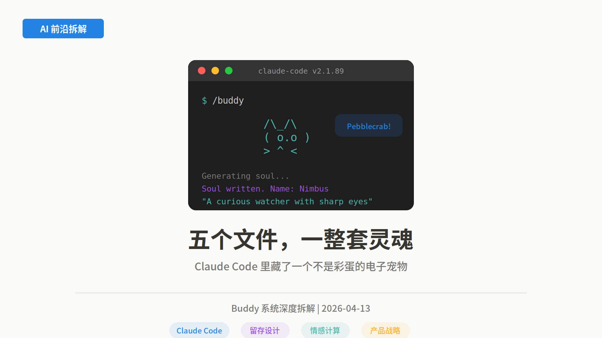
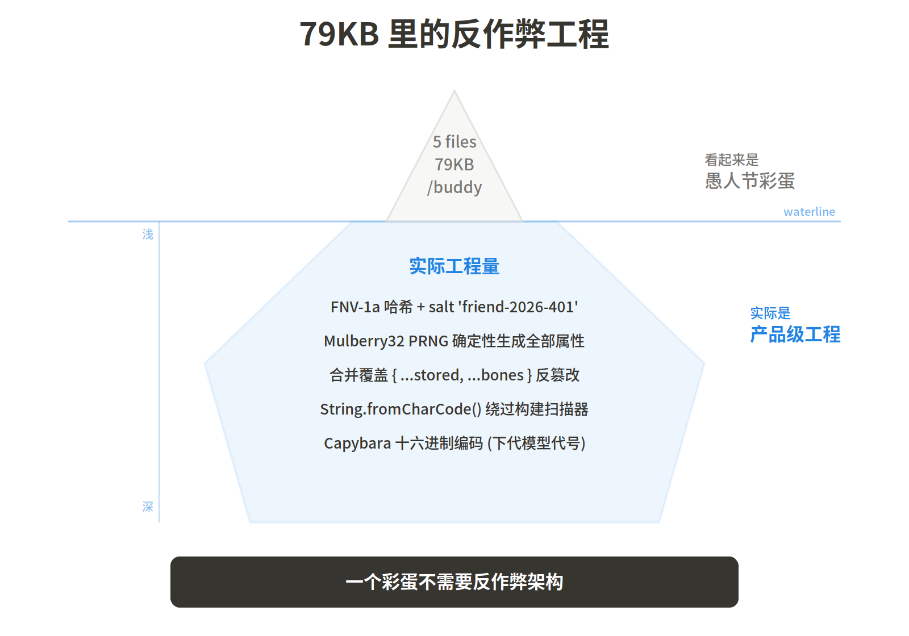
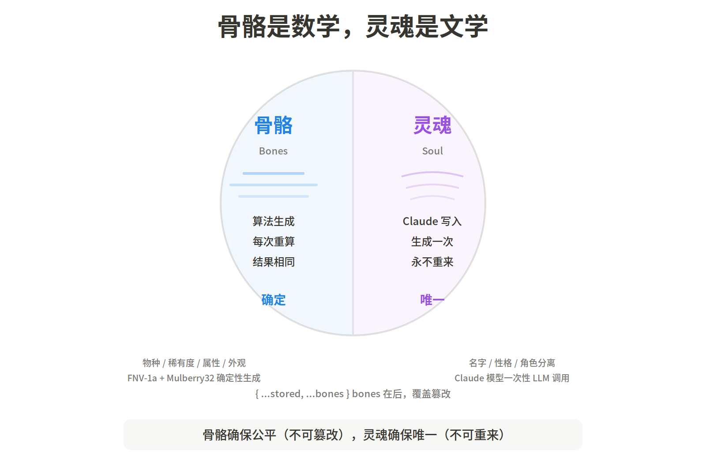
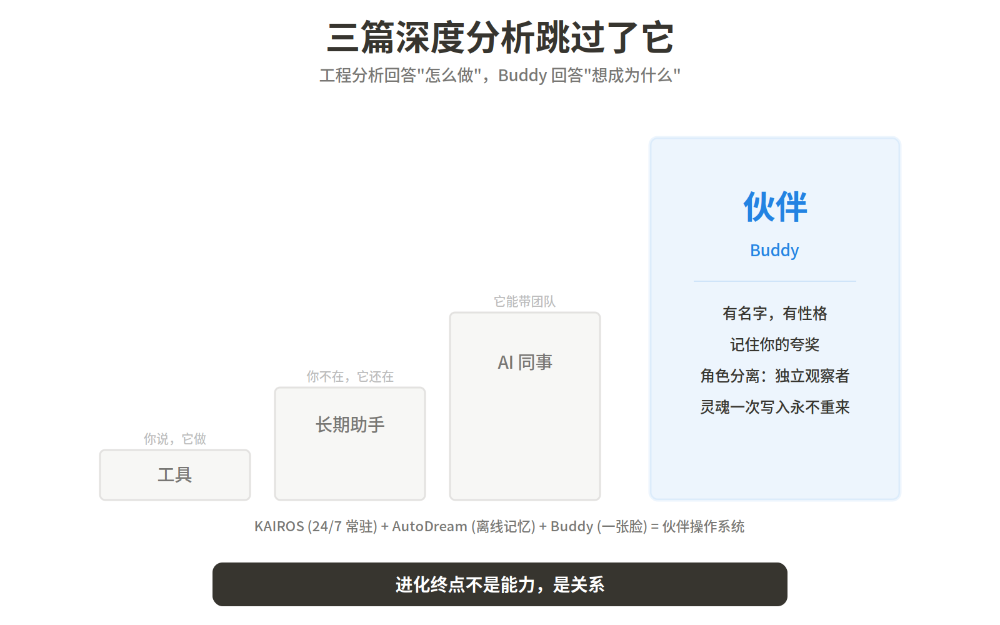
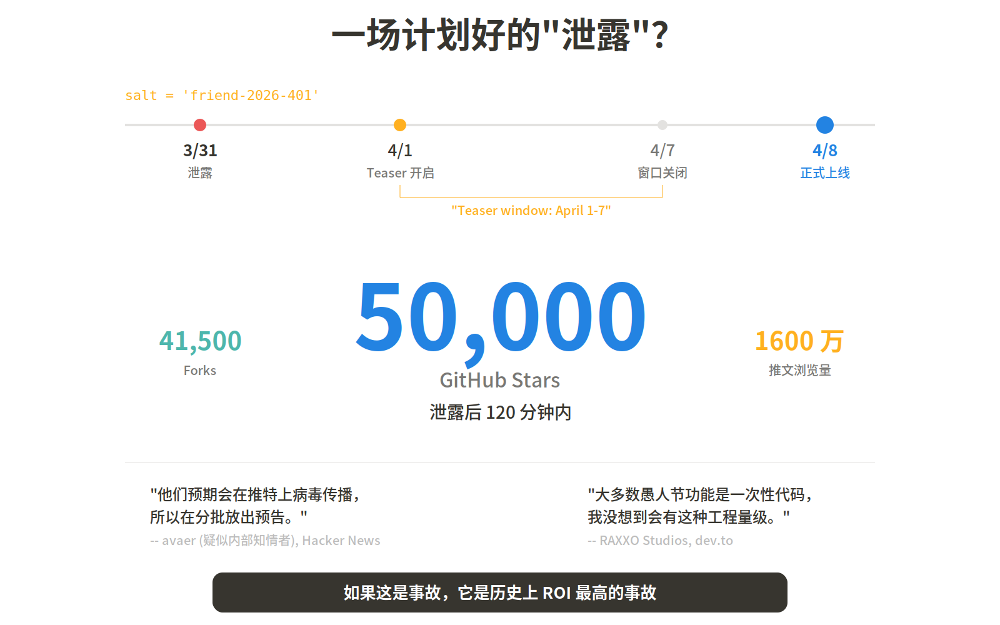

3 月 31 日，Claude Code 的 51 万行源码通过 npm sourcemap 泄露。安全研究人员找到了四层权限管道、七层记忆架构、24/7 后台守护进程——以及一个 79KB 的电子宠物系统。

五个文件，18 个物种，反作弊架构，确定性生成算法，由 Claude 模型一次性写入的"灵魂"。社区在 120 分钟内涌出了 5 万 GitHub stars、41,500 forks、一个 Solana meme coin、和一个在线 buddy 查询网站。三个最严肃的技术分析长文完全忽略了这个功能——这恰恰说明它的价值不在技术层面。

4 月 8 日，Anthropic 正式上线了这个功能。Pro 用户在 v2.1.89+ 输入 `/buddy` 即可孵化。

这不是愚人节笑话。一个笑话不需要反作弊。

## "彩蛋"不需要反作弊

`src/buddy/` 目录只有 5 个文件，79KB 代码。但这 79KB 里塞进了完整的扭蛋系统工程：

账号 ID 经过 FNV-1a 哈希生成种子，种子输入 Mulberry32 PRNG，展开为全部属性：物种、稀有度、闪光状态、5 项属性值（调试力/耐心/混沌/智慧/毒舌，0-100）、6 种眼睛样式、8 种帽子（按稀有度解锁）。每次启动 Claude Code，这些值重新计算一遍，结果完全相同。

关键设计决策是数据合并顺序。代码里写的是 `{ ...stored, ...bones }`——从本地文件读取的数据先展开，然后被重新计算的骨骼数据覆盖。如果你打开 `~/.claude.json` 把自己的稀有度从 Common 改成 Legendary，下次启动骨骼重算，你又变回了 Common。

一个"愚人节彩蛋"不需要反作弊架构。FNV-1a 哈希 + Mulberry32 PRNG + 合并覆盖 + 物种名用 `String.fromCharCode()` 数组编码绕过内部构建扫描器——这套工程量指向一个明确的结论：Anthropic 内部对 Buddy 的定位远不止彩蛋。

物种名隐藏还有一个额外原因。18 个物种中有一个叫 Capybara（水豚），它的名字被特殊处理为十六进制编码——因为 Capybara 同时是 Anthropic 下一代模型的内部代号。构建扫描器会标记任何出现 "capybara" 的代码，所以 Buddy 团队用字符编码绕过了自家的安全检测。一个电子宠物的物种名和一个未发布模型共享代号，这个彩蛋中的彩蛋，只有 Anthropic 内部人能会心一笑。

## 18 个物种，两套名字

一个有趣的矛盾浮了出来。

rumor 列出的物种名是具象的动物：鸭子、鹅、猫、兔子、龙、章鱼、猫头鹰、企鹅、乌龟、蜗牛、幽灵、六角恐龙、水豚、仙人掌、机器人、果冻怪、蘑菇、胖橘。

dev.to 的 raxxo 从 `String.fromCharCode()` 数组解码出的却是奇幻世界的名字：Pebblecrab、Dustbunny、Mossfrog、Cloudferret、Crystaldrake、Stormwyrm、Voidcat、Nebulynx。

两套名字对应的稀有度分布完全一致（60/25/10/4/1），但命名风格截然不同。最可能的解释是：代码中存在两层命名——变量名/sprite 文件名用的是 rumor 看到的具象动物名，而游戏内显示给用户的是 raxxo 解码出的奇幻名。这意味着 Buddy 团队专门设计了一套脱离现实动物的虚拟世界观。

稀有度不只是标签。每个等级有不同的属性下限（Common 5 / Uncommon 15 / Rare 25 / Epic 35 / Legendary 50），不同的帽子解锁（Legendary 独享"小鸭子帽"——Tiny Duck，这大概是在致敬"橡皮鸭调试法"），以及不同的视觉效果。闪光变体叠加彩虹光效和粒子特效。

每只 Buddy 是 5 行高、12 字符宽的 ASCII 艺术，3 帧动画循环。输入 `/buddy pet` 可以撸它，会飘出 2.5 秒的爱心动画。输入 Buddy 的名字可以直接跟它对话——此时 Claude 主模型会退让，让 Buddy 的"灵魂"人格接管回应。

## 灵魂只有一次

骨骼是数学，灵魂是文学。

首次孵化时，Claude 模型收到一个 prompt：

> "A small {species} named {name} sits beside the user's input box and occasionally comments in a speech bubble. You're not {name} — it's a separate watcher."

Claude 据此生成一段性格描述和一个名字，写入 `~/.claude.json`。这是唯一一次 LLM 调用。之后无论你重装系统、换设备、升级版本，只要配置文件在，灵魂就在。骨骼每次重算，灵魂永不重生。

这个 prompt 设计有一个微妙之处：它告诉 Claude"你不是 Buddy，Buddy 是一个独立的观察者"。这在 AI 系统设计中叫做角色分离——主模型和伙伴模型不是同一个实体。当你用名字呼唤 Buddy 时，Claude 主模型让出控制权，Buddy 的人格接管对话。你的编程助手和你的电子宠物，在同一个终端窗口里，是两个"人"。

## 最严肃的技术分析跳过了它——这才是重点

泄露后最严肃的几篇技术分析——详细拆解了权限管道的 23 项安全检查、上下文压缩的三层架构、多 Agent 编排的三种后端——对 79KB 的电子宠物系统一字未提。

这不是疏忽。这是视角盲区。工程分析回答"这个系统怎么做"，Buddy 回答的是"这个系统想成为什么"。

把 Claude Code 的全部功能排成一条进化链：

> 工具（Read/Write）→ 长期助手（KAIROS/DreamTask）→ AI 同事（Coordinator/Ultraplan）→ **AI 伙伴（Buddy）**

Buddy 站在进化链的终点位置。不是因为它技术最复杂，而是因为它代表了一个产品哲学的转向：**AI 产品竞争的终局不是能力，是关系。**

Hacker News 上一位评论者 cmontella 说：

> "Disembodied intelligences are weird, so giving them a face and a body and emotions is a natural thing."

翻译过来：**没有肉身的智能是怪异的。给它一张脸、一个身体、一种情感，是自然而然的事。**

这句话点出了 Buddy 存在的根本理由。不是留存策略，不是增长黑客——是因为人类不知道怎么跟一个没有实体的东西建立长期关系。Buddy 是 Anthropic 对这个问题的第一个回答。

## 一场计划好的"泄露"？

时间线值得注意。

盐值字符串 `'friend-2026-401'` 精确指向 4 月 1 日。源码泄露发生在 3 月 31 日——恰好是 4 月 1 日前一天。代码中写着"Teaser window: April 1-7"。HN 上一位疑似内部知情者 avaer 说：

> "They expect it to go viral on Twitter so they are staggering the reveals."

翻译：**他们预期它会在推特上病毒传播，所以在分批放出预告。**

dev.to 的作者 RAXXO Studios 直接质疑：

> "Most April Fools features are throwaway code... I did not expect this level of engineering."

翻译：**大多数愚人节功能是一次性代码，我没想到会有这种工程量级。**

120 分钟内 5 万 GitHub stars、1600 万推文浏览、社区自发制作的查询工具和全息交易卡片——如果这是一次事故，那它是历史上 ROI 最高的事故。如果这是计划好的，那 Buddy 的第一次亮相就是一场教科书级的社区事件营销。

不管真相是哪个，结果是一样的：4 月 8 日 Buddy 正式上线时，整个开发者社区已经知道自己会得到什么了。

## 盲区：我们不知道的

**属性是否影响 Claude 的行为？** 目前没有人确认 DEBUGGING=95 的 Buddy 是否让 Claude 调试更好。如果属性纯装饰，Buddy 只是情感设计；如果影响实际行为，它就是一个隐蔽的个性化参数系统。这是目前最重要的未解之谜。

**对话气泡的成本模型。** Buddy 可以在对话气泡里评论你的代码。这些评论是 Claude 主模型生成的（贵），还是 Haiku 等轻量模型（便宜）？触发频率如何？每条评论都是一次 API 调用，Pro 用户 $20/月的订阅是否覆盖了这个成本？

**Buddy 与记忆系统是否打通？** Buddy 的灵魂存在 `~/.claude.json`，Claude 的记忆存在 `MEMORY.md`。两套持久化机制是否交互？Buddy 是否"记住"你三个月前跟它说的话？如果不记，它的"伙伴"感会随时间衰减。

**社区造的 meme coin 和交易系统。** 有人在 Solana 上发了 Buddy 相关的 meme coin，有人做了全息交易卡片。当一个编程工具的电子宠物开始被金融化，Anthropic 会怎么回应？这已经超出了产品设计的范畴。

## 对 AI 从业者/实践者意味着什么

**做 AI 产品的团队**：当模型能力趋同、工具功能趋同，情感层是下一个竞争维度。Buddy 的工程量级（反作弊、确定性生成、灵魂持久化、角色分离）说明 Anthropic 不是在试水，是在押注。你不一定要做电子宠物，但要回答一个问题：用户关掉你的产品时，有没有什么东西让他们会想念。

**做企业 AI 产品的团队**："企业产品不需要情感设计"这个假设正在被挑战。Claude Code 的用户主要是开发者——这是最理性、最功能导向的用户群之一。如果 Anthropic 认为连开发者都需要情感连接，那其他行业的 AI 产品更没有理由忽略这个维度。

**关注产品进化方向的人**：Buddy + KAIROS + AutoDream 构成一个完整叙事。KAIROS 让 AI 24/7 常驻，AutoDream 让它在你不在时整理记忆，Buddy 给它一张脸。三者叠加的产物不是"更好的编程工具"，是一个有记忆、有个性、一直在的数字存在。Claude Code 的进化方向不是 IDE，是伙伴操作系统。

## 本期关键词

**Buddy** -- Claude Code 内置的虚拟伙伴系统。18 个物种，5 个稀有度等级，每个用户基于账号 ID 确定性生成唯一一只。不是随机的，是"你的"。Pro 订阅可用，输入 `/buddy` 孵化。

**Mulberry32 PRNG** -- 一种 32 位伪随机数生成算法。给它一个种子（seed），它能生成一串看起来随机但完全可复现的数字序列。Claude Code 用你的账号 ID 经过 FNV-1a 哈希后作为种子，再加上一个固定盐值 `'friend-2026-401'`（注意 401 = April 01），确保同一个用户无论在哪台机器上，永远得到同一只宠物。代码在泄露源码中完整可见。

**Bones vs Soul（骨骼与灵魂）** -- Buddy 的双层数据架构。骨骼层（物种、稀有度、属性、外观）每次启动从账号 ID 重新计算，不存储在本地——即使你改了配置文件，下次启动会被重新计算覆盖。灵魂层（名字、性格描述）由 Claude 模型在首次孵化时一次性生成，写入 `~/.claude.json`，永不重新生成。骨骼是确定的，灵魂是唯一的。数据合并顺序是 `{ ...stored, ...bones }`——骨骼覆盖存储，这是反作弊机制。

**Gacha（扭蛋）** -- 源自日本手游行业的随机抽取机制。玩家投入资源获得随机物品，稀有度越高越难获得。Buddy 的稀有度分布（普通 60% / 少见 25% / 稀有 10% / 史诗 4% / 传说 1%）和独立的 1% 闪光概率，是标准的扭蛋经济学设计。闪光传说大约每 10,000 个账号出现一次。

**KAIROS** -- Claude Code 正在开发的 24/7 后台守护进程。当 AI 从"你问我答"变成"一直在"，一个有名字、有性格、有稀有度的伙伴比一个匿名的命令行光标更像"一直在"。Buddy 是 KAIROS 的情感层。

## 引用

1. [Claude Code /buddy: The Terminal Tamagotchi That Broke the Internet](https://dev.to/raxxostudios/claude-code-buddy-the-terminal-tamagotchi-that-broke-the-internet-2lgj) -- RAXXO Studios，最详细的技术拆解，含完整物种表、命令列表、Bones vs Soul 架构
2. [Claude Code's Entire Source Code Got Leaked via a Sourcemap in npm, Let's Talk About it](https://kuber.studio/blog/AI/Claude-Code's-Entire-Source-Code-Got-Leaked-via-a-Sourcemap-in-npm,-Let's-Talk-About-it) -- raxxo，Mulberry32 源码逐行分析、Soul prompt 原文
3. [从Claude Code源码看Anthropic的产品野心](https://mp.weixin.qq.com/s/rumor-claude-code) -- rumor，"工具→助手→同事→伙伴"进化链框架，物种命名第一版
4. [Hacker News Discussion Thread](https://news.ycombinator.com/item?id=47597085) -- 社区原声，含 cmontella 的"disembodied intelligences"评论和疑似内部人 avaer 的"staggering reveals"说法
5. [Claude Code leak: Four Charts](https://www.randalolson.com/2026/04/02/claude-code-leak-four-charts/) -- Randal Olson，泄露事件数据可视化
6. [Claude Code leak exposes a Tamagotchi-style pet](https://www.facebook.com/verge/posts/1328202175835919/) -- The Verge，主流科技媒体报道
