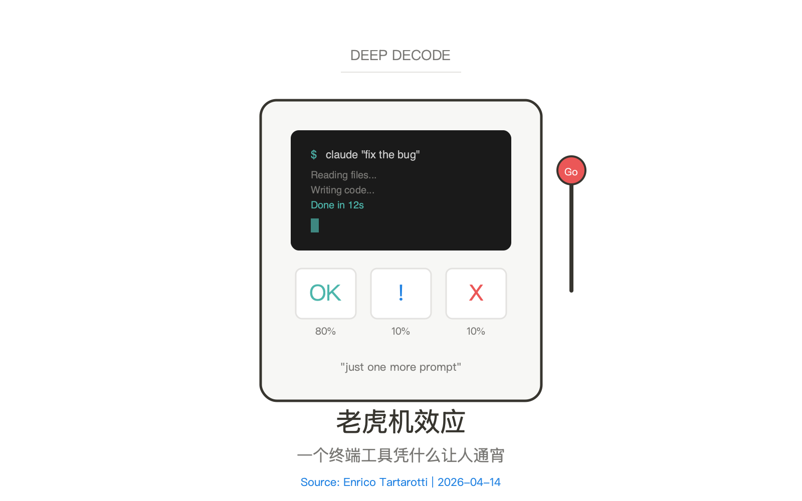
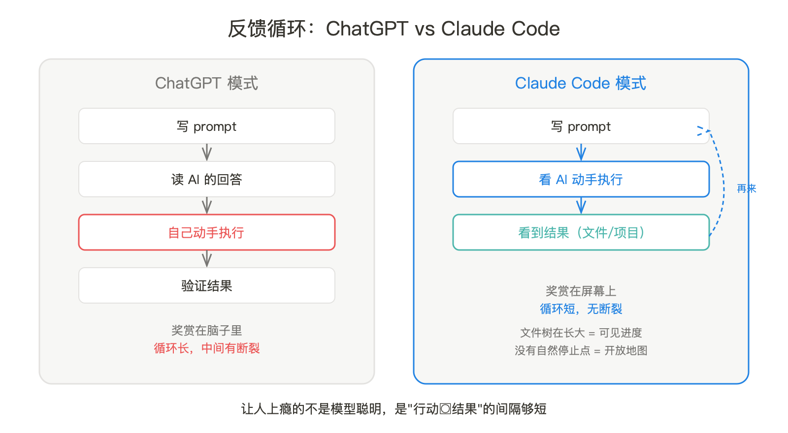
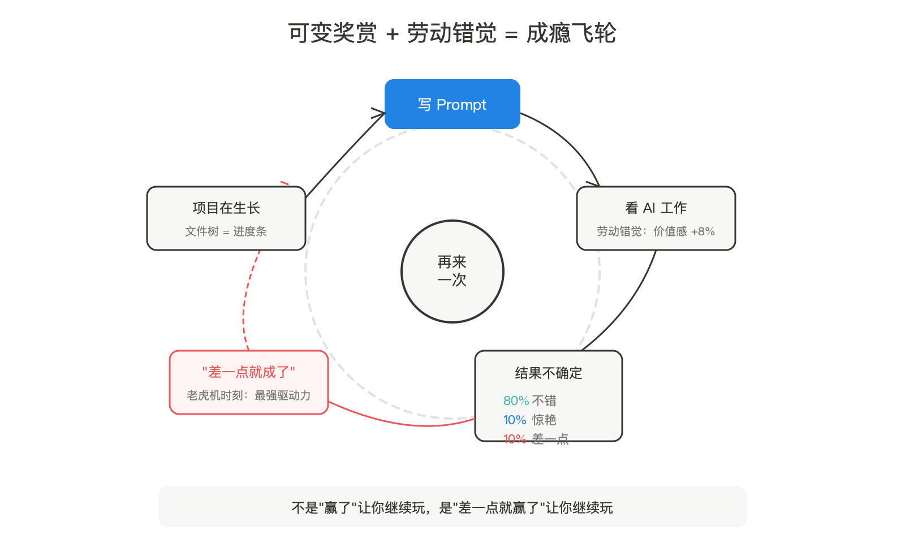
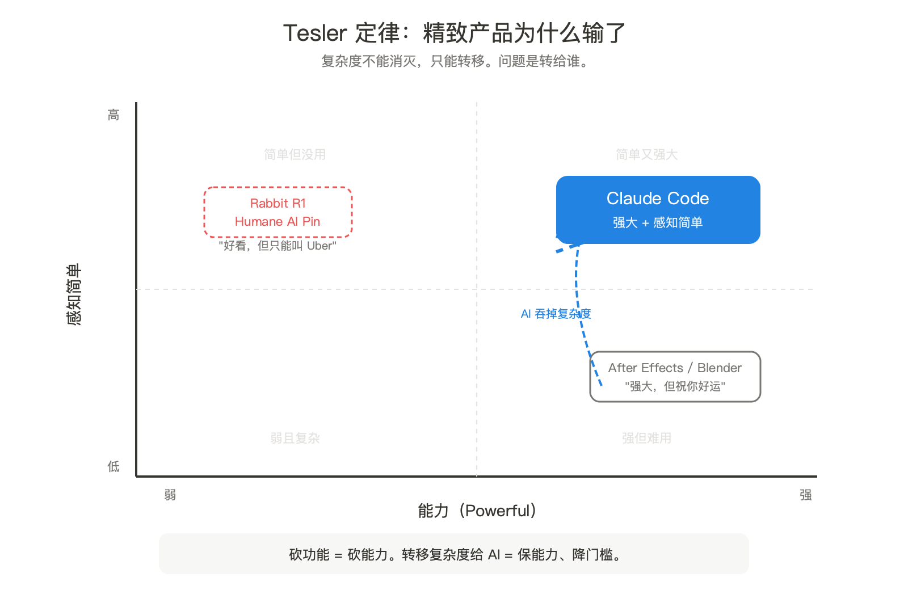

精心设计的 AI 硬件产品全死了——Rabbit R1、Humane AI Pin、那些 APP。它们有漂亮的 UI、友好的引导、设计师精心打磨的每一个像素。全部要么死了，要么在死的路上。

活下来的是一个黑底白字的终端工具。没有按钮，没有引导，安装就需要命令行。但人们在凌晨三点用它搭系统，像玩《文明》一样停不下来。

这不是巧合。YouTube 科技频道 Enrico Tartarotti 最近发布了一期视频拆解这个现象，从游戏设计和行为心理学两个维度解释了 Claude Code 的成瘾机制。他的框架值得拆开看——不是因为"游戏化"本身新鲜，而是因为它解释了一个更深的产品悖论：为什么精致设计反而输给了粗糙工具。

## 不是模型聪明，是反馈循环够短

Tartarotti 的第一个论点来自 Jesse Schell 的《游戏设计艺术》第 63 条原则：反馈循环必须短。

游戏让人停不下来的核心不是画面多好、剧情多强，而是"行动→结果"之间的间隔够短。你打一下，怪掉血；你下一个指令，地图扩展一格。Claude Code 的交互模式恰好踩中了这个结构：你写一句 prompt，几秒后文件开始变化，十几秒后看到结果。行动→奖赏。再来一个 prompt，再来一轮。

这和 ChatGPT 式的对话体验有本质区别。ChatGPT 的循环是"写 prompt→读回答→自己动手"，Claude Code 的循环是"写 prompt→看它动手→看到结果"。前者的奖赏在脑子里，后者的奖赏在屏幕上——文件树在长大，项目在成型。

## Juiciness：187 条加载文案的产品哲学

《游戏设计艺术》第 64 条原则叫 juiciness——直译是"多汁感"。2012 年瑞典一个游戏设计大会上演示过一个经典案例：同一个弹球游戏，规则完全不变，只加了颤动效果、音效、颜色变化，游戏感瞬间从"无聊"变成"有趣"。

Claude Code 源码泄露后，人们发现里面藏了 187 条加载提示文案——"Reticulating splines""Consulting the oracle""Summoning creativity"之类的。功能上这些文案毫无作用，纯粹是人格碎片。但它们让一个终端工具有了"脾气"，让等待变成了"看它表演"。

这是一个被低估的产品决策。大部分开发者工具追求专业感、追求冷静。但 Claude Code 选择了另一条路——不装严肃，让工具有温度。效果是：用户不会觉得自己在等一个程序跑完，而是在看一个"搭档"干活。

## 可变奖赏：老虎机和"再来一次"

第 36 条原则是 Chance——不可预测的奖赏比固定奖赏更让人上瘾。这是老虎机的底层原理，也是 Tartarotti 整个分析里最核心的一环。

Claude Code 有时候写出惊艳的方案，有时候只是凑合能用，大约 10% 的时候会出错。如果它每次都完美，用户用完就走。如果它每次都出错，用户弃用。但"大部分时候不错，偶尔惊喜，偶尔差一点"——这恰好是最容易成瘾的奖赏分布。

差一点的时候最危险。因为你知道它"几乎做到了"，只差一个 prompt 就能修好。于是你输入修正指令，等结果。这就是老虎机效应——不是赢了让你继续玩，是"差一点就赢了"让你继续玩。

哈佛商学院 Ryan Buell 和 Michael Norton 在 2011 年发表的劳动错觉（Labor Illusion）研究进一步解释了这个现象：当你能看到系统在"努力工作"，你对结果的感知价值会提高约 8%。Claude Code 的终端输出——读文件、写代码、跑测试、遇到错误、修复、再跑——就是劳动过程的完整展示。相比之下，一个转圈的 loading 动画藏起了所有过程，也藏起了价值感。

## Tesler 定律：精致产品为什么输了

到这里，游戏化解释只说了"为什么停不下来"。但更核心的问题是：为什么一个终端工具击败了那些精心设计的 AI 产品？

Tartarotti 给出的框架是 Tesler 定律，由 Larry Tesler 在 1980 年代提出——也就是发明复制粘贴的那个人。定律的核心：复杂度守恒，不能被消灭，只能被转移。

复制粘贴看起来极其简单——两个快捷键。但背后是剪贴板格式管理、富文本转换、跨应用通信、甚至跨设备同步。复杂度没有消失，只是从用户端转移到了系统端。这就是"感知简单"（perceived simplicity）和"实际简单"不同的本质。

Tartarotti 画了一个二维坐标：横轴是能力（powerful），纵轴是简单（simple）。大量 AI 产品落在左上角——简单但能力弱。"这个硬件很好看，但它只能叫个 Uber。"专业工具落在右下角——强大但学习曲线陡峭，比如 After Effects 和 Blender。

Claude Code 的位置在右上角：强大且感知简单。它强大是因为底层是代码——移动文件夹是终端命令，整理照片是脚本，分析表格是 Python。它感知简单是因为复杂度被 Claude 吞掉了。你说"帮我同步 Notion 的文档"，它发现 MCP 连不上，自己去查文档，换 API 方案，跑通了。你做了一件很复杂的事，但你的感知是"我说了一句话，事情办好了"。

这就是为什么精心设计的 AI 产品全死了。它们追求的是"实际简单"——简化功能、限制选项、美化界面。但用户要的不是简单，是"感觉简单但什么都能干"。Tesler 定律说复杂度不能消灭，那些产品选择消灭复杂度的方式是砍功能——结果能力也一起砍了。Claude Code 选择的是把复杂度转移给 AI 模型——功能不砍，用户不累。

## 代码是万物的底层接口

视频里一个容易被忽略但极其重要的观察：Claude Code 的用户大量不是开发者。他们用它订机票、报税、整理博物馆档案、监控番茄生长。这些人在用一个"编程工具"做完全不是编程的事。

为什么？因为你每天做的大部分事情，底层都是代码。去 Skyscanner 搜航班——本质是调 API。用 Excel 分析数据——本质是跑计算脚本。整理文件夹——本质是文件系统操作。这些事情被包装成了图形界面，让人类可以使用。但图形界面也带来了约束：你不能对 Skyscanner 说"找有一天中转新加坡且可以拐去台湾的航班"。

Claude Code 做的事不是教人写代码，而是移除了人和代码之间的那层界面。代码一直在那里——搜索是代码，排序是代码，发邮件是代码。Claude Code 让你用自然语言直接操作代码层，跳过了图形界面的限制。

这解释了一个更大的趋势：AI coding 工具不只是开发者工具的升级，它在重新定义"用电脑"这件事本身。

## 盲区：我们不知道的

Tartarotti 的分析框架精致但也有盲区。

**成瘾叙事的选择性**。用游戏心理学解释 Claude Code 的成功，暗含一个假设：用户是被"操纵"的。但视频自己也承认，Anthropic 并没有刻意做游戏化设计。如果这些效果是"意外的"，那用游戏设计原则来解释就存在事后归因的风险——你总能从成功产品中找到符合某个心理学理论的特征。

**$200/月的经济悖论没展开**。视频提到一个用户在 $200/月的订阅上消耗了 $27,000 的算力。这不只是"产品太好了"的问题——这是一个不可持续的商业模式。Anthropic 的每一个深度用户都在亏钱。视频把这当成"做得太好的副作用"一笔带过，但这实际上是 Claude Code 面临的最大结构性风险。

**泄露源码的解读过于表面**。视频提到了 187 条加载文案、假工具混淆竞争对手、"求模型遵守指令"的 prompt。但源码泄露揭示的远不止这些——上下文压缩策略、多模型调度、权限管道等工程决策才是 Claude Code 真正的护城河。仅看"juiciness"的 187 条文案，是只看到了冰山的海报，没看到冰山本身。

## 对 AI 从业者/实践者意味着什么

**如果你在做 AI 产品**：不要追求"简单"，追求"感知简单"。区别在于：前者砍功能，后者转移复杂度。Tesler 定律的启示不是让产品变简单——是让 AI 承担复杂度，让用户只感受到结果。那些死掉的 AI 硬件产品犯的共同错误是把"功能少"当成了"体验好"。

**如果你在做开发者工具**：劳动错觉是一个被严重低估的设计维度。Claude Code 的终端输出不是技术限制，是产品优势。让用户看到 AI 在做什么——读了哪些文件、尝试了什么方案、遇到了什么错误——这个"透明过程"本身就在创造价值感。下次做 loading 状态的时候，不要用转圈动画，展示过程。

**如果你在思考 AI 的用户边界**：Claude Code 的非开发者用户群说明，"AI 编程工具"这个品类的天花板远高于"开发者工具"。当 AI 能代写代码时，代码就变成了通用接口——像鼠标和键盘一样。这意味着 AI coding 产品的竞争对手不只是其他 coding 工具，而是所有垂直领域的 SaaS 产品。

**一个更底层的判断**：Tartarotti 的视频揭示了一个产品设计的相变时刻。在 AI 之前，Tesler 定律意味着复杂度在用户和系统之间做零和博弈。AI 打破了这个零和——复杂度可以被模型"吞掉"，用户和系统都不需要承担。这不是渐进式改善，是产品设计底层逻辑的重写。过去十年积累的 UX 最佳实践——简化流程、减少选项、引导式操作——可能都需要重新审视。

---

## 本期关键词

**Tesler 定律（复杂度守恒定律）** -- 由发明复制粘贴的 Larry Tesler 在 1980 年代提出。核心主张：任何系统都有一个无法被消除的内在复杂度，你只能决定让用户承担还是让系统承担。过去系统承担复杂度需要大量工程投入（比如 Apple 的跨设备剪贴板），AI 时代则可以让模型直接"吞掉"复杂度。这是 Claude Code 击败精致 AI 产品的底层解释。

**劳动错觉（Labor Illusion）** -- 哈佛商学院 Ryan Buell 和 Michael Norton 在 2011 年提出的概念。研究发现：当用户能看到服务背后的工作过程时，对结果的感知价值平均提高约 8%——即使结果完全一样。Claude Code 的终端输出（实时展示文件读取、代码编写、测试运行、错误修复）是劳动错觉的教科书级应用。

**Juiciness（多汁感）** -- Jesse Schell《游戏设计艺术》第 64 条原则。指不改变核心规则，只通过视觉反馈、音效、微交互等"调料"增加体验丰富度。Claude Code 的 187 条随机加载文案就是 juiciness 在开发者工具中的实践：功能零贡献，体验感大幅提升。

**可变比率强化（Variable-ratio Reinforcement）** -- 行为心理学中最强的强化模式。老虎机、刷社交媒体、开盲盒都基于此原理。Claude Code 的输出质量天然符合可变比率分布：大部分时候不错，偶尔惊艳，偶尔出错。"差一点就成功"的时刻会触发"再来一次"的冲动，这是成瘾循环的核心驱动力。

**感知简单（Perceived Simplicity）** -- 和"实际简单"相对的概念。实际简单是功能少、选项少；感知简单是功能强大但用户不需要感知复杂度。复制粘贴是感知简单的经典案例——两个快捷键背后是剪贴板管理、格式转换、跨应用通信。AI 时代的产品设计正在从追求"实际简单"转向追求"感知简单"。

## 引用

1. [Why Everyone is OBSESSED With Claude Code](https://www.youtube.com/watch?v=gzt52Trk9w0) -- Enrico Tartarotti, 本期拆解原视频
2. [The Labor Illusion: How Operational Transparency Increases Perceived Value](https://www.hbs.edu/faculty/Pages/item.aspx?num=40158) -- Ryan W. Buell & Michael I. Norton, Harvard Business School, 2011
3. [Tesler's Law | Laws of UX](https://lawsofux.com/teslers-law/) -- Tesler 定律详解
4. [The Art of Game Design: A Book of Lenses](https://schellgames.com/art-of-game-design) -- Jesse Schell, 游戏设计 113 条原则
5. [Claude Code 源码泄露全面剖析](raw/claudecode-sources/) -- 源码泄露系列分析
