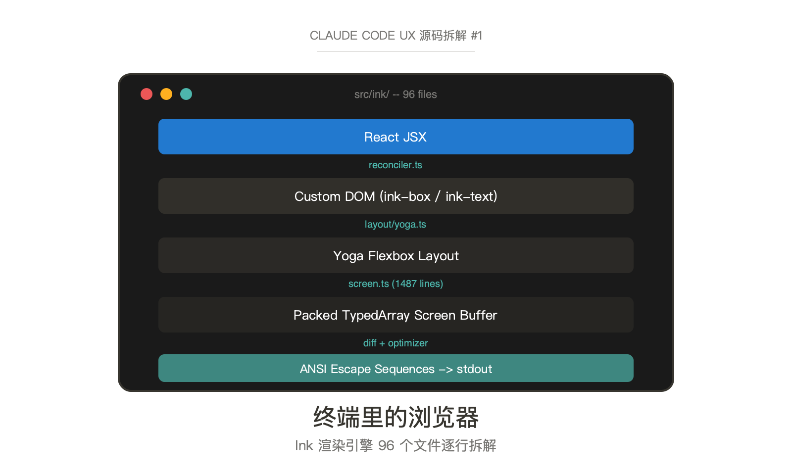
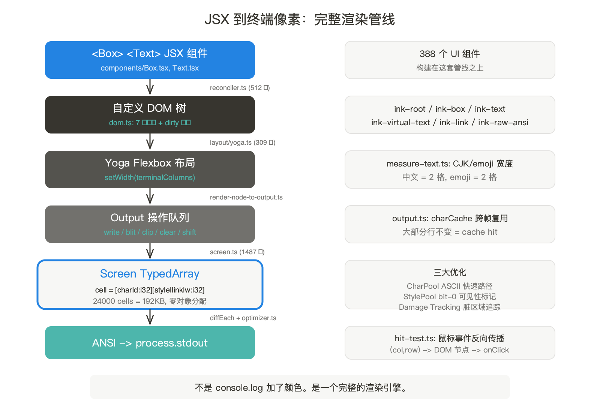
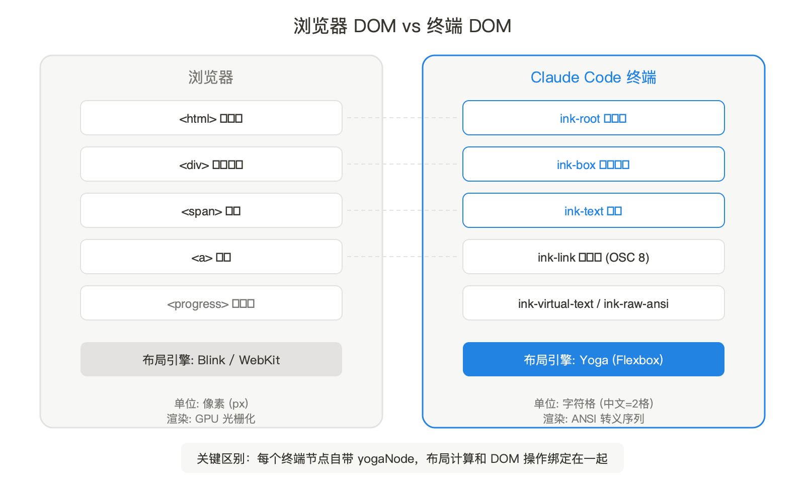
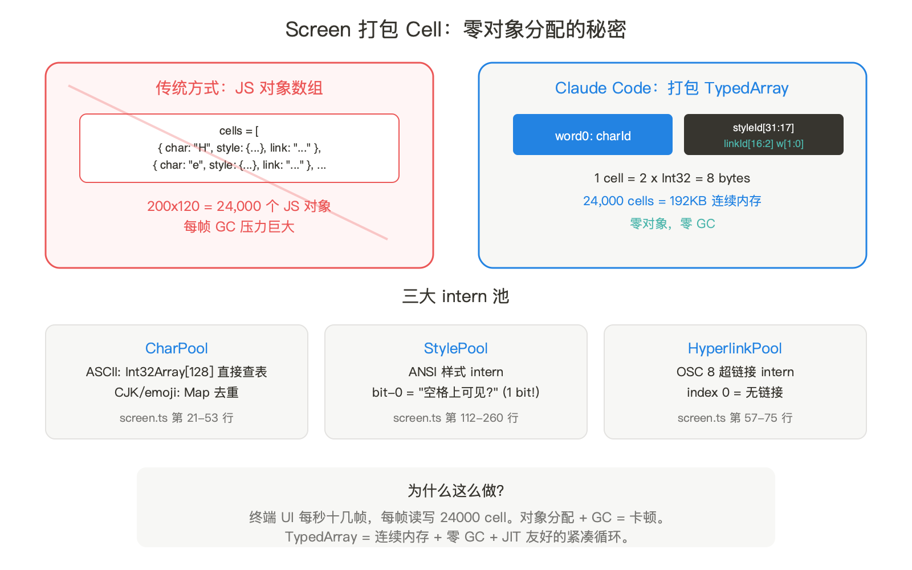
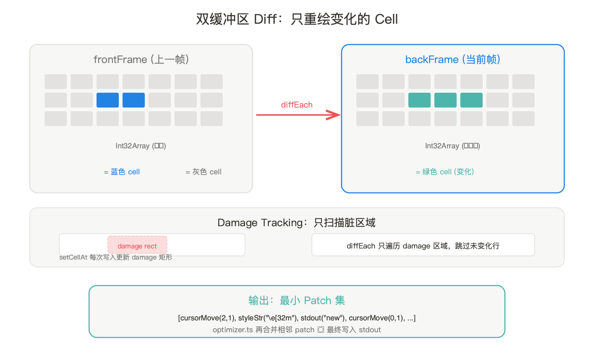
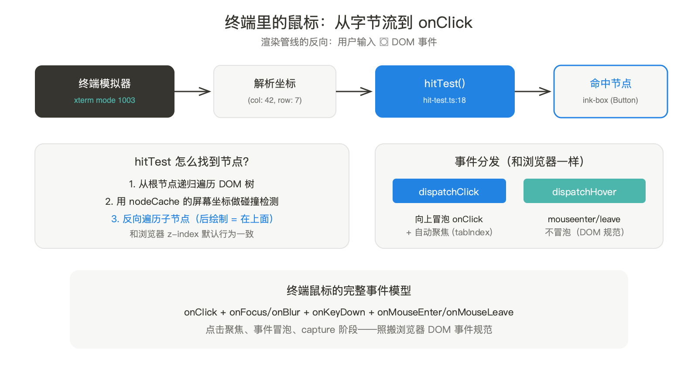
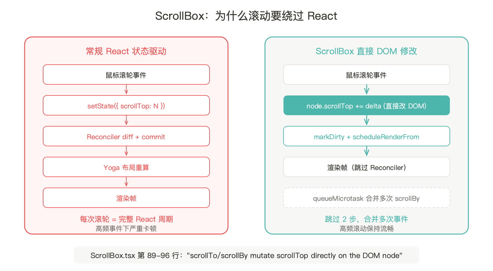

浏览器有 Blink、WebKit 两大渲染引擎，负责把 HTML/CSS 变成屏幕上的像素。Claude Code 也有一个——96 个 TypeScript 文件，用 React 驱动，把 JSX 组件变成终端里的 ANSI 字符。

这不是比喻。它有自定义 DOM（`dom.ts`），有布局引擎（Facebook 的 Yoga），有帧调度（`frame.ts`），有双缓冲区 diff 算法（`screen.ts`），有鼠标点击检测（`hit-test.ts`），甚至有选区高亮（`selection.ts`）。你在 Claude Code 里看到的每一行输出——对齐的文字、彩色的代码块、滚动的对话流——都经过这条管线。



## 一、渲染管线全景：从 JSX 到终端像素

打开 `src/ink/` 目录，96 个文件看似杂乱。但沿着数据流看，管线非常清晰：

```
React JSX
    ↓  reconciler.ts（React Reconciler 适配）
自定义 DOM 树（ink-box / ink-text 节点）
    ↓  dom.ts（DOM 操作 + dirty 标记）
Yoga 布局计算
    ↓  layout/yoga.ts（Flexbox → 终端坐标）
输出缓冲区
    ↓  output.ts（write/blit/clip 操作队列）
Screen 像素矩阵
    ↓  screen.ts（TypedArray 打包的 cell 数组）
Diff
    ↓  screen.ts diffEach()（双缓冲区差异计算）
Patch 流
    ↓  optimizer.ts（合并/去重 ANSI 序列）
终端 stdout
```

每一步都有对应文件，每个文件职责单一。这不是一个"加了些颜色的 console.log"——这是一个完整的渲染引擎。



## 二、自定义 DOM：终端世界里的 HTMLElement

浏览器的 DOM 有 `div`、`span`、`a`。Claude Code 的终端 DOM 有 7 种节点类型（`dom.ts` 第 19-27 行）：

```typescript
export type ElementNames =
  | 'ink-root'      // 根节点，相当于 <html>
  | 'ink-box'       // 布局容器，相当于 <div>
  | 'ink-text'      // 文本节点，相当于 <span>
  | 'ink-virtual-text' // 嵌套文本（Text 里套 Text）
  | 'ink-link'      // 终端超链接（OSC 8 协议）
  | 'ink-progress'  // 进度条
  | 'ink-raw-ansi'  // 预渲染的 ANSI 字符串
```

每个 `DOMElement` 长这样（`dom.ts` 第 31-91 行）：一个 `nodeName`、一个 `style` 对象、一个 `childNodes` 数组、一个指向父节点的 `parentNode`——和浏览器 DOM 的结构几乎一样。但有一个关键区别：每个节点还携带一个 `yogaNode`，直接绑定 Facebook 的 Yoga 布局引擎。

创建节点的代码（`dom.ts` 第 110-132 行）揭示了一个设计决策：

```typescript
export const createNode = (nodeName: ElementNames): DOMElement => {
  const needsYogaNode =
    nodeName !== 'ink-virtual-text' &&
    nodeName !== 'ink-link' &&
    nodeName !== 'ink-progress'
  const node: DOMElement = {
    nodeName, style: {}, attributes: {},
    childNodes: [], parentNode: undefined,
    yogaNode: needsYogaNode ? createLayoutNode() : undefined,
    dirty: false,
  }
  // ink-text 和 ink-raw-ansi 需要自定义测量函数
  if (nodeName === 'ink-text') {
    node.yogaNode?.setMeasureFunc(measureTextNode.bind(null, node))
  }
  return node
}
```

`ink-virtual-text`、`ink-link`、`ink-progress` 不分配 Yoga 节点。这是内存优化：嵌套文本和链接不需要独立的布局计算，它们的尺寸由父级 `ink-text` 的 measure 函数统一计算。一个对话里可能有上千个嵌套文本节点，省掉这些 Yoga 分配是有意义的。



脏标记机制（`dom.ts` 第 393-413 行）也值得看。`markDirty` 不只标记当前节点——它沿着 `parentNode` 一路标记到根节点，同时在叶子文本节点上调用 `yogaNode.markDirty()` 触发 Yoga 重新测量。这意味着改一个字的颜色，整条祖先链都知道需要重绘。

## 三、从 React 到 DOM：Reconciler 适配层

React 本身不知道怎么渲染终端。`reconciler.ts`（512 行）是桥梁——它实现了 React 的 Host Config 接口，告诉 React "创建元素"意味着创建 `ink-box`，"更新属性"意味着调用 `setAttribute` 和 `setStyle`。

最关键的钩子是 `resetAfterCommit`（`reconciler.ts` 第 247 行）。每次 React 完成一轮状态更新（commit），这个函数被调用。它做两件事：

1. 调用 `rootNode.onComputeLayout()` —— 触发 Yoga 重新计算布局
2. 调用 `rootNode.onRender()` —— 触发渲染帧

这个顺序至关重要。布局必须在渲染之前完成，否则组件读到的尺寸是上一帧的。`ink.tsx` 第 239-258 行把这两步绑定到 `rootNode` 上：

```typescript
this.rootNode.onComputeLayout = () => {
  if (this.isUnmounted) return
  if (this.rootNode.yogaNode) {
    this.rootNode.yogaNode.setWidth(this.terminalColumns)
    this.rootNode.yogaNode.calculateLayout(this.terminalColumns)
  }
}
```

`setWidth(this.terminalColumns)` —— 根节点的宽度就是终端列数。一个 80 列的终端，Yoga 就在 80 个字符宽度里做 Flexbox 布局。终端窗口拉宽？`handleResize`（`ink.tsx` 第 309 行）更新 `terminalColumns`，触发重新渲染。

## 四、Yoga 布局：Flexbox 塞进 80 列

`layout/yoga.ts`（309 行）是 Yoga 的适配层。Yoga 是 Facebook 开发的跨平台 Flexbox 引擎，React Native 用它做移动端布局。Claude Code 用它做终端布局。

适配器是一个 `YogaLayoutNode` 类，把 Yoga 的 C++ API（通过 TypeScript 移植版）包装成终端友好的接口。关键在第 306-308 行：

```typescript
export function createYogaLayoutNode(): LayoutNode {
  return new YogaLayoutNode(Yoga.Node.create())
}
```

注释（第 300-304 行）透露了一个重要的架构变化：

> "The TS yoga-layout port is synchronous — no WASM loading, no linear memory growth, so no preload/swap/reset machinery is needed."

早期 Ink（npm 上的开源版本）用的是 Yoga 的 WebAssembly 编译版，启动时要异步加载 WASM 文件。Claude Code 的 Ink fork 切换到了纯 TypeScript 移植版——没有 WASM，没有异步加载，`import` 即用。这消除了一类启动延迟，但可能牺牲了布局计算性能。对于终端 UI 来说，布局树通常不大（几百个节点），TypeScript 的性能够用。

Yoga 支持的布局属性在 `yoga.ts` 的 setter 方法里一目了然：`flexDirection`（行/列/反向）、`flexGrow/Shrink/Basis`、`alignItems/Self`、`justifyContent`、`position`（relative/absolute）、`margin/padding/border/gap`、`overflow`（visible/hidden/scroll）。这是完整的 Flexbox 子集——你在 CSS 里能用的 Flexbox 属性，这里几乎都能用。

终端 Flexbox 和浏览器 Flexbox 的核心区别：单位。浏览器用像素，终端用字符格。一个中文字符占 2 格，一个 emoji 也占 2 格。这个宽度计算在 `measure-text.ts` 里处理，通过 `lineWidth()` 函数（来自 `line-width-cache.js`）做 Unicode 感知的字符宽度计算。

## 五、Screen 缓冲区：24000 个 Cell 不创建一个对象

渲染管线的终点是 `screen.ts`——1487 行，整个 Ink 引擎最大的文件，也是性能最敏感的。

一个 200 列 x 120 行的终端，有 24,000 个 cell。每帧都要读写这些 cell，每秒可能十几帧。如果每个 cell 是一个 JavaScript 对象，光 GC 压力就能让终端卡顿。

Claude Code 的解法是**打包 TypedArray**（`screen.ts` 第 332-348 行）。每个 cell 用 2 个 Int32 表示：

```
word0: charId          (32 位，CharPool 索引)
word1: styleId[31:17] | hyperlinkId[16:2] | width[1:0]
```

一个 cell 只占 8 字节。24,000 个 cell = 192KB 的连续内存。零对象分配。

`CharPool`（第 21-53 行）是字符串 intern 池。ASCII 字符（0-127）走 `Int32Array[128]` 直接查表——比 `Map.get` 快。非 ASCII（中文、emoji）用 `Map<string, number>`。同一个字符只存一次。



`StylePool`（第 112-260 行）更精巧。它不只 intern ANSI 样式——它还用 styleId 的 **bit 0** 编码"这个样式在空格上有没有可见效果"。背景色、反色、下划线在空格上可见（bit 0 = 1），纯前景色在空格上不可见（bit 0 = 0）。渲染器跳过"不可见空格"时只需检查一个 bit，不用查 style 属性。

## 六、双缓冲区 Diff：只重绘变化的 Cell

浏览器有 Virtual DOM diff。Claude Code 有 Screen diff。

`screen.ts` 的 `diffEach`（第 1156-1463 行）在两个 Screen 缓冲区之间做 diff。算法：

1. 计算前后两帧的 damage 矩形的并集——只扫描脏区域
2. 逐行扫描脏区域，用 `findNextDiff`（第 1213 行）找到下一个不同的 cell
3. 对每个不同的 cell，生成一个 `Patch`（cursor move + style transition + character）
4. `optimizer.ts` 合并相邻的 patch

`findNextDiff` 的实现（第 1213 行）是一个紧凑的循环，每次比较 2 个 Int32。注释说这是为了让 V8 的 JIT 能内联优化。两个复用的 Cell 对象避免了每次 diff 时的对象分配。



双缓冲区的工作方式：`frontFrame` 持有上一帧的 Screen，`backFrame` 持有当前帧。渲染器向 `backFrame` 写入新内容，diff 计算两者差异，然后交换。下一帧，老的 `frontFrame` 变成新的 `backFrame`。

## 七、帧调度与输出优化

`ink.tsx` 第 212-216 行定义了帧调度策略：

```typescript
const deferredRender = (): void => queueMicrotask(this.onRender)
this.scheduleRender = throttle(deferredRender, FRAME_INTERVAL_MS, {
  leading: true, trailing: true
})
```

`FRAME_INTERVAL_MS`（定义在 `constants.ts`）控制最大帧率。`queueMicrotask` 确保渲染在 React 的 layout effect 之后执行——否则光标位置会滞后一帧。`throttle` 的 `leading: true` 保证第一次触发立即渲染（响应性），`trailing: true` 保证最后一次触发也渲染（完整性）。

`optimizer.ts`（93 行）做的是 patch 流的窗口优化。7 条规则，都是直觉可以理解的：

- 连续两个 `cursorMove`？加起来变一个
- 连续两个 `cursorTo`？只保留最后一个
- 连续两个 `styleStr`？拼接，但**不能丢弃**第一个（第 58-65 行有详细注释：样式切换是 diff，不是 setter，丢弃第一个可能导致背景色泄漏）
- `cursorHide` 紧接着 `cursorShow`？互相抵消，都删掉

## 八、终端里的鼠标：hit-test.ts

`hit-test.ts`（130 行）实现了终端里的鼠标事件。是的，终端可以追踪鼠标——通过 xterm 的鼠标协议（mode 1003），终端模拟器会报告每次鼠标移动和点击的 (col, row) 坐标。

`hitTest`（第 18 行）从根节点开始递归遍历 DOM 树，用 `nodeCache` 里缓存的屏幕坐标（含滚动偏移）做碰撞检测。关键设计：**反向遍历子节点**（第 34 行），因为后面的兄弟节点画在上面——和浏览器的 z-index 默认行为一致。

`dispatchClick`（第 49 行）从命中的最深节点开始向上冒泡，依次触发 `onClick` 处理器。第 59-69 行还实现了"点击聚焦"——找到最近的有 `tabIndex` 属性的祖先节点，调用 `focusManager.focus()`。这和浏览器里点击一个 `<input>` 自动聚焦的行为一模一样。



`dispatchHover`（第 102 行）实现 `mouseenter`/`mouseleave`。它维护一个 `hoveredNodes` 集合，每次鼠标移动时 diff 新旧集合，对离开的节点触发 `mouseleave`，对进入的节点触发 `mouseenter`。不冒泡——和 DOM 的 `mouseenter` 规范一致。

## 九、ScrollBox：绕过 React 的滚动

`ScrollBox.tsx`（236 行）是 Claude Code 对话流的核心组件。它的设计有一个反直觉的决策：**滚动不走 React 状态**。

第 89-96 行的注释解释了为什么：

> "scrollTo/scrollBy mutate scrollTop directly on the DOM node, mark it dirty, and call scheduleRenderFrom via a microtask."

如果用 React 的 `setState` 来驱动滚动，每次鼠标滚轮事件都要经过 reconciler → diff → commit 的完整周期。对于高频的滚轮事件，这太慢了。Claude Code 的做法是直接修改 DOM 节点的 `scrollTop` 属性（跳过 React），然后用 `markDirty` + `scheduleRenderFrom` 触发一次低开销的渲染。`queueMicrotask` 把同一轮事件循环内的多次 `scrollBy` 合并成一次渲染。



`scrollToElement`（第 15-19 行）更巧妙。不同于 `scrollTo(N)` 直接写一个数字（到渲染时可能已经过时），`scrollToElement` 在 DOM 上设置一个 `scrollAnchor` 引用，渲染器在绘制阶段才读取元素的当前位置——延迟到最后时刻的"懒求值"。

## 盲区：我们不知道的

**这是 fork 不是复用**。Claude Code 的 Ink 和 npm 上的 `ink` 包已经是两个不同的项目。npm 版 Ink 用 Yoga WASM，不支持鼠标事件，没有 screen.ts 级别的 cell 打包优化。但这也意味着 Claude Code 在维护一个完整的终端渲染引擎——上游 Ink 的 bug fix 不能直接 cherry-pick，自定义功能（鼠标事件、screen 打包、选区系统）的维护成本只会随时间增长。这是一个典型的 fork 陷阱：短期获得了定制自由，长期绑定了工程资源。

**TypeScript Yoga 的性能代价不清楚**。从 WASM 切换到纯 TS 消除了加载延迟，但 Yoga 的布局计算是 CPU 密集的。`FrameEvent` 里追踪了 yoga 的 `visited`、`measured`、`cacheHits` 计数——这暗示团队在监控布局性能。对于大型对话（几百条消息），布局树可能有上千个节点，纯 TS 版 Yoga 的性能是否够用没有公开数据。

**renderNodeToOutput 是管线里最复杂的一步，但本篇篇幅有限未展开**。它把 Yoga 的布局坐标转化为 Screen 缓冲区的写入操作——处理滚动偏移、裁剪区域、绝对定位、文本换行。源码完整存在于 `src/ink/render-node-to-output.ts`。从 `output.ts` 定义的 7 种操作类型（write/blit/clip/unclip/clear/shift/noSelect）可以看出它的职责边界，但具体的 DOM 树遍历和坐标映射逻辑需要单独拆解——这可能值得一篇独立文章。

## 对 AI 从业者/实践者意味着什么

**如果你在做 CLI AI 工具**：不要用 `console.log` 一行行打印。Claude Code 证明了终端 UI 可以达到接近浏览器的交互丰富度——滚动、鼠标点击、焦点管理、主题色、布局引擎。关键不是用哪个库，而是要把终端当成一个"有宽度限制的屏幕"来对待，而不是"打印行的管道"。React + Yoga 的组合意味着你可以用组件化思维写终端 UI，和写 Web 前端没有本质区别。

**如果你在做高频更新的 TUI**：Screen 的打包 TypedArray 设计是教科书级的优化。24,000 个 cell 零对象分配，diff 只扫描 damage 区域，CharPool 的 ASCII 快速路径，StylePool 的 bit-0 可见性标记——每一个都是可以直接复用的技术。特别是"双缓冲区 + damage tracking + 窗口优化"这个组合，几乎是所有实时渲染系统（游戏、视频编辑器、终端）的通用模式。

**如果你在思考"为什么 Claude Code 感觉这么流畅"**：答案不是"模型回复快"。Claude Code 的终端渲染帧率有节流控制（`FRAME_INTERVAL_MS`），diff 算法确保只重绘变化的 cell，滚动跳过 React 走直接 DOM 修改。流畅感来自工程纪律——不是"怎么快怎么来"，而是"知道哪些地方可以省，哪些地方不能省"。

**一个更深层的判断**：Anthropic 选择 fork 并深度定制 Ink 而不是用现成的终端框架（blessed、curses），说明他们把终端体验当作核心竞争力，而不是附属品。96 个文件、1487 行的 screen.ts、完整的鼠标事件系统——这是一个认真的终端渲染引擎，不是一个 CLI 工具临时搭的架子。这个投入和他们的产品定位一致：Claude Code 不是一个"能在终端里用的 AI"，而是"一个恰好用终端做界面的全功能开发环境"。

---

## 本期关键词

**Reconciler（协调器）** -- React 的核心渲染协议。React 本身不知道怎么画 DOM、终端还是移动端——它通过 Reconciler 接口让宿主环境实现创建/更新/删除节点的具体操作。`react-dom` 是浏览器的 Reconciler，Claude Code 的 `reconciler.ts` 是终端的 Reconciler。关键方法是 `resetAfterCommit`：每次 React 状态更新完成后，触发 Yoga 布局计算和终端渲染。

**Yoga 布局引擎** -- Facebook 开发的跨平台 Flexbox 引擎，用于 React Native 的移动端布局。Claude Code 用它的纯 TypeScript 移植版在终端里做 Flexbox 布局——`flexDirection`、`justifyContent`、`alignItems`、`padding`、`margin`、`gap` 全部可用。区别在于单位：浏览器用像素，终端用字符格（一个中文字 = 2 格）。

**Screen 打包 Cell** -- `screen.ts` 的核心数据结构。每个终端 cell 用 2 个 Int32 表示（charId + 打包的 styleId/hyperlinkId/width），存储在连续的 `Int32Array` 里。200x120 的屏幕 = 192KB 连续内存，零对象分配。`BigInt64Array` 视图共享同一块 buffer，用 `fill(0n)` 做整屏清零。这个设计让每帧的 GC 压力几乎为零。

**双缓冲区 Diff** -- 游戏引擎和视频渲染的经典技术。两个 Screen 缓冲区交替使用：一个持有上一帧，一个接收当前帧。`diffEach` 只比较两帧之间变化的 cell（通过 damage 矩形限制扫描范围），生成最小的 Patch 集。减少终端写入量直接提升帧率。

**Damage Tracking（脏区域追踪）** -- 每次 `setCellAt` 写入 cell 时，`screen.ts` 更新一个 `damage` 矩形记录被修改的区域。diff 阶段只扫描 damage 区域，跳过未变化的行。这和浏览器的"重绘区域"概念一样——不是每帧重绘整个屏幕，而是只重绘变化的部分。

## 引用

1. [Claude Code 源码](raw/claudecodesources/raw_code/claude-code/src/ink/) -- 本期拆解的一手源码，96 个 TypeScript 文件
2. [Yoga Layout](https://www.yogalayout.dev/) -- Facebook 的跨平台 Flexbox 引擎
3. [Ink (npm)](https://github.com/vadimdemedes/ink) -- 原版开源 Ink 框架（Claude Code 是深度 fork）
4. [React Reconciler](https://github.com/facebook/react/tree/main/packages/react-reconciler) -- React 自定义渲染器接口
5. [xterm Mouse Protocol](https://invisible-island.net/xterm/ctlseqs/ctlseqs.html#h2-Mouse-Tracking) -- 终端鼠标追踪协议
