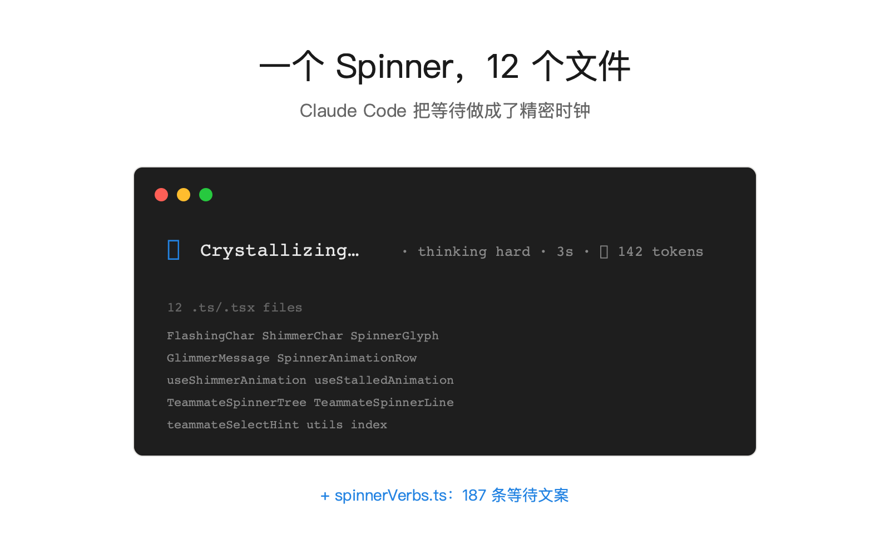
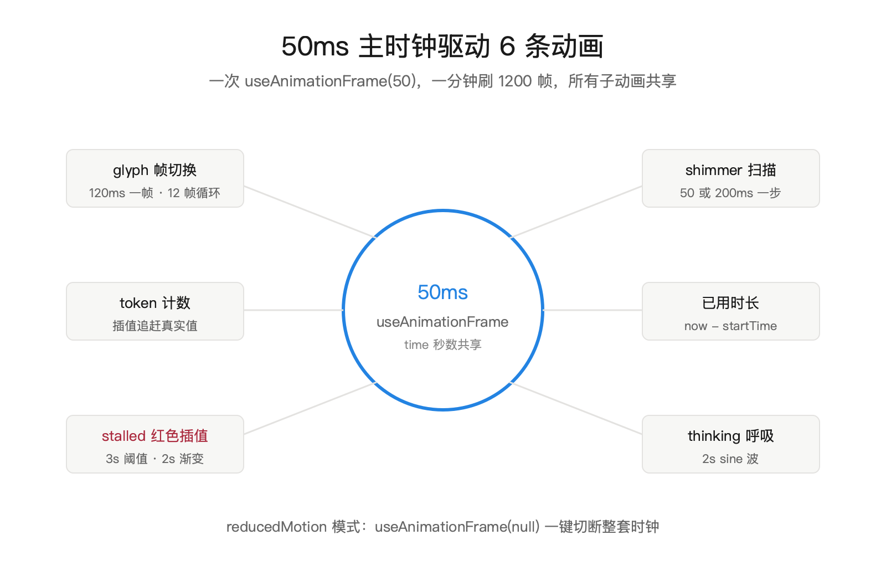
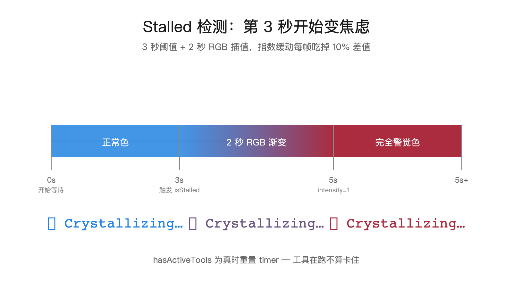
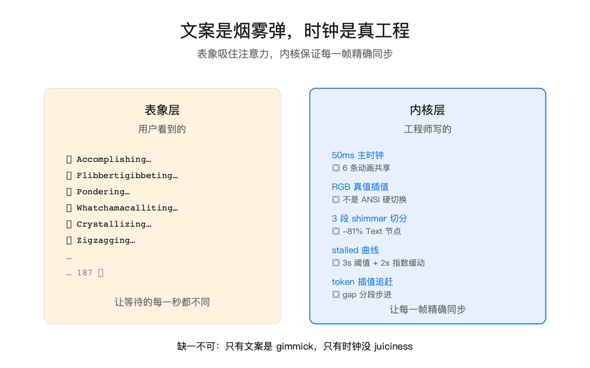

Claude Code 的等待动画,藏了 187 条文案。从 Accomplishing 到 Zigzagging,整部英文字母表走一遍还装不满,每刷新一次换一条。

而这 187 条,不过是这套系统最外面的一层皮。往里走一层,是 12 个源码文件、一个 50 毫秒的主时钟、一套 RGB 颜色插值引擎,还有一个精确到"第 3 秒开始转红"的卡顿检测。一个终端里转圈的小玩意儿,工程量抵得上不少 SaaS 产品的整个前端。



## 一呼一吸:六个字符来回走一趟

先看贴皮那一层——在文案前面跳动的那个小符号。`SpinnerGlyph.tsx` 硬编码了 6 个 Unicode 字符:

```typescript
return process.platform === 'darwin'
  ? ['·', '✢', '✳', '✶', '✻', '✽']
  : ['·', '✢', '*', '✶', '✻', '✽']
```

macOS 用 `✽`,Linux 换成 `*`。挑字符看似随便,代码注释里却单独记了一笔——Ghostty 终端(`TERM === 'xterm-ghostty'`)下 `✽` 有轻微偏移,所以强制降级成 `*`。为一种终端的一个字符单独兜底,这才是"让用户感觉不到问题"的工程量。

6 个字符接下来扩成 12 帧:

```typescript
const SPINNER_FRAMES = [
  ...DEFAULT_CHARACTERS,
  ...[...DEFAULT_CHARACTERS].reverse(),
]
```

正序一遍,倒序一遍,凑成 `· ✢ ✳ ✶ ✻ ✽ ✽ ✻ ✶ ✳ ✢ ·`。呼吸感就这么来——字符从小到大,再从大到小,像一次深吸后慢慢吐出。每帧切换周期 120 毫秒(`Math.floor(time / 120)`),一个完整的呼吸 1.44 秒。

## 50 毫秒主时钟:一切动画的心跳

这 12 帧只是掀开一层。再往下,是 `SpinnerAnimationRow.tsx` 里这一行:

```typescript
const [viewportRef, time] = useAnimationFrame(reducedMotion ? null : 50)
```

一个 50 毫秒的 tick——一秒跳 20 下,一分钟 1200 下。这个时钟不是只给 spinner 用的,它牵着 6 条独立动画一起跑:

1. spinner glyph 的帧切换(120ms 一帧)
2. shimmer 高亮点的扫描(requesting 模式 50ms 一步,assistant 模式 200ms)
3. token 计数器的缓动递增
4. 已用时间的实时刷新
5. stalled 红色插值
6. "thinking" 文字的呼吸光晕(2 秒 sine 曲线)

代码注释里记过一次重构:原来 ThinkingShimmer 有自己的 `useAnimationFrame(50)`,后来被挪到 SpinnerAnimationRow 里——"复用已有的 50ms 时钟,消除冗余订阅"(`reuse our existing 50ms clock and eliminate the redundant subscriber`)。

这句注释是整个 Spinner 系统的设计哲学:**一个 Box 里所有以 20fps 跳动的零件,共享一个时钟**。要是每个子动画都起一个 `setInterval(50)`,React 50ms 内要调度 N 次渲染,终端 diff 要做 N 次比较,CPU 就在那儿白转 N 圈。共享时钟下,50ms 内整个 Box 只 diff 一次。



## Shimmer 扫描:只涂 3 个字的性能优化

文案下面还藏着一道更精巧的动画:shimmer。一道稍亮的高光在文字上扫过去,或左或右,模拟"信息在流"的感觉。

直觉做法是给每个字符发一个 `<FlashingChar>`,让它自己判断"我现在亮不亮"。早期版本就是这么写的——`ShimmerChar.tsx` 是残留下来的化石。但 `GlimmerMessage.tsx` 换了一套活法:

```typescript
const shimmerStart = glimmerIndex - 1
const shimmerEnd = glimmerIndex + 1
if (shimmerStart >= messageWidth || shimmerEnd < 0) {
  return <Text color={messageColor}>{message}</Text>
}
```

高亮永远只落在当前扫描位置 ±1 的 3 个字符上。其余字符用一个 `<Text>` 裹住,颜色默认。切分逻辑分三段:before / shim / after,按视觉列宽度(`stringWidth`,含 emoji 和 CJK 双宽字符)计算。

为什么这样做?代码里一条注释漏了底:

```typescript
// This component re-renders at 20fps ... Precompute grapheme segmentation
// + widths once per message instead of per frame. Measured -81% on the shimmer path.
```

逐字符 FlashingChar 在 20fps 下每秒要造出 `字符数 × 20` 个 Text 节点。40 字的文案就是 800 个。优化后,60 个(3 段 × 20fps)。**81% 的性能提升,省下来的是用户手提电脑的续航**。

## Stalled 红色:第 3 秒开始变焦虑

这是全套里最心理学的一段代码。`useStalledAnimation.ts` 只做一件事:**AI 3 秒不吐新 token,就把整个 spinner 慢慢染一层红**。

```typescript
const isStalled = timeSinceLastToken > 3000 && !hasActiveTools
const intensity = isStalled
  ? Math.min((timeSinceLastToken - 3000) / 2000, 1) // Fade over 2 seconds
  : 0
```

3 秒是阈值,2 秒是淡入时长。第 3 秒看上去还是正常色,第 5 秒彻底变成 `rgb(171, 43, 63)` 那种深红。中间的过渡用 `interpolateColor` 做 RGB 插值——不是 ANSI 16 色那种硬切,是真刀实枪的 24bit 渐变。

过渡的颗粒度是 10% 一步:

```typescript
const diff = intensity - current
current += diff * 0.1
```

每帧吃掉剩余差值的 10%。这是经典的指数缓动(exponential easing)。看不到阶梯,只剩一条平滑的曲线。

设计上这是在做什么?**告诉用户"AI 卡住了",但不是突然告诉**。突然变红是在吓人,让人以为出了错;渐变变红是在说"这次比平时慢,你可能得留点神"。情感计算的教科书做法。

有一处 bug 修复的痕迹值得一看。`hasActiveTools` 把 timer 重置了——正在跑工具时(比如 Bash 正在跑 npm install),就算 5 秒不吐文字也不算 stalled。UX 和技术状态要对齐:用户不是在等 AI 想,是在等工具做事,焦虑动画就不该上来。



## Token 计数器:视觉插值在追真实值

Spinner 右侧常出现 `↓ 1,234 tokens` 这样的计数。乍一看是真实 token 数,其实不是——**它只是真实值的影子,一步一步追上来**。

```typescript
const gap = currentResponseLength - tokenCounterRef.current
if (gap > 0) {
  let increment
  if (gap < 70)       increment = 3
  else if (gap < 200) increment = Math.max(8, Math.ceil(gap * 0.15))
  else                increment = 50
  tokenCounterRef.current = Math.min(
    tokenCounterRef.current + increment,
    currentResponseLength,
  )
}
```

差距小时慢慢追(每帧 +3),中等时按比例追(15%),差距一大就直接跨 50 个。50ms 一帧,每秒最多追上 1000 个 token。

为什么不直接显示真实值?因为 token 流入是突发的——模型可能先憋着不吐,然后一口气流出 200 个。直接显示,数字就从 0 跳到 200,体感错乱。插值追赶让数字一直在涨,看上去才像"AI 在连续思考输出"。

这是一行"看起来像数据、其实是 UX"的代码。真实值存在 ref 里,供停止判断用;显示值是加工过的。

## 187 条文案:是烟雾弹,也是彩蛋

前面讲的都是时钟。现在回头看文案。`src/constants/spinnerVerbs.ts` 里摆着 187 条动词:

```typescript
export const SPINNER_VERBS = [
  'Accomplishing', 'Actioning', 'Actualizing', 'Architecting',
  'Baking', 'Beaming', "Beboppin'", 'Befuddling', ...
  'Flibbertigibbeting', ... 'Tomfoolering', ...
  'Whatchamacalliting', 'Wrangling', 'Zesting', 'Zigzagging',
]
```

从正经词(Computing, Processing)到彩蛋词(Flibbertigibbeting 胡言乱语,Whatchamacalliting 那啥那啥)。还开放了 `spinnerVerbs` 配置,用户可以 append 或 replace 自己的词库。

187 这个数字有讲究吗?没有。从命名风格一眼就看得出——这不是一次写成的,是工程师们一个个加进去的彩蛋。

但站在产品角度,这 187 条做的事只有一件:**把"AI 还在想"的 10-30 秒,熬得不那么难受**。你盯着 "Pondering..." 三秒,切到 "Crystallizing..." 三秒,再切到 "Flibbertigibbeting..."——注意力早被文字勾走了。**主观上觉得等了多久,看的是变化,不是速度**。

文案是烟雾弹,把你的注意力从"还要等多久"里引开。时钟才是真工程,让每一帧都精准同步。



## Reduced Motion:一个圆点的两秒呼吸

accessibility 这条线也没漏。macOS 和 Linux 都有系统级的"减少动效"开关,Claude Code 读到这个信号,做什么?

```typescript
const REDUCED_MOTION_DOT = '●'
const REDUCED_MOTION_CYCLE_MS = 2000 // 2-second cycle: 1s visible, 1s dim
```

12 帧全部退化成一个 `●`,2 秒一次呼吸(1 秒亮 1 秒暗)。50ms 的主时钟直接传 `null` 进去:

```typescript
useAnimationFrame(reducedMotion ? null : 50)
```

整个高频时钟停了。CPU 占用从 20fps 掉到接近 0。shimmer 不动了,token 计数器直接同步真实值,不再做插值。**这不是把动画关掉那么简单——所有为 juiciness 付出的计算,一并撤了**。对眩晕症用户友好,对省电池也友好。

## 盲区:我们不知道的

**文案调度逻辑没读到**。187 条词,怎么选下一条?是纯随机、按时间、还是按上下文?`getSpinnerVerbs()` 只管读取和合并,没看到切换的触发点。按常理是父组件每 N 秒换一次,但代码里找不到明显的常量。

**Teammate tree 的 spinner 如何协调**。多 agent 并行时,每个 agent 各有自己的 spinner(`TeammateSpinnerTree.tsx`, `TeammateSpinnerLine.tsx`)——它们是共享同一个 50ms 时钟,还是每人一套?从 import 看应该共享,但没深读调度。

**性能实测数据**。-81% 的 shimmer 优化是代码注释里写的,没见到 benchmark 文件。这个数字或许是内部实测,或许只是估算。

## 对 AI 产品从业者意味着什么

三条落地判断。

第一,**微交互值得写 12 个文件**。Claude Code 是命令行工具,没有视觉设计部门,没有 CSS 可以 hack,UX 团队手里只有 TypeScript 和 ANSI 转义。就这样的条件,他们给一个等待动画写了 12 个文件、一套颜色插值引擎、一条 stalled 检测曲线。你的 SaaS 产品有 React,有 Framer Motion,做个 loader 用了几个文件?

第二,**共享时钟是条隐形的工程原则**。每次想在 UI 里加"每 50 毫秒做点什么",先停下来问一句:这个应用里,已经有 50ms 时钟了吗?有,就挂上去;没有,就先建一条,再让所有同类动画共用。一堆独立的 setInterval,是小团队慢慢变慢的元凶。

第三,**等待体验,靠"变化"稀释,不靠"速度"**。187 条文案、RGB 插值、stalled 渐变——核心都是"让每一秒都不同于上一秒"。产品里有等待,就别去优化"等待时长",去优化"等待时长的可忍受度"。前者要改模型、改后端、改网络,后者只要一个前端工程师,加一点品味。

## 本期关键词

- **useAnimationFrame(50)** -- Ink 框架提供的终端动画 hook,订阅一个 50ms 的统一时钟。Claude Code 用它驱动一切 20fps 微交互,从 spinner 帧切到 token 计数到 stalled 红色插值。传 null 进去可以暂停,这是 reducedMotion 模式和 stalled 模式的主要停止机制。

- **juiciness(多汁感)** -- 游戏设计术语,指"小操作反馈得多"。按个键不是只改一个数字,是字号跳一下、颜色闪一下、音效响一下、粒子飞一下。Claude Code 的 spinner 是 juiciness 在终端的移植:一个等待动画同时做 glyph 呼吸、shimmer 扫描、token 追赶、stalled 变红、thinking 光晕。视觉层的冗余就是情感层的丰满。

- **RGB 颜色插值** -- `interpolateColor(c1, c2, t)` 在两个 RGB 点之间做线性内插。Claude Code 用它做 stalled 从正常色到红色的渐变,也用它做 shimmer 的高亮渗透。区别于 ANSI 16 色的硬切换——插值需要 24bit 颜色终端支持,对 ANSI 主题有 fallback 到二分开关的退化路径。

- **grapheme segmentation(字素分段)** -- 用 `Intl.Segmenter` 把字符串切成字素簇,考虑 emoji ZWJ 序列、组合字符、CJK 全角等。Claude Code 在 shimmer 里用它一次性切好 + 缓存宽度,代替每帧重算 `stringWidth`。测量显示 -81% 的性能提升。

- **reduced motion** -- 系统级辅助功能信号,操作系统告诉应用"这个用户对动效敏感"。Claude Code 读到后把高频动画全部退化:12 帧 glyph 变成一个圆点 2 秒呼吸、shimmer 关闭、token 计数不再插值。不是把动画关掉,是把所有 juiciness 相关的计算撤掉,同时保留"在工作中"的信号。

- **指数缓动(exponential easing)** -- 过渡动画的一种数学形式:每帧前进剩余距离的固定百分比(`current += diff * 0.1`)。特点是起始快、逼近慢,视觉上像"减速泊车"。Claude Code 的 stalled 红色从 0 到 1 用的是这个——不是线性,是前 1 秒变红得明显、后 1 秒只是微调,对应"从正常到警觉"的心理曲线。

## 引用

1. [Claude Code 源码(src/components/Spinner/)](https://github.com/anthropics/claude-code) -- 本文一手来源,12 个 .tsx/.ts 文件加 constants/spinnerVerbs.ts
2. [SpinnerAnimationRow.tsx](https://github.com/anthropics/claude-code/blob/main/src/components/Spinner/SpinnerAnimationRow.tsx) -- 50ms 主时钟的拥有者
3. [GlimmerMessage.tsx](https://github.com/anthropics/claude-code/blob/main/src/components/Spinner/GlimmerMessage.tsx) -- shimmer 三段切分的性能优化
4. [useStalledAnimation.ts](https://github.com/anthropics/claude-code/blob/main/src/components/Spinner/useStalledAnimation.ts) -- 3 秒阈值 + 2 秒渐变的焦虑曲线
5. [spinnerVerbs.ts](https://github.com/anthropics/claude-code/blob/main/src/constants/spinnerVerbs.ts) -- 完整 187 条列表
