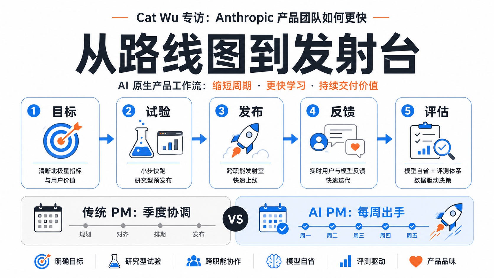
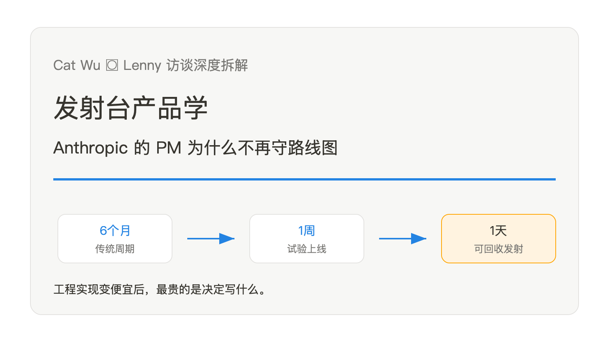
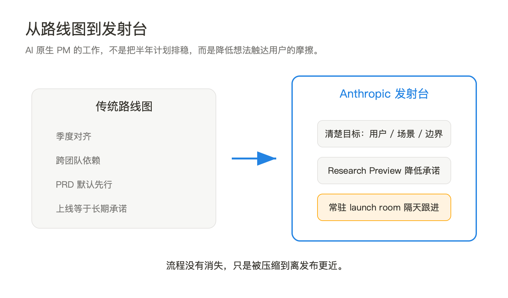
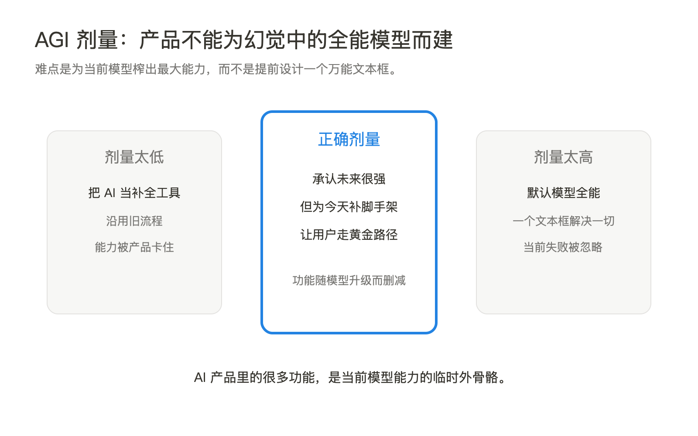
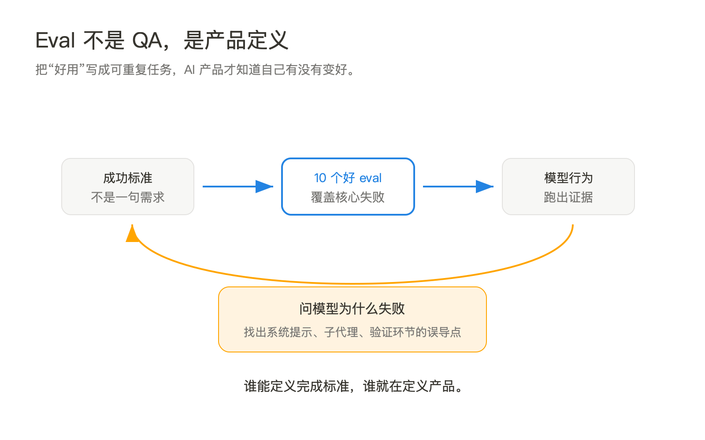
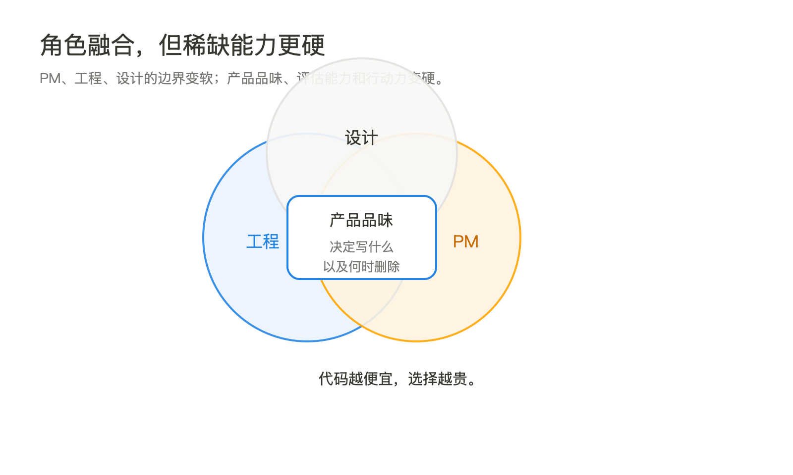
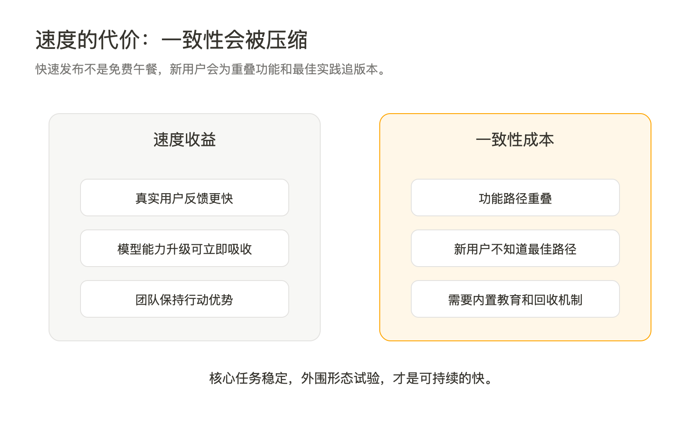

**播客版**：本篇已生成 `podcast.mp3`，邮件中作为附件发送，时长约 10 分钟。建议先听播客建立主线，再读正文细节。

Cat Wu 在 Lenny 的访谈里反复讲同一件事：AI 产品团队的时间单位变了。过去，一个功能从想法到上线可以按季度算；现在，Anthropic 内部很多功能从六个月压到一个月，有时是一周，甚至一天。

这不是单纯的工程效率故事。工程变快之后，产品管理没有消失，反而被迫换了职责。PM 不再主要维护一张跨季度路线图，而是在给团队搭一个能快速发射、快速回收、快速修正的产品系统。

## 一、从路线图到发射台

传统 PM 的核心工作，是把昂贵的代码生产组织起来。需求评审、跨团队依赖、季度 roadmap、PRD、发布节奏，背后都默认一个前提：代码很贵，错一次代价高，所以要提前协调。

Cat Wu 给出的新前提相反：AI 正在让工程实现变便宜，模型能力又每隔几个月跳一次。于是问题不再是“怎么把半年计划排稳”，而是“怎么让一个真实想法在一周内碰到用户”。

Anthropic 的做法不是取消管理，而是把管理压缩成三个杠杆。第一，目标必须足够清楚，比如用户是谁、问题是什么、哪些场景必须开箱即用。第二，功能大多以 Research Preview 发出，降低“上线等于长期承诺”的心理成本。第三，工程、文档、PMM、DevRel 有一个常驻 launch room，工程师认为功能可用后，相关角色可以隔天把说明、公告和反馈通道补上。

这里的关键不是“少流程”，而是“流程短到足够贴近发射”。如果一个团队口头上追求敏捷，但每次发布仍然要重新找人、重新对齐、重新解释上下文，那只是把瀑布拆成了更小的瀑布。Anthropic 的发射台逻辑，是把反复发生的协作动作固定下来，让任何人都能把一个试验推到用户面前。

这解释了为什么 PRD 没有消失。Cat 说，模糊度高、基础设施重、周期仍然较长的项目，仍然会写一页 PRD。变化在于 PRD 不再是默认动作。默认动作变成：先把目标讲清楚，先把东西送出去，先拿到真实反馈。

## 二、AGI-pilled 的正确剂量

访谈里最值得拆的一句话，是 Cat 对 AI 产品判断的描述：为超级 AGI 模型设计产品很容易，难的是为当前模型榨出最大能力。

这句话很锋利。因为很多 AI 产品会犯两种相反的错误。一种是低估模型，继续把 AI 当自动补全文本的工具；另一种是高估模型，直接为“未来全能模型”设计一个文本框，然后期待模型自己理解一切、补齐一切、验证一切。

Anthropic 的产品策略夹在中间。当前模型已经强到可以做复杂任务，但仍然会漏测 UI、误解约束、在长任务里忘记边界、在某些场景下需要外部脚手架。所以产品的工作，是把用户引到模型最擅长的路径上，同时替模型补上它现在还不稳定的部分。

Claude Code 的 todo list 是一个典型例子。早期模型做大规模重构时，会说自己要改 20 个调用点，实际改 5 个就停。团队给它加了待办列表，相当于给模型一只外部手指，让它逐项勾住任务。后来模型变强，已经能自然使用待办列表，这个功能就从“强制补丁”变成“用户可见的进度提示”。

这背后有一个产品原则：AI 产品里的很多功能都有保质期。今天的按钮、提示、工作流，可能只是为了弥补今天模型的缺口。模型一升级，原来的补丁就可能变成负担。真正难的不是写更多功能，而是判断哪些功能是在帮助当前模型，哪些功能已经开始阻碍新模型。

这也是 PM 仍然重要的地方。代码便宜以后，最贵的是“决定写什么”。产品品味不再只是界面审美，而是对模型边界的判断：它现在会什么、不会什么、用户怎么误用它、哪一步需要脚手架、哪一步应该放手让模型自己做。

## 三、评估不是 QA，是产品定义

Cat 提到一个被低估的技能：构造 evals。她说，不必一次写几百个评测，10 个高质量 eval 就能帮团队量化目标、看清进度、暴露缺口。

这句话应该放进所有 AI 产品团队的工作台。传统产品里，PM 写需求，工程实现，QA 验收。AI 产品里，这三件事开始挤在一起。因为模型行为不是确定性的，需求如果不能转成可重复检查的任务，就很难判断一次模型升级到底让产品变好了还是变坏了。

Eval 的价值不是“测试模型分数”，而是把模糊品味落到可执行样本上。比如“更懂前端验证”太抽象；一个好 eval 会给出具体仓库、具体修改目标、具体成功标准：改完后必须打开 UI，验证页面真实可用，不能只跑单元测试。这样团队才知道失败发生在哪里，是系统提示误导了模型，还是子代理漏做了验证，还是主代理没有检查子代理的工作。

Cat 还提到一个很实用的方法：问模型为什么做错。模型出乎意料地跳过 UI 验证时，不只是记录“失败”，而是让模型反思它为什么这样决策。这个动作不像传统用户访谈，更像产品经理在调试一个半透明的工作流。你不是只看结果，而是在找“哪里误导了它”。

这也是 Anthropic 产品组织的一个变化：PM、工程、研究之间的边界变薄了。PM 不只是写用户故事，也要能构造小型评测、读模型失败样本、理解 harness 对行为的影响。工程不只是接需求，也在从 Twitter、GitHub issue、内部 dogfood 里判断该做什么。

“评估”因此变成产品定义的一部分。谁能定义好完成标准，谁就在定义产品本身。

## 四、角色融合，但不是人人都做 PM

访谈里另一个容易被误读的点，是“角色都在融合”。Cat 说，PM 会做一些工程，工程师会做 PM，设计师也在 PM 化和落代码。Anthropic 的 Claude Code 团队更偏向招聘有产品品味的工程师，很多 PM 也有工程背景。

这不等于 PM 这个职业没了。更准确地说，职位边界在变软，稀缺能力在变硬。

以前，一个 PM 可以靠协调复杂组织、管理 roadmap、写清楚需求获得价值。现在，如果工程师一周能做出多个版本，PM 还停在“等大家对齐后再开工”，就会变成节奏瓶颈。相反，一个能看懂模型能力、能判断用户任务优先级、能给出好 eval、能推动发布闭环的人，不管头衔叫 PM、工程师还是设计师，都会变得更值钱。

Cat 对“产品品味”的解释很具体。Anthropic 会收到大量 GitHub issue，用户想要所有东西。问题不是“有没有需求”，而是哪些值得做、应该用什么形态做、做出来后是否让用户更接近核心任务。代码越便宜，选择越贵。

这里有一个反直觉结论：AI 并没有让“会写代码”永久压倒一切。Cat 也很谨慎地说，工程背景在接下来几个月特别有用，因为它帮助你估算实现成本；但技能价值变化太快，没人能稳定预测几年后的角色组合。真正稳定的能力，是一阶思考：看见技术变化，判断团队缺口，然后不端着地补上那个缺口。

不端着不是低能力，而是不执着于“这是不是我的职责”。Cat 的口头禅是 “Just do things”。在 AI 原生团队里，这不是鸡血口号，而是组织协议：只要你理解约束，能解释判断，就先把该做的事做掉。

## 五、速度有代价，代价是产品一致性

Cat 没有把快速发布包装成无成本神话。她明确说，Anthropic 牺牲了一部分产品一致性。

当一个团队每天都有新功能、每周都在试形态，产品套件里就会出现重叠路径。对老用户来说，这是探索空间；对新用户来说，这可能是迷宫。用户不知道完成某个任务到底该走 Claude Code CLI、Desktop、Web、Mobile，还是 Cowork。功能多到一定程度，教程和 onboarding 反而重新变得必要。

这解释了 `/powerup` 这类 onboarding 功能的出现。早期团队希望产品足够直觉，不需要教程。但当功能和最佳实践增长太快，“不做 onboarding”本身会伤害用户。产品复杂度不会因为理念消失，它只会转移到用户身上。

速度的另一个代价，是用户也被迫追版本。传统 SaaS 用户可以一个月看一次更新，半年不看也能回来。AI agent 工具体系的用户却会感觉，如果几天不看 Twitter，就错过了一种新工作流。Cat 希望工具能主动教育用户，把他们带着走，而不是让用户每天追消息流。

这点对所有 AI 产品公司都重要。快速发布不是终点。真正的竞争力，是让用户在快速变化里仍然有稳定感。Anthropic 的答案是：核心任务要稳定，外围功能可以试验；任务成功率要稳定，交互形态可以重写；使命和团队原则要稳定，产品表面可以迭代。

## 盲区：访谈没有完全回答的问题

第一，Research Preview 是速度工具，也可能成为质量债入口。用户知道这是早期功能，不代表用户愿意长期忍受不一致。AI 工具的用户很宽容，但宽容来自“它真的帮我做成事”。一旦试验太多、核心路径不清楚，宽容会变成疲劳。

第二，产品品味很重要，但很难规模化。Anthropic 能靠少数高品味工程师和 PM 快速判断，是因为团队密度很高、用户反馈极近、内部 dogfood 强。普通企业照搬“少流程、快发布”，如果没有同等的人才密度和反馈系统，容易变成混乱。

第三，evals 仍然会受任务选择偏差影响。10 个好 eval 比 100 个烂 eval 更有价值，但谁来定义“好”？如果评测只覆盖团队熟悉的任务，产品会在熟悉场景里进步，在边缘场景里失明。

第四，使命对齐能降低组织摩擦，但也可能遮蔽局部用户损失。第三方 Claude 客户端访问受限的争议就说明，优先 first-party 产品和 API 在商业上合理，但社区会感受到被切断。使命能帮助内部决策，不自动消除外部摩擦。

## 对 AI 从业者意味着什么

如果你是 PM，不要只练“提示词技巧”。更值得练的是三件事：把模糊目标写成可执行成功标准；把失败样本转成 eval；把一个想法压缩到一周内能给真实用户试的形态。

如果你是工程师，不要只把 AI 当代码加速器。工程师正在获得更多产品权力，因为你离实现成本、模型能力和真实反馈更近。问题是，权力会暴露品味。能从用户反馈里判断该做什么，比能让模型多写几千行代码更稀缺。

如果你在管理 AI 产品团队，别照搬 Anthropic 的表层动作。少流程不是没有流程，Research Preview 不是随便发，launch room 不是拉个群。真正要复制的是底层机制：目标清楚、发射摩擦低、反馈回路短、评估可重复、失败能回收。

如果你在企业里推广 AI，Cat 对自动化的提醒很值得记住：95% 自动化不算自动化。因为最后 5% 会让人不敢信任系统。真正有价值的内部工具，不是一次性 demo，而是每天都用、能稳定完成重复任务、越用越贴近偏好的工作流。

## 本期关键词

- **发射台产品学（Launchroom Product）** -- 指 AI 原生团队把产品管理从“长期路线图协调”改造成“短周期发射系统”的做法。它不是取消流程，而是把文档、公告、DevRel、用户反馈这些发布动作提前模块化，让工程师或 PM 的想法能在一周内进入用户手里。

- **AGI 剂量（Right Amount of AGI-pilled）** -- Cat Wu 用来描述 AI 产品判断的核心难题。太少会把 AI 当传统功能增强，太多会为还不存在的全能模型设计产品。正确剂量是承认未来模型会很强，同时为当前模型设计脚手架，让它在今天就能稳定完成任务。

- **产品脚手架（Product Harness）** -- 包在模型外面的产品机制，包括权限、todo、上下文、工具、提示、验证、onboarding 和用户反馈闭环。模型变强后，脚手架要不断被删减或重写。它不是一次性架构，而是随模型能力变化的动态产品层。

- **研究预览（Research Preview）** -- Anthropic 用来降低发布承诺的产品形态。它清楚告诉用户：这是早期试验，可能变化，也可能不长期支持。它的价值在于把“必须完美才能发”的门槛降下来，但前提是核心任务不能被不稳定功能破坏。

- **产品品味（Product Taste）** -- 在代码变便宜之后，决定什么值得写、怎么写、什么时候该删的能力。它不是审美词，而是资源配置能力：从大量 issue、用户反馈和模型失败样本中判断哪些是真问题，哪些只是局部噪音。

- **评估样本（Evals）** -- 把 AI 产品的成功标准落到可重复任务上的方法。好的 eval 不只是测模型分数，而是定义产品应该怎样完成任务、怎样验证结果、怎样避免常见失败。对 AI PM 来说，写 eval 正在变成写需求的一部分。

- **95% 自动化陷阱（95% Automation Trap）** -- 自动化如果只做到 95%，用户仍然需要时刻检查剩下 5%，信任成本不会真正下降。Cat 的建议是把少数高频工作流打磨到接近 100%，而不是堆一批半可靠 demo。

## 引用

1. [How Anthropic’s product team moves faster than anyone else | Cat Wu](https://www.lennysnewsletter.com/p/how-anthropics-product-team-moves?showTranscript=true) -- 本期原始访谈与转写
2. [Castbox episode page: How Anthropic’s product team moves faster than anyone else](https://castbox.fm/episode/How-Anthropic%E2%80%99s-product-team-moves-faster-than-anyone-else-%7C-Cat-Wu-%28Head-of-Product%2C-Claude-Code%29-id4963775-id936311960) -- 发布日期与章节索引交叉验证
3. [Claude Code product page](https://claude.com/product/claude-code) -- Claude Code 产品背景
4. [Anthropic](https://www.anthropic.com) -- 公司与产品背景
