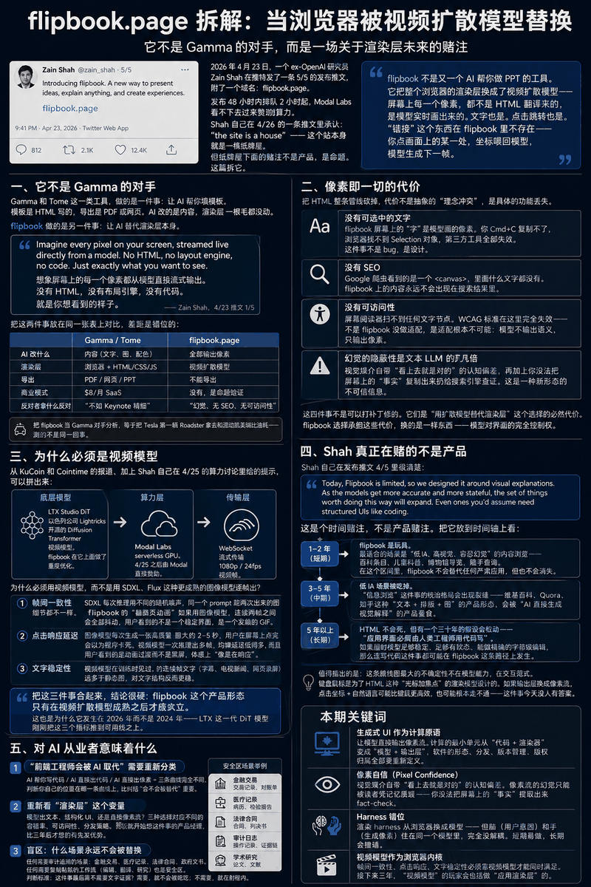
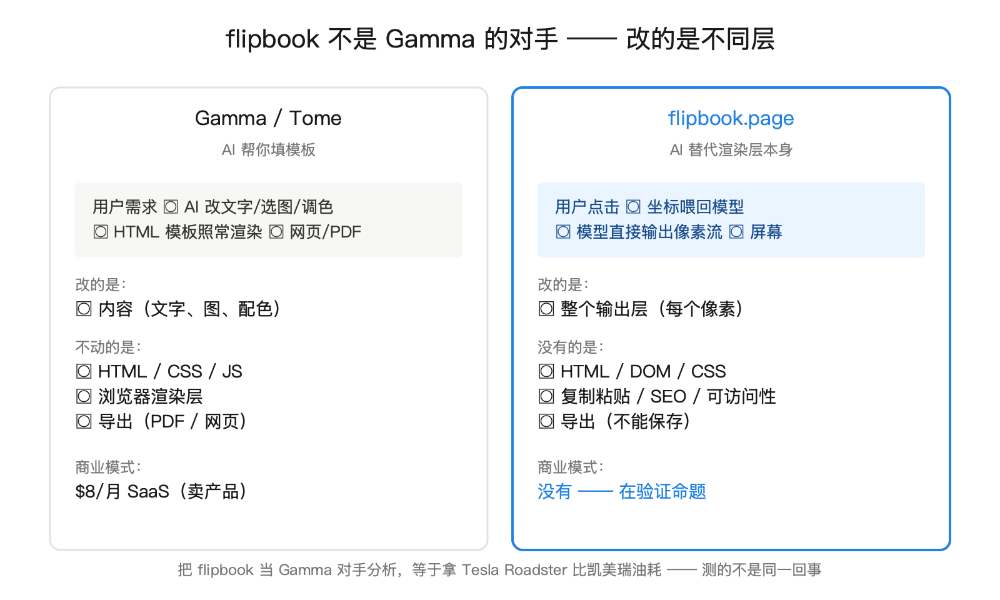
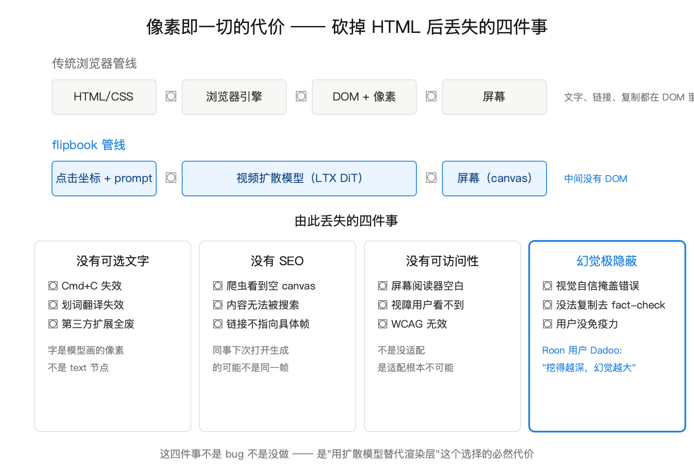
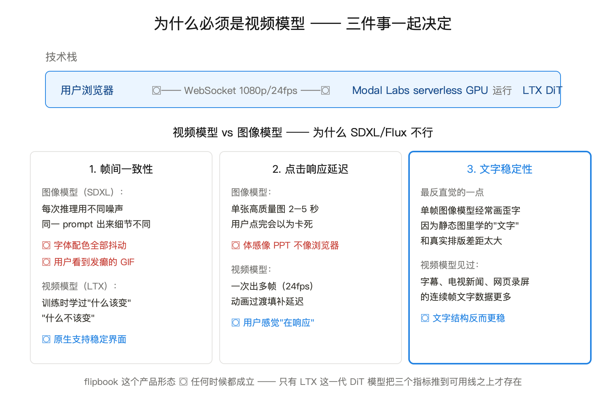
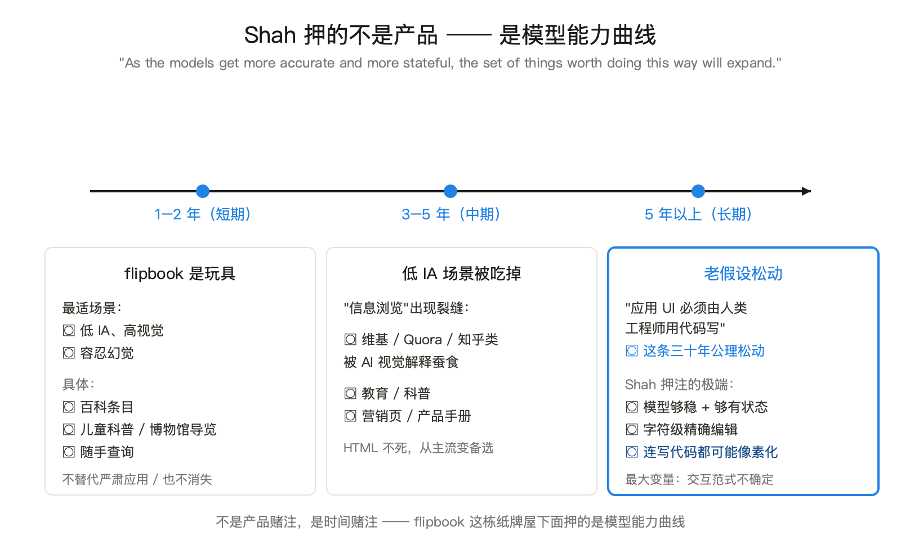
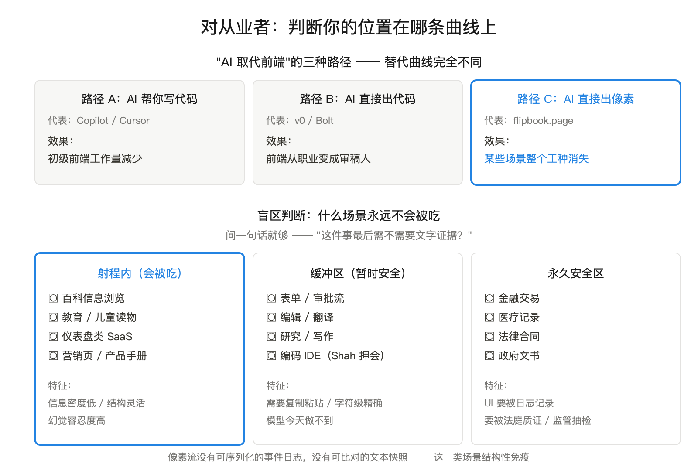

<audio controls src="podcast.mp3">点此收听播客版（爽快思思 配音）</audio>

2026 年 4 月 23 日，一个 ex-OpenAI 研究员 Zain Shah 在推特发了一条 5/5 的发布推文，附了一个域名：flipbook.page。中文圈第一时间把它归到 Gamma、Tome 那一类 AI 演示工具里。归错了。

flipbook 不是又一个 AI 帮你做 PPT 的工具。它把整个浏览器的渲染层换成了视频扩散模型 —— 屏幕上每一个像素，都不是 HTML 翻译来的，是模型实时画出来的。文字也是。点击跳转也是。"链接"这个东西在 flipbook 里不存在 —— 你点画面上的某一处，坐标喂回模型，模型生成下一帧。

发布 48 小时内排队 2 小时起，Modal Labs 看不下去过来赞助算力。Shah 自己在 4/26 的一条推文里承认："the site is a house" —— 这个站本身就是一栋纸牌屋。

但纸牌屋下面的赌注不是产品，是命题。这篇拆它。

## 一、它不是 Gamma 的对手

Gamma 和 Tome 这一类工具，做的是一件事：**让 AI 帮你填模板**。模板是 HTML 写的，导出是 PDF 或网页。AI 改的是内容，渲染层一根毛都没动。Gamma 卖 8 美元一个月，模式跟 Notion AI 一样 —— SaaS 加 AI 增量。

flipbook 做的是另一件事：**让 AI 替代渲染层本身**。

Shah 在发布推文 1/5 里写得很直白：

> Imagine every pixel on your screen, streamed live directly from a model. No HTML, no layout engine, no code. Just exactly what you want to see.

「想象屏幕上的每一个像素都从模型直接流式输出。没有 HTML，没有布局引擎，没有代码。就是你想看到的样子。」

这句话每个词都重要。"No HTML" 不是修辞，是技术事实 —— 你在 flipbook 上按 F12，DevTools 里看不到任何 DOM 元素，只有一个 `<canvas>` 在播视频。"No layout engine" 也是技术事实 —— 字体大小、文字换行、栅格对齐，全部由扩散模型在像素层面自己决定，不存在 CSS 计算这一步。"No code" 是说得最重的 —— flipbook 上你看到的那个"按钮"不是 `<button>`，是模型画出来的一块带按钮形状的像素。你点它，模型把你的点击坐标当作 prompt 的一部分接着画下一帧。

把这两件事放在同一张表上对比，差距是错位的：

| | Gamma / Tome | flipbook.page |
|---|---|---|
| AI 改什么 | 内容（文字、图、配色） | 全部输出像素 |
| 渲染层 | 浏览器 + HTML/CSS/JS | 视频扩散模型 |
| 导出 | PDF / 网页 / PPT | 不能导出 |
| 商业模式 | $8/月 SaaS | 没有，是命题验证 |
| 反对者拿什么反对 | "不如 Keynote 精细" | "幻觉、无 SEO、无可访问性" |

把 flipbook 当 Gamma 对手分析，等于把 Tesla 第一辆 Roadster 拿去和混动凯美瑞比油耗 —— 测的不是同一回事。

## 二、像素即一切的代价

把 HTML 整条管线砍掉，代价不是抽象的"理念冲突"，是具体的功能丢失。一项一项数：

**没有可选中的文字**。flipbook 屏幕上的"字"是模型画的像素。你 Cmd+C 复制不了，浏览器找不到 `Selection` 对象，第三方工具（划词翻译、复制到 Anki、保存到 Readwise）全部失效。这件事不是 bug，是设计 —— 因为模型不输出文本流，只输出帧。

**没有 SEO**。Google 爬虫看到的是一个 `<canvas>`，里面什么文字都没有。flipbook 上写的内容永远不会出现在搜索结果里。这意味着 flipbook 上的"知识"不能被外部世界引用 —— 你看到一段对你有用的解释，没法分享一个链接给同事让他直接跳到那段，因为下次同事打开生成的可能就不是同一帧。

**没有可访问性**。屏幕阅读器（VoiceOver、JAWS）扫不到任何文字节点。视障用户在 flipbook 上看到的是空白屏幕加视频流声音。WCAG 标准在这里完全失效 —— 不是 flipbook 没做适配，是适配根本不可能：模型不输出语义，只输出像素。

**幻觉的隐蔽性是文本 LLM 的几倍**。Roon Labs 论坛的用户 Dadoo 在 4/24 给出了最锋利的批评：

> It can and will present incorrect information without you ever noticing it… high hallucination potential the deeper you dig.

「它会、并且经常会，呈现错误信息却让你完全察觉不到 …… 你挖得越深，幻觉空间越大。」

文本 LLM 的幻觉至少能被复制粘贴、搜索引擎、fact-check 工具检验。flipbook 里的幻觉是图像形式的 —— 视觉媒介自带"看上去就是对的"的认知偏差，再加上你没法把屏幕上的"事实"复制出来扔给搜索引擎查证。这是一种新形态的不可信信息：**视觉自信掩盖事实错误**。

这四件事不是可以打补丁修的。它们是"用扩散模型替代渲染层"这个选择的必然代价。flipbook 选择承担这些代价，换的是一样东西 —— 模型对界面的完全控制权。这件事值不值，下面继续说。

## 三、为什么必须是视频模型

flipbook 的技术栈没有官方架构图，但从 KuCoin 和 Cointime 的报道、加上 Shah 自己在 4/25 的算力讨论里给的提示，可以拼出来：

- **底层模型**：LTX Studio DiT —— 以色列公司 Lightricks 开源的 Diffusion Transformer 视频模型。flipbook 在它上面做了重度优化。
- **算力层**：Modal Labs serverless GPU。4/25 之后由 Modal 直接赞助。
- **传输层**：WebSocket 流式传输 1080p / 24fps 视频帧。

这里有一个值得停下来想清楚的问题：**为什么必须用视频模型，而不是用 SDXL、Flux 这种更成熟的图像模型逐帧出？**

看上去好像图像模型也行 —— 反正每一帧也是一张图。实际跑起来三件事会立刻翻车：

**第一，帧间一致性**。SDXL 每次推理用不同的随机噪声，同一个 prompt 跑两次出来的图细节都不一样。flipbook 的"翻页动画"如果用图像模型，连续两帧之间的字体、配色、布局会全部抖动，用户看到的不是一个稳定界面，是一个发癫的 GIF。视频模型在训练时就学过"连续帧之间应该有什么变化、什么不该变"，这是它原生支持的能力。

**第二，点击响应延迟**。用户点屏幕到下一帧出现的时间，决定了 flipbook 是浏览器还是 PPT。图像模型每次生成一张高质量图大约 2–5 秒，用户在屏幕上点完会以为程序卡死。视频模型一次推理出多帧（24fps × 一段动画），均摊到每帧的延迟低得多，而且用户看到的是动画过渡而不是黑屏，体感上"像是在响应"。

**第三，文字稳定性**。这点最反直觉 —— 单帧图像模型画字经常画歪，是因为它在静态图片里学过的"文字"和真实排版差距太大。视频模型在训练时见过的连续帧文字（字幕、电视新闻、网页录屏）远多于静态图，对文字结构反而更稳。

把这三件事合起来，结论很硬：**flipbook 这个产品形态只有在视频扩散模型成熟之后才成立**。这也是为什么它发生在 2026 年而不是 2024 年 —— LTX 这一代 DiT 模型刚刚把这三个指标推到可用线之上。

## 四、Shah 真正在赌的不是产品

flipbook 现在能做的事很有限。Shah 自己在发布推文 4/5 里很清楚：

> Today, Flipbook is limited, so we designed it around visual explanations. As the models get more accurate and more stateful, the set of things worth doing this way will expand. Even ones you'd assume need structured UIs like coding.

「今天的 Flipbook 还很受限，所以我们让它围绕视觉解释来设计。等模型更准确、更有状态，这种方式能做的事会扩张 —— 甚至你以为必须用结构化 UI 的事，比如写代码。」

这句话是整个产品的论点支点。"As the models get more accurate and more stateful" —— 当模型更准确、更有状态。Shah 押的不是 flipbook 这个产品本身，是一条曲线：模型能力的提升会让"用结构化 UI"的必要性逐年下降。

这是个时间赌注，不是产品赌注。把它放到时间轴上看：

**1–2 年（短期）**：flipbook 是玩具。它最适合的场景是"低 IA、高视觉、容忍幻觉"的内容浏览 —— 百科条目、儿童科普、博物馆导览、随手查询。Gigazine 报道里说它"用插画教知识"，正好就是这个生态位。在这个区间里，flipbook 不会替代任何严肃应用，但也不会消失 —— 它会找到几百万有"我就是想随手看个解释、不需要精确"的用户。

**3–5 年（中期）**：低 IA 场景被吃掉。"信息浏览"这件事的统治格局会出现裂缝 —— 维基百科、Quora、知乎这种"文本 + 排版 + 图"的产品形态，会被"AI 直接生成视觉解释"的产品蚕食。中等内容容忍度（教育、科普、营销页、产品手册）会逐步迁移过去。HTML 在这些场景里不会消失，但会从"主流"变成"备选"。

**5 年以上（长期）**：HTML 不会死，但有一个三十年的假设会松动 —— "应用界面必须由人类工程师用代码写"。如果届时模型足够稳定、足够有状态、能做精确的字符级编辑，那么连写代码这件事都可能在 flipbook 这条路径上发生。Shah 的"Even ones you'd assume need structured UIs like coding" 不是修辞，是路线图。

值得指出的是：这条路线图最大的不确定性不在模型能力，在交互范式。键盘鼠标是为了 HTML 这种"光标加焦点"的渲染模型设计的。如果输出层换成像素流，点击坐标 + 自然语言可能比键鼠更高效，也可能根本走不通 —— 这件事今天没人有答案。

## 五、对 AI 从业者意味着什么

讲完命题，落到从业者视角。这件事在三个方向上有具体含义：

**第一，"前端工程师会被 AI 取代"这个老命题需要重新分类。** 过去三年这个讨论被 GitHub Copilot、Cursor、v0 主导，焦点是"AI 帮人写代码"或"AI 直接出代码"。flipbook 把第三种可能性摆上了桌：**AI 干脆不输出代码，直接出像素**。这三种路径的工程师替代曲线完全不同 —— "AI 帮你写代码"会让初级前端工作量减少；"AI 直接出代码"会让前端从职业变成审稿人；"AI 直接出像素"会让前端在某些场景里**整个工种消失**（因为没有代码可写）。判断你自己的位置在哪一条曲线上，比纠结"会不会被替代"重要。

**第二，做 AI 应用的人需要重新看"渲染层"这个变量。** 长期以来我们做 AI 产品的默认假设是：模型出文本、产品出 UI，UI 用 React/Vue 写。flipbook 把"UI 用代码写"这件事从公理变成了选项。这意味着以后做 AI 应用的时候多了一个设计变量：**这个产品的输出，应该是文本、还是结构化 UI、还是直接像素流？** 三种选择对应不同的容错率、不同的可访问性、不同的分发策略。今天就开始想这件事的产品经理，比三年后才想的有先发优势。

**第三，盲区 —— 什么场景永远不会被替换。** 任何需要审计追溯的场景：金融交易、医疗记录、法律合同、政府文书。这些场景里 UI 不只是给人看的，还要被日志记录、被法庭质证、被监管抽检。像素流没有可序列化的事件日志，没有可比对的文本快照 —— 你没办法在 5 年后告诉法官"用户当时点的是这个按钮"。这一类场景的 UI 工程师不会被这条曲线碰到。同理，任何需要复制粘贴的工作流（编辑、翻译、研究）也是安全区。判断一个场景是不是 flipbook 路径的目标，问一句话就够了：**"这件事最后需不需要文字证据？"** 需要，就不会被吃；不需要，就在射程内。

## 本期关键词

**生成式 UI 作为计算原语**。过去三十年浏览器都在做同一件事 —— 把 HTML/CSS/JS 翻译成像素。flipbook 把这条管线整个抹掉，让模型直接输出像素流。这不是让 AI 写网页，是让 AI 就是网页。这个转变如果成立，"计算"的最小单元会从"代码 + 渲染器"变成"模型 + 输出层"，软件的形态、分发、版本管理、版权归属全部要重新定义。

**像素自信（Pixel Confidence）**。视觉媒介自带"看上去就是对的"的认知偏差。文本 LLM 的幻觉可以被复制粘贴扔进搜索引擎，像素流的幻觉只能被读者凭记忆质疑 —— 你没法把屏幕上的"事实"提取出来 fact-check。这是一种新形态的不可信信息，对它的免疫力还没在用户群中长出来。

**Harness 错位**（沿用 [脑手分离] 文章里的说法）。flipbook 把渲染 harness 从浏览器换成了模型 —— 但脑（用户意图）和手（生成像素）住在同一个模型里，完全没解耦。这跟 Anthropic Managed Agents 的方向相反。短期看 flipbook 这种"全在一个袋子里"的形态更容易做出原型，但当模型和渲染器要分别迭代时，这个架构会撞墙。

**视频模型作为浏览器内核**。SDXL 时代我们以为图像模型就够了，flipbook 证明了不行 —— 帧间一致性、点击响应、文字稳定性这三件事必须靠视频模型才能同时满足。这意味着接下来三年，"视频模型"这件事的玩家不只是做创意工具的（Runway、Pika、Sora），还会包括做"应用渲染层"的（flipbook 是第一个，不会是最后一个）。

## 引用

1. [flipbook.page](https://flipbook.page/) —— 产品官网（需要现代浏览器，整页是 canvas 视频流）
2. [Zain Shah 发布推文 1/5](https://xcancel.com/zan2434/status/2046982383430496444) —— "No HTML, no layout engine, no code"
3. [Zain Shah 发布推文 4/5](https://x.com/zan2434/status/2046983256093163948) —— "Even ones you'd assume need structured UIs like coding"
4. [Zain Shah 4/26 致谢推文](https://x.com/zan2434/status/2047369568621097064) —— "the site is a house [of cards]"
5. [Zain Shah 4/25 算力扩容推文](https://x.com/zan2434/status/2047748600143437921) —— Modal Labs 接入
6. [Eddie Jiao 设计迭代推文](https://x.com/eddiejiao_obj/status/2047373400889606595) —— "hundreds of iterations"
7. [Roon Labs 用户 Dadoo 评论](https://community.roonlabs.com/t/flipbook-an-experiment-in-visual-exploration-of-information/318875) —— 幻觉隐蔽性批评
8. [KuCoin 报道](https://www.kucoin.com/news/flash/former-openai-researcher-unveils-flipbook-prototype-using-ai-to-generate-screen-pixels) —— 技术栈三件套
9. [Gigazine 报道](https://gigazine.net/gsc_news/en/20260423-flipbook-knowledge-image/) —— "用插画教知识"定位
10. [Cointime 报道](https://www.cointime.ai/flash-news/former-openai-researcher-releases-flipbook-prototype-72827) —— LTX + Modal 技术栈确认
