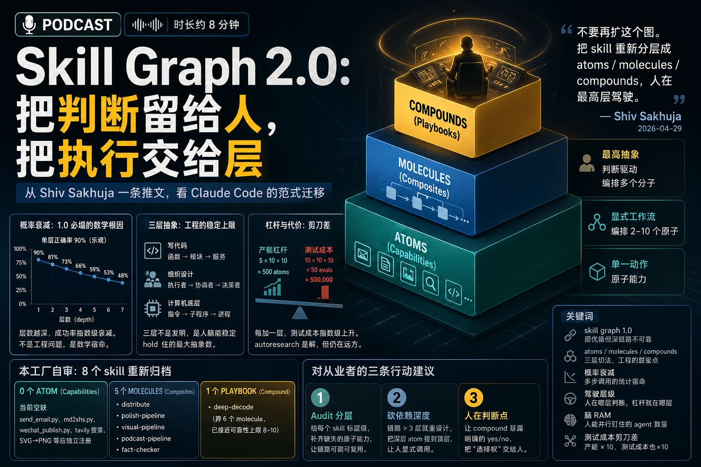
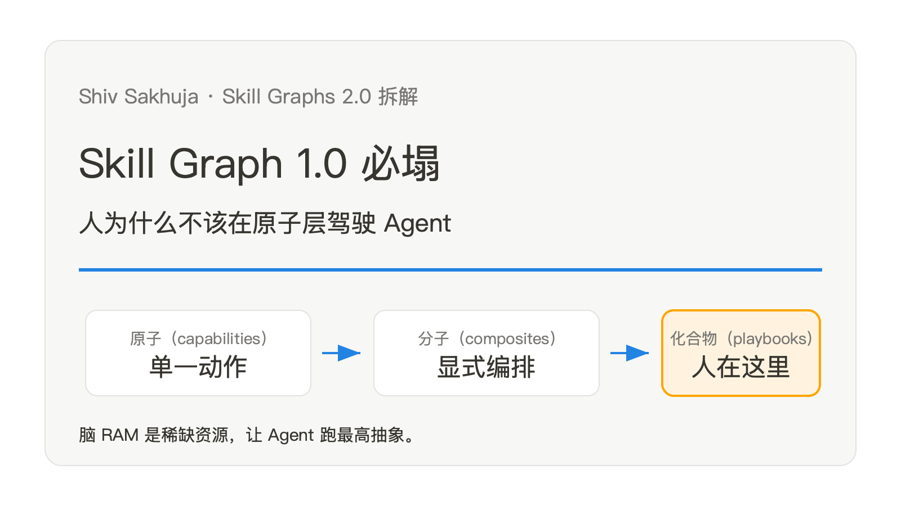
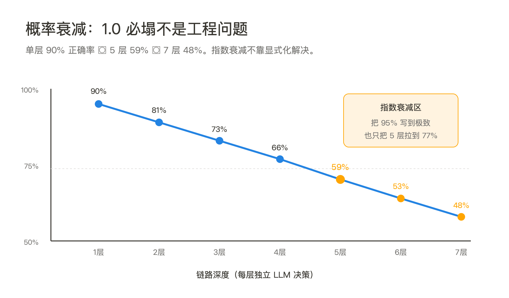
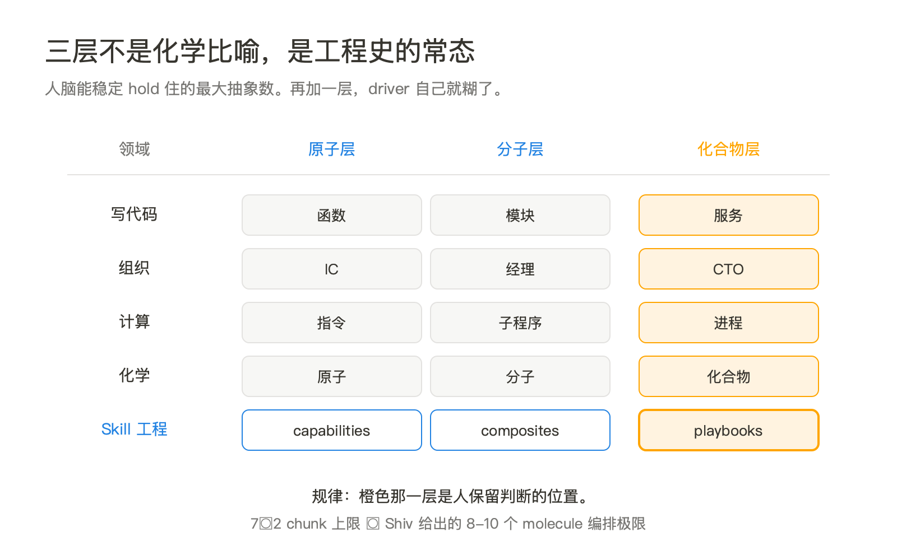
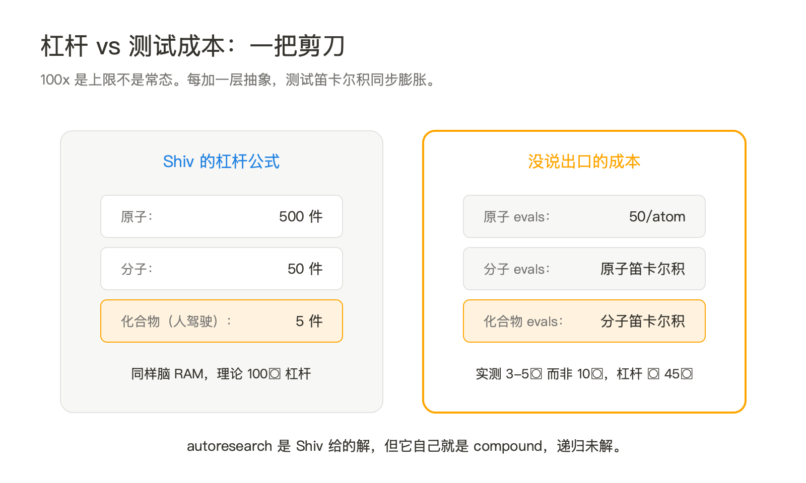
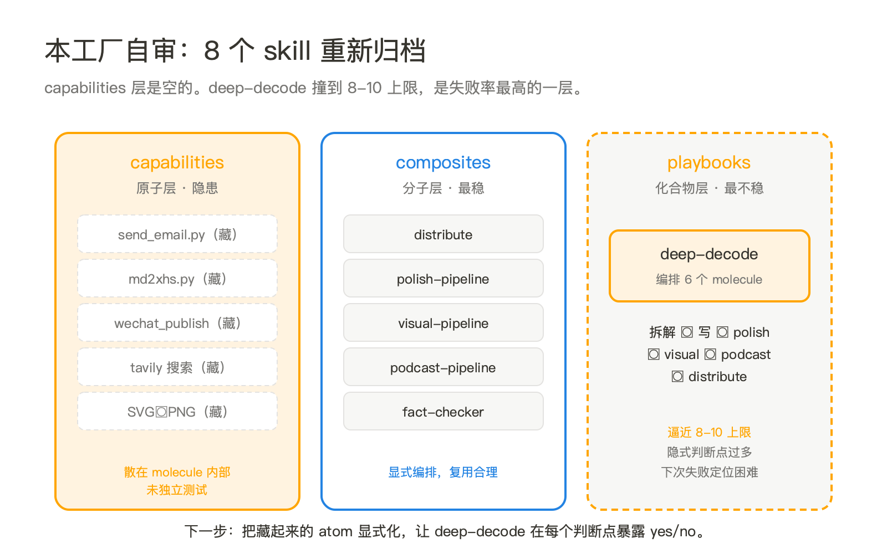

**播客版**：本篇已生成 `podcast.mp3`，邮件以附件发送，时长约 8 分钟。建议先听播客建立主线，再读正文细节。

Shiv Sakhuja 这条推文之所以值得停下来读，不是因为他给出了一个新名词。是因为他承认了一件 Claude Code 用户半年来一直在私下嘀咕、却没人公开总结的事：**skill graph 1.0 的玩法，在依赖深度大于两三层之后就塌了**。

skill graph 1.0 的初衷很合理：把每个 skill 写成 markdown，让 skill 之间像 Obsidian 笔记一样互相 wikilink。一个"草拟营销邮件"的 skill 自然依赖一个"图形设计"的 skill，再依赖一个"品牌色规范"的 skill。看起来是图，跑起来也是图。直到链条变深，agent 开始在某一层悄无声息地走丢——忘了调下层、错调了别的层、绕进了循环依赖。Shiv 的结论是：不要再扩这个图，**把 skill 重新分层成 atoms / molecules / compounds**，人在最高层驾驶。

这套切法他公司内部叫 capabilities / composites / playbooks。但比命名更重要的，是底下的工程直觉：链路深度是 LLM 系统真正的脆弱点，而人不该在脆弱的那一层做事。

## 一、概率衰减：1.0 必塌不是工程问题，是数学问题

Shiv 给出的失败描述是"depth 越深越不可靠"。这条观察经验上对，但他没说为什么对。补一刀就清楚了：每一层 skill-to-skill 的调用，本质都是一次 agent 自主决策——读上下文、判断该不该调下层、调哪个、传什么参数。这些决策**不是确定性函数，是概率事件**。

假设单层调用的端到端正确率是 90%（这已经很乐观，多数实测在 80% 以下），那么：

- 2 层链路：0.9² = 81%
- 3 层链路：0.9³ = 73%
- 5 层链路：0.9⁵ = 59%
- 7 层链路：0.9⁷ = 48%

这不是工程没调好，是概率独立事件相乘的数学结果。skill graph 1.0 的拥护者会说"我会把每个 skill 写得更显式"，但显式只能把单层从 80% 提到 95%，挡不住指数衰减。要打破衰减，唯一的办法是**砍掉层数**——让人在判断层介入，把 LLM 关进它能稳定的浅链路里。

这也回应了一个常见反驳："那 Anthropic 自己的 agent SDK 不是也能跑深链路吗？"能跑，但 Anthropic 内部的 harness 跑链路时是重度评测驱动的，每条链路都用 evals 筛选过、上线前压过几百次。普通用户拿一个手写的 markdown 图直接跑，没有这种过滤。Shiv 的解法实际上是把不可靠那段交还给人。

## 二、为什么恰好是三层：抽象的稳定上限

Shiv 用了化学比喻：原子、分子、化合物。但这套切法在工程史上反复出现过。

写代码：函数、模块、服务。再细分一层，就开始有人吵"这是不是过度工程"。
组织设计：IC、经理、CTO（或更广义的：执行者、协调者、决策者）。再加一层中层，组织效率开始打折。
计算机底层：指令、子程序、进程。每跨一层，运行时多一次上下文切换。

三层不是 Shiv 的发明，是**人脑能稳定 hold 住的最大抽象数**。心理学叫它"working memory chunking"，工程界叫它"层次设计的甜蜜点"。再多一层，driver 自己就糊了——不是 agent 不行，是人忘了自己在哪一层。

这件事对 skill graph 设计有一个直接含义：**层级数不该是设计目标，应该是设计约束**。如果你发现自己想加第四层（"超级 playbook 编排多个 playbook"），先停一停问：是不是你正在做的事根本不该交给 agent，而该自己写一段流程把它拆开？

Shiv 自己也承认这个上限：他猜测 compound 一旦编排超过 8-10 个 molecule 就会撞上 reliability 天花板。这个数字和心理学里 7±2 的 chunk 上限几乎吻合。

## 三、5 个 Agent 并行 = 500 个原子任务，公式有水分

Shiv 的杠杆论证最容易被引用、也最容易被误读：

> 1 个 compound = 10 个 molecule，1 个 molecule = 10 个 atom。
> 5 个 compound 并行 ≈ 500 个 atom 工作量。
> 同样的脑 RAM，输出差 100 倍。

这个公式干净得让人想转发。但里面藏着一个**很强的假设**：每一层都能 reliably 展开 10 倍。把数学翻译回工程语言，意思是 compound 调 molecule 时几乎不出错，molecule 调 atom 时也几乎不出错。

实测呢？2026 年这个时间点，公开的 agent benchmark（SWE-bench、MLE-bench、Tau-bench）上，多步任务的链路成功率到 5 步就开始急剧下降。Anthropic 自己的 Claude 4.7 Opus 在 8-10 步的复杂任务里也只能稳定保持 70% 左右。也就是说，**当下的 LLM 在 compound 层做不到稳定的 10× 展开**。3-5× 是常态，遇到含糊任务就变 1-2×。

这不是说 Shiv 的公式错了，是说 **100x 是上限不是常态**。真实场景里，5 个 compound 并行更可能是 5×3×3 ≈ 45 个原子任务的产能，仍然是大杠杆，但要把它当上限去规划组织，会失望。

更重要的是，杠杆公式只算了产能，没算**测试成本**。每加一层抽象，单元测试就要补一倍。一个 atom 跑 50 条 eval 就够了，molecule 要跑 atom 的笛卡尔积，compound 要跑 molecule 的笛卡尔积。Shiv 在文末承认这是最大挑战：**"testing the skills takes a lot of time"**。他寄希望于 autoresearch 来自动产生测试，但那是个远期假设。

短期内更现实的策略是：先承认 100x 是地平线、不是地板。每个 compound 上线前都要付出"补测试"的固定成本，否则杠杆变成放大器，把单点失败放大到整条链。

## 四、回到本工厂：现有 skills 重新归档

这套理论最有价值的地方，是它能逼任何一个跑 Claude Code 的团队对着自己 `.claude/skills/` 目录做一次审计。本工厂目前 8 个 skill，按 Shiv 的三层切法重新摆一遍：

**capabilities（atoms）层**——这一层目前是空的。`send_email.py`、`md2xhs.py`、`wechat_publish.py`、tavily 搜索、单张 SVG→PNG 转换，这些是**真正的原子动作**，但它们当前以脚本形式散落在各 skill 内部，没有作为独立 capability 注册。

**composites（molecules）层**——已有的 `distribute`、`polish-pipeline`、`visual-pipeline`、`podcast-pipeline`、`fact-checker` 都属于这一层。它们各自调用 2-5 个原子动作，逻辑显式，复用合理。这层是工厂目前最稳的部分。

**playbooks（compounds）层**——只有一个 `deep-decode`，把"吃→写→评"全流程压在一起。它跨 6 个 molecule（拆解、写、polish、visual、podcast、distribute），已经接近 Shiv 给出的 8-10 上限，所以**它也是工厂里失败率最高的那个**。每次拆解出问题，几乎都是 deep-decode 在某一步少调了下层（图没生成、polish 没跑双 agent、podcast 跳过了）。

推论清晰：工厂下一步**不是再加 compound，是把现有 atom 显式化**。把 `send_email.py`、`md2xhs.py` 等从 distribute 内部提出来，做成独立 capability，配 frontmatter 和测试。然后让 distribute 这个 molecule 显式声明依赖了哪些 capability。这样 deep-decode 失败时，能精确定位到是哪一层断了，而不是整条链黑盒。

更深一层的推论是：**deep-decode 这个 compound 现在写得太隐式**。它假设下层 molecule 各自正常，没有显式的 pre-check 和 fallback。Shiv 的原则是"compound 应该把能确定的事固化到指令里，把判断留给真正的判断点"。当前的 deep-decode 把太多事交给了 agent 临场判断（比如"自动选择是否跑 fact-checker"），这正是 Shiv 警告的"在 compound 层把判断给得太多"。

## 盲区：Shiv 还没回答的几件事

**compound 之上的那一层叫什么？** Shiv 说"我还没撞到上限"。但现实里很多业务场景已经在跑"多 playbook 协同"——比如内容工厂同时跑选题排产、内容生产、分发分析、读者反馈反向喂入选题，每条都是 playbook 级别。这是 compound 之上的"组织层"还是"协议层"？没人有答案。

**多个 compound 共享同一 capability 池时怎么避免冲突？** 比如 `deep-decode` 和某个未来的 `daily-brief` 都要调"tavily 搜索"这个 capability，但配额、cache、rate-limit 怎么协调？skill graph 1.0 的拥护者会说"图自然解决"，2.0 还没回答。

**测试问题没真正解决。** Shiv 把希望寄托给 autoresearch，但 autoresearch 自己就是一个跨多层的 compound，等于让一个 compound 来测试另一个 compound。这是个递归问题，不是工程问题。

**人在 compound 层驾驶，是不是又回到了"高级运维"？** 如果每个 compound 跑完都要人审一道，加在一起的人工时间可能比直接写 atom 还长。Shiv 没承认这个风险，但实践里很多人会撞到。

## 对从业者意味着什么

如果你在用 Claude Code 攒 skill，下面三件事现在就值得做：

**第一，audit 一次自己的 `.claude/skills/`**。把每个 skill 标上层级（capability / composite / playbook）。如果某层为空（多数人 capability 层都没显式化），是隐患不是优势——意味着你的 atom 散落在 composite 内部，没法独立测试和复用。

**第二，砍依赖深度。** 如果某条链路超过 3 层，不要再往下加，反着设计：把深层的 atom 拉到顶层让 driver 显式调用。Shiv 自己提到他不把 atom 放在 `.claude` 目录里，**就是为了防止 agent 自动触发深链**。这个反直觉的工程姿态值得借鉴。

**第三，承认 compound 层需要人。** 不要把"全自动化"作为目标，把"人在判断点介入"作为目标。一个跑得稳的 compound，应该在每个高判断点暴露给 driver 一个明确的 yes/no——比如 deep-decode 在写完文章后停下来等 review，而不是自动 polish→visual→podcast 一路跑到底。

skill graph 2.0 不是给 agent 减负，是给人重新分配工作。把"做事"留给 atom 和 molecule，把"决定做什么"留给 compound 和驾驶它的人。代码越便宜，选择越贵。skill 越多，分层越贵。

## 本期关键词

- **skill graph 1.0** —— Shiv 早先提出的玩法：把所有 skill 写成 markdown 文件，用 wikilink 互相依赖，构成一张图。优雅但不可靠，因为 agent 沿着深链路调用时端到端成功率指数衰减。
- **atoms / molecules / compounds** —— Shiv 的三层切法。原子是单一动作，分子用显式工作流编排 2-10 个原子，化合物用判断驱动编排多个分子。Antimetal 内部分别叫 capabilities / composites / playbooks。
- **概率衰减** —— LLM 多步调用的统计宿命。每一层 skill-to-skill 的判断都是独立概率事件，单层 90% 正确率到 5 层就只剩 59%。这是 skill graph 1.0 必塌的数学根因。
- **驾驶层级（driver level）** —— 人在哪一层做判断决定了杠杆大小。在 atom 层驾驶等于一个 CTO 在亲自修 bug，浪费脑 RAM；在 compound 层驾驶才是 5 agent 并行驱动 500 原子任务的姿态。
- **脑 RAM** —— Shiv 的核心洞察：**人能并行盯住的 agent 数量是稀缺资源，不是 agent 的算力**。一个人最多并行 5 个 agent，所以应该让每个 agent 跑最高抽象的任务，而不是反过来。
- **测试成本剪刀差** —— 三层抽象在产能上是 10× 累积，在测试成本上也是 10× 累积。autoresearch 是 Shiv 设想的解，但当前没有可用方案。这是 skill graph 2.0 最大的未解风险。

## 引用

1. [Skill Graphs 2.0](https://x.com/shivsakhuja/status/2047124337191444844) —— Shiv Sakhuja，2026-04-29，原始推文（含四条作者补充）
2. [[../../../wiki/concepts/skill-graph-levels|skill-graph-levels（本站知识页）]]
3. [[../../../wiki/concepts/harness-engineering|harness-engineering（关联：单 agent 边界）]]
