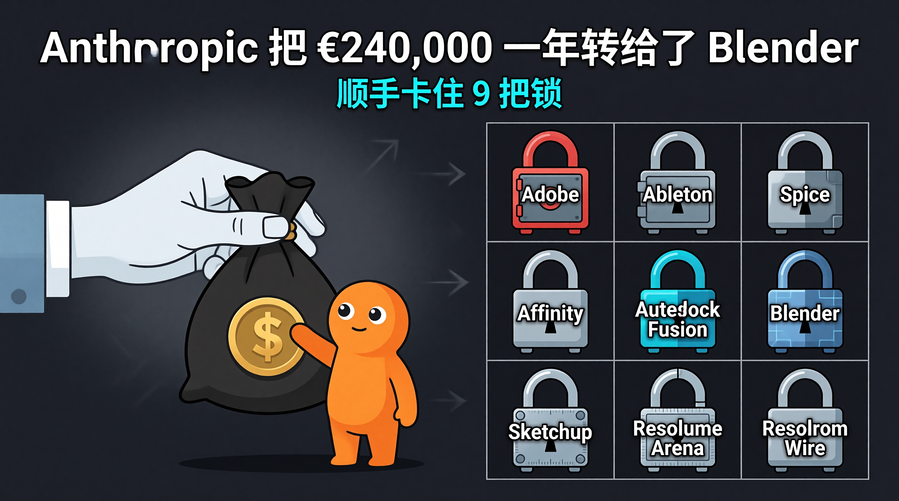
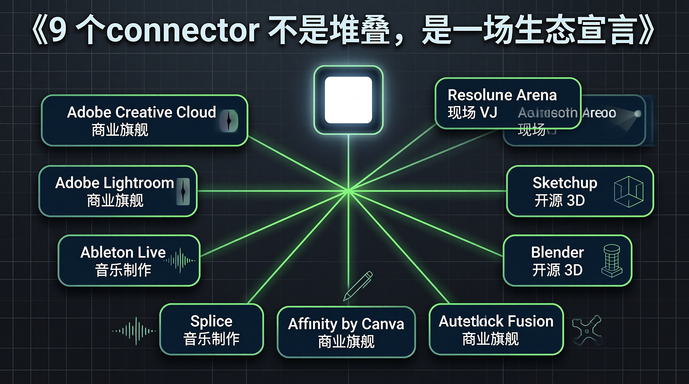
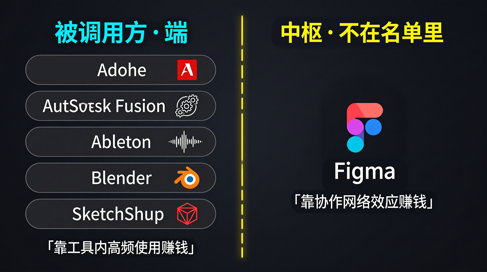
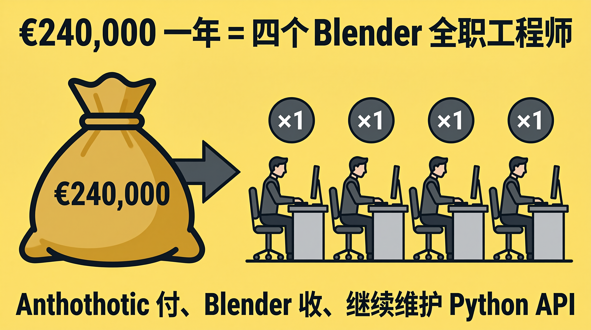
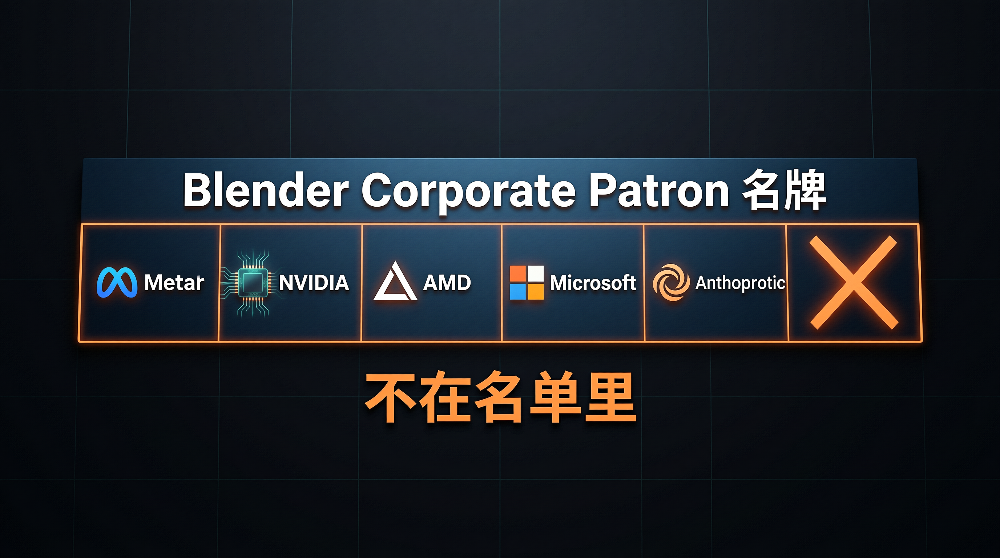

四月二十八号那天，Claude 官方账号在三十秒里抛出去九个名字：Adobe、Ableton、Splice、Affinity、Autodesk Fusion、Blender、SketchUp、Resolume Arena、Resolume Wire。同一天，Blender 基金会的捐赠人页面悄悄多了一行——Anthropic，年捐 €240,000，Corporate Patron 档。

九个 connector 一次性放出，外加给自己最大的"被调用方"开一张四个工程师的工资支票。这两件事如果分开看都不算大新闻，连在一起读，就能闻到味道：Anthropic 在用 connector 矩阵抢"AI 助手 + 专业工具"的标准接口卡位，并且懂得给生态最薄弱的那一环垫钱。

## 九个名字一次发，是有讲究的

Notion、Slack、Google Drive、GitHub 是 Claude connector 体系的第一批客人，2024 年至 2025 年陆续接进来。那一波解决的是知识工作者的桌面：邮件、文档、代码仓。这一波九件套跨过去了一道边界——专业创作工具栈。

Adobe Creative Cloud 五十多个工具一并打包，Photoshop、Premiere、Lightroom、Illustrator、Firefly、Express、InDesign、Adobe Stock 全在里面。Claude 接到的是一条横跨图像、视频、版式、库存素材的工作流总线，不是单点 API。Anthropic 官方的措辞很克制："let Claude work alongside the software creative professionals rely on, so creatives can extend their reach"。翻成大白话：Claude 不替代专业工具，Claude 当编排器。

为什么是九个一起发，不是分九次发？

九次分发 = 九次 PR 周期 = 九次"功能更新"叙事。一次性九个 = 一次"生态宣言"叙事。前者卖功能，后者定义类目。Anthropic 选了后者。从产品规划角度看，这是把 connector = MCP 应用层 这条路径做"既成事实化"——你之前可以怀疑 MCP 是不是噱头，看到九个商业软件巨头同时签字，怀疑成本会被快速抬高。

九件套的另一个隐含信号是分层：

- **Adobe / Autodesk Fusion**：商业旗舰，覆盖图像视频和工业设计。Anthropic 拿到的是订阅生态的入场券。
- **Ableton / Splice**：音乐制作的左右手——一个是 DAW，一个是采样库。Claude 进来不是写歌，是当"懂 Live 的客服"——Ableton 的 connector 把 Claude 的回答锚定在官方文档上。
- **Affinity by Canva**：典型的"后来者反扑"。Affinity 的卖点本来就是永久授权 + 一次买断对抗 Adobe，现在它把"批量自动化 + 应用内自定义功能"作为差异化主轴。
- **Blender / SketchUp**：3D 建模的两条路径——Blender 偏开源 + 程序化（Python API），SketchUp 偏可视化 + 商业。Claude 在前者做"自然语言写脚本"，在后者做"对话起草，导入精修"。
- **Resolume Arena + Wire**：VJ 和现场视觉的小众工具。九件套里它最像彩蛋，但也最戳"专业感"——专业到一般人没听过。

## 名单里谁在、谁不在

九件套读完，最快冒出来的反问是：Figma 呢？

Figma 这两年是设计师默认工具，按理应该排在第一梯队。但 Figma 没在名单里——而且很可能永远不会出现。原因不复杂：Figma 自己已经在做 MCP host，Figma MCP server 早已上线给 Cursor / Claude Desktop 这类客户端调用。它不是不接，是不愿做被 Claude 一键开关的"端"。它要做中枢。

这种态度的差异决定了 connector 矩阵的边界。愿意做被调用方的工具，本质是承认"AI 助手在用户的入口位置"。Adobe、Autodesk、Ableton 接受这个前提，因为它们的盈利模型是"工具内的高频深度使用"——用户停留越久，订阅越粘。Claude 把人引进来即可，不威胁主收入。

Figma 不接受这个前提，因为 Figma 的盈利模型是"作为协作中枢的网络效应"。一旦它做被调用方，它就从枢纽降级成节点。

这是 connector 生态最值得读懂的隐变量：每个被接入的工具都在做一次自我定位——我是端，还是枢纽？这一波九件套全部站在了"我是端"那一边。下一波 Anthropic 想拉的工具如果是 Figma 这类枢纽，谈判桌上摆的就不只是 connector，还有 revenue share 或控制权交换。

## €240,000 一年，等于四个 Blender 工程师

Blender 基金会公开的 Corporate Patron 档位门槛是 €240,000/年。Anthropic 这次进来就是按这个数填的。Blender CEO Francesco Siddi 在公开声明里把这笔钱的用途讲得很直白：用于核心开发，特别提到 Python API 的维护和改进。

这句话值得重读一遍。Python API 是什么？是 Claude Blender connector 调用的同一套接口。Anthropic 一边用 Blender 的 API 卖 connector，一边给 API 维护团队发工资。

€240,000 在 Blender 那一侧能覆盖大约四名全职工程师的年薪。换在 Anthropic 这一侧，按它最新一轮估值算，这个数字可能比 Mike Krieger 一个月的 Slack 通讯录预算还少。杠杆比拉到极致——花零头给生态最薄弱的一环续命，反过来保证自己的产品能持续工作。

Siddi 也很懂如何处理社区情绪。他在公告里直接说："This is towards helping Blender itself as a software, this is not an AI takeover."并且强调赞助"no strings attached"，与 Meta 之前的赞助同性质，不代表 Blender 认可 Anthropic 的产品或使命。这段话同时安抚了两群人——担心 AI 公司渗透开源的艺术家、和担心 Blender 偏向 AI 路线的传统用户。

## OpenAI 没做这件事

横向对比 OpenAI、Google、xAI——它们都在卷模型，都在搭工具调用接口，但截至四月底，没有一家在 Blender Development Fund 的捐赠人列表里出现过。GitHub 历史显示，过去两年 Blender 的 Patron 名单里有 Meta、AMD、NVIDIA、Microsoft、Intel、Epic Games（Unreal 团队），生成式 AI 阵营这边一片空白。

为什么 Anthropic 要做这件 OpenAI 没做的事？

第一层是 PR。OpenAI 这两年在创作者社区里背着"训练数据来源不透明"的包袱，在 Reddit 和 ArtStation 上被反复审讯。Anthropic 用 €240,000 直接买一份"我们和创作者站在一起"的姿态，性价比极高。

第二层是产品。Anthropic 的差异化叙事一直是 Constitutional AI、Responsible Scaling Policy、Trust & Safety——这些抽象的东西需要具体的物证支持。"给 Blender 捐了一年四个工程师工资"是物证，比一篇博客好用。

第三层是技术防御。Blender 是 9 件套里唯一的开源软件，也是九个里 API 最深、最容易出问题的一个。如果 Blender 在哪一次 minor 升级里悄悄改了 Python API 的行为，Claude Blender connector 就会大面积失灵。Anthropic 现在掏钱让 Blender 工程师能稳定上班，等于给自己买了一份生态稳定性保险。

这三层叠在一起，€240,000 这笔钱的真实价格远低于它的账面数字。

## 盲区

公告之外，仍有几个未解答的问题。

**一、各 connector 的可用性梯度未公开。** Anthropic 官方公告没明示哪些计划（Free / Pro / Max / Team / Enterprise）可以使用哪些 connector。9to5Mac 的报道说"available immediately across every Claude plan, including Free"，但官方公告原文未明示这一点。创意工具是高频高调用场景，如果 Free 用户就能畅用 Adobe connector，Anthropic 的 token 成本会被瞬间拉满；如果限 Pro+，那这次发布更像企业销售导流。

**二、Splice、Resolume 这类小众工具的真实使用率存疑。** Splice 在采样库里份额第一，但用户基数远小于 Adobe；Resolume 是 VJ 圈用的小众工具。Anthropic 把它们和 Adobe 摆在同一发布会上，是真的要做这些垂直场景，还是为了凑"九"这个数字制造规模感？前者意味着 Anthropic 团队对小众专业工具有真投入，后者意味着发布会本身就是 PR 优先级最高的产物。

**三、Adobe / Autodesk 的态度。** 它们接入 connector 等于给 Claude 让出了"用户入口"位置——长期看是不是好事？如果用户养成"先和 Claude 说，再让 Claude 去开 Photoshop"的习惯，Adobe 的 UI、教学体系、订阅留存都会被冲。这次合作公告里看不到这两家公司高管的直接表态，只有 Anthropic 单方面在讲。沉默有时候是最响的信号。

**四、Anthropic 自己的生态护城河期限。** Connector 协议层（MCP）是开放的，理论上 OpenAI、Google 明天就能复刻。Anthropic 真正的卡位优势来自"率先做出来 + 商业合作签订"。这个时间窗口能维持多久？六个月？十二个月？取决于 OpenAI 把 GPT-5 的 tool use 能力推到什么程度，以及 Adobe 这类合作方愿不愿意"独家"。

## 对 AI 产品和实践者意味着什么

如果你正在做 AI Q&A 评测体系，这次发布意味着评测维度需要扩。原先以"能不能正确回答 Adobe 文档问题"评 Claude，现在要加"能不能正确编排一条横跨 Photoshop + Premiere + Stock 的 5 步工作流"。前者考知识点，后者考 agent 行为。

如果你正在评估接 MCP 的时机，这次九件套发布是过去 48 小时内最强的 MCP 生态信号。它说明：第一，Anthropic 愿意把 connector 当主线产品推；第二，专业软件商愿意做被调用方；第三，9 个名字坐实了 MCP 不是协议层小众实验。这三个信号都对你的 MCP 接入决策构成正向加权。

如果你的产品需要让用户"用自然语言驱动专业工具"，这次的范式可以照抄：先把"Claude 是编排器，专业工具是执行器"作为默认架构，再决定哪些工具值得做完整 connector，哪些用 MCP server 就够。Adobe / Ableton 的做法说明——connector 的最小可用版本是"答案锚定在官方文档"，不需要从第一天就做完整工具调用。这是一个非常友好的起步姿势。

最后一条：Anthropic 给 Blender 的那 €240,000 是一记潜台词。它说的是"做生态的人要愿意给生态垫钱"。如果你的业务踩在一块开源底盘上，预算里留一笔反哺的钱可能不是花费，是保险。

## 本期关键词

- **Connector** —— Claude 产品里 MCP 协议的封装态。开发者侧的 MCP server 需要本地运行 + 客户端配对（Claude Desktop / Cursor），用户侧的 connector 是 Anthropic 在 Claude.ai 里替你接好了鉴权和工具描述，零本地部署。Adobe / Notion / GitHub 都是 connector 形态。

- **Corporate Patron** —— Blender Development Fund 的最高公开档位，门槛 €240,000/年。Meta、AMD、NVIDIA、Microsoft、Intel、Epic Games 历史上都在这一档参与过。Anthropic 是 2026 年新进入这一档的 AI 公司。

- **被调用方 vs 中枢** —— 在 connector 生态里，每个软件都要做一次定位选择。Adobe / Autodesk / Ableton 选择做被调用方，因为它们靠"工具内深度使用"赚钱，被外部 AI 拉用户进来不威胁主收入。Figma 选择做中枢，因为它靠协作网络效应赚钱，做被调用方意味着自降一级。Anthropic 这一波九件套全部站在前者那一边。

- **MCP（Model Context Protocol）** —— Anthropic 在 2024 末发布的开放协议，定义 LLM 和外部工具间的接口。MCP 既可以用 server-host 方式（开发者运行）部署，也可以用 connector 方式（终端用户开关）部署。Anthropic 这次九件套发布让 MCP 第一次拥有了"公司级被认证的合作目录"。

- **生态转移支付** —— 用户付订阅费给 Adobe、Autodesk、Ableton；Claude 在它们之上抽 connector 调用费；Anthropic 把其中一部分以 €240,000/年的形式转给 Blender 工程师。这条钱的循环路径是 connector 生态独有的——靠某些工具盈利，又给另一些工具续命。

## 引用

1. Anthropic 官方公告 *Claude for Creative Work* —— https://www.anthropic.com/news/claude-for-creative-work
2. 9to5Mac 报道 *Anthropic releases 9 Claude connectors for creative tools, including Blender and Adobe* —— https://9to5mac.com/2026/04/28/anthropic-releases-9-new-claude-connectors-for-creative-tools-including-blender-and-adobe/
3. MacRumors 报道 *Claude Gains Integrations With Adobe, Blender, SketchUp and Other Creative Apps* —— https://www.macrumors.com/2026/04/28/claude-creative-tool-connectors/
4. Blender 官方公告 *Anthropic joins the Blender Development Fund as Corporate Patron* —— https://www.blender.org/press/anthropic-joins-the-blender-development-fund-as-corporate-patron/
5. 80 Level *Blender CEO Addresses Funding From Claude AI Creator Anthropic*（含 Francesco Siddi 引语原文） —— https://80.lv/articles/blender-ceo-on-anthropic-funding-this-is-not-ai-takeover
6. TechRadar *Anthropic signs up Adobe, Blender and more to push Claude into creative work* —— https://www.techradar.com/pro/claude-cant-replace-taste-or-imagination-but-it-can-open-up-new-ways-of-working-anthropic-signs-up-adobe-blender-and-more-to-push-claude-into-creative-work
