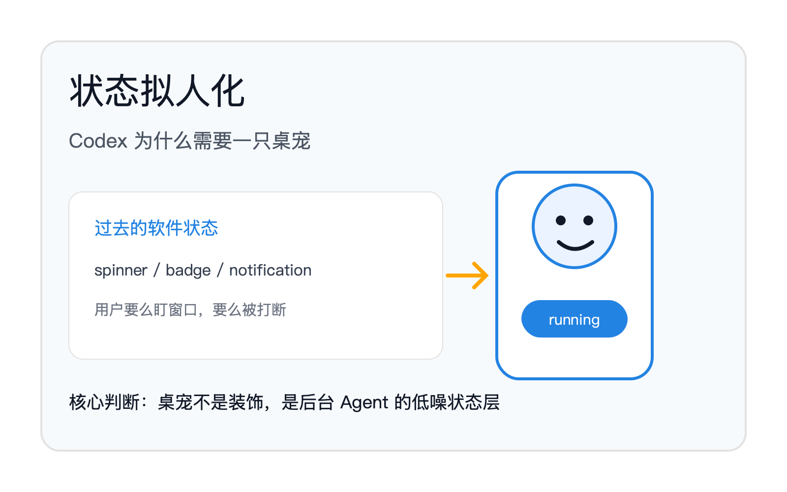
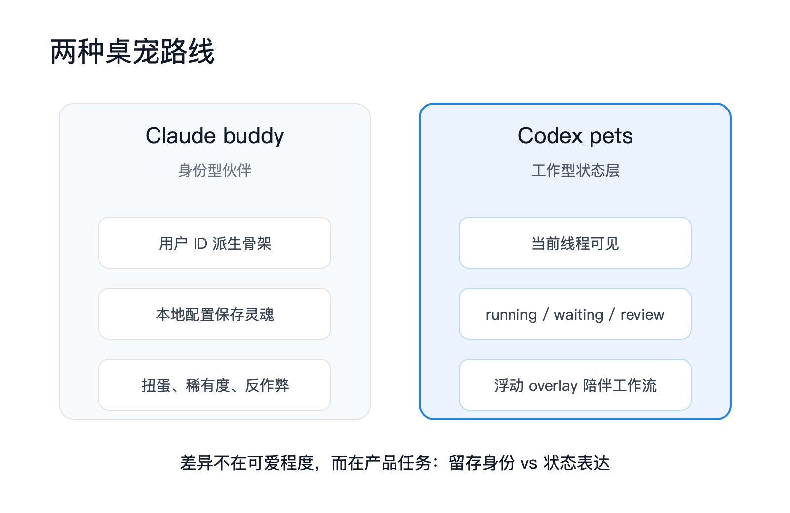
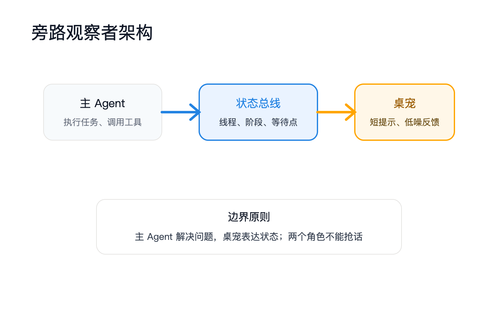
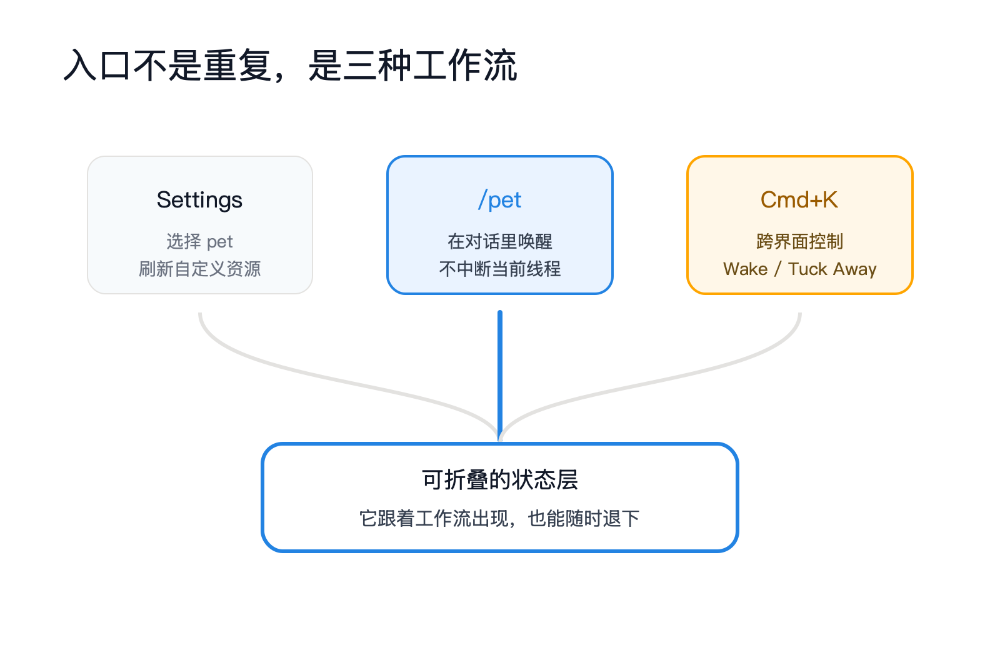

Codex 新增桌宠，第一眼看是轻功能：一个会动的小伴侣，飘在屏幕边上，偶尔提醒你它在干活。

但把它放回 Codex App 的工作场景，这不是装饰。它解决的是 Agent 产品里最难被传统 UI 处理的问题：长任务运行时，用户怎么知道系统还活着、在做什么、是否轮到自己接手。




## 一、桌宠先是一盏状态灯

OpenAI 官方文档对 Codex pets 的描述很克制：它是 App 里的可选动画伴侣。用户可以在 Settings → Appearance → Pets 选择内置 pet，也可以从本地 Codex home 刷新自定义 pet。入口有三种：在 composer 里输入 `/pet`，在 Settings → Appearance 里点 Wake Pet / Tuck Away Pet，或者用 Cmd+K / Ctrl+K 从命令面板执行同样命令。

真正关键的是第二段。文档说，浮动 overlay 会在你使用其他 App 时保留 Codex 的活跃工作状态：显示当前线程，反映 Codex 是 running、waiting for input，还是 ready for review，并配一个短进度提示。

这句话把“桌宠”的产品定位讲透了。它的任务不是陪你聊天，而是把后台 Agent 的状态从一个窗口里拎出来，放到你的工作环境边缘。


传统软件的状态反馈有两个默认位置：窗口内的 spinner，或者系统级通知。前者要求用户一直盯着窗口，后者只在离散事件发生时弹出。Agent 不一样。它的工作是连续的、长时间的、带不确定性的。中间状态太多，通知会打扰；不通知，用户又会焦虑。

桌宠在两者之间补了一层：常驻、低噪、可扫视。它不抢注意力，但让你知道 Codex 还在场。

## 二、Codex 走的是工作型桌宠

参照组里的源码来自之前泄露的 Claude Code/Claude CLI 体系，不属于 Codex App。直接拿它当 Codex 证据会错。但它提供了一个很好的对照：Claude buddy 追求的是“身份”，Codex pets 追求的是“工作状态”。

Claude buddy 的核心实现藏在 `src/buddy/`。它把伴侣拆成两部分：可持久化的“灵魂”和由用户 ID 派生的“骨架”。

```ts
// raw/claudecodesources/raw_code/src/buddy/companion.ts
const SALT = 'friend-2026-401'

export function roll(userId: string): Roll {
  const key = userId + SALT
  if (rollCache?.key === key) return rollCache.value
  const value = rollFrom(mulberry32(hashString(key)))
  rollCache = { key, value }
  return value
}

export function getCompanion(): Companion | undefined {
  const stored = getGlobalConfig().companion
  if (!stored) return undefined
  const { bones } = roll(companionUserId())
  return { ...stored, ...bones }
}
```

这段代码的设计很明确：名字和性格存在配置里，物种、稀有度、帽子、属性从用户 ID 确定性生成。它要制造“这是你的那一只”的感觉。更细的是合并顺序 `{ ...stored, ...bones }`，骨架覆盖本地存储，用户不能靠改配置把普通 buddy 改成稀有 buddy。

Codex pets 目前公开信息里没有这套稀有度、反作弊、扭蛋经济。它的入口也不叫 hatch，而是 wake / tuck away。语义差异很大：Claude 是“孵化一个伙伴”，Codex 是“唤醒一个状态层”。



这意味着 Codex 没有走“开发者情感留存”的老路。它更像把状态栏拟人化。桌宠可爱只是表层，核心是减少 Agent 常驻带来的不确定感。

## 三、真正的架构是旁路观察者

Claude buddy 源码里最值得 Codex 借鉴的不是动画，而是角色边界。它在 prompt 里明确告诉主模型：你不是伴侣，伴侣是一个单独的 watcher。

```ts
// raw/claudecodesources/raw_code/src/buddy/prompt.ts
A small ${species} named ${name} sits beside the user's input box and
occasionally comments in a speech bubble. You're not ${name} — it's a
separate watcher.

When the user addresses ${name} directly (by name), its bubble will answer.
Your job in that moment is to stay out of the way...
```

这是关键设计。桌宠如果和主 Agent 混成一个角色，就会制造噪声：主 Agent 要解释任务，桌宠也要说话；用户问一句，两个角色抢答。旁路 watcher 的好处是，它只承担窄职责：观察状态、给短反馈、把复杂执行过程压缩成一眼能看懂的提示。

Claude buddy 的 UI 层也遵循这个思路。伴侣反应存在全局状态里，渲染组件只读 `companionReaction` 和 `companionPetAt`，再把它转成气泡、眨眼、爱心动画。

```tsx
// raw/claudecodesources/raw_code/src/buddy/CompanionSprite.tsx
const reaction = useAppState(s => s.companionReaction)
const petAt = useAppState(s => s.companionPetAt)

const petAge = petAt ? tick - petStartTick : Infinity
const petting = petAge * TICK_MS < PET_BURST_MS

if (reaction || petting) {
  spriteFrame = tick % frameCount
} else {
  const step = IDLE_SEQUENCE[tick % IDLE_SEQUENCE.length]!
  blink = step === -1
}
```

这段代码没有神秘感，但很有产品感。它不是每一帧都要“表现自己”，而是空闲时几乎不动，偶尔眨眼；有反应或被摸时，才切到兴奋帧。好的桌宠不是一直动，而是让用户在余光里感到系统还在。

Codex pets 的官方描述也指向同一个架构：overlay 读取当前线程和工作状态，把 running / waiting / review 转成短提示。这本质上是一个状态订阅器，不是主任务执行器。



## 四、为什么命令面板比设置页更重要

官方文档给了三个入口：设置页、`/pet`、命令面板。表面看是重复，实际上对应三种使用场景。

设置页负责配置：选哪个 pet，刷新自定义 pet。`/pet` 负责在对话上下文里快速唤醒。命令面板负责跨界面控制：当用户在 App 里不想离开当前流，Cmd+K / Ctrl+K 是最短路径。

这里能看出 Codex App 的产品判断：桌宠不是一次性开关，而是工作流里的可折叠状态层。用户有时需要它在场，有时需要它退下。Wake Pet / Tuck Away Pet 的命名比 Show / Hide 更有温度，但底层仍是工作流控制。

自定义 pet 也放在同一条线里。官方给出的路径是安装 `hatch-pet` skill，重新加载 skills，然后让 skill 创建一个受近期项目启发的新 pet。

这一步超过了简单换皮肤。它把桌宠接进 Codex 的技能系统：pet 不只是预设资产，也可以由本地上下文生成。更深一层看，Codex 正在把“个性化界面”从设置项迁移到 skill 工作流里。



这一步的意义不在于用户能不能养一只更好看的 pet，而在于 Codex 把 UI 外观也纳入了可编程空间。未来自定义的不一定只是形象，也可能包括状态文案、提醒粒度、项目语境、甚至不同仓库对应不同伴侣。

## 五、盲区：我们还不知道什么

Codex pets 目前公开材料很少。官方文档确认了功能入口和状态呈现，但没有讲实现细节。几个问题必须留白。

第一，状态映射是否可扩展。现在文档只提 running、waiting for input、ready for review。真实开发任务里还有更细的状态：测试失败、权限请求、网络阻塞、分支冲突、CI 等待、子 Agent 运行。桌宠能不能表达这些，决定它是轻装饰还是工作仪表盘。

第二，自定义 pet 的边界。`hatch-pet` skill 能创建外观，但是否能定义行为、文案风格、状态映射，还没有公开说明。如果只能换形象，它是主题系统；如果能改状态表达，它就是个人化 Agent UX 的入口。

第三，隐私和注意力边界。overlay 会在用户使用其他 App 时显示活跃线程和进度提示。企业场景里，线程名称、任务提示、review 内容都可能有敏感信息。一个常驻浮窗必须有足够克制的显示策略，否则它会从“低干扰反馈”变成“低空泄露风险”。

第四，它是否会影响用户对 Agent 的归因。桌宠越像一个主体，用户越容易把任务状态、成功、失败都投射到它身上。产品要拿捏：给 Codex 一个身体，不等于给它一个不受控人格。

## 对 AI 从业者/实践者意味着什么

做 Agent 产品的人，应该把 Codex pets 当成一个信号：Agent UX 的下一层竞争，不是再加一个聊天框，而是把“长时间运行的不确定性”变成用户可感知、可控制、可放下的状态。

如果你在做开发者工具，别急着复制桌宠。先问三个问题：你的任务是否长到需要后台存在感；用户是否经常离开主窗口；系统是否有明确的 waiting / review / running 状态。如果答案都是是，拟人化状态层有价值。如果没有，桌宠只会变成噪声。

如果你在做企业 AI 产品，重点不是可爱，而是“可扫视”。审批流、报表生成、知识库同步、数据清洗，都有类似问题。用户不想每五分钟点开看一次，也不想被每一步通知打断。常驻小状态层可能比大弹窗更适合。

如果你在做平台，Codex 的 custom pet 路径更值得看。它把界面资产接进 skill 系统，说明未来的 Agent 产品不只任务可编排，界面也会被编排。用户给 Agent 定义工作方式，也会给 Agent 定义出现方式。

最深的变化是这个：过去软件状态是机器语言，spinner、进度条、badge。现在 Agent 的状态开始变成人类能感知的存在。Codex pets 只是一个很小的入口，但它指向的问题很大：当 AI 不再只在窗口里回答，而是在后台持续工作，产品需要一种新的“在场语法”。

## 本期关键词

**状态拟人化** -- 把系统状态包装成一个有形象、有动作、有短提示的存在。它不是为了模拟人格，而是降低用户理解后台状态的成本。Codex pets 的核心价值就在这里：running、waiting、review 这些抽象状态，被放进一个浮动伴侣里，用户扫一眼就知道当前轮到谁。

**旁路观察者** -- 不参与主任务执行，只观察线程状态并输出短反馈的组件。Claude buddy 源码里的 prompt 明确说 companion 是 separate watcher。这个边界很重要：主 Agent 负责解决问题，桌宠负责表达状态。两者混在一起，用户会听到两个声音。

**浮动 overlay** -- 脱离主窗口、常驻在屏幕边缘的显示层。Codex pets 的 overlay 会在用户使用其他 App 时保留活跃工作状态。它比通知更连续，比主窗口更轻，适合长任务和异步任务。

**工作型桌宠** -- 区别于传统电子宠物的路线。Claude buddy 更像身份与留存系统，有稀有度、骨架、灵魂；Codex pets 更像工作仪表盘，核心任务是表达线程状态。它不是“养成”，而是“在场”。

**可编程界面** -- 界面不再只是设置项，而是由 skill、上下文和本地资源生成。`hatch-pet` 暗示 Codex 把 pet 外观接入了 skill 系统。未来 Agent 的界面层可能像工具层一样可扩展。

## 引用

1. [Codex app settings: Codex pets](https://developers.openai.com/codex/app/settings#codex-pets) -- OpenAI 官方文档，说明 `/pet`、Wake Pet / Tuck Away Pet、floating overlay、running / waiting / review 状态和 `hatch-pet` 自定义路径
2. [Agent Skills – Codex](https://developers.openai.com/codex/skills) -- OpenAI 官方文档，说明 Codex 的 skills 机制，自定义 pet 依赖这一扩展路径
3. [Codex overview](https://developers.openai.com/codex/overview) -- OpenAI 官方文档，Codex 的任务类型与开发工作流背景
4. [Claude Code Buddy 源码对照：CompanionSprite.tsx](/Users/muming/项目/内容/raw/claudecodesources/raw_code/src/buddy/CompanionSprite.tsx) -- 本地 Claude 泄露源码对照，不作为 Codex 实现证据
5. [Claude Code Buddy 源码对照：companion.ts](/Users/muming/项目/内容/raw/claudecodesources/raw_code/src/buddy/companion.ts) -- 本地 Claude 泄露源码对照，展示骨架/灵魂拆分
6. [Claude Code Buddy 源码对照：prompt.ts](/Users/muming/项目/内容/raw/claudecodesources/raw_code/src/buddy/prompt.ts) -- 本地 Claude 泄露源码对照，展示 separate watcher 的角色边界
