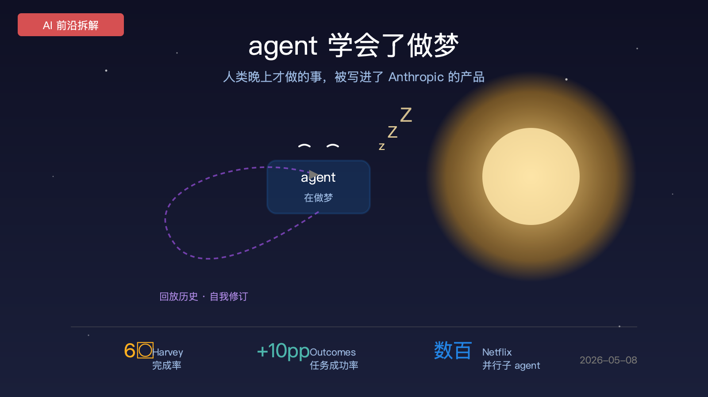
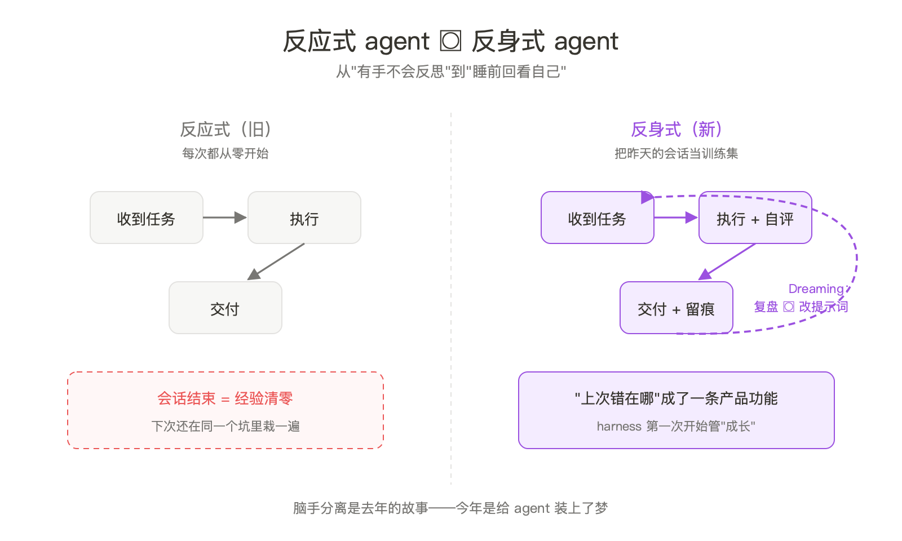
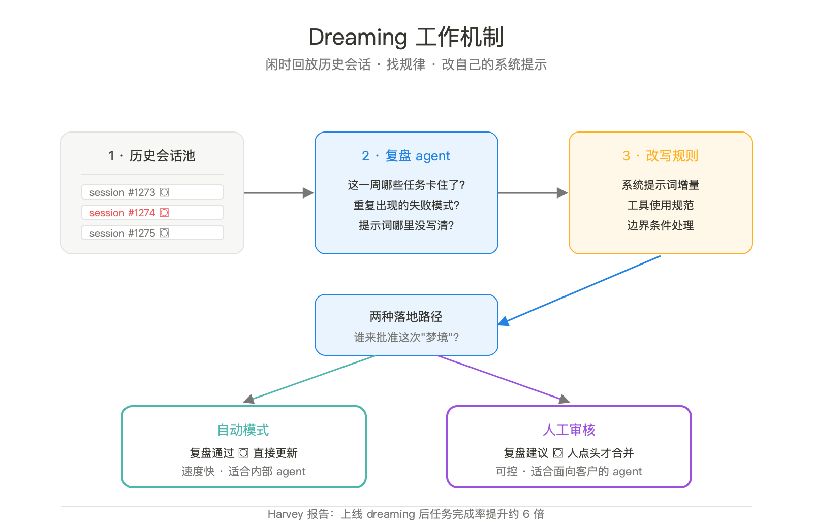
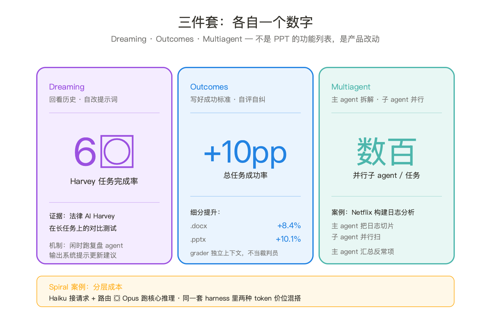

去年这个时候，Anthropic 把 agent 的脑和手拆开卖。这个月他们补上了第三件，叫梦。

我第一眼看到 dreaming 这个词的反应是嫌弃的，又一个营销词。然后翻到 Harvey 那条 6× 完成率的数字。让 agent 在没事干的时候回头看自己之前几百次会话，找出哪里反复栽跟头，然后改自己的系统提示词——这件事 Anthropic 给它起名 dreaming。

人类睡觉时大脑做的事，被翻译成了一条 API。

## 反应式 agent 的天花板

要看懂 dreaming 改了什么，先说 agent 现在卡在哪。

过去两年的 agent 行为模式是固定的：收到请求，推理，调工具，输出，会话结束。结束之后那次会话发生的所有事被打包扔进日志，下一次从零开始。给输入出输出，中间什么都不留。

问题不在某次任务做得好不好。问题在它做不好同一类任务里那个反复出现的坑。客户名字写错纠正一次，下个会话又错。某个 SQL 风格客户讨厌，提醒一次第二天又写。每个 agent 团队都在给系统提示词打补丁，打成一坨连作者自己都不敢删的东西。

我见过一个团队的 system prompt 600 行，几乎每行都对应过去某次客诉。这是反应式 agent 脚手架的最终归宿，补丁博物馆。

Dreaming 动的就是这一点。它不是让 agent 变聪明，是给 harness 加了一条记忆通道：上周你做错了什么，今天版本应该知道。这条通道以前靠人，工程师每周翻日志手动改提示词。Anthropic 这回把它做成了产品功能。

## Dreaming 的实际机制

抛开"做梦"这个词，机制其实直白。

把 session 当语料。脑手分离架构里 session 是 append-only 事件流，本来就不会丢。Dreaming 把这堆事件流喂给一个专门的复盘 agent。

复盘 agent 不执行任务，只读自己。它问的问题就是工程师每周开会问的那些。这周哪些任务进了死循环？哪些工具调用反复失败？用户哪里不满意？提示词哪里写得模糊导致 agent 自由发挥？

最后输出系统提示更新建议。两种走法：自动合并到下次会话的 system prompt，或者写成变更建议等人点头。这个开关 Anthropic 留给了开发者。

Harvey 跑通后报告完成率提升约六倍。法律 AI 这种长链路任务吃这套吃得最猛。一个并购尽调要拆成上百步，每步都可能踩同样的坑。把这些坑写进 system prompt 的边界条件，约等于把老法律助理的肌肉记忆做成软件。

得拆穿一点：6× 是 Anthropic 自己报的数字，不是独立测评。即使打个对折，这个量级的提升也已经超过模型版本升级能给的。Sonnet 4.5 升到 Opus 4.5 一年里实际任务收益大概 20%-40%，dreaming 在长任务上一下 300%。这个差距不是模型做的，是 harness 做的。

## Outcomes：把验收 API 化

Outcomes 是这次更新里容易被忽视的那个。

它解决的问题非常朴素：agent 自己不知道自己干完了没。模型说"我已经把报告写好了"是一回事，文件格式是不是真的正确、字段是不是真的填全，是另一回事。这层判断过去只能靠人，agent 输出，人检查，不对就再来一遍。

Outcomes 让开发者写一份成功标准，可以是规则也可以是 rubric。系统启动一个独立 grader 来评。grader 在另一个上下文窗口里，读 agent 产出对照标准给反馈，不达标就让 agent 拿着反馈再来一次，最多迭代 N 轮。

为什么非要独立的 grader？因为同一个 agent 自评会作弊。不是阴谋论，是实测过的偏差。LLM 评估自己的输出时倾向给高分，行内叫 self-preference bias。Anthropic 干脆把裁判和运动员物理隔开，独立上下文独立评分。

看数据：总任务成功率 +10pp，docx 文档类 +8.4%，pptx +10.1%。结构化产出物收益最大，这类任务本来就有客观验收标准。表头对不对、模板用没用、必填字段缺没缺，rubric 写起来不费劲。开放性写作上 Outcomes 收益没那么显眼。这条边界 Anthropic 没在发布稿里直说，但他们挑数据的方式已经把答案告诉你了。

把这件事抽象一层：Outcomes 是把产品经理的验收清单变成 API。以前你写 PRD，工程师读完做出来，QA 拿着 PRD 测。现在你直接写 rubric，agent 拿着 rubric 自我迭代。能定义需求的人变得比管开发的人值钱，这是托管 agent 时代第一个肉眼可见的角色变化。

## Multiagent 的 Netflix 时刻

第三件套是多 agent 编排，主 agent 拆任务，子 agent 并行干。

概念不新鲜，AutoGen 和 CrewAI 早做过 demo。Managed Agents 这次的差别在两点。子 agent 的容器、token、状态都在 Anthropic 这边记账，开发者不用自己搭调度。子 agent 跟主 agent 共享同一份文件系统，传参不用绕弯。

案例是 Netflix。他们用主 agent 把上千份构建日志切片，分发给数百个子 agent 并行扫，每个子 agent 找异常模式，主 agent 汇总。这个工作流以前的两条路是要么单线程跑几小时，要么人写 MapReduce。现在变成 agent-native 的拆分-合并。

数百个子 agent 并行，这个数字比"多 agent 协作"这种说法有用得多。它告诉你这东西适合的场景长什么样：批量、可拆分、子任务彼此独立、结果可汇总。日志分析、批量代码审查、文档去重、对账，全是。不适合的是长链路依赖任务、子任务结果会改变后续路径的任务。这条边界 Anthropic 也没明说，但限制就写在产品里：目前只支持一级委派，子 agent 不能再调 agent。

Spiral 那个案例顺手解决了另一个问题：成本分层。他们用 Haiku 处理请求和路由，Opus 跑核心推理。同一套 harness 里两种 token 价位的模型混搭。以前做这件事得自己拼两套 SDK，现在内置。

## 为什么这件事重要

把这次更新放到去年那篇"脑手分离"的延长线上看，能看出来的不是产品列表，是范式。

去年讲的是 agent 的架构问题，脑和手粘在一起没法独立升级。今年讲的是 agent 的成长问题，它不会从昨天的错误里学。两个不同层次的脱耦：去年解开运行时，今年解开时间。

反应式 agent 永远活在当下，每个 session 是一座孤岛。Dreaming 第一次给了它一条往回看的通道。这不是上下文窗口里那种短期记忆，是跨 session 跨周的长期反思。哪些反思值得保留、应该写进哪一层（系统提示？工具描述？子 agent 的 rubric？），这层工程目前是空白的。Anthropic 推了第一版方案，行业未来一年要补的就是这一块。

更深一层的变化在于 harness 的职能扩了。

之前 harness 管运行，把模型输出路由到工具，把工具结果写回上下文。Sebastian Raschka 那句 "Harness > Model" 说的就是这个层面。现在 harness 开始管成长，历史回放、自我评估、规则迭代。一个 harness 能不能让 agent 持续变好，比模型基础能力高不高更接近产品体验。

也得说坏处。这是 Anthropic 把锁点又往深埋了一层。Session 格式锁过一次，现在 dreaming 输出的提示更新格式、Outcomes 的 rubric DSL、子 agent 的编排协议，每一个都是新的标准位。开发者一旦在这上面建立了 evaluation 基础设施，迁移成本就不只是切 API，是重做整套质量保障流程。AWS 的 lock-in 也不是从 EC2 开始的，是从 IAM 和 CloudWatch 开始的。同样的剧本。

## 盲区

几件官方稿没说、但应该问的事。

**Dreaming 的失败模式**。如果复盘 agent 自己有偏差，它会把错的东西写进系统提示，下次会话变得更糟。Anthropic 的解法是让人审核，但人审核就退回到了"工程师每周翻日志手动改"。自动化的飞轮怎么转，没说清。

**Outcomes 评分的天花板**。结构化任务收益大，开放性任务呢？写一份分析报告 rubric 该怎么写？写松 grader 全过，写紧 agent 永远不达标。这条曲线在哪个点拐弯，发布稿没披露。

**Multiagent 的故障半径**。一个主 agent 调数百个子 agent 并行，其中一个子 agent 跑死循环或者输出毒化数据怎么办？回滚机制在哪一层？这个问题在传统分布式系统里有几十年的答案，agent 这边没人正面回答过。

**6× 这个数字怎么测的**。基线是什么？没 dreaming 时是哪个版本的 system prompt？测试集的任务分布是不是天然偏向 dreaming 擅长的那一类？厂商内部数据公开时这种问号是默认的，至少应该写出来。

## 对 AI 从业者意味着什么

**做 agent 产品的**：把 evaluation 当一等公民。Outcomes 这条线背后的逻辑很直接，rubric 比代码更值钱。能讲清楚"什么叫做完了"的人比能写出 agent 实现的人更稀缺。组里没有专门做 eval 的，赶紧补一个。

**做基础设施的**：dreaming 这层迟早会有开源版本，短期自己造的成本远高于直接用。如果还没到非自有不可的阶段，先用 Managed Agents 跑通一遍，看哪里被锁住，再决定要不要拆出来。这是 build-vs-buy 的标准答案，一年前算不了这笔账，今年可以。

**做模型评测的**：传统的"任务成功率"指标越来越不够用。同一个用了 dreaming 的 agent，第一周和第十周的表现可能差出三倍。你测哪一周？时间维度成了 evaluation 的新轴，行业里几乎所有 benchmark 都还是单点测试。方法论需要重写。

**做企业 AI 落地的**：Multiagent 那个 Netflix 案例值得仔细看一眼。批量、可拆分、子任务独立——这种形态的任务你公司里比你以为的多。日终对账、合同抽取、客诉分类、API 文档校对，全是。以前要么单线程跑很慢，要么写 MapReduce 工程量大，现在中间档有了。

---

## 本期关键词

**Dreaming（梦境式自我迭代）** -- Managed Agents 的新功能。让 agent 在闲时回看历史 session、复盘失败模式、自动或半自动更新自己的系统提示词。Harvey 用上之后任务完成率提升约六倍。agent 第一次有了"上次怎么做错的"这条跨 session 的记忆通道。

**Outcomes（成功标准 API）** -- 开发者写一份验收 rubric，系统启动独立 grader 在隔离上下文里评估 agent 产出，不达标 agent 自动迭代。docx +8.4%，pptx +10.1%，总任务成功率 +10pp。本质是把产品经理的验收清单 API 化。

**Self-preference bias（自评偏好偏差）** -- LLM 评估自己输出时倾向给高分。Outcomes 用独立 grader、独立上下文规避这件事。所以 agent 自检要靠架构而不是提示词。

**Multiagent orchestration（多 agent 编排）** -- 主 agent 拆任务，子 agent 并行执行，共享文件系统但不共享上下文。Managed Agents 当前限制一级委派。Netflix 案例里是数百个子 agent 并行扫构建日志找异常。

**Tiered model（分层模型架构）** -- 同一套 harness 里混搭不同价位的模型。Spiral 用 Haiku 接请求做路由，Opus 跑核心推理。成本结构变成可配置的，不再是"全用最贵的"。

**Reflective agent（反身式 agent）** -- 与反应式 agent 相对。能基于自己历史行为做改进的 agent。Dreaming 是反身能力的一种实现。长期看这是 agent 工程范式的临界点：从"运行得好"到"持续变好"。

**Harness（脚手架）** -- 包裹 LLM 的控制循环。本期看点是 harness 的职能边界又扩了一圈，从管运行扩到管成长。Sebastian Raschka 那句 "Harness > Model" 在这次更新之后更适用。

**Webhook 任务通知** -- Managed Agents 这次支持任务完成时主动 webhook，不必轮询。看起来是工程细节，但配合 dreaming 和 outcomes 这种长任务时长，这个支持本来就是必需的，不然客户端等不起。

## 引用

1. [New in Claude Managed Agents: dreaming, outcomes, and multiagent orchestration](https://claude.com/blog/new-in-claude-managed-agents) -- 本期拆解原文
2. [Scaling Managed Agents: Decoupling the Brain from the Hands](https://www.anthropic.com/engineering/managed-agents) -- 上一期"脑手分离"原文，本文延长线
3. [Claude Managed Agents Documentation](https://platform.claude.com/docs/en/managed-agents/overview) -- 官方完整 API 文档
