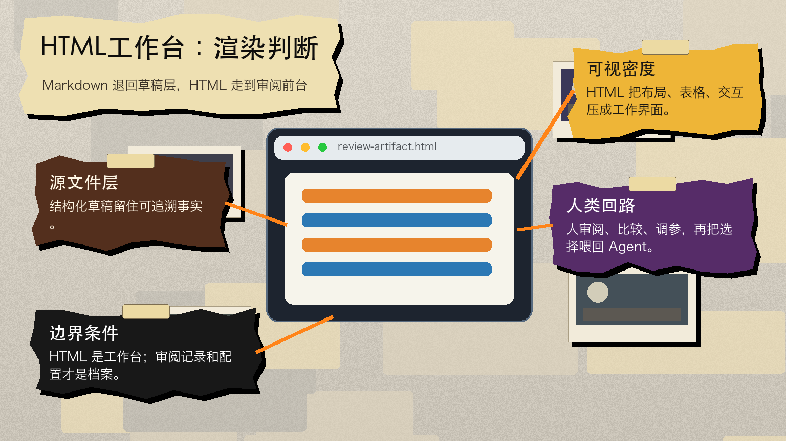
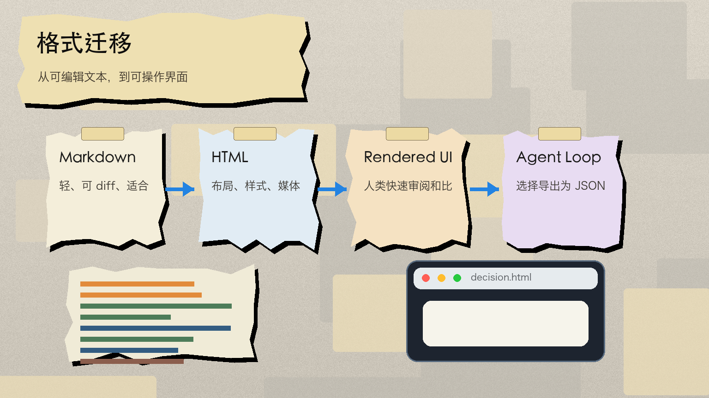
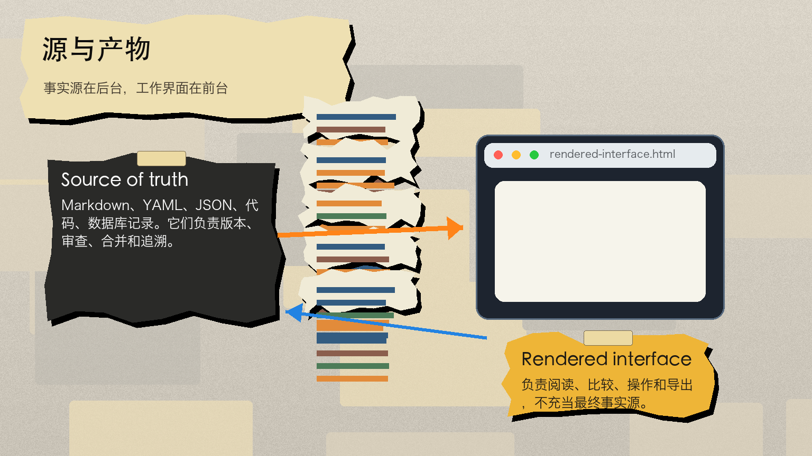
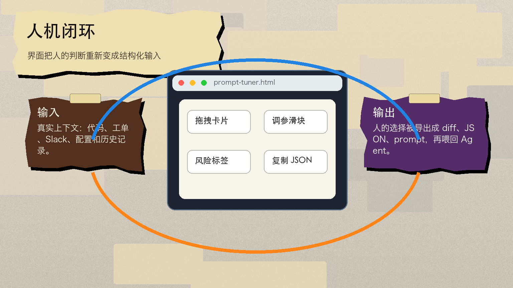
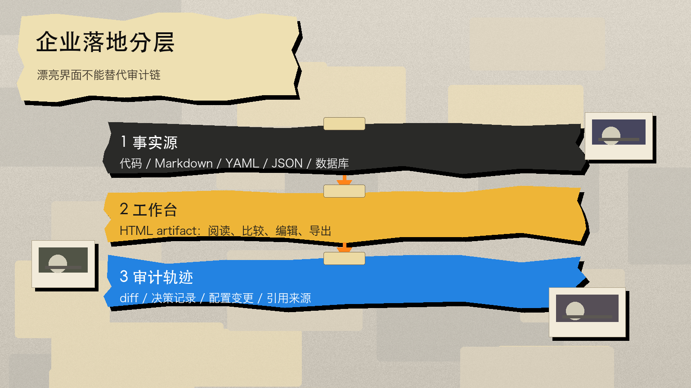

# Markdown 没死，只是退回草稿层

一个 Claude Code 团队成员把一件很小的事说穿了：他越来越不想让 Claude 输出 Markdown，而是让它直接生成 HTML 文件。

这听起来像格式偏好。实质上，它说的是 Agent 协作里的权力转移。过去，AI 产出一段文本，人类打开、修改、复制、归档。Markdown 胜出，是因为它轻、清楚、好 diff、好手改。现在，Agent 输出越来越像 spec、方案网格、PR 解说、研究报告、配置编辑器、交互原型。人类不再总是逐字修改，而是在读、比较、调参、审阅，再把结果喂回 Agent。这个时候，Markdown 的核心优势开始变窄。

Thariq 这篇 X Article 的标题是《Using Claude Code: The Unreasonable Effectiveness of HTML》。Berryxia 的中文转述把它概括成“Markdown 失宠，HTML 的好日子要来了”。这个说法抓住了传播点，但还不够精确。Markdown 没有失宠，它只是退回了更适合自己的位置：源文件层、草稿层、可追溯层。HTML 真正抢走的，是“给人看的 Agent 输出界面”。

## Markdown 的优势，正在被 Agent 自己削弱

Thariq 原文开头先承认 Markdown 的强项：简单、可移植、有基本富文本能力，而且人类容易编辑。Claude 甚至已经很擅长在 Markdown 里用 ASCII 画图。

问题出在下一步。他写道：“I'm also increasingly not editing these files myself, but using them as specs, reference files, brainstorming outputs, etc.” 中文意思是：他越来越少直接编辑这些文件，而是把它们当作 spec、参考文件、头脑风暴输出等。

这句话才是整篇文章的轴。

Markdown 最强的理由，是人类愿意直接改它。但当“修改”这件事也交给 Claude Code，Markdown 的护城河就少了一半。人类留下来的工作不是手改每一行，而是判断这个方案是否可读、可比、可信、可操作。于是输出格式的标准也变了：不再是“我能不能方便改这个文件”，而是“我能不能快速理解它，并把决定反馈回 Agent”。

这解释了为什么 HTML 在 Agent 场景里突然变得锋利。HTML 不是因为“比 Markdown 好看”才有价值，而是因为它天然就是界面。它可以放表格、CSS、SVG、代码高亮、JavaScript 交互、canvas、图片、绝对定位和响应式布局。Markdown 也能表达结构，但表达到一定复杂度后，会逼模型用 ASCII 图、Unicode 色块、很长的列表和难读的表格绕路。

Thariq 举了一个很具体的尴尬场景：Claude Code 为了在 Markdown 里显示颜色，只能用 Unicode 字符估颜色。这个画面有点好笑，但背后的信号并不轻。模型明明理解了视觉结构，却被输出介质压回了字符游戏。

## HTML 不是文档格式，是 rendered artifact

这件事最容易被误读成“以后都用 HTML”。这不对。

更稳的分层是：Markdown、YAML、JSON、代码和数据库记录仍然是 source of truth；HTML 是 rendered artifact。前者负责可追溯、可版本控制、可被机器稳定解析；后者负责让人读懂、操作、分享和决策。

这也是我们刚改内容工厂流水线时采用的结构：`spec_lock.yaml` 负责锁定主判断、产物、gate 和红线；正文、图、播客、邮件预览负责让人消费。HTML 不是来取代 `spec_lock.yaml` 的。它应该是 `spec_lock.yaml` 被渲染出来之后，供人审阅和操作的那一层。

放到企业 Agent 工作流里，这个分层更重要。一个 PR 解说页面可以用 HTML 渲染 diff、模块图、风险标签和注释；但真正合并进仓库的，仍然是代码 diff 和 review 记录。一个 feature flag 编辑器可以用 HTML 做表单、依赖警告和 copy diff；但真正进入系统的，仍然是配置变更。一个 prompt 调参器可以用 HTML 做实时预览和 token 计数；但真正被复用的，仍然是 prompt 模板和变量。

HTML 的位置不是档案柜，而是工作台。

## “双向交互”才是关键变化

Thariq 原文里最有价值的部分，是 Two-way Interaction 和 Custom Editing Interfaces。

他不是只说 HTML 可读。他说，可以让 Claude 做滑块、旋钮、拖拽卡片、实时预览、导出按钮。更关键的是，可以让界面把人类操作后的结果复制成 JSON、prompt、diff，再贴回 Claude Code。

这就不是“文档”了，而是一个很小、很短命、但正好够用的操作界面。

原文里的例子很典型：把 30 个 Linear tickets 做成 Now / Next / Later / Cut 四列拖拽卡片；做一个 feature flag 表单编辑器，按模块分组、显示依赖、提醒前置开关；做一个 prompt 调参器，左边编辑模板，右边用三个样例实时渲染，顺便显示字符数和 token 数。

这些东西如果做成正式产品，会显得过度设计。如果写成 Markdown，又很难操作。HTML artifact 卡在中间：它是一次性的，但足够可用；它不是产品，但能把人类判断变成结构化反馈。

这意味着 Agent 的 UI 不一定总是大产品里的固定界面。很多 UI 会变成任务现场临时生成的“脚手架”。用完之后，它的价值不是长期存在，而是把人类从一大段抽象文本里拉回循环。

## Claude Code 为什么特别适合这件事

Thariq 还解释了为什么不是普通聊天窗口，而是 Claude Code 更适合生成这类 HTML 文件。原因不是模型本身，而是上下文入口。

Claude Code 能读文件系统、代码目录、Git 历史，也能通过 MCP 接 Slack、Linear、浏览器上下文。它不是凭空写一个漂亮页面，而是能从真实工作材料里抽出结构，再渲染成页面。原文提到，他写这篇文章时让 Claude Code 读自己的代码文件夹，找出所有生成过的 HTML 文件，分组归类，再生成带图示的 HTML 文件。文章里的图，就是这个过程的结果。

这点决定了 HTML artifact 的边界：它不是设计师手工做的网页，也不是 CMS 里的文章模板，而是 Agent 对上下文做完理解之后，临时生成的阅读界面。

所以这篇文章真正押注的不是 HTML，而是“上下文充分的 Agent 可以为每个任务生成专用界面”。HTML 只是当前最通用、浏览器原生支持最好、表达能力最完整的载体。

## 盲区：HTML 的工程账并不轻

Thariq 没有回避缺点。他在 FAQ 里说，HTML 可能比 Markdown 多花 2-4 倍时间；HTML diff 噪声大，也比 Markdown 难 review。

这两个缺点足够让“HTML 替代 Markdown”的说法刹车。

如果一个文件要长期维护、多人协作、进入仓库、接受代码审查，Markdown 仍然有明显优势。它不是表达力最强，但它可读、可 diff、可合并、可长期演化。HTML 一旦夹进大量 inline style、绝对定位、脚本和生成式结构，人的审查成本会上升。页面看起来更清楚，源文件反而更不清楚。

企业落地里更合理的模式，是三层分离：

第一层是 source of truth。用 Markdown、YAML、JSON、代码、数据库记录保存可追溯事实。

第二层是 rendered interface。用 HTML 把复杂信息变成可读、可点、可比较的界面。

第三层是 audit trail。把人类在界面里的操作导出成 diff、JSON、prompt 或决策记录，再进入系统。

这比“以后不用 Markdown”更无聊，但更接近真实工作。Markdown 不负责取悦读者，HTML 不负责当最终事实源。两者分工，Agent 才不会在漂亮和可控之间二选一。

## 对 AI 从业者意味着什么

第一，写 Agent prompt 时，别只写“输出 Markdown”。更好的写法是定义 artifact 的用途：谁读、读完要做什么、需要哪些交互、最后导出成什么。比如“生成一个 HTML PR explainer，包含模块图、关键 diff 注释、风险标签和 copy review summary 按钮”，比“总结这个 PR”更像给 Agent 下工作单。

第二，团队内部的 Agent 交付物应该分 source 和 view。source 用 `spec_lock.yaml`、JSON、Markdown、代码保持可追溯；view 用 HTML、SVG、图文页降低理解成本。不要让 HTML 承担所有责任，也不要让 Markdown 负责所有阅读体验。

第三，Agent 生成 UI 会先从内部工具爆发。PR 说明、事故报告、研究摘要、方案比选、配置编辑、prompt 调参，这些场景都不需要长期产品化，却经常需要临时界面。HTML artifact 刚好填这个空。

第四，审查机制要跟上。HTML 页面看起来更像“成品”，容易让人降低警惕。事实、引用、参数变更和导出 diff 仍然要回到可验证源。界面提升阅读率，不等于提升真实性。

Thariq 文章最后说，HTML 让他感觉自己更在 Claude 的循环里，而不是把选择完全丢给 Claude。这是整篇文章最准确的收束。好的 Agent 输出格式，不是让人更少参与，而是让人更容易参与。

Markdown 仍然会留下来。但它不再独占 Agent 与人沟通的界面。它会更多退回后台，成为源、草稿、日志和契约。前台会出现越来越多一次性的 HTML artifact，短命、具体、可操作，用完就把人的判断带回 Agent loop。

## 对从业者意味着什么

Agent 产品的下一轮竞争，不只在模型能力，也在输出介质。谁能把复杂上下文渲染成人愿意读、愿意点、愿意改、能导出的界面，谁就更容易让 Agent 进入真实工作流。

这对企业内部尤其直接。以前的自动化报告只要“能生成”就算完成；以后要追问四件事：读者是谁，决策动作是什么，交互结果怎么导出，导出结果如何回到系统。没有这四件事，HTML 只是漂亮文档。有了这四件事，HTML 才是 Agent 的工作界面。

## 本期关键词

- **HTML artifact** -- 这里不是指一个普通网页，而是 Agent 为某个具体任务临时生成的 HTML 工作界面。它可以是一份 PR 解说、一个配置编辑器、一组方案对比、一个 prompt 调参器。它的价值不在长期存在，而在让人类完成一次阅读、判断、操作或导出。

- **Source of truth** -- 事实源、可信源。工程里通常指真正被系统采纳、可追溯、可版本控制的数据或文件。本文的判断是，Markdown、YAML、JSON、代码和数据库更适合做 source of truth；HTML 更适合做 rendered interface。

- **Rendered interface** -- 从结构化源渲染出来的人类界面。它可以更美观、更可读、更可操作，但不一定是最终事实源。把 HTML 放在这一层，能避免“好看但不可审”的风险。

- **Human-in-the-loop UI** -- 让人类停留在 Agent 循环里的界面。不是只让人看结果，而是让人能调整、筛选、拖拽、导出，把判断重新喂回 Agent。

- **Spec lock** -- 执行契约。它把主判断、产物范围、质量 gate 和风格红线锁住，防止长链生产过程中跑偏。本文的反向启示是：越是要生成丰富 HTML artifact，越需要一个可审的 spec lock 在背后做源。

## 引用

1. [Berryxia.AI: Markdown 失宠！HTML 的好日子要来了？](https://x.com/berryxia/status/2052884681193144743) -- 本期中文入口
2. [Thariq: Using Claude Code: The Unreasonable Effectiveness of HTML](https://x.com/trq212/status/2052809885763747935) -- 主原文
3. [HTML effectiveness examples](https://thariqs.github.io/html-effectiveness/) -- Thariq 提供的 HTML artifact 示例集
4. [Two-way interaction playground reference](https://x.com/trq212/status/2017024445244924382) -- 原文提到的双向交互补充帖
