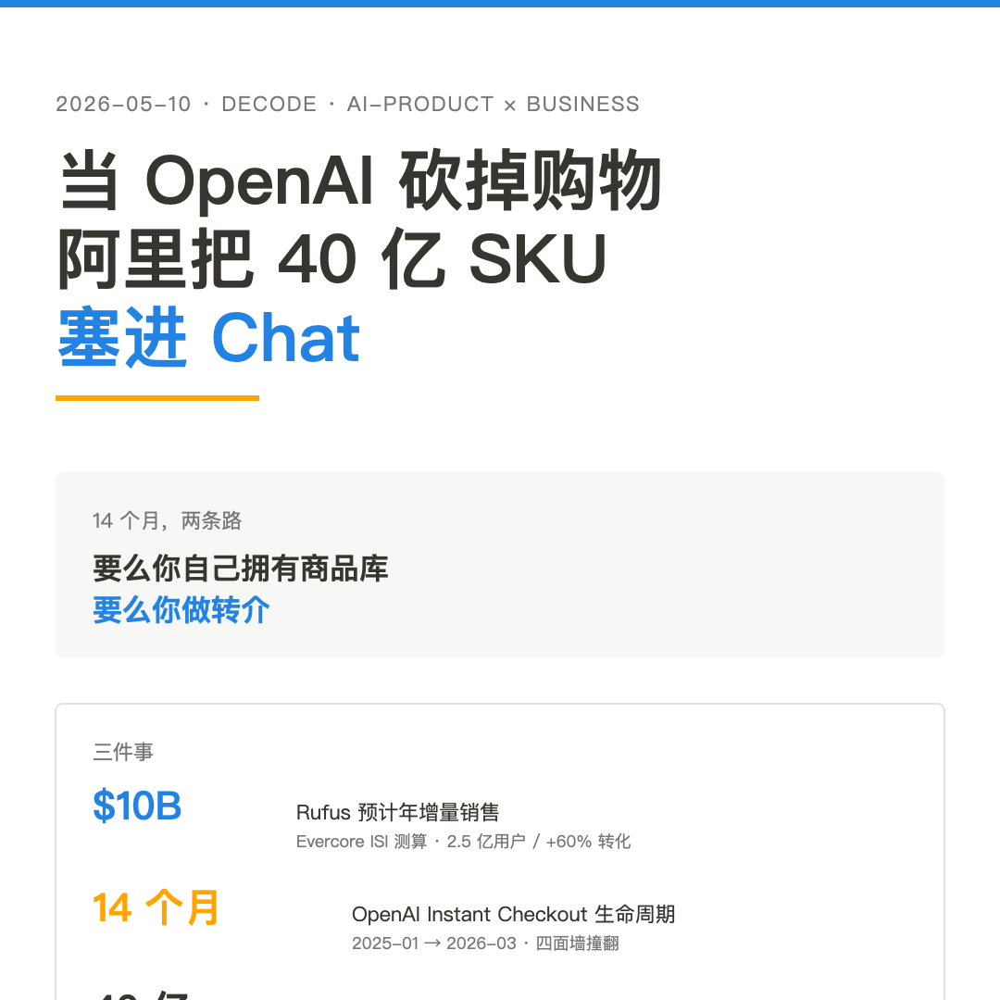
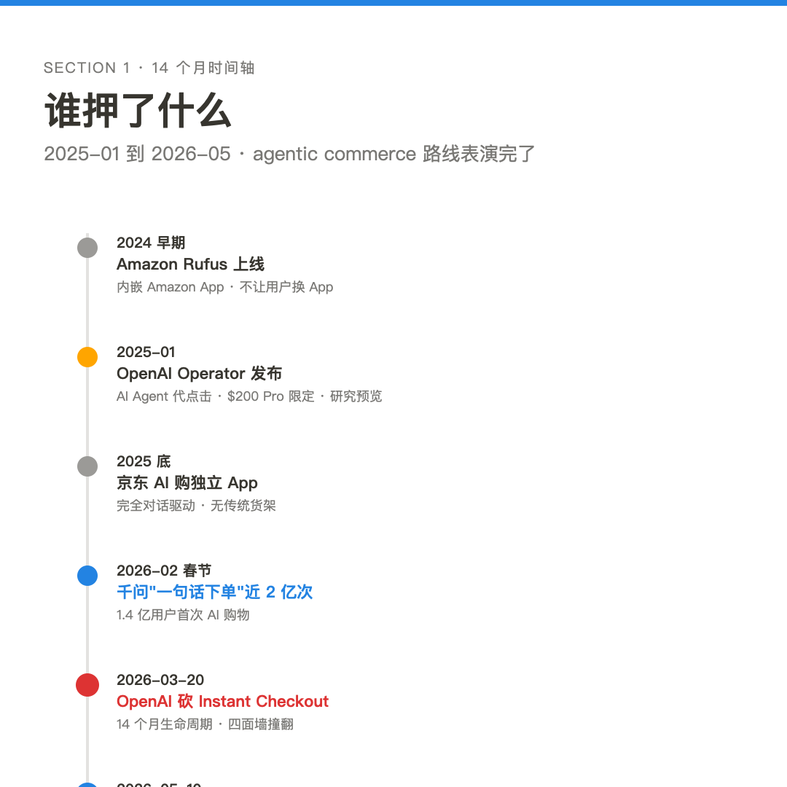
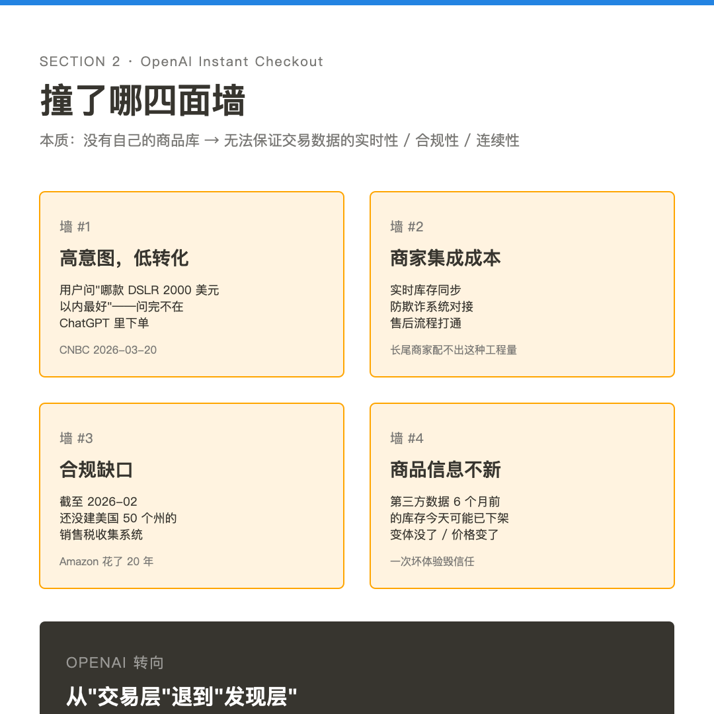
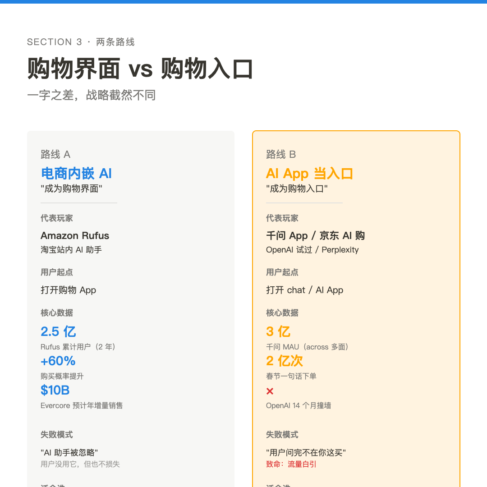
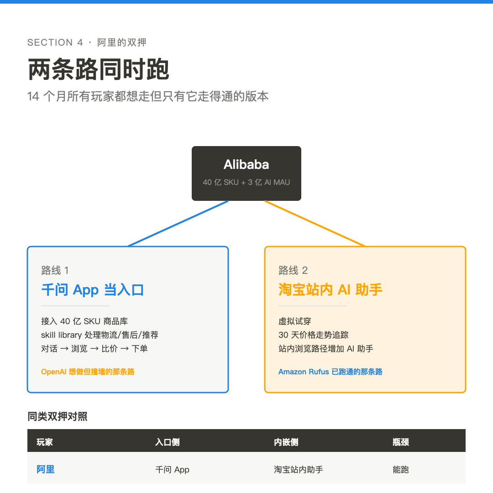

# 当 OpenAI 砍掉购物，阿里把 40 亿 SKU 塞进 Chat

2026 年 3 月 20 日，OpenAI 把 Instant Checkout 砍了。两个月后的 5 月 10 日，路透社报阿里巴巴准备把千问和淘宝深度整合，让对话替代关键词搜索。前者承认走不通，后者把 40 亿件商品塞进 Chat 入口。这两件事放在一起看，agentic commerce 大战 14 个月的战略选择被锁死成两条路：要么你自己拥有商品库，要么你做转介。中间没有路了。

**本期关键词**

- **Agentic Commerce**：AI Agent 直接代用户完成 浏览/比价/下单 的购物路径，传统是 search-driven，新范式是 conversation-driven
- **Skill Library**：阿里千问内的功能模块库，处理物流、售后、推荐——对话式商务的底层接口候选
- **Instant Checkout**：OpenAI 在 ChatGPT 内直接结账的功能，2025 年初推出，2026 年 3 月砍掉
- **Rufus**：Amazon 内嵌 AI 购物助手，2024 早期上线，2026 累计 2.5 亿用户
- **货找人**：拼多多早期分布式实时推荐架构，让商品主动到用户面前——agentic shopping 的中文先驱

---

## 14 个月：路线表演完了

时间轴值得拉出来看。

2025 年 1 月，OpenAI 发布 Operator——AI Agent 用自己的浏览器代你点击购物网站。研究预览版，$200 美元 Pro 限定，美国用户专享。

那之前半年多，Amazon 已经悄悄上线 Rufus——内嵌在 Amazon App 里的 AI 购物助手，不让你换 App，只在原本的购物界面里多一个聊天框。

2025 年底，京东上线"京东 AI 购"独立 App，完全对话驱动，没有传统货架。

2026 年春节，路透社引述阿里数据：千问 App 在春节假期完成"一句话下单"近 2 亿次，1.4 亿用户第一次用 AI 完成购物。

2026 年 3 月 20 日，OpenAI 宣布 Instant Checkout 终止——14 个月生命周期。CNBC 引述 OpenAI 发言人：转向"和零售商合作建 dedicated app"，让用户在 ChatGPT 里发现，在 Instacart / Target / Walmart / Expedia / Booking 完成。

2026 年 5 月 10 日，路透社知情人士透露阿里千问 + 淘宝整合即将官宣。这条新闻还没等阿里自己承认，已经传遍全球科技媒体。

每一个时间点都是有人押了一条路。Operator 押"AI Agent 直接代购"，Rufus 押"电商 App 内嵌助手"，京东 AI 购押"AI App 当新入口"，千问押"双押两条路"。14 个月，撞墙的、慢热的、跑通的，结果全摆出来了。

---

## OpenAI 撞了什么墙

砍掉 Instant Checkout 的四个原因，Lengow Blog 综合 CNBC 和 OpenAI 内部说法之后写得很直白。

用户在 ChatGPT 里有高购物意图——问"哪款 DSLR 相机 2000 美元以内最好"、"这件外套和那件外套哪个值得买"，这种问题问得很多。但问完了不在 ChatGPT 里下单，转身打开亚马逊或者淘宝去买。意图很高，转化很低。

商家集成成本是第二个墙。OpenAI 想让 Instant Checkout 显示实时库存、防欺诈、处理售后——每一项都要和商家做深度对接。Walmart 这种规模的客户能配合，长尾商家配不出来这种工程量。

合规是第三个墙。截至 2026 年 2 月，OpenAI 还没建美国 50 个州的销售税收集系统。每个州税率不同、申报规则不同、扣减规则不同。Amazon 花了 20 年才解决这事。OpenAI 一年没解决。

商品信息不新是第四个墙。ChatGPT 显示的商品来自第三方数据，不能保证 6 个月前抓的库存信息今天还成立。用户点了买，发现已下架、价格变了、变体没了——一次坏体验毁掉的信任要十次好体验才补回来。

这四个墙合起来指向一个本质：没有自己的商品库，AI App 没法保证交易数据的实时性、合规性、连续性。OpenAI 选择退一步，不做交易层，只做发现层——推荐 + 路由，跳到合作零售商完成支付。当前合作伙伴 5 家：Instacart、Target、Walmart、Expedia、Booking.com。

---

## Amazon Rufus 走的另一条路

Amazon 没有押"AI App 当新入口"。Rufus 直接长在 Amazon App 里——你照常打开 Amazon，照常搜索浏览，多了一个 AI 聊天框可以问"这两件衣服哪个更适合我的体型"或者"帮我比一下这三个相机"。

不让用户换 App 是 Rufus 路线的核心。Amazon 官方 2026 年披露：累计 2.5 亿用户使用过，MAU 同比涨 149%，互动量涨 210%。Evercore ISI 测算 Rufus 每年带来 $10B 增量销售——大约相当于阿里巴巴一个季度活跃买家中部分类目的成交规模。

更关键的一个数：用过 Rufus 的购物会话，购买概率比未用的高 60%。这不是"AI 助你购物"的口号，是直接的转化率提升。

Rufus 能跑通的原因和 OpenAI 撞墙的原因是同一件事的两面——Amazon 拥有商品库。库存数据是自家的、实时的；防欺诈系统是十几年砌起来的；销售税在每个州都早就跑通了。Rufus 的 AI 模型用的是 Amazon Bedrock，里面跑 Anthropic Claude Sonnet 和自研 Nova，但模型不是护城河，商品库才是。

战略上 Amazon 的定位是"成为购物界面"——一字之差，OpenAI 想做的是"成为购物入口"。界面是已有路径上的优化，入口是要重新争夺用户的第一秒注意力。前者的失败模式是"AI 助手被忽略"，后者的失败模式是"用户问完不在你这买"。OpenAI 撞的是后者，Amazon 走的是前者。

---

## 阿里的双押

千问 + 淘宝整合最有意思的地方在于它同时跑两条路。

第一条是"AI App 当入口"。千问 App 直接接入淘宝 + 天猫超 40 亿商品库，配备 skill library 处理物流、售后、推荐。用户打开千问，输入"想找一件适合通勤的羽绒服，预算 800 以内"，AI 直接给出推荐 + 比价 + 下单。这条路就是 OpenAI 想做但被迫放弃的那条。

第二条是"电商 App 内嵌"。淘宝站内上线千问赋能的 AI 购物助手，配虚拟试穿 + 30 天价格走势。用户打开淘宝照常浏览，多了一个 AI 助手可问。这条路就是 Amazon Rufus 已经跑出来的那条。

阿里能同时押两条的前提有两个。一个是它自己拥有 40 亿 SKU 的商品库——OpenAI 撞的四个墙阿里不会撞，因为商品数据、防欺诈、合规、库存实时性都是 20 多年砌起来的内功。另一个是它已经有 3 亿 MAU 的 AI 触点——这个数字横跨淘宝、天猫、支付宝以及其他面，意味着 AI 流量不需要从零启动。

对比看。京东 AI 购独立 App 也想双押，但商品库规模和阿里差一档。字节豆包 + 抖音电商也是双押，但抖音电商以内容驱动 GMV，不是传统货架电商，"AI 代购"的逻辑要重新设计。拼多多走纯后端 AI 路线，"货找人"是它分布式推荐系统的中文表达，但它不押对话入口。

阿里这次走的是过去 14 个月所有玩家都想走但只有它走得通的版本——前提是 40 亿 SKU + 3 亿 AI 触点同时存在。

---

## 不知道的事

阿里官方还没官宣。所有判断建立在路透社知情人士的版本上。官宣后的实际产品形态可能与传闻不同——skill library 的开放程度、千问 App 的购物入口位置、虚拟试穿的可用商品范围，都还是黑盒。

千问 MAU 3 亿是横跨多个消费者面的总数，不是千问 App 独立 DAU。这个数字看起来很大，但它的实际含义是阿里把已有用户引导到了 AI 触点，不是 AI 触点自然增长。"AI App 当入口"的可持续性需要再过两个季度才能看清楚。

春节"一句话下单近 2 亿次"是阿里口径的营销数字，没有第三方独立审计。AI 对话率 ≠ 实际成交订单数，营销数字和财报数字之间通常有 5-10 倍的差距。

Amazon Rufus 数据全部来自 Amazon 自己披露。+149% MAU、+60% 购买概率、$10B 增量销售——前两个是 Amazon 财报相关披露，最后一个是 Evercore ISI 的外部测算。没有 SEC 备案级的独立验证。

这一轮还没涉及对中小商家、佣金体系、广告系统的下游影响。当 AI 直接给用户推荐 3 个商品，剩下的 39.9999 亿件商品怎么办——这是另一篇的题。

---

## 对从业者意味着什么

电商 PM 本周对照自己的产品在哪一条路上。AI 助手是放在站内的"购物界面"还是另起一个 App 当"购物入口"，决定了你接下来 12 个月的产品路线图。两条路不能 A/B 测试得出结果——它们是公司层面的资源押注。

跨境电商创业者本周问自己：你能拥有商品库吗？拥有——OpenAI 撞的四个墙你不会撞，可以跑 Rufus 路线。不能拥有——AI 直接卖货那条路被 OpenAI 提前替你验证关闭了，应该考虑做发现层 + 路由到现有零售商的合作模式。

AI Agent 创业者本周对照护城河来源。模型不是护城河——Amazon Rufus 用的是 Claude Sonnet + Nova，阿里千问也是开源模型出身。真正的护城河是商品库 + 合规 + 实时数据 + 用户流量的复合资产。没有这些底层资产，纯做"AI 代购"工具会撞 OpenAI 一样的墙。

CTO 本周看 skill library 这个抽象。阿里把物流、售后、推荐封装成 AI 可调用的能力包，本质是把传统 ERP 系统的 API 给 LLM 重新包装。这套结构如果跑通，会成为 agentic commerce 的事实标准——以后所有商家都得提供 LLM-callable 的 skill 接口。提前准备的团队在标准制定阶段会占位。

---

## 引用

- IT之家，*消息称阿里巴巴将深度整合千问与淘宝，打造 AI 对话式购物新体验*，2026-05-10，<https://www.ithome.com/0/948/468.htm>
- Inside Retail Asia，*Alibaba to integrate Qwen AI with Taobao, launch agentic shopping*，2026-05-11，<https://insideretail.asia/2026/05/11/alibaba-to-integrate-qwen-ai-with-taobao-launch-agentic-shopping/>
- PYMNTS，*Alibaba Aims to Integrate AI Platform and eCommerce Marketplace*，2026-05，<https://www.pymnts.com/artificial-intelligence-2/2026/alibaba-aims-to-integrate-ai-platform-and-ecommerce-marketplace>
- Amazon Newsroom，*Amazon Rufus AI assistant personalized shopping features*，2026，<https://www.aboutamazon.com/news/retail/amazon-rufus-ai-assistant-personalized-shopping-features>
- PYMNTS，*Amazon Says Rufus Gives It an Edge in Agentic Commerce Race*，2026，<https://www.pymnts.com/amazon/2026/amazon-says-rufus-gives-it-an-edge-in-agentic-commerce-race/>
- CNBC，*OpenAI's first try at agentic shopping stumbled. It's trying again*，2026-03-20，<https://www.cnbc.com/2026/03/20/open-ai-agentic-shopping-etsy-shopify-walmart-amazon.html>
- Lengow Blog，*OpenAI's E-Commerce Bet: What Went Wrong with ChatGPT Checkout*，2026-04，<https://blog.lengow.com/chatgpt-wanted-to-become-the-worlds-biggest-shop/>
- Perplexity Blog，*Shopping That Puts You First*，2026，<https://www.perplexity.ai/hub/blog/shopping-that-puts-you-first>
- Adobe Analytics（via Modern Retail），AI 渠道流量 2025 假日季 +693%
