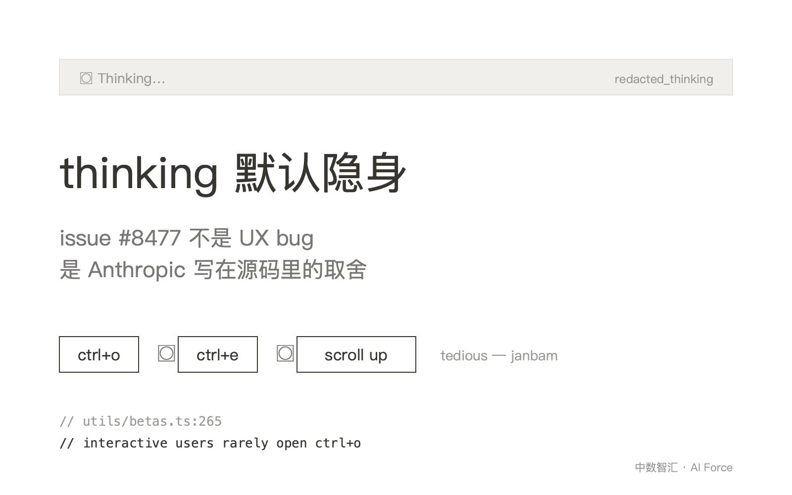
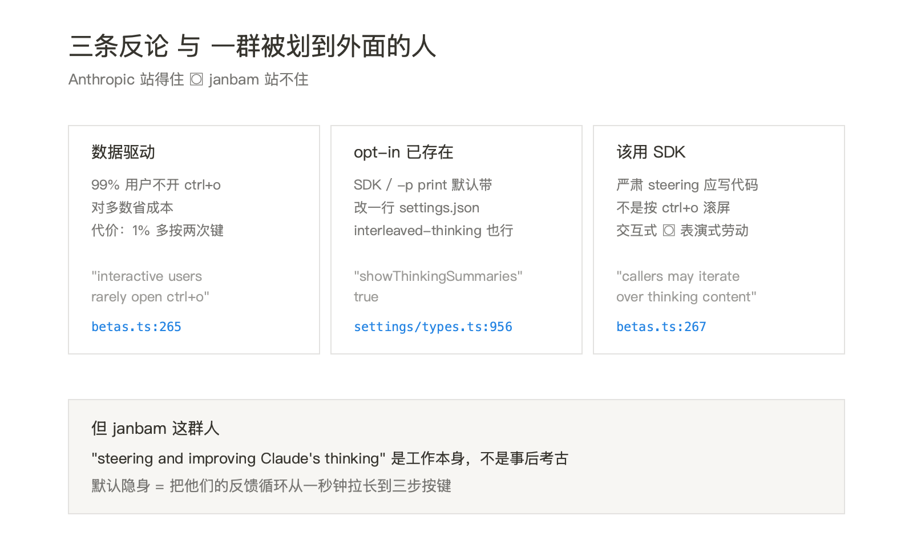

2025 年 9 月 30 日，GitHub 用户 janbam 在 anthropics/claude-code 仓库提了一条 issue，编号 8477，标题平淡——"[FEATURE] Add Option to Always Show Claude's Thinking"。他说自己升到 v2.0.0 之后，verbose 模式不再渲染 thinking 内容了；想看 Claude 是怎么想的，得连按三步——`ctrl+o`、`ctrl+e`、再向上滚——他用的词是 **tedious**。issue 七个多月过去没合并，状态还是 open。

如果只看 issue 描述，这是一个 UX 微改进。但把 `claude-code/src/` 翻开，会发现这不是漏改的设置项——v2.0.0 让 janbam 第一次注意到 thinking 不在主屏；七个月后的 2026-02-12，Anthropic 又在 API 层加了一刀。两刀方向一致，理由都写在源码注释里——**interactive users rarely open ctrl+o**。janbam 是被这个判断划到外面的人。



## 本期关键词

- **thinking 块**——Claude 模型在 API 返回里夹带的一类内容块（content block），类型字段是 `thinking` 或 `redacted_thinking`，里面是模型"出声思考"的草稿。它不进入最终回答，但会被计费、会进入对话上下文。
- **transcript 模式 / ctrl+o**——Claude Code REPL 的第二屏。日常聊天界面只显示精简后的对话；按 ctrl+o 进 transcript 后，每条消息、每一段 thinking、每一次 tool call 都按时间顺序展开。
- **`transcript:toggleShowAll` / ctrl+e**——transcript 屏幕内的"再展开一层"开关。第一层是精简，第二层是把每条消息的 thinking 块也露出来。
- **`REDACT_THINKING_BETA_HEADER`**——一个 beta header 字符串，值是 `redact-thinking-2026-02-12`。Claude Code 发请求时把它塞进 header，告诉 API："不要返回 thinking 的摘要文本，只返回一个签名占位块"。
- **`showThinkingSummaries`**——`settings.json` 里一个 boolean 设置项，默认 false。开了它，Claude Code 就不再发那个 beta header，API 会把 thinking summary 一起返回。
- **verbose 模式**——历史名词。v2.0.0 之前，verbose 是把所有"幕后"内容（包括 thinking）一起渲染到主屏的开关；现在它的语义被拆散到了多个独立设置和 transcript 模式里。

## 第一刀：v2.0.0 把 thinking 从主屏赶走

打开 `src/components/Messages.tsx`，第 229 行有一条 prop 注释，写得非常直白：

```ts
/** In transcript mode, hide all thinking blocks except the last one */
hidePastThinking?: boolean;
```

这条 prop 解释了 janbam 走的那条三步走路径：进 transcript（ctrl+o）→ 切到 showAll（ctrl+e）→ 滚回去找上一次 thinking。即便在 transcript 里，默认行为也只保留**最近一次**的 thinking 块；要看上一次的，还得手动展开。日常对话主屏更彻底——根本不渲染 thinking 内容。模型确实"想了"，但用户看不到。

主屏上唯一保留的 thinking 痕迹，在 `src/components/Spinner/SpinnerAnimationRow.tsx` 第 171-173 行：

```ts
let thinkingText = thinkingStatus === 'thinking'
  ? `thinking${effortSuffix}`
  : typeof thinkingStatus === 'number'
    ? `thought for ${Math.max(1, Math.round(thinkingStatus / 1000))}s` : null;
```

转圈圈时显示 `thinking…`，停下时显示 `thought for 7s`。一个字符串，没有内容。整段 `SpinnerAnimationRow.tsx` 从 171 到 214 行都在做空间分配——thinking 字符串和计时器、token 计数器抢同一行的剩余宽度（变量名 `availableSpace`）；终端窄到放不下，连 `thinking` 这个字也会被砍掉。把模型的中间状态压缩成"一行能塞下的几个字"，这是 v2.0.0 主屏对 thinking 的全部礼遇。

至于隐藏起来的内容怎么找回来，键位本身就讲清楚了链路。`src/keybindings/defaultBindings.ts` 第 44 行把 `ctrl+o` 绑到 Global 上下文的 `app:toggleTranscript`；第 163 行把 `ctrl+e` 绑到 Transcript 上下文的 `transcript:toggleShowAll`。Transcript 是单独一个键位上下文——`src/keybindings/schema.ts` 第 46 行把它命名为 `'When viewing the transcript'`。也就是说，janbam 抱怨的三次按键，本质是穿越两个键位上下文：从 Global 上下文跳进 Transcript 上下文，再在 Transcript 上下文里手动把"完整模式"打开。每一步都需要的人，刚好是把"steer thinking"当本职的那种用户。


## 第二刀：API 请求头里写明"别给我 thinking summary"

如果说 v2.0.0 砍的是渲染，2026 年 2 月 12 日 Anthropic 砍了一刀更靠后的——直接告诉 API 别返回 thinking 摘要。证据在 `src/constants/betas.ts` 第 20 行：

```ts
export const REDACT_THINKING_BETA_HEADER = 'redact-thinking-2026-02-12'
```

这个 beta header 在什么场景下推送？`src/utils/betas.ts` 第 264-277 行给出了一段教科书级的注释：

```ts
// Skip the API-side Haiku thinking summarizer — the summary is only used
// for ctrl+o display, which interactive users rarely open. The API returns
// redacted_thinking blocks instead; AssistantRedactedThinkingMessage already
// renders those as a stub. SDK / print-mode keep summaries because callers
// may iterate over thinking content. Users can opt back in via settings.json
// showThinkingSummaries.
if (
  includeFirstPartyOnlyBetas &&
  modelSupportsISP(model) &&
  !getIsNonInteractiveSession() &&
  getInitialSettings().showThinkingSummaries !== true
) {
  betaHeaders.push(REDACT_THINKING_BETA_HEADER)
}
```

注释把内部逻辑摆了个透。第一，thinking summary 不是 Claude 自己写的，是 API 端跑一个**小 Haiku 模型**做摘要——这步要钱、要时间。第二，Anthropic 内部数据显示，"interactive users rarely open ctrl+o"——日常用 REPL 的人很少打开 transcript。第三，既然几乎没人看，那对**交互式 + 一方客户端 + 未显式开启 showThinkingSummaries** 的会话，干脆把 summarizer 跳过，API 改返回一个签名占位块。

占位块怎么显示？`src/components/messages/AssistantRedactedThinkingMessage.tsx` 整个文件就 30 行，主体是一句话：

```tsx
<Text dimColor italic>
  ✻ Thinking…
</Text>
```

灰色斜体，三个字符加省略号——这就是被砍掉摘要之后用户能看到的全部"思考"。注意这个组件名里的 `Redacted`——它本是 API 协议里"涉密/不可见思考"的概念（比如出于安全原因被 redact 的 thinking 块），现在被复用成"我们故意不给你的 thinking 块"的占位符。同一个 UI 组件，承担了两种语义。

两刀连着看才完整：v2.0.0 砍主屏渲染时，thinking 内容还在 API response 里——只是 UI 不画。2026-02-12 这刀直接砍到上游——API 干脆不再返回内容。等到 janbam 想"用 settings 开个 always show"，他打开 `src/utils/settings/types.ts` 第 956-961 行会看到这一段：

```ts
showThinkingSummaries: z
  .boolean()
  .optional()
  .describe(
    'Show thinking summaries in the transcript view (ctrl+o). Default: false.',
  ),
```

注意描述里的 **in the transcript view (ctrl+o)**。即便他把这个 boolean 设成 true，summary 也只会出现在 transcript 屏，不会回到主屏。Anthropic 用一行 schema 告诉你：开关存在，但开了之后，你看到 thinking 的路径**依然是 ctrl+o**。三步按键并没有省掉。


## 第三道证据：summarize 通知偷偷指向同一条路径

打开 `src/screens/REPL.tsx` 第 4980-4988 行，对话被自动压缩（compact）时，REPL 弹一条通知：

```ts
const historyShortcut = getShortcutDisplay('app:toggleTranscript', 'Global', 'ctrl+o');
addNotification({
  key: 'summarize-ctrl-o-hint',
  text: `Conversation summarized (${historyShortcut} for history)`,
  priority: 'medium',
  timeoutMs: 8000
});
```

读这段代码的产品判断：Claude Code 把对话压缩了，怕你迷失，弹一条 8 秒提示——但它告诉你的不是"内容在新窗口里"，而是"按 ctrl+o 看历史"。`summarize-ctrl-o-hint` 这个 key 名本身已经承认：ctrl+o 是用户找回过去状态的**唯一入口**。整套 UX 设计建立在一个假设上——平时不需要看 thinking、不需要看完整 transcript，**真要看的时候去 ctrl+o**。issue #8477 推翻的就是这个假设：有些人，看 thinking 是工作本身，不是事后的考古活动。

## 盲区：Anthropic 也许是对的

把上面整理出来当判决书递过去，Anthropic 会怎么辩护？至少三条反论拿得出来。

第一，**数据驱动**。"interactive users rarely open ctrl+o" 这一句注释如果是真的，那 v2.0.0 的取舍就是统计意义上的多数决——给 99% 用户每次省一次 Haiku 摘要 + 一段渲染开销，代价是 1% 用户多按两次键。两边的成本不对等，倾向多数是工程默认。

第二，**opt-in 路径已经存在**。三种身份各有出路：SDK 调用方和 `claude -p` 这种 print mode 走 `getIsNonInteractiveSession()` 分支，beta header 不发，summary 默认返回；交互式用户改一行 `settings.json` 加 `"showThinkingSummaries": true`，summary 也会回来；想要 thinking 的最原始格式，还可以加 `interleaved-thinking-2025-05-14` beta（`src/constants/betas.ts` 第 4-5 行），让 thinking 块和 tool use 块交错返回。Anthropic 不是封死，是把默认关掉。

第三，**真要 steer thinking 的人，本来就该用 SDK**。`betas.ts` 注释那句"SDK / print-mode keep summaries because callers may iterate over thinking content"已经画了边界：在交互式终端里"用眼睛 steer thinking"是表演式的劳动；要严肃地基于 thinking 做控制（比如根据 thinking 判分、根据 thinking 截断），应该写代码去消费 thinking 块，不是按 ctrl+o 滚屏。

这三条都站得住。但都没有解决 janbam 的问题——他想要的不是 SDK 集成，是**在 v2.0.0 之前那种"verbose 一开就什么都看见"的工作流**。这套工作流确实是少数人的，但少数人里有"steering and improving Claude's thinking"这种 use case。把 thinking 默认隐身，等于把这群人的反馈循环从一秒钟拉到三步按键。从他们的视角看，这不是"多按两次键"，是**Anthropic 默认假设我不会盯着思考过程看**——而他正是靠盯着思考过程吃饭的。



## 把判断扩出去：默认不可见，是 Agent 工具的通用方向

#8477 是 Claude Code 一家的 issue，但默认隐身的方向不只它一家在走。任何用过主流 Agent 类编辑器的人都知道：tool call 详情默认折叠、reasoning 默认收起、extended thinking 默认躲进可点开的次屏——这是 2025 下半年到 2026 上半年 Agent 工具的共同方向。把"模型在干什么"从主舞台移到后台，理由 Anthropic 已经替整个行业在自己的 `betas.ts` 注释里写过了：rarely open。

把这件事从源码层看到产品层，会发现两个驱动同向用力。**模型层面**：Claude 3.7 / Claude 4 之后，extended thinking 经常一次产生几千个 token，平铺到 UI 上既视觉污染又费 token；摘要本身也是模型成本（Haiku 调用是真的钱）。**用户层面**：Agent 跑得越久越自动，注意力假设就越偏向"完成态"——用户希望被告知结果而不是过程。当这两条同时往"少展示"挪，结果就是默认设置下，**Agent 的"如何完成"对人是不可见的**。

issue #8477 是这条趋势的临床切片：当默认值是隐身，**想 steer 模型思考的人需要走配置项 + 三段按键 + 一个非主屏窗口**。这条路径不是不能走，但它意味着一种角色分化——日常使用者享受静默，专业 steer 用户付出寻找成本。Anthropic 在 `settings.json` 里留了 `showThinkingSummaries`，等于承认了这种分化的存在，但默认值告诉你它把哪类用户当主流。

## 对 AI 从业者意味着什么

- **架构师**：本周打开你们 Agent 产品的 telemetry——"用户停留在隐藏内容（思考过程、tool args、子任务列表）的时间占总会话时间多少"。如果低于 5%，你的默认值大概率正在偷偷把高级用户挤出去。补一个简单的"始终展开"配置项，比 Anthropic 给的 `showThinkingSummaries` 更彻底——不要让用户每次还要按 ctrl+o。
- **PM**：本周回去看你最近三次"为了减少视觉噪音"做的折叠决策。把那些被折叠掉的内容做个问卷：是 PM 主观觉得吵，还是有数据支撑用户没在看？如果是前者，你折叠的可能正是高级用户的"工作面板"。
- **AI 工程师 / Agent 实现者**：本周改一处——把你 Agent 主循环里的 reasoning / planning 字段从"事后日志"提到"前台流"。给一个 `--verbose-reasoning` 开关，让默认行为依然安静，但**开关在文档里有名字、好打开、能持久化**。Anthropic 给的范例是 settings.json 里加一个 boolean——这是最低成本，但够用。
- **企业 AI 决策者**：本周和团队 review 一次"我们买的 Agent 工具，能不能看到它的中间状态"。看不到中间状态的工具，不是没用——是用来"出活"的，不是用来"被训练 / 被审计"的。这两类用途在 2026 年要分开采购，混在一起的工具会让审计团队抓狂。
- **个人 Claude Code 用户**：今天就改 `~/.claude/settings.json`，加 `"showThinkingSummaries": true`；再去 `~/.claude/keybindings.json`（如果有）给 `app:toggleTranscript` 绑一个更顺手的键。`meta+t` 默认绑的是 `chat:thinkingToggle`（`defaultBindings.ts:72`），是切"模型要不要 think"，不是切"显示 think"——这两个开关不是一个东西。

## 引用

1. [GitHub Issue #8477 — [FEATURE] Add Option to Always Show Claude's Thinking](https://github.com/anthropics/claude-code/issues/8477) — janbam，2025-09-30，状态 open。原文："Since v2.0.0, thinking is no longer shown in verbose mode. To see the thinking I need to press ctrl-o, ctrl-e, and scroll up. This is tedious."（自 v2.0.0 起，verbose 模式不再显示 thinking。看 thinking 要按 ctrl-o、ctrl-e、再上滚，很麻烦。）
2. `claude-code/src/utils/betas.ts` 第 260-277 行 — 决定何时推送 `REDACT_THINKING_BETA_HEADER` 的逻辑 + 那段决策注释。
3. `claude-code/src/constants/betas.ts` 第 20 行 — `REDACT_THINKING_BETA_HEADER = 'redact-thinking-2026-02-12'` 字面值。
4. `claude-code/src/utils/settings/types.ts` 第 956-961 行 — `showThinkingSummaries` 设置项 schema，默认 false。
5. `claude-code/src/components/messages/AssistantRedactedThinkingMessage.tsx` — 30 行的"思考占位"组件全文。
6. `claude-code/src/components/Messages.tsx` 第 229-230 行 — `hidePastThinking` prop 注释。
7. `claude-code/src/components/Spinner/SpinnerAnimationRow.tsx` 第 171-214 行 — 主屏 thinking 字符串的渲染与空间竞争逻辑。
8. `claude-code/src/keybindings/defaultBindings.ts` 第 44、72、163 行 — `ctrl+o` / `ctrl+e` / `meta+t` 三个键位定义。
9. `claude-code/src/keybindings/schema.ts` 第 46、86、113-114 行 — Transcript 键位上下文与 `chat:thinkingToggle` / `transcript:toggleShowAll` 动作。
10. `claude-code/src/screens/REPL.tsx` 第 4980-4988 行 — `summarize-ctrl-o-hint` 通知逻辑。
