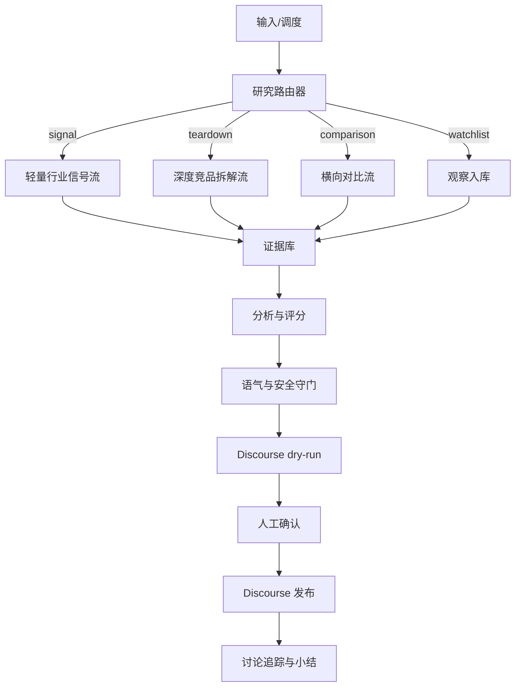

# 竞品深度拆解虾开源项目研究与集大成设计

## 1. 总判断

现成开源项目没有一个能直接满足北京中数智汇的场景。原因不是能力不够，而是目标错位：

- 竞品分析类项目通常会输出 strategic recommendations、action items、roadmap advice。
- deep research 类项目擅长检索和写报告，但不懂竞品拆解的固定维度。
- OpenClaw 现成 competitor-analysis-report skill 结构接近，但语气是“客户交付 / 战略建议”，不适合你们要的“行业研究 / 知识分享”。

因此应该采用“模块借鉴，重新组装”的策略：

- 借 deep research 的检索循环。
- 借 competitive intelligence 的分析框架。
- 借 OpenClaw skill 的报告产物形态。
- 借生产级 research agent 的可信度评分、缓存、重试、成本控制。
- 另外加一层你们独有的语气守门：内部议程不可见。

## 2. 开源项目拆解

| 项目 | 能借什么 | 不能照搬什么 | 在本项目中的位置 |
|---|---|---|---|
| brightdata/competitive-intelligence | Researcher → Analyst → Writer 三段式；pricing、leadership、market position、strategy 维度；流式进度 | 输出偏战略建议和 action items | 借多 agent 分工，不借推荐语气 |
| brightdata/skills competitive-intel | snapshot、pricing、review、hiring、content、landscape 六类分析；30+ 数据源映射；8 类输出模板 | 依赖 Bright Data 工具链；语气偏“可行动洞察” | 借数据源地图和模板库 |
| openclaw competitor-analysis-report | competitor profiles、feature matrix、pricing analysis、SWOT、positioning map、appendix；Markdown/HTML/CSV 产物 | strategic recommendations / immediate actions 不符合公开语气 | 借报告骨架，改写成行业观察 |
| competitive-teardown skill | pricing pages、reviews、job postings、SEO、social；12 维评分；validation checkpoint | action roadmap、where to move next 太显性 | 借拆解维度和质量门 |
| dzhng/deep-research | breadth/depth 参数；learnings / directions 递归研究；小代码量 | 通用研究，不懂竞品框架 | 借轻量迭代检索核心 |
| Tactara/deep-research-agent | search → draft → refine；Firecrawl 深抓 | Streamlit UI 不需要；框架偏 demo | 借简洁研究流 |
| tarun7r/deep-research-agent | ResearchPlanner / Searcher / Synthesizer / ReportWriter；可信度评分；section validation；缓存；导出 | LangGraph/Chainlit 较重，第一版可不引入 | 借质量门和状态模型 |
| langchain-ai/open_deep_research | 可配置 report_structure、模型、search API、MCP；benchmark/eval | 依赖 LangGraph server，集成较重 | 借配置化报告结构和 eval 思路 |
| NVIDIA AI-Q | intent router；shallow vs deep research；YAML 配置；async jobs；evaluation harness | 企业蓝图太重 | 借路由、异步任务和安全边界 |
| 24601/agent-deep-research | agent skill 形态；OpenClaw / ClawHub 安装；start/status/report 非阻塞；dry-run/cost estimation；本地文件 RAG grounding | 依赖 Gemini Interactions API | 借 OpenClaw skill 包装和命令体验 |

## 3. 集大成设计：四层架构



四层分别是：

1. 研究层：抓取、搜索、深抓、去重、证据归档。
2. 分析层：产品定位、能力地图、价格包装、用户反馈、招聘信号、SEO/内容信号、横向对比。
3. 守门层：可信度评分、业务相关度评分、语气红线、内部敏感信息过滤。
4. 发布层：dry-run、人工确认、Discourse 发帖、讨论追踪、后续观察项。

## 4. Agent 分工

### 4.1 Orchestrator / Router

职责：

- 判断任务类型：`signal`、`teardown`、`comparison`、`watchlist`。
- 决定研究深度：shallow / standard / deep。
- 分配预算：搜索次数、网页深抓数、LLM token、最长运行时间。

借鉴来源：

- NVIDIA AI-Q 的 shallow / deep research 路由。
- dzhng/deep-research 的 breadth / depth 参数。

### 4.2 Source Planner

职责：

- 为每个竞品生成数据源计划。
- 至少覆盖官网、价格页、文档、更新日志、案例、评论、招聘、社区/论坛。
- 判断是否需要搜索引擎、直接抓取、结构化数据源或手动补证。

借鉴来源：

- brightdata/skills competitive-intel 的数据源地图。
- competitive-teardown 的 data collection guide。

### 4.3 Evidence Collector

职责：

- 抓公开页面。
- 提取标题、正文、发布时间、价格、feature list、评论、招聘 JD。
- 生成 evidence hash 去重。
- 保存原文摘录和 URL。

限制：

- 不绕过登录、验证码、付费墙。
- 不采集非公开信息。

### 4.4 Credibility Scorer

职责：

- 给每条证据打可信度。
- 官方文档 / 价格页 / 更新日志最高。
- 评论、社媒、二手博客次之。
- 无来源、转载、营销稿降低权重。

借鉴来源：

- tarun7r/deep-research-agent 的 source credibility scoring。

### 4.5 Analyst Team

拆成 6 个分析器：

- Positioning Analyst：产品定位和目标客户。
- Feature Analyst：能力地图和 feature matrix。
- Pricing Analyst：价格、套餐、免费/企业版边界。
- Delivery Analyst：数据接入、权限、安全、私有化、集成门槛。
- Market Signal Analyst：用户评论、招聘、内容、SEO、客户案例。
- Comparison Analyst：多竞品横向比较和行业趋势。

借鉴来源：

- openclaw competitor-analysis-report 的报告骨架。
- brightdata/competitive-intelligence 的 Analyst agent。
- competitive-teardown 的 12 维评分。

### 4.6 Writer

职责：

- 输出行业研究语气的 Markdown。
- 不写 roadmap advice。
- 不写“我们应该”。
- 把 recommendation 改写成“行业信号 / 能力边界 / 可观察问题”。

### 4.7 Tone & Safety Gate

职责：

- 扫描禁用句式。
- 扫描内部敏感词：客户名单、管理层关注点、内部路线、销售策略。
- 确认每个判断有公开证据。
- 不通过则退回 Writer 重写。

这是本项目区别于所有开源项目的关键层。

## 5. 四种产物模式

### signal：轻量行业信号

触发：

- 单个功能变化。
- 价格页小变动。
- 招聘 JD 暗示新方向。
- 社区/评论出现高频抱怨。

输出结构：

```markdown
## [竞品名] 的一个新变化

- 变化：
- 来源：
- 时间：
- 置信度：

## 行业信号

## 可观察问题
```

### teardown：深度竞品拆解

触发：

- 重点竞品季度复盘。
- 重大功能 / 定价 / 战略变化。
- 产品虾或管理层长期关注对象。

输出结构：

```markdown
# [竞品名] 深度行业观察

## 1. 一句话结论
## 2. 产品定位
## 3. 能力地图
## 4. 价格与商业包装
## 5. 交付与集成门槛
## 6. 用户反馈与市场信号
## 7. 横向对比
## 8. 可观察问题
## 9. 证据附录
```

### comparison：横向对比

触发：

- 多个竞品同时出现同类能力。
- 需要比较 pricing / feature / deployment / ICP。

输出：

- feature matrix。
- pricing matrix。
- positioning map。
- 行业分歧点。

### watchlist：只入库观察

触发：

- 证据不足。
- 分数低。
- 内部敏感但不宜公开。

输出：

- evidence 入库。
- 不发帖。

## 6. 评分系统

### 6.1 发帖总分

| 维度 | 权重 | 说明 |
|---|---:|---|
| 业务相关度 | 35 | 只做内部排序，不进入公开正文 |
| 新颖度 | 25 | 是否是新功能、新价格、新定位、新客户案例 |
| 证据质量 | 20 | 来源可信度、是否有多源交叉 |
| 紧急程度 | 20 | 是否需要近期被产品/销售看到 |

### 6.2 业务相关度

| 子项 | 分值 |
|---|---:|
| 客户重叠 | 8 |
| 场景重叠 | 8 |
| 预期迁移 | 7 |
| 销售影响 | 6 |
| 交付影响 | 4 |
| 战略敏感 | 2 |

战略敏感只给 2 分。它能影响排序，但不能压过证据和客户场景。否则这个虾会显得“有话要说”，不再像研究。

### 6.3 深度拆解质量分

| 维度 | 合格线 |
|---|---|
| 公开证据 | 至少 8 条，重点结论必须有来源 |
| 能力矩阵 | 至少 10 个能力点 |
| 价格包装 | 必须引用官方价格页或标注未公开 |
| 横向对比 | 至少 2 个同类竞品 |
| 用户/市场信号 | 至少 2 类来源，例如评论 + 招聘 |
| 语气守门 | 禁用句式 0 命中 |

## 7. OpenClaw 命令设计

```bash
# 轻量信号 dry-run
openclaw run competitor-shrimp signal --competitor "ExampleAI" --since 7d --dry-run

# 深度拆解 dry-run
openclaw run competitor-shrimp teardown --competitor "ExampleAI" --depth deep --dry-run

# 多竞品横向对比
openclaw run competitor-shrimp compare --competitors "A,B,C" --topic "企业知识库权限治理" --dry-run

# 发布上一次 dry-run
openclaw run competitor-shrimp publish --draft-id <id> --confirm

# 查询长任务
openclaw run competitor-shrimp status <job-id>

# 导出报告
openclaw run competitor-shrimp report <job-id> --format md
```

## 8. 配置设计

```yaml
mode_defaults:
  signal:
    max_sources: 5
    max_runtime_minutes: 5
  teardown:
    max_sources: 30
    max_runtime_minutes: 45
  comparison:
    max_sources_per_competitor: 15
    max_runtime_minutes: 60

tone_policy:
  public_style: "industry_research"
  hide_internal_agenda: true
  banned_phrases:
    - "我们应该"
    - "建议我们"
    - "必须跟进"
    - "可以做一个类似的"
    - "竞品已经领先"

business_profile:
  target_customers:
    - 企业知识管理负责人
    - 数字化部门负责人
  core_scenarios:
    - 企业知识库
    - 智能问答
    - 权限治理
    - 数据接入
  sales_friction:
    - 准确率
    - 权限隔离
    - 私有化部署
    - 成本可控
  strategic_sensitive:
    - 被拒绝过但仍需观察的方向

competitors:
  - name: 示例竞品
    aliases: ["Example AI", "ExampleAI"]
    teardown_priority: high
    sources:
      - url: "https://example.com/pricing"
        type: pricing
        trust_level: 95
      - url: "https://example.com/changelog"
        type: changelog
        trust_level: 90
```

## 9. 数据模型

核心表：

- `competitors`
- `sources`
- `evidence_items`
- `research_jobs`
- `intel_items`
- `teardown_reports`
- `comparison_matrices`
- `discourse_posts`
- `discussion_summaries`

关键原则：

- 原始证据不可变。
- LLM 摘要可以重跑。
- 每个公开判断必须能追溯到 evidence id。
- dry-run 和 publish 分离，避免误发。

## 10. MVP 方案

### 第 1 周：能跑

- 实现 OpenClaw skill 基本目录。
- 支持 YAML 配置。
- 支持 signal 和 teardown dry-run。
- 支持官方网页抓取、搜索结果抓取、去重、证据入库。
- 输出 Markdown，不真实发帖。

### 第 2 周：能发

- 接 Discourse API。
- 加 dry-run 审核和 `--confirm` 发布。
- 加语气守门和禁用句式测试。
- 支持 topic / reply / tag。

### 第 3 周：能拆

- feature matrix。
- pricing matrix。
- 用户反馈 / 招聘 / 内容信号。
- 横向 comparison。
- 讨论追踪和自动小结。

## 11. 不建议做的事

- 不要第一版就上完整 LangGraph / NeMo / React UI。
- 不要让 agent 自动发布高置信度帖子，至少前两周要 dry-run。
- 不要输出 action roadmap。
- 不要写“对中数智汇意味着什么”。
- 不要把内部战略敏感项写进公开帖子。

## 12. 最终建议

最适合的实现路线是：

1. 用 24601/agent-deep-research 的 skill 命令体验做壳。
2. 用 dzhng/deep-research 的轻量递归研究做核心循环。
3. 用 openclaw competitor-analysis-report 的报告骨架做 teardown 模板。
4. 用 competitive-teardown 的数据源和 12 维评分补足拆解深度。
5. 用 tarun7r/deep-research-agent 的 credibility / validation / caching 做质量门。
6. 用 NVIDIA AI-Q 的 shallow/deep router 做模式路由。
7. 加你们独有的 Tone & Safety Gate，把“战略建议”全部转成“行业观察”。

一句话版本：

> 这个虾应该是“会做 deep research 的行业研究员”，不是“会抓网页的竞品监控机器人”。
