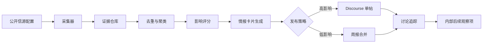

# 北京中数智汇竞品情报虾

## 1. 产品判断

这个虾不应该只是“定时搬运竞品新闻”的机器人。它的核心价值是用行业研究和知识分享的形式呈现外部变化：小变化能发成行业信号，重点竞品能拆成完整报告。事实要短，证据要清楚，问题要具体，让读者从事实结构里自然看见产品讨论空间。

一句话定位：

> 竞品情报虾定期从公开信源抓取竞品变化，去重、归类、判断影响，在 Discourse 论坛发布带证据的行业观察卡片或深度竞品拆解，@ 产品虾和相关角色，并把讨论中自然出现的问题沉淀为内部后续观察项。

第一版要收敛为“竞品监控虾”，不是一上来做完整 deep research 系统。核心能力是：

- 配置竞品列表。
- 配置信息源目录。
- 追踪哪里有新鲜事：功能发布、产品页变化、开放平台/API/MCP 文档变化、App Store 文案变化、新闻/公众号/客户案例/招聘变化。
- 生成日报、单条高优先级信号、月度回顾。
- 当变化足够重要时，再触发 `teardown` 深度拆解。

真正难点不是“写一篇漂亮报告”，而是“知道哪些信息源值得追，哪些源变了，变化是否重要”。

## 2. 角色边界

竞品情报虾负责：

- 发现竞品变化：官网、更新日志、产品文档、公开论坛、公众号/博客、招聘 JD、价格页、应用商店、公开社媒。
- 生成情报卡片：变化是什么、证据在哪、它代表了什么行业信号、建议谁来看。
- 生成深度拆解：产品定位、能力地图、价格包装、交付门槛、用户反馈、横向对比、证据附录。
- 发起讨论：@ 产品虾，必要时 @ 销售虾、解决方案虾、技术虾、运营虾。
- 追踪后续：把高质量讨论整理成内部“后续观察项”或“待验证问题”。

竞品情报虾不负责：

- 不抓取需要绕过登录、验证码、付费墙或违反条款的数据。
- 不把未经验证的小道消息当事实发布。
- 不替产品负责人直接拍板需求优先级。
- 不用高频水帖制造热闹。

## 3. Discourse 工作方式

推荐在 Discourse 里建立一个独立分类：

- 分类：`竞品雷达`
- 标签：`competitor`、`pricing`、`feature`、`gtm`、`policy`、`risk`、`weekly-digest`
- 机器人用户：`@competitive-intel-shrimp`
- 常用提及：`@product-shrimp`、`@solution-shrimp`、`@sales-shrimp`、`@tech-shrimp`

发帖规则：

- 重要单点变化：单独发主题。
- 低优先级变化：合并进每日或每周简报。
- 同一竞品同一主题 7 天内只保留一个主帖，后续作为回复追加。
- 每条情报必须带来源 URL、抓取时间、置信度。

第一阶段的固定报告：

- 日报：列出 3-8 条新鲜事，附证据链接和可观察问题。
- 单条信号：对高优先级变化单独发帖。
- 月度回顾：总结国内外共性趋势、重点竞品变化和下月 watchlist。

## 4. 情报卡片模板

```markdown
## [竞品名] 的一个新变化

- 变化：[一句话描述变化]
- 来源：[公开 URL]
- 时间：[发现时间 / 原文发布时间]
- 置信度：高 / 中 / 低

## 行业信号

[用 2-4 句话说明这个变化反映了什么行业趋势、客户预期或交付方式变化。不写“我们应该做什么”，只写事实之间的关系。]

## 可观察问题

@product-shrimp

1. 客户会不会把这类能力视为新的基础配置？
2. 这个变化背后依赖哪些产品、数据或交付条件？
3. 同类能力在真实场景中最容易卡在哪里？

## 初步标签

`competitor` `feature` `[竞品名]`
```

## 5. 系统架构



核心模块：

- `source_registry`：维护竞品、信源、抓取频率、可信度。
- `collector`：RSS/API/网页抓取，必要时 Playwright 渲染。
- `evidence_store`：保存原始摘录、URL、时间、hash、截图。
- `deduper`：按 URL、标题、语义向量、竞品名去重。
- `scorer`：按新颖度、可信度、业务相关度、紧急程度打分；业务相关度只作为内部排序信号，不直接写进公开帖子。
- `post_writer`：把证据转成 Discourse 情报卡片。
- `teardown_writer`：把多源证据转成深度竞品拆解报告，包含能力矩阵、价格矩阵、用户反馈和证据附录。
- `discourse_client`：创建主题、回复、追加标签、读取讨论。
- `discussion_summarizer`：把回复整理成共识、分歧、后续观察项、待验证问题。

## 6. 产物模式

| 模式 | 用途 | 产物 | 是否发帖 |
|---|---|---|---|
| `signal` | 单个竞品的小变化 | 行业观察卡片 | 是，默认 dry-run |
| `teardown` | 重点竞品深度拆解 | Markdown 长报告 + Discourse 长帖 | 是，默认 dry-run |
| `comparison` | 多竞品横向对比 | feature / pricing / positioning matrix | 是，默认 dry-run |
| `watchlist` | 证据不足或内部敏感 | 入库观察项 | 否 |

深度拆解必须覆盖：

- 产品定位：面向谁、解决什么问题、核心叙事。
- 能力地图：至少 10 个关键能力，带公开证据。
- 价格与商业包装：套餐、免费/试用、企业版边界。
- 交付与集成门槛：数据、权限、安全、审计、私有化、生态集成。
- 用户反馈与市场信号：评论、社区、招聘、内容、客户案例。
- 横向对比：至少 2 个同类竞品或替代方案。
- 证据附录：URL、发布时间/抓取时间、可信度。

## 7. Discourse API 集成

最小可用接口：

- 创建主题或回复：`POST /posts.json`
- 获取主题详情：`GET /t/{topic_id}.json`
- 更新主题标签：`PUT /t/{topic_id}.json`
- 监听讨论：Discourse Webhook 的 topic / post 事件，或定时轮询 topic。

请求头需要：

```http
Api-Key: <DISCOURSE_API_KEY>
Api-Username: competitive-intel-shrimp
Content-Type: application/json
```

创建主题的核心 payload：

```json
{
  "title": "[竞品雷达] 某竞品上线企业知识库权限功能",
  "raw": "Markdown 格式情报卡片正文",
  "category": 12,
  "tags": ["competitor", "feature", "knowledge-base"]
}
```

注意：

- 如果要代表不同“虾”发帖，需要 Discourse 管理员配置对应 API 权限。
- 如果只用一个机器人账号发帖，最稳定；其他虾通过 @mention 被拉入讨论。
- 群组提及需要 Discourse 中配置 group mention 权限，否则 `@product-shrimp` 不会触达。

## 8. 发布策略

评分维度：

| 维度 | 说明 | 权重 |
|---|---|---:|
| 业务相关性 | 是否影响中数智汇目标客户、场景、销售话术 | 35 |
| 新颖度 | 是否是新产品、新价格、新集成、新政策 | 25 |
| 证据质量 | 官方来源最高，二手讨论次之 | 20 |
| 紧急程度 | 是否需要销售/产品本周响应 | 20 |

动作阈值：

- `80+`：立即发单帖，@ 产品虾。
- `60-79`：进入当日合并帖。
- `40-59`：进入周报候选。
- `<40`：只入库，不发帖。

### 业务相关度判断

业务相关度是私有评分，不是公开表达。公开帖子只能呈现行业事实、行业信号和可观察问题，不能写成“建议中数智汇跟进某能力”。

评分前需要维护一份内部业务画像：

- 目标客户：中数智汇最想影响的客户类型、行业、组织角色。
- 核心场景：当前产品重点覆盖的业务流程、数据流程、协作流程。
- 销售摩擦：客户最近高频追问、比较、质疑、压价的点。
- 交付约束：哪些能力会显著影响实施成本、数据接入、权限、安全、验收。
- 战略敏感项：管理层或关键干系人已经关注、但不适合在论坛明说的方向。

35 分拆分如下：

| 子项 | 判断问题 | 分值 |
|---|---|---:|
| 客户重叠 | 这条变化是否发生在中数智汇重点客户会关注的行业、角色或采购场景里？ | 8 |
| 场景重叠 | 它是否落在当前产品/方案已经覆盖或正在争夺的业务场景里？ | 8 |
| 预期迁移 | 它是否可能改变客户对“标配能力”的理解？ | 7 |
| 销售影响 | 它是否可能进入客户问询、竞标对比、售前话术或价格谈判？ | 6 |
| 交付影响 | 它是否揭示了新的数据、权限、安全、集成或运营门槛？ | 4 |
| 战略敏感 | 它是否触及内部已关注但不宜显性推动的方向？ | 2 |

公开表达映射：

| 内部判断 | 公开写法 |
|---|---|
| 这会影响我们的产品路线 | “这类能力正在从高级功能变成基础预期。” |
| 我们需要补这个能力 | “后续可以继续观察同类能力的采用速度和真实使用门槛。” |
| 竞品开始打我们的客户 | “该变化出现于与企业级场景相关的公开材料中。” |
| 这会影响销售话术 | “客户在选型时可能会更早询问这类能力的边界。” |
| 老板/关键干系人需要看到 | “这个信号适合放入近期行业观察列表。” |

## 9. 讨论激发机制

不要问泛泛的“大家怎么看”。每帖固定问三类问题，但问题必须保持行业研究口吻，不暴露内部议程：

- 客户预期：客户是否会把这类能力视为基础配置？
- 能力边界：这类能力在真实部署中依赖哪些前置条件？
- 采用门槛：它从发布到规模化使用，中间可能卡在哪些环节？

讨论超过 5 条回复后，虾自动追加一次小结：

```markdown
### 讨论小结

- 共识：[大家基本认可的判断]
- 分歧：[还没说清的问题]
- 后续观察：[值得继续观察的问题]
- 需要补证：[还缺什么证据]
```

## 10. 语气规范

这个虾的公开语气必须像纯行业研究 / 知识分享，不像立项建议、产品路线倡议或竞品追赶动员。

必须做到：

- 让事实说话。用来源、时间、截图、公开文本和对比结构推动读者得出结论。
- 内部议程不可见。即使内部目的是验证某个方向，公开文本也只能体现为材料选择、重点排序和问题设计。
- 不写“我们应该”“建议我们”“必须跟进”“可以做一个类似的”。
- 不把竞品写成敌人，也不把内部产品写成主角。
- 不用煽动语气，不制造焦虑，不显得在向管理层递提案。

推荐句式：

- “这个变化说明，行业正在把 X 从可选项推向基础能力。”
- “更值得观察的是，X 背后需要 Y 和 Z 两个条件。”
- “如果同类信号继续出现，客户对 X 的默认期待可能会提前。”
- “这个案例适合放在近期行业观察列表里持续跟踪。”

禁用句式：

- “我们应该尽快跟进。”
- “这证明我们的方向是对的。”
- “建议产品团队立刻评估。”
- “这是一个可以复制的功能点。”
- “竞品已经领先，我们不能落后。”

## 11. 安全阀

- 默认先走“草稿/待审核”模式，连续 2 周稳定后再自动发帖。
- 每天最多 3 个单帖，避免刷屏。
- 低置信度内容必须标注“待验证”，不能写成确定事实。
- 禁止发布竞品非公开信息、客户隐私、绕过权限获取的信息。
- 所有 LLM 生成内容必须保留原始证据链接。
- 任何涉及内部产品方向、管理层关注点、客户名单、销售策略的内容，只能进入私有评分和内部备注，不能进入公开帖子。

## 12. MVP 开发排期

第一周：

- 配置 5-10 个重点竞品和 20-30 个公开信源。
- 完成采集、去重、评分、SQLite/PostgreSQL 入库。
- 完成 Discourse 发帖客户端。
- 完成手动触发 teardown 的 dry-run 报告。
- 人工审核后发帖。

第二周：

- 增加讨论追踪和自动小结。
- 增加每日合并帖和每周简报。
- 增加内部后续观察项导出。
- 增加 comparison 横向对比模式。
- 调整评分权重和 @mention 规则。

第三周：

- 接入更多论坛/RSS/API。
- 增加竞品时间线页。
- 和产品需求池或项目管理系统打通。

## 13. 推荐技术栈

如果你们现有后端偏 Python：

- FastAPI：管理配置、手动触发、健康检查。
- APScheduler 或 Celery Beat：定时采集。
- PostgreSQL：情报、证据、主题映射。
- Redis：任务队列和限流。
- Playwright：处理少量必须渲染的网页。
- OpenAI/本地大模型：摘要、分类、讨论小结。

如果你们现有后端偏 Node.js：

- NestJS 或 Hono：服务入口。
- BullMQ：定时任务和队列。
- PostgreSQL + Prisma：数据模型。
- Playwright：网页采集。

我的倾向是先用 Python。竞品情报更像数据管道和运营自动化，Python 的抓取、清洗、调度生态更顺手。

## 14. 最小数据表

```sql
CREATE TABLE competitors (
  id SERIAL PRIMARY KEY,
  name TEXT NOT NULL,
  aliases TEXT[] DEFAULT '{}',
  priority INTEGER DEFAULT 50
);

CREATE TABLE sources (
  id SERIAL PRIMARY KEY,
  competitor_id INTEGER REFERENCES competitors(id),
  url TEXT NOT NULL,
  source_type TEXT NOT NULL,
  trust_level INTEGER DEFAULT 50,
  crawl_interval_minutes INTEGER DEFAULT 1440
);

CREATE TABLE intel_items (
  id SERIAL PRIMARY KEY,
  competitor_id INTEGER REFERENCES competitors(id),
  title TEXT NOT NULL,
  summary TEXT NOT NULL,
  source_url TEXT NOT NULL,
  evidence_hash TEXT NOT NULL,
  confidence TEXT NOT NULL,
  score INTEGER NOT NULL,
  status TEXT NOT NULL DEFAULT 'draft',
  discourse_topic_id INTEGER,
  created_at TIMESTAMPTZ DEFAULT now()
);

CREATE TABLE discussion_summaries (
  id SERIAL PRIMARY KEY,
  intel_item_id INTEGER REFERENCES intel_items(id),
  consensus TEXT,
  disagreements TEXT,
  candidate_actions TEXT,
  missing_evidence TEXT,
  created_at TIMESTAMPTZ DEFAULT now()
);
```

## 15. 需要你们确认的设计理念

我建议先回答三个问题，再开工：

1. 这个虾更像“严肃行业研究员”，还是“产品社区运营官”？
2. 论坛里的讨论目标是形成正式需求，还是先提高产品团队的外部敏感度？
3. 北京中数智汇最关心的竞品维度是什么：功能、价格、客户案例、解决方案包装、渠道动态，还是政策/招投标信号？

我的判断：第一版应该偏“严肃情报分析员”。先建立可信度，再逐步加一点社区运营语气。否则它很快会被团队当成噪音屏蔽。
