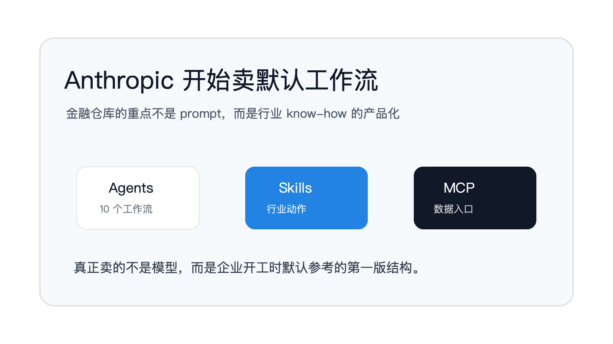
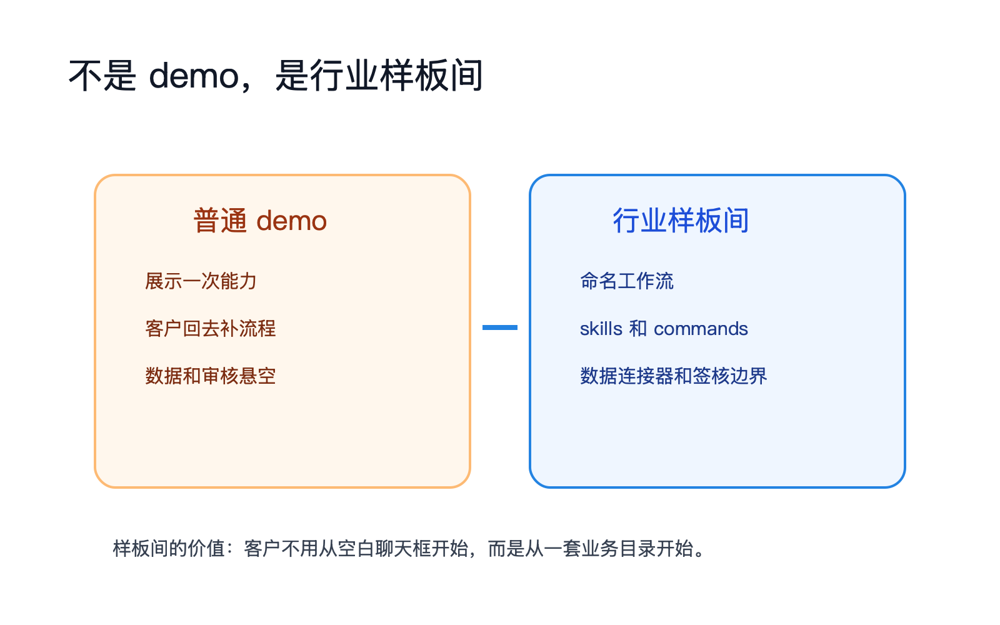
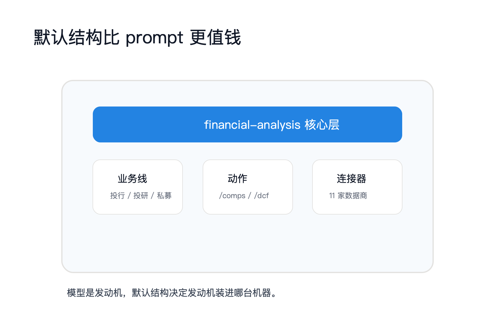
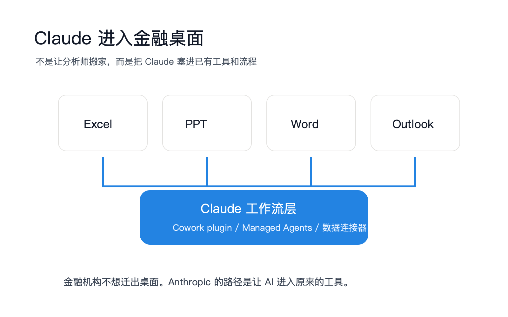

# Anthropic 开始卖金融行业的默认工作流

2026 年 5 月 11 日，凡人小北转发 Anthropic 金融服务仓库时，只写了两句话：“Anthropic：‘我正在金融街’。走自己的路，让别人无路可走。”

这句话准。不是因为金融行业天然高级，也不是因为 Claude 终于会写 pitch deck。真正的信号是：Anthropic 不再只把模型能力拿给客户看，而是开始把一个行业的工作方法写成可以安装、可以部署、可以改造的默认结构。

GoSailGlobal 的长推把表层信息列得很完整：10 个端到端 agent，7 个垂直行业插件，11 家金融数据商的 MCP 连接器，两种部署方式，还有 Microsoft 365 安装工具。这已经超出 demo 的范畴。但更关键的是，Anthropic 官方新闻和 GitHub README 自己也在说同一件事。2026 年 5 月 5 日，Anthropic 发布 “Agents for financial services”，开头就把它定义成 10 个 ready-to-run agent templates，面向常见金融工作流。

这不是“开源一组金融 prompt”。这是把金融服务里的 know-how 产品化。真正卖的不是模型，而是默认工作流。

## 不是 demo，是行业样板间

普通 demo 展示能力。比如让模型总结一份 10-K、生成一个 DCF 模板、写一页会议纪要。能力看起来很亮，但客户带回公司以后，还要自己回答一串更麻烦的问题：谁来触发？读哪些数据？产物是什么格式？中间谁审核？出错后谁接管？放在 Excel 里跑，还是放在内部工作流引擎后面跑？

Anthropic 这次给的不是一个答案，而是一套文件结构。

README 的第一句很直接：这是面向金融服务工作流的 reference agents、skills 和 data connectors，覆盖投资银行、股票研究、私募和财富管理。下面不是泛泛举例，而是 10 个已经命名的工作流：Pitch Agent 做 comps、precedents、LBO 到品牌化 pitch deck；Meeting Prep Agent 做客户会前 briefing pack；Market Researcher 做行业概览、竞争格局和 peer comps；Earnings Reviewer 从财报会和 filings 走到模型更新和研报草稿；Model Builder 在 Excel 里做 DCF、LBO、三表和 comps。

后面还有基金运营和风控侧的流程：Valuation Reviewer、GL Reconciler、Month-End Closer、Statement Auditor、KYC Screener。这些名字不是技术演示的名字，是金融机构内部岗位和流程的名字。

行业样板间的关键，不是“能不能跑一次”，而是“默认怎么摆”。Anthropic 把 agent、skill、command、connector、managed-agent wrapper 放进同一个仓库，等于告诉客户：金融 agent 项目开工时，第一版目录可以长这样。

## 真正值钱的是默认结构

企业 AI 最难卖的，从来不是模型参数。客户真正买单的，是“少走弯路”。

金融服务尤其明显。投行、投研、私募、财富管理、基金运营、KYC，这些场景不是缺文本生成能力，而是流程太重：数据源多，格式旧，合规边界硬，审核链条长。模型可以写得像分析师，但它不知道一家机构的模板、审批、数据许可、口径和签核点，产物就进不了工作。

Anthropic 的仓库把这些问题压进结构里。

第一层是垂直插件。`financial-analysis` 作为核心插件，包含 comps、DCF、LBO、三表、deck QC、Excel 审计和 11 个数据连接器。`investment-banking`、`equity-research`、`private-equity`、`wealth-management`、`fund-admin`、`operations` 分别把 CIM、teaser、earnings note、IC memo、client review、GL recon、KYC rules 这些动作拆成 skills 和 commands。用户不是从空白聊天框开始，而是从 `/comps`、`/dcf`、`/earnings`、`/ic-memo` 这些业务动作开始。

第二层是连接器。README 把 Daloopa、Morningstar、S&P Global、FactSet、Moody's、MT Newswires、Aiera、LSEG、PitchBook、Chronograph、Egnyte 都列成 MCP integration。GoSailGlobal 长推说“这一行单独值得讲”，判断是对的。没有数据入口，agent 只是会写格式漂亮的空报告；有了金融数据入口，agent 才能进入投研、建模、尽调和运营流程。

第三层是部署形态。README 说，同一份 source 可以有两种用法：作为 Claude Cowork plugin 安装，或者通过 Claude Managed Agents API 部署到企业自己的 workflow engine 后面。官方 5 月 5 日新闻又把入口扩展成 Claude Code、Claude web/desktop 的 Cowork，以及 Managed Agents API。也就是说，同一个金融工作流可以先在个人工作台跑，再进入团队工作台，最后挂到企业自己的编排层后面。

这就是默认结构的价值。模型能力是底层发动机，默认结构决定发动机装进哪台机器。

## Anthropic 要进金融桌面

这条线不是 5 月 5 日突然出现的。

Anthropic 在 “Claude for Financial Services” 里已经把方向说得很清楚：Claude 要成为 financial analysis platform。到 “Advancing Claude for Financial Services”，官方继续补 Excel、数据连接器和工作工具连接器。Claude for Excel beta 扩展到 Max、Team、Enterprise 用户，Anthropic 强调 Claude 能在保留 formatting、formulas 和 dependencies 的同时解释它改了什么；连接器名单里出现 Asana、Box、Canva、Daloopa、Databricks、FactSet、Notion、PitchBook、Snowflake。

金融仓库里的 Microsoft 365 install tooling 是这一段的落地版。README 写明，它用于让 IT admin 把 Claude 部署进 Excel、PowerPoint、Word 和 Outlook，并且可以对接 Vertex AI、Bedrock 或内部 LLM gateway，不强制只走 Anthropic API。

这句话比“支持 Excel”更重要。金融机构不想为了 AI 迁出自己的工作台。分析师还在 Excel 里建模，在 PowerPoint 里出材料，在 Outlook 里处理客户邮件，在 Word 里改 memo。Anthropic 的打法不是另建一个 AI 门户让人搬家，而是把 Claude 塞进现有桌面，再用 agent 和 skill 接住业务动作。

所以 financial-services 仓库不是孤立项目。它和 Excel、数据连接器、Managed Agents、Cowork 是一条线：把 Claude 从聊天产品推成行业工作流层。

## 没说出口的边界

这套结构强，不代表它已经解决金融 AI 的所有问题。

README 的免责声明非常重：仓库内容不构成投资、法律、税务或会计建议；这些 agents 只是起草 analyst work product，输出需要 qualified professional review；它们不做投资推荐，不执行交易，不绑定风险，不记账，不批准 onboarding。

这不是官样文章。它说明 Anthropic 很清楚金融场景的红线在哪里。能自动生成材料，不等于能自动承担责任。能找总账差异，不等于能 post to a ledger。能跑 KYC rules，不等于能 approve onboarding。

还有一个更商业的边界：README 明确写 MCP access may require a subscription or API key from the provider。11 个连接器看起来很漂亮，但企业真正使用时，仍要处理供应商合同、权限、审计、数据驻留和内部系统映射。Anthropic 给的是样板间，不是交钥匙大楼。

最后一个边界更隐蔽：默认结构会带来路径依赖。谁先把某个行业的 agent 目录、skill 边界、connector 接口、人工签核点写成公开模板，谁就有机会成为后来者的起点。客户当然可以改，但改一个已经成形的结构，和从零设计一套结构，不是同一种心理成本。

## 对从业者意味着什么

企业 AI 团队本周可以先停一下“哪个模型更强”的讨论，转去问一个更具体的问题：本行业的默认工作流，正在被谁定义？

如果是 CTO，应该把这个仓库当作 agent 项目模板看，而不是当金融方案看。重点不是复制 Pitch Agent，而是观察 Anthropic 怎么把 agent、skills、commands、connectors、subagents、deployment wrapper 放在一个可维护结构里。

如果是 AI 产品负责人，下一版需求文档不要只写“AI 帮用户生成报告”。要写清楚触发命令、输入数据、产物格式、人工签核点、失败路由和部署位置。没有这些，产品只是聊天增强；有了这些，才开始接近工作流产品。

如果是行业解决方案团队，要警惕“prompt 包”这个低级形态。客户不缺一组提示词，客户缺的是第一版可执行结构。Anthropic 这次给出的启发是：行业 know-how 要落成文件、命令、连接器、模板和审核边界，才能被销售、交付和生态复制。

如果是金融机构内部团队，最该做的不是照抄仓库，而是拿它做差距分析：哪些流程可以沿用公开模板，哪些流程必须保留内部差异，哪些数据连接器有许可问题，哪些动作绝不能越过人工签核。

金融行业不是被一个 repo 改造的。真正发生变化的是，AI 厂商开始争夺“行业第一版结构”的解释权。模型仍然重要，但行业工作流的默认目录，正在变成更靠近收入的那层产品。

## 本期关键词

- **默认工作流**：不是某个客户最终采用的完整流程，而是一个行业项目开工时默认参考的第一版结构。它规定 agent 怎么拆、skill 放哪里、数据从哪里进、人工在哪个节点签核。

- **行业样板间**：厂商把一个行业的典型业务线做成可安装、可修改、可部署的模板。样板间不是最终生产系统，但它会影响客户对“合理结构”的第一印象。

- **技能商品化**：把专家方法从口头经验和 prompt 写法，沉淀成 skills、commands、agent.yaml、connector 配置和审核规则。商品化之后，know-how 才能被复制、交付和生态化。

- **数据入口**：agent 接入真实业务的门。没有数据入口，模型只能生成看起来合理的文本；有了受控的数据入口，模型才可能进入投研、运营、审计和客户服务流程。

- **人工签核点**：金融 AI 的责任边界。README 反复强调输出需要 qualified professional review，这意味着 Anthropic 卖的是工作流提速，不是责任转移。

## 引用

1. [Anthropic financial-services GitHub repository](https://github.com/anthropics/financial-services)
2. [frxiaobei X post](https://x.com/frxiaobei/status/2053861985008431398)
3. [GoSailGlobal quoted X thread](https://x.com/GoSailGlobal/status/2053304501231350074)
4. [Anthropic: Agents for financial services](https://www.anthropic.com/news/finance-agents)
5. [Anthropic: Claude for Financial Services](https://www.anthropic.com/news/claude-for-financial-services)
6. [Anthropic: Advancing Claude for Financial Services](https://www.anthropic.com/news/advancing-claude-for-financial-services)
