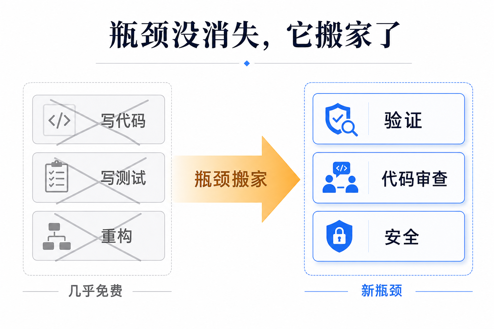

# 瓶颈搬家了：当写代码免费，工程组织该按哪条线重排

过去三十年，软件研发的所有流程都是围着同一件昂贵的事建起来的：人写代码。六个月路线图、季度规划、正式设计文档、持续部署的层层卡口——这些约束的潜台词都是「工程师的时间很贵，得排好队、别返工、别浪费」。Anthropic 工程负责人写的这篇《Running an AI-Native Engineering Org》给出一个让人不舒服的判断：当 agentic AI（能自主规划、写码、跑测试的 AI）把「打字写代码」这件事变得几乎免费，这套流程的地基就塌了一半，而大多数团队还在地基上继续盖楼。

核心不是「AI 把开发提速了」。核心是一句反直觉的话：**瓶颈没有消失，它搬家了**。

## 本期关键词

- **AI 原生工程组织（AI-native engineering org）** —— 不是「给老团队配个 AI 助手」，而是假设写代码已经不要钱、瓶颈已经搬走，重新设计的研发团队和流程。
- **即时规划（JIT planning, just-in-time）** —— 不再提前定六个月路线图，而是「先做原型 → 丢给内部用户 → 按反馈走」，规划周期压到天甚至小时。
- **trust but verify（信任但要验证）** —— 把活交给 Claude，但用独立的人或机制去核验它的产出；随着模型变强，持续重估「哪些还需要人验」。
- **吃自家狗粮（dogfood）** —— 团队每个人，包括非工程岗，都天天用自己在造的产品。

## 一、瓶颈搬家：从「写代码」到「验证、审查、安全」

先把这篇文章的地基句摆出来，后面全是从它推出来的：

> "Writing code, writing tests, and refactoring rarely slows us down anymore. But the bottlenecks didn't go away when agentic coding took away the actual need to type code. Verification, code review, and security took their place."（写代码、写测试、重构，现在几乎都不再拖慢我们。但当 agentic 编码拿走了「真正需要敲代码」这件事，瓶颈并没有消失——验证、代码审查和安全，接替了它们的位置。）

这句话的结构值得拆开看。它先承认一个事实（写代码不再是瓶颈），再纠正一个错觉（很多人以为瓶颈因此消失了），最后给出真相（瓶颈平移到了下游三件事）。逻辑链很直：当生产代码的成本趋近于零，卡住交付的就不再是「打字速度」，而是「怎么确认这堆代码是对的、是安全的、值不值得发」。

作者补了一句态度：他越来越不看重 raw throughput（原始吞吐量）——模型管够，码量不再稀缺；他真正在意的是「哪里还需要人的专长」。这是整篇文章的指南针：**凡是机器能啃干净的，往机器挪；凡是机器啃不彻底的，把人集中过去。** 下面每一节都是这根指南针指向的一个具体动作。

## 二、规划：六个月路线图为什么活不过第三个月

旧流程的第一块塌方在规划。作者诚实地交代：他们原来的六个月路线图，**到第三个月就已经过期**——因为团队自己用上 Claude Code 后产能变化太快，半年前定的优先级早就不成立了。

替代方案叫即时规划（JIT planning）：

> "Our process now is let's prototype, get a lot of internal users on it, and start acting on their feedback."（我们现在的做法是：先做原型，让一大批内部用户用上，然后按他们的反馈行动。）

连规划的载体都变了——正式设计文档被砍掉，挪进了 PR（Pull Request，代码合并请求）和原型里的讨论：

> "Our planning ritual shifted away from design docs toward discussions in PRs or prototypes."（我们的规划仪式从写设计文档，转向了在 PR 或原型里讨论。）

判断：长路线图本质是一种「昂贵工程时间」的产物——因为做错方向返工很贵，所以要提前把方向想清楚、排好队。当原型成本趋近于零，「先做出来给人用」比「先论证它该不该做」更便宜也更准。设计文档讨论的是「假想中的系统」，PR 里的原型讨论的是「能跑的系统」，后者把争论锚在事实上而不是想象上。还在用季度路线图考核工程团队的组织，是在为一个已经变便宜的环节（提前规划）付昂贵的税。

## 三、取上下文：先问 Claude，能自动化就别当仪式

第二块塌方在「怎么搞清楚一段代码在干什么」。

旧规矩是：有问题，去找当年写这段代码的人。这条规矩的前提是「代码是某个人写的，知识在那个人脑子里」。作者说新规矩往下挖了一层：

> "When engineers wrote code, the first step to getting an answer to most questions was to find the person who wrote the code... Our new norm is to go a level deeper... You ask Claude that question."（当代码是工程师写的，回答大多数问题的第一步是找到写代码的人……我们的新常态是再往深一层……你去问 Claude 这个问题。）

更狠的是把「人工仪式」直接降级成「后台进程」。作者举了自己的例子：

> "Having Claude summarize customer feedback channels every morning went from a ritual I did manually with my coffee to something I just have running automatically in the background."（让 Claude 每天早上汇总客户反馈渠道，从我端着咖啡手动做的一项仪式，变成了一件在后台自动跑着的事。）

判断：这两件事是同一个动作的两面——**把「获取上下文」从「向人索取」改成「向系统查询」**。前者受限于那个人在不在、记不记得、有没有空；后者随叫随到、可并行、可自动化。这里藏着一条给每个团队的自检：你团队里有多少「每周固定花时间、产出是一份摘要 / 一次同步 / 一份状态」的仪式？其中有几件，本质是在做信息搬运、而不是做判断？凡是搬运，都该问一句能不能让它在后台自动跑。

## 四、代码审查：哪些交给 Claude，哪些死活留给人

这是全篇分工最清楚的一节，也是「瓶颈搬家」最该落地的地方——既然审查成了新瓶颈，就得精确切分。

交给 Claude 的：风格与 lint、回应 PR 上的修改意见、在正式提交前抓 bug 并修掉、补测试。这些的共同点是**有客观标准、可机械核验**——对不对，跑一下就知道。

死活留给人的：法务审查、信任边界与安全敏感代码、产品判断、设计专长。这些的共同点是**没有可自动跑的判据**——对不对，取决于价值取舍、责任归属、对人的理解，机器给不出最终签字。

贯穿这条分工线的原则叫 trust but verify（信任但要验证），而且作者强调它不是一刀切的静态规则——随着模型变强，要持续重估「哪些验证项可以放手、哪些必须攥着」。

判断：这一节是整篇最可直接抄走的部分。它没有停在「AI 辅助代码审查」这种正确的废话上，而是画了一条具体的刀线：**有客观判据的归机器，靠价值判断和担责的归人。** 注意这条线会移动——今天必须人审的，明天模型变强后可能就能交出去。这意味着「哪些该人审」不是一次性配置，而是要定期重估的活参数。把这条线写死的团队，要么在浪费人去做机器能做的核验，要么在让机器去签它担不起的责任。

## 五、招人与团队：不再为「码量」招人

瓶颈搬家，招人的标准也得跟着搬。作者明说：他们在 raw throughput 上的权重降低了——模型管够码量，再按「能写多少代码」去招人和考核，等于奖励一件已经免费的东西。

新的两类画像：一类是**有产品感的创造者**——好奇、对「把产品发出去」有热情的人；另一类是**深系统专家**——为了 Claude Code on the Web 能稳定跑在多平台上，他们专门招了懂底层系统的人。前者负责「该做什么」，后者负责「机器还啃不动的硬骨头」。

团队还有三条核心原则：
- 狂吃自家狗粮——每个成员，包括跨职能伙伴，都天天用 Claude Code；
- 团队尽量扁平——经理也从一线 IC（个人贡献者）做起，不脱离写代码；
- 毫不犹豫砍掉过时流程。

角色边界也被刻意模糊了：PM 也写代码，工程师也做设计、做内容。判断：当写代码这件事的门槛被 AI 拉平，「我是 PM 所以我不碰代码」这种岗位护城河就失去了存在理由。边界模糊不是管理松散，而是因为完成一件事的成本结构变了——一个有产品感的人现在可以自己把想法做成能跑的原型，不必再隔着一道「翻译给工程师」的墙。

## 六、三个数字：这不是 PPT，是已经发生的事

方法论容易说，难的是拿出已经发生的证据。这篇文章给了三个硬指标，每个都对应前面一节的主张：

- **onboarding（新人上手）：一周内 ship 真代码。** 过去这件事要花到一年。对应第三节——新人不必再靠「找老员工问」来攒上下文，他直接问 Claude，所以能极快地开始真正交付。
- **PR cycle time（PR 从开到合的周期）下降。** 作者特意点出一个反直觉的副作用：当 PR 周期变短，它会**暴露出 CI / build（持续集成 / 构建）环节的新瓶颈**。这恰恰是「瓶颈搬家」的现场演示——你拆掉一个瓶颈，下一个瓶颈立刻浮上来。
- **Claude-assisted commits 100% 采用：连续四个月没有一次非 Claude 参与的提交。**

> "By default, every commit is Claude-assisted... I don't think I've seen a non-Claude-assisted commit in the last four months."（默认情况下，每一次提交都有 Claude 参与……我想我已经四个月没见过一次没有 Claude 参与的提交了。）

判断：100% 这个数字的分量不在「用得多」，而在「它已经是默认，不是选项」。一项工具到了「四个月没有一次例外」的程度，它就不再是辅助，而是基础设施——就像没人会统计「这个月有多少提交用到了编译器」。第二个数字更值得每个团队记住：拆瓶颈不会让瓶颈消失，只会让你看见下一个。这是个持续的过程，不是一次性的升级。

## 七、那场被砍掉的周会

整篇文章里最具体、最该被复制的动作，是砍掉一个大型周会。理由不是「会太多」这种正确的抱怨，而是一个精准的观察：与会者只在轮到自己汇报时才认真听，其余时间都在自己的笔记本上忙别的。于是作者问了一个简单的问题：

> "Why are we having this meeting again? It seems like an expensive use of our time."（我们到底为什么还在开这个会？这看起来是对我们时间一种昂贵的浪费。）

「expensive（昂贵）」这个词用得不是随口——它正是整篇文章的关键词。围着「昂贵工程时间」建的会、文档、路线图，当工程时间不再那么昂贵，它们就从「必要约束」变成了「昂贵浪费」。

文章结尾把这个问题交还给读者：

> "Ask yourself: what's one piece of your engineering workflow that you might consider automating or even dropping altogether?"（问问你自己：你工程流程里，有哪一件事是你可以考虑自动化、甚至干脆砍掉的？）

判断：这篇文章真正的可操作产物，就是这一个问题。它不要求你先信「AI 会颠覆一切」这种大叙事，只要求你拿起自家流程清单，对每一项问两遍——它当初是为了省哪种昂贵资源建的？那种资源现在还昂贵吗？两个答案错位的地方，就是该动手的地方。

## 对从业者意味着什么

这篇文章的底层模型只有一句：**你过去所有的工程流程，都是为「昂贵的人写代码」这个约束优化的；这个约束松了，流程就得跟着重排。** 不重排，省下来的产能会被旧流程的摩擦吃掉。

- **对工程团队**：别再用「码量 / 打字速度」考核人，那是在奖励一件已经免费的事。把精力挪到新瓶颈上——验证、代码审查、安全。审查环节先画那条刀线：有客观判据的（风格、lint、抓 bug、补测试）尽量交给 Claude，靠价值判断和担责的（法务、信任边界、产品、设计）留给人，并且定期重估这条线该不该往机器那边移。
- **对管理者 / CTO**：这是组织重构信号，不是工具采购。长路线图换成即时规划（原型 → 内部用户 → 按反馈走），设计文档讨论挪进 PR 和原型。拿起你的流程清单，对每一项问那两个问题：它当初省的是哪种昂贵资源？那资源现在还贵吗？最该先砍的，往往是那个「大家只在轮到自己时才认真听」的周会。
- **对个人贡献者**：onboarding 从一年压到一周、四个月 100% Claude 参与提交——这两个数字说明门槛已经被拉平。把不可替代性从「会写某段代码」迁移到「会定义目标、会验收、会担责」。PM 也写码、工程师也做设计已成常态，岗位边界不再是护城河，能把想法直接做成能跑原型的人最值钱。
- **对所有人**：记住「拆瓶颈只会让你看见下一个」（PR 变快就暴露了 CI 瓶颈）。AI 原生不是一次升级，是把「持续找到并拆掉当前最贵的那个环节」变成日常。结尾那个问题值得贴在每次复盘上：我这套流程里，有哪一件可以自动化、甚至干脆砍掉？

## 引用

1. Running an AI-Native Engineering Org（运营一个 AI 原生工程组织，Anthropic 官方博客）：https://claude.com/blog/running-an-ai-native-engineering-org
