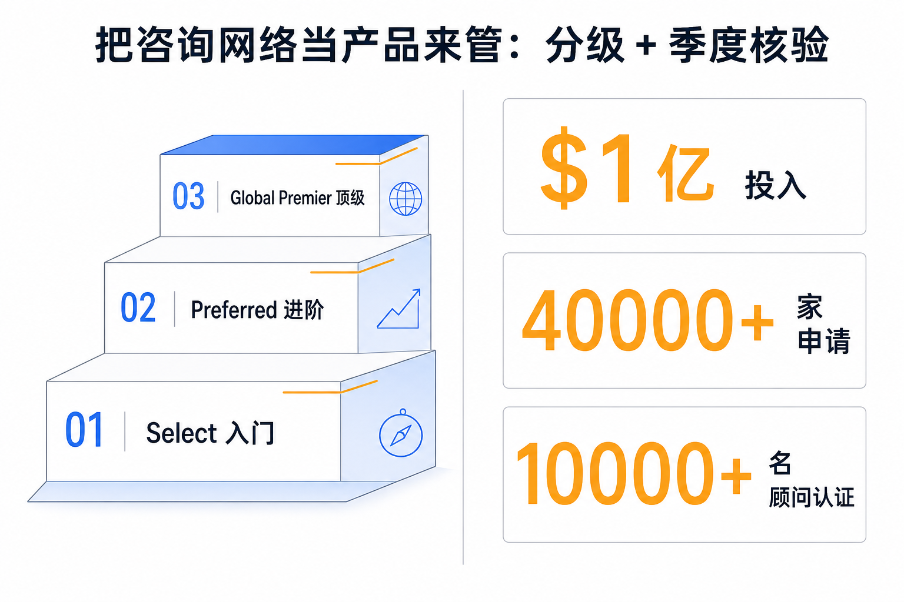

# Anthropic 给集成商发了一张成绩单：把咨询网络当产品来管

过去几十年里，一家咨询公司在大厂合作伙伴体系里能爬到哪一级，看的是合同金额、公司规模、和高管的私交。这是一套靠关系和体量运转的旧规则。6 月 3 日，Anthropic 上线 **Services Track（服务伙伴分级体系）** 和 **Claude Partner Hub（合作伙伴门户）**，把这套规则换成了三个能被机器核对的硬指标：你认证了多少名最近还在干活的从业者、你有多少个客户真把产品跑在了生产环境里、你敢不敢把这些客户案例公开出来。而且，**每季度核一次**。

这件事表面是渠道公告，本质是一次产品化动作。Anthropic 没有把合作伙伴当成需要逢年过节维护的关系网，而是当成一个有明确验收标准、会定期复检、不及格就掉级的产品来管理。这意味着集成商之间的竞争锚点被强行从「把 logo 做大」挪到了「把能力做实」。本期拆的就是这套机制，以及它暴露出的一件更大的事——AI 集成生意，正在长出它真正的商业形状。

## 本期关键词

- **Services Track（服务伙伴分级体系）** —— Anthropic 给咨询/集成伙伴设的三级制度（Select / Preferred / Global Premier），决定升级的不是公司大小，而是认证人数、生产环境客户数、公开案例数三项硬指标。
- **Claude Partner Hub（合作伙伴门户）** —— 配套上线的公开目录与门户：伙伴每天能看到自己离下一级还差多少，客户能用它找到够格的伙伴，并通过 MCP 连接器在对话里直接查某家伙伴的资质。
- **认证从业者（certified practitioner）** —— 通过 Anthropic 认证考试、且**过去 90 天还在活跃**的个人。这个「90 天活跃」的定语是整套机制的命门——它防止公司靠囤积一批考过即弃的证书来充数。
- **生产环境部署（production deployment）** —— 客户真把 Claude 用在了正式业务里，不是 PoC（概念验证）演示。这是把「卖出去」和「用起来」区分开的那条线。

## 一、三级门槛卡的全是数字，不是身段

先把规则说清楚，否则后面都是空话。Services Track 分三级，每一级的入场券都是一组可数的指标，不是一份关系说明书。

- **Select（入门级）**：≥10 名认证个人、过去 12 个月内 ≥2 个生产环境联合客户、≥1 个公开客户案例；
- **Preferred（进阶级）**：≥100 名认证个人、≥15 个已部署联合客户、≥3 个公开案例；
- **Global Premier（顶级）**：≥1000 名认证个人、≥100 个已部署客户（且跨 3 个以上地区）、≥15 个公开案例，外加一份**有指名高管负责的联合商业计划**。

三级之下还有一个免费的 Registered（注册）入口，最低门槛是 10 名认证从业者就能进门。免费加入，认证考试按级别给折扣——把门槛压低，让更多人先进来跑指标。

判断：这三档梯度里，从来没出现过「年营收多少」「员工多少人」「成立多少年」这类传统合作伙伴体系最爱用的体量门槛。它换上的三个度量——**最近 90 天活跃的认证人数、跑在生产环境的客户数、公开的客户背书数**——分别对应三个无法靠 PPT 糊弄的问题：你的人现在真的在用吗？你的客户真的部署了吗？你敢把名字摆出来吗？三道关层层收口，把「签了单」和「用起来了」「用出效果了」一步步逼出来。

## 二、整套机制的命门，是那个「90 天」

如果只让你记住这篇里的一个细节，是这个：认证从业者的计数，只算**过去 90 天还在活跃**的人。

这一个定语，决定了整套体系是真有牙齿还是又一张奖状。传统认证体系的通病是证书会贬值——公司组织一批人突击考过，拿到一摞证书挂在官网上，之后这些人转岗、离职、再没碰过产品，证书却永远有效。资质于是和真实能力脱钩，变成一种可以囤积的库存。

Anthropic 用「90 天活跃」+「每季度核验」两道闸把这个漏洞焊死了。证书不再是一次性资产，而是一个需要持续供能的状态：你的人停手三个月，这一票就不算数，公司的等级随之承压。配合上 1 月 1 日、7 月 1 日两个固定的晋级时点（2026 年还额外加了 10 月 1 日的首次复核），这套节奏让等级变成了一个**需要季度续费的动态值**，而不是挣到手就锁死的头衔。

判断：把资质从「存量」改造成「流量」，是这套设计里最锋利的一刀。它逼着集成商不能只在拿单前冲一波认证，而要让自己的人持续泡在产品里——因为一旦松手，掉级是自动发生的。这是用度量机制替代信任，机器每季度替你查一遍岗，比任何「我们很重视 AI」的承诺都硬。

## 三、Partner Hub 把这套指标，变成了三方都能用的活仪表盘

光有规则不够，规则得能被各方实时看见、实时用，才不会沦为后台的一纸文件。Claude Partner Hub 干的就是这件事——把那套指标做成一个三方都接得上的活仪表盘。

- **对伙伴**：每天能看到自己离各级要求还差多少。差几个生产客户、差多少认证人数，一目了然。资质从一年评一次的黑箱，变成天天盯着的进度条。
- **对客户**：能在门户里直接找到够格的伙伴来做项目，按真实部署数据挑人，而不是听销售自我介绍。
- **对所有人**：Hub 接了 **MCP 连接器**（Model Context Protocol，一套让 AI 应用接外部数据源的开放协议）——这意味着你可以在和 Claude 的对话里，直接问「帮我查 XX 这家伙伴的资质排名」，让模型实时拉取，而不必去翻网页目录。

判断：把资质做成 MCP 可查的实时数据，是这套机制能闭环的最后一块拼图。它让「选伙伴」这个动作从一次性的尽职调查，变成对话里随手可发起的实时查询；也让伙伴的成绩单永远摊在阳光下，没有「官网展示的是去年高光」的余地。资质一旦变成可被第三方随时调取的实时数据，作假的空间就被压到了最小——这正是产品化管理和关系型管理最根本的区别：前者把判断交给可核验的数据，后者把判断交给说得动谁。

## 四、接盘的体量说明：这不是试点，是全员基础设施

为什么 Anthropic 要费这么大劲把渠道产品化？因为接盘的体量，已经大到必须用产品而非人情来管理了。

Anthropic 给这套体系配的是 **1 亿美元**投入（用于伙伴培训、技术支持、联合营销），**40000 多家**公司提交了申请，**10000 多名**顾问已经完成认证。而真正说明问题的，是头部集成商各自铺开的人数：

- **Accenture（埃森哲）** 在训 3 万人；
- **Cognizant（高知特）** 铺到约 35 万员工；
- **Deloitte（德勤）** 面向 47 万全球员工；
- **KPMG（毕马威）** 覆盖 27.6 万人以上；
- **Infosys（印孚瑟斯）** 在建行业专属的 Claude 驱动 agent；
- **PwC（普华永道）** 铺开 Claude Code 和 Cowork。

这些数字的量级——动辄几十万人——说明大厂已经不把 AI 当成某个事业部里的试点项目，而是当成**全员都要会用的基础设施**在铺。当一家集成商要让几十万人都达到某种 Claude 能力标准，靠客户经理喝酒聊感情维护这层关系是不可能完成的，必须有一套可量化、可自动核验的等级系统替人盯着。

判断：体量逼出了产品化。当合作伙伴的人头规模冲到几十万，关系型管理在物理上就失效了——你没有那么多客户经理去一一维护，也没有任何人脑能记住谁达标谁没达标。Services Track 那套「认证人数 × 生产客户 × 公开案例 + 季度核验」的指标体系，本质是给一个百万级规模的咨询网络装上一套自动巡检系统。把网络做大到一定程度，管理就只能交给度量。

## 五、它定义了 AI 集成生意真正的形状

把前面四节叠起来，会浮出一个比渠道政策大得多的判断：AI 这门生意真正赚钱、也真正难做的地方，第一次被一家模型公司用制度给框出来了。

Anthropic 自己把这句话说得很直白：

> "The real work—and the real opportunity—is in the integration, the evaluation, and the way people's work evolves."（真正的活、也是真正的机会，在集成、在评估、在人的工作方式如何演变。）

这句话拆开看，恰好对应 Services Track 的三个度量。「集成」对应的是生产环境部署数——光卖出去不算，得真接进客户的业务里跑起来。「评估」对应的是公开客户案例——得有人愿意出来作证它真有效。「人的工作方式如何演变」对应的是 90 天活跃的认证人数——得有一批人持续泡在里面，把工作方式真的改了。模型本身正在快速商品化，谁家的模型都越来越强、价格越来越低；而把模型嵌进一个具体组织、调出真实效果、让人的干活方式跟着变，这件脏活累活才是真正有壁垒、真正能持续收费的地方。

判断：Anthropic 用这套分级，等于公开宣布了它对自己生意边界的认知——**模型是入口，集成才是战场**。它把最难的那段（让 AI 在真实组织里产生真实价值）外包给了集成商网络，又用产品化的度量逼着这个网络把活做实。对整个行业，这是一个信号：AI 落地的价值正在从「谁有更好的模型」往「谁能把模型真正用进去」转移，而这后一段，是一个体量可达百万从业者、却必须靠可核验指标来管理的全新市场。

## 对从业者意味着什么

- **对集成商/咨询公司**：游戏规则变了，资质现在是一笔需要季度续费的流量，不是挣到手就锁死的存量。别再靠突击认证冲一波然后吃老本——「90 天活跃」会自动把停手的人剔出去。把资源压在三件事上：让认证的人持续真用产品、把客户从 PoC 推进到生产环境、争取客户同意公开案例。这三件事现在直接换算成你的等级。
- **对采购方/甲方**：挑伙伴别再只看公司大小和过往名气。去 Partner Hub 看真实部署数据——它有多少个生产环境客户、多少个敢公开的案例。一家挂着顶级 logo 但 Hub 上生产客户寥寥的伙伴，和一家体量不大但部署数据扎实的伙伴，后者更可能把你的项目真正做成。
- **对个人从业者**：认证从「考过即止」变成了「持续在用才算数」，这反而对真在一线干活的人有利。你的实战投入第一次被一个全行业承认的体系直接计入，认证不再是简历上的一行装饰，而是你所在公司等级的真实分母。
- **对所有人**：这是一个更大趋势的缩影——AI 时代里，「资质」「能力」「信誉」都在从一次性颁发的证书，变成需要持续供能、可被实时核验的动态状态。无论你是公司还是个人，可被随时核对的真实成绩，正在取代说得动谁的关系。

## 引用

1. Anthropic — Introducing the Claude Partner Network: Services Track and Claude Partner Hub（介绍 Claude 合作伙伴网络：服务伙伴分级体系与合作伙伴门户）：https://www.anthropic.com/news/services-track-partner-hub
