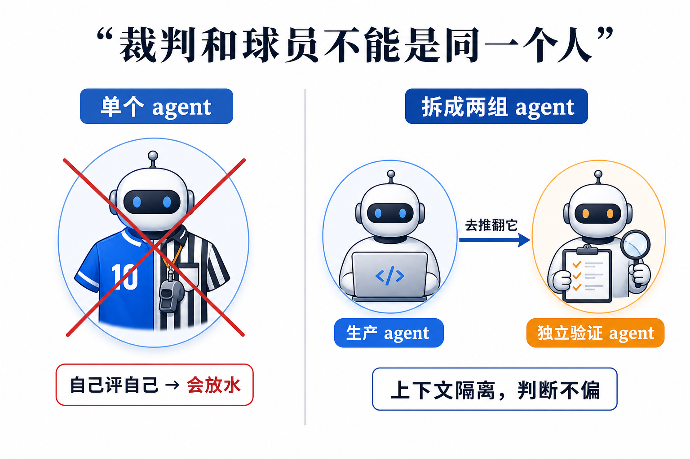
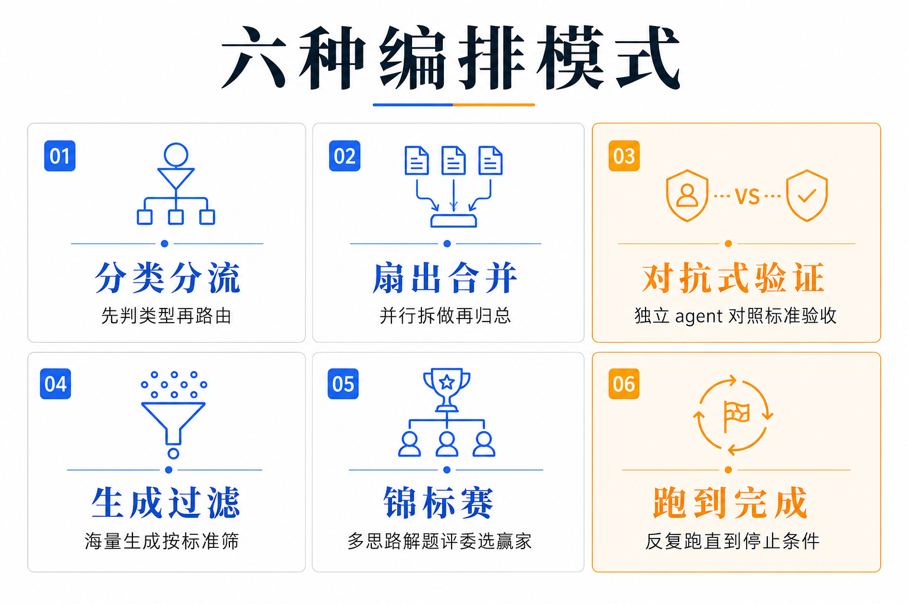

# 裁判和球员不能是同一个人：为什么 Claude 要给自己造一副马具

让一个聪明 agent 一口气把活干完，听起来天经地义——模型越强，越该信它自顶到底跑。Anthropic 在 Dynamic Workflows（动态工作流）的技术文里给了一个反直觉的判断：单个 agent 跑长链路，会稳定地犯三种它自己治不了的错。解法不是换更聪明的模型，而是让模型当场为这个具体任务写一副**马具（harness）**——把活拆给一群上下文隔离的并行 agent，再派另一组带着「去推翻它」指令的 agent 来验收。

这篇文章的核心不是「又快了」，而是一句结构性的话：单个 agent 治不了自己的偏袒，因为裁判和球员是同一个人。本期拆的就是这副马具治的是什么病、用哪六种招式治、以及一句给所有人的冷水——你的任务真的需要更多算力吗。

## 本期关键词

- **Dynamic Workflows（动态工作流）** —— Claude Code 新功能：模型现场写一份 JavaScript 编排脚本，把一个大任务拆给一群并行子 agent，自己调度、自己验收，而不是在一个上下文窗口里从头干到尾。
- **Harness（马具/支架）** —— 套在模型外面的一层结构。模型本身的性格缺陷（偷懒、偏袒、走神）治不好，就用外部结构把它框住，让缺陷失效。
- **对抗式验证（adversarial verification）** —— 派一组独立的、上下文隔离的 agent，专门带着「去推翻」的指令检查另一组 agent 的产出，用结构换可靠。
- **上下文隔离（context isolation）** —— 验收的 agent 看不到生产者的「自我」，没有要维护的答案，所以它的判断不偏。

## 一、三种病：聪明 agent 跑久了会怎样

为什么不能让一个聪明 agent 一口气干完？技术文给了三个具体的失败模式，每一个做过长链路 agent 的人都见过：

- **Agentic laziness（智能体偷懒）** —— 原文的定义是「Claude 在一个特别复杂、多步骤的任务还没真正完成时就停下，做了一部分就宣布完工」。它不是能力不够，是判断「够了」的标准被它自己悄悄放低了。
- **Self-preferential bias（自我偏好偏差）** —— 原文：「Claude 倾向于偏袒自己的结果或发现，尤其是被要求对照一份评分标准去验证、评判它们的时候。」让一个 agent 既当作者又当审稿人，它会给自己放水。
- **Goal drift（目标漂移）** —— 原文：「在多轮对话里逐渐丢失对最初目标的忠诚度，尤其是在上下文压缩之后。」摘要一次、压缩一次，原始目标就被稀释一点，跑得越久偏得越远。

这三种病有个共同点：它们都不是知识缺陷，是**自我审视的缺陷**。模型不知道自己已经偷懒、不愿意否定自己刚写的东西、记不清几十轮前的初心——这些靠「把模型训得更诚实」很难根治，因为问题恰恰出在它对「自己」的判断上。

## 二、解法是一副马具，不是一个更乖的模型

技术文里最该抄下来的一句：

> "Workflows allow you to dynamically create harnesses built on top of Claude Code that enable Claude to solve all of those problems more natively."（工作流让你在 Claude Code 之上动态搭出一副马具，使 Claude 能更原生地解决上面这些问题。）

关键词是 **harness**。马具是套在马身上、由外部约束它行为的东西，不是让马变乖。对应到这里：与其指望模型不偏袒自己，不如把验证这件事整个拆出去——交给**独立的、上下文隔离的**另一组 agent，让它带着「去推翻这个结论」的指令上场。

这一步为什么管用，值得说透。自我偏好偏差的根，是验收者拥有「自己的答案」要维护。把验收者换成一个上下文隔离的 agent，它从没生产过那个答案，没有自我要保，于是「偏袒自己」这件事在它身上根本不成立——裁判和球员被结构性地拆成两个人。偷懒和目标漂移同理：一个只负责「检查任务是否真正完成」的 agent，不背生产者那份「想早点收工」的包袱。

这是用结构解决性格，不是用说教解决性格。能搭出这层结构的前提，是模型聪明到能当场写对一份编排脚本——这也是 Opus 4.8 与 Dynamic Workflows 同期出现的原因：脚本里可以指定每个子 agent 用哪个模型，把贵的留给难的，把快的留给简单分流。

## 三、六种招式：都是项目经理的日常，第一次被模型自己写成了脚本

Anthropic 把常见的编排套路归纳成六种。逐个对应它治的病：

1. **分类后分流（classify-and-act）** —— 先判断任务类型，再路由到不同 agent。把「一个 agent 什么都干」拆成专责分工。
2. **扇出再合并（fan-out-and-synthesize）** —— 把活拆开并行做，再把结构化结果归总。规模大到一个上下文装不下时用它。
3. **对抗式验证（adversarial verification）** —— 派独立 agent 对照标准去验收产出。直接治自我偏好偏差。
4. **生成再过滤（generate-and-filter）** —— 大量生成候选，按评分标准筛，再去重。
5. **锦标赛（tournament）** —— 多个 agent 用不同思路解同一题，评委挑出赢家。
6. **跑到完成为止（loop until done）** —— 反复派 agent，直到触发停止条件（没有新发现、没有报错为止）。直接治偷懒——「做完没」由停止条件说了算，不由 agent 自己宣布。

这六种没有一种是新算法。分流、拆包、复核、海选、赛马、盯到交付——它们全是人类项目经理每天在做的管理动作。真正变了的是：这套管理动作第一次被模型自己写进一份可执行脚本、并由模型自己执行。Agent 从被管理的对象，变成了管理的主体。

## 四、它适合哪些活：规模大 + 错了代价高

技术文给的用例都指向同一个甜点区——规模大到一个上下文装不下，且答错的代价很高：

- **深度研究** —— 并行扇出几十路搜索，再用对抗式验证逐条核查结论，不让模型把没查实的话写进报告。
- **文档对照核验** —— 拿一份文档逐条对着另一份核，每条交给独立 agent。
- **海量排序** —— 用两两比较（comparative judgment）给一大堆东西排序，比让一个 agent 一次性打分稳。
- **规则遵守** —— 一条规则配一个验证 agent，避免「一个 agent 同时盯十条规则」时漏检。
- **根因调查** —— 多个假设并行查，而不是顺着一条线钻到底。
- **规模化分级（triage at scale）** —— 上千条工单按严重度分级、去重。

配套的几个具体例子让甜点区更清楚：一个 1/50 概率才复现的测试失败，搭一条专门反复跑到复现的工作流去抓；翻过去 50 个会话挖出反复出现的人工纠正模式；处理 1000+ 工单按严重度分级；给 80 份简历排序，并对排在前十的再做一轮验证。它们的共同形状是：**人来做要么做不动，要么做了也不放心**。

## 五、它怎么跑：标准 JavaScript 加几个特殊函数

机制比想象的朴素。动态工作流执行的就是一段 JavaScript：用几个特殊的生成函数（spawn 类）来派生和协调子 agent，剩下的数据处理用标准 JS——`JSON`、`Math`、`Array` 这些原生工具就够。这意味着 agent 之间传递、汇总、筛选数据走的是确定性代码，而不是再丢给一个模型去「理解」一遍。

三个工程细节决定了它能用在真任务上：每个子 agent 可单独选模型；子 agent 跑在隔离的工作目录（worktree）里，互不污染；会话被打断后能从断点续跑，不必从头再来。

## 六、一句冷水：你的任务真的需要更多算力吗

技术文在介绍完所有能力之后，专门留了一句给开发者的提醒：

> "Does it really need more compute? For example, most traditional coding tasks do not need a panel of 5 reviewers."（它真的需要更多算力吗？比如，大多数传统编码任务并不需要一个五人评审团。）

这句话校准了 Dynamic Workflows 的定位。它烧的 token 远高于一次普通会话——一个对抗式验证就要多开好几个 agent 来回攻防。它是为「答错代价很高」的任务准备的重武器，不是日常顺手的工具。给一个改 bug 的小活配上五人评审团，是把算力烧在不需要的地方。

判断：这句冷水和前面那副马具是一体的。马具的价值在于「错了代价高」时用结构换可靠；一旦任务本身错了也没关系，那层结构就是纯成本。会用它的人，第一步不是写脚本，是先判断这活值不值得动这套重武器。

## 对从业者意味着什么

- **对一线工程师**：把 Dynamic Workflows 当重武器，不当日用品。先问「它真的需要更多算力吗」——日常改 bug、写小函数别上五人评审团；真要上，留给那种规模大到一个上下文装不下、且错了代价很高的活（迁移、安全审计、死代码清理、1/50 才复现的 flaky 测试）。
- **对要做长链路 agent 的人**：别再指望「把 prompt 写得更严」就能治住偷懒、偏袒、走神。这三种是自我审视的缺陷，靠模型自己治不好。解法是结构——把验证拆给上下文隔离的独立 agent，让它带「去推翻」的指令上场。裁判和球员必须是两个人。
- **对团队/管理者**：六种编排招式其实是你已经熟的项目管理动作（分流、复核、赛马、盯到交付）。现在模型能把这些动作自己写成脚本执行，意味着「编排」从一项要工程师手搭的工作，变成模型按需即时生成的能力。把人腾出来去定义目标和验收标准——那是脚本替不了的部分。

## 引用

1. A harness for every task: dynamic workflows in Claude Code（每个任务一副马具：Claude Code 的动态工作流，官方技术文）：https://claude.com/blog/a-harness-for-every-task-dynamic-workflows-in-claude-code
