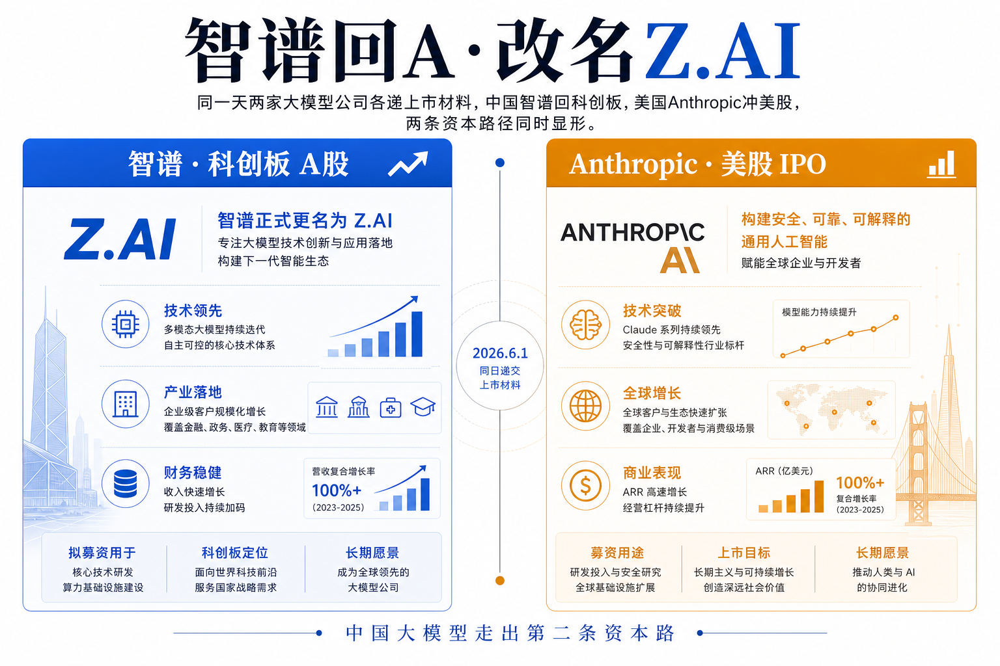

# 智谱回 A 还要改名 Z.AI：上市 5 个月再去科创板，中国大模型走出第二条资本路

同一天，6 月 1 日，地球两端各有一家大模型公司递了上市材料。在美国，Anthropic 向 SEC 秘密递交 IPO 文件，估值 9650 亿美元，年化收入 470 亿美元。在中国，智谱晚上在港交所公告：董事会决议，建议向中国监管申请发行 A 股，去上海证券交易所的科创板挂牌。一个奔向纳斯达克，一个回归科创板——两条资本路径在同一个日历格子里同时显形。

智谱这步棋的特别之处不在"上市"本身，而在于它**已经是上市公司**。1 月 8 日它刚在港交所敲钟，到现在不到 5 个月。一家公司港股 H 股还没坐热，转身又要发 A 股，这在中国大模型行业里是头一回。顺手它还干了件容易被当成花絮、其实是信号的事：把英文名从拗口的"Knowledge Atlas Technology Joint Stock Company Limited"改成"Z.AI Co., Ltd."。

## 本期看点

- **科创板（STAR Market）** —— 上交所 2019 年设立的板块，专门接硬科技公司，对未盈利企业更宽容，是中国版"给前沿科技的资本市场"。
- **A+H 两地上市** —— 同一家公司同时在内地 A 股和香港 H 股挂牌，两边股票不互通，各自定价。智谱要做的就是先 H 后 A。
- **MaaS（Model as a Service）** —— 模型即服务，把大模型能力打包成 API 卖给企业，按调用量收费，是大模型公司的主流变现方式。
- **GLM** —— 智谱自研的大模型系列（General Language Model），从 GLM-4 到最新的 GLM-5，是它对标 GPT、Gemini 的核心产品线。

## 一、公告把数字钉死了：发行 2% 到 8%，全是新股

先把硬事实摆清楚，因为摘要常把它说糊。智谱 6 月 1 日的港交所公告说的是"建议"——董事会通过决议，要去向中国证监会和上交所**申请**发 A 股，这是流程的起点不是终点，还要过年度股东会的特别决议。

发行规模公告写得很死：拟发行的 A 股数量，占发行完成后公司总股本的 **2% 到 8%**（不含超额配股权行使部分），换成绝对数就是**不少于 9,098,838 股、不多于 38,768,964 股**新 A 股。关键词是"新股"——公告明确这次全部是新股发行，**原股东不公开发售股份**。

这个细节值得停一下。原股东不减持，意味着这轮募资的钱**全部进公司账上**，而不是让早期投资人套现离场。对一家还在烧钱做基座模型的公司，这是把外部资本直接转成研发弹药，而不是给老股东开退出通道。结合外部报道的拟募资规模约 150 亿元人民币，这是一笔实打实输血给模型训练的钱。

募资净额的去向公告列了三项：**人工智能通用基座大模型、大模型 MaaS 一站式服务平台、补充流动资金**。前两项就是智谱的两条腿——一条腿练模型（基座），一条腿卖模型（MaaS 平台）。把钱直接砸向"基座+平台"，等于公开承认这两件事都还远没到自我造血、需要持续重资本投入。

## 二、刚上市 5 个月就回 A：被科创板"晾过"一次的二次进场

智谱回 A 这步，放在它自己的时间线里才看得懂分量。

它原本是想直接上科创板的。据港股招股书披露，2025 年 4 月智谱就在北京证监局开启了 A 股上市辅导备案——也就是排队等科创板。但等到 2025 年 12 月 12 日，它仍**没有收到中国证监会关于 A 股上市的任何意见或问询**。等不起的智谱掉头去了香港：2026 年 1 月 8 日在港交所敲钟，发行价每股 116.20 港元，募资约 43.5 亿港元，认购倍数高达 1159 倍，开盘市值约 528 亿港元。上市后股价一路狂飙，到 2 月 20 日市值已突破 3200 亿港元，43 天涨超 5 倍。

把这条线接上现在：先被科创板晾了 8 个月，被迫走港股；港股大获成功、市值翻几番之后，**反手再去敲科创板的门**。这次进场和上次最大的不同是——它带着一份漂亮的港股成绩单回来了。一家被资本市场用真金白银认证过、市值三千亿港元的公司，监管和市场对它的接纳度，已经不是 2025 年那个还没上市的智谱可比。

这意味着对其他大模型独角兽，智谱踩出了一条可复制的路径：**先用香港这个对未盈利科技公司更友好的市场完成首发，把估值做实，再回内地科创板拿第二轮资本**。H 股解决"能不能上"，A 股解决"在自己主场再融一笔、把估值锚在国内"。

## 三、营收 7.24 亿、净亏 31.82 亿：为什么非得两边都要钱

智谱为什么这么急着两地融资，看一眼它的财务就明白了。据其披露，**2025 年营收 7.24 亿元人民币，同比增长 131.9%；经调整净亏损 31.82 亿元**。

把这两个数字并排看：一年收入 7 亿出头，一年亏掉 31 亿——亏损是营收的四倍多。这不是经营不善，这是**前沿大模型的成本结构本身**：训练一代基座模型动辄数亿到数十亿的算力开销，而商业化收入的爬坡远跟不上训练的烧钱速度。营收翻倍听起来很猛，但 7.24 亿的盘子翻一倍也才十几亿，填不平三十多亿的窟窿。

这就是为什么智谱要在 H 股之外再开 A 股这个口子。一家年亏三十亿的公司，靠经营性现金流养不活下一代模型，资本市场就是它的命脉。港股已经融了一轮，但 GLM 系列要继续往前追 GPT 和 Gemini，需要的是持续不断的弹药补给，单一市场的一次性融资不够烧。**这也是公告里募资明确投向"基座大模型"的潜台词——钱是用来买下一轮入场券的。**

科创板的意义恰在这里。它 2019 年设立，核心使命就是给硬科技公司、尤其是还没盈利的硬科技公司一个公开融资的通道——对未盈利企业的上市标准比主板宽容得多。智谱这种"高增长、高亏损、重研发"的画像，正是科创板设计时瞄准的对象。换句话说，智谱回 A 不只是它一家的选择，也是科创板这个制度安排终于接住了一家真正意义上的前沿 AI 公司。

## 四、改名 Z.AI：一个品牌信号，不是花絮

公告里那条"改英文名"很容易被当成行政细节滑过去，但它是个明确的品牌动作。

智谱要把英文名从"Knowledge Atlas Technology Joint Stock Company Limited"改成"**Z.AI Co., Ltd.**"，并相应修订公司章程。旧名是直译"知识图谱"的产物——智谱早年的技术起点确实是知识图谱（GLM 之前的 ChatGLM 时代）。但今天再叫"Knowledge Atlas"，既绕口又过时，对一家要面向全球市场、产品已经叫"Z.ai"的公司是个拖累。

事实上智谱的国际品牌一直用"Z.ai"——港股上市时官方新闻稿标题就是"China's AGI Pioneer and Leader Z.ai Listed on Hong Kong Stock Exchange"。这次把法定英文名也统一成 Z.AI，是让"对外品牌"和"法律实体"对齐：一个字母 Z、一个 .AI 后缀，短、好记、自带 AI 标签，是为国际化和资本市场叙事服务的。

对从业者，这是个该读懂的信号：智谱不打算只做"中国的大模型公司"。改名、A+H 两地上市、官方稿用 AGI 措辞，三件事拼起来是同一个野心——做一家**全球资本市场认可的 AGI 公司**，而不是一个困在国内的国资概念股。

## 五、两条资本路：科创板 vs 纳斯达克，同一天分岔

回到开头那个巧合。6 月 1 日这天，智谱奔科创板，Anthropic 奔美股，把中美大模型的两条资本化路径摆到了同一帧画面里。

美国这条路是**超大规模私募 + 冲击纳斯达克**。Anthropic 5 月底刚融 650 亿美元、估值 9650 亿，年化收入 470 亿美元，然后秘密递交 IPO；OpenAI 也在准备秘密申报。它们的玩法是先在私募市场把估值堆到接近万亿，再去公开市场。体量是中国玩家的两个数量级——Anthropic 一年 470 亿美元收入，智谱一年 7.24 亿元人民币，差着约 450 倍。

中国这条路是**港股打底 + 科创板补强**。没有动辄千亿美元的私募盘子，靠的是 H 股完成首发、A 股回流，以及国资的深度参与（智谱港股招股阶段就拿到北京核心国资约 30 亿港元认购）。它解决的不是"如何成为万亿公司"，而是"在算力和资金都受约束的条件下，如何持续拿到烧基座模型的钱"。

这两条路没有谁对谁错，是不同资本环境下的不同最优解。但对关注这个行业的人，值得记住的判断是：**大模型的竞争已经不只是模型能力的竞争，也是融资能力的竞争**。谁能更持续、更低成本地从资本市场拿到弹药，谁就能在基座模型这场无底洞式的烧钱赛里多撑一轮。智谱回 A，本质是在中国的制度框架里，为这场持久战又找到了一个加油站。

## 对从业者意味着什么

对大模型创业者：智谱踩出了"H 股首发→科创板回流"的可复制路径。如果你的公司高增长、高亏损、重研发，不必死等科创板放行——香港市场对未盈利科技公司更友好，可以先上 H 股把估值做实，再回 A 拿第二轮。资本路径本身是一种竞争力，要和产品路线一起规划。

对投资人：把"融资能力"和"模型能力"放在同等权重去评估一家大模型公司。智谱 7.24 亿营收对 31.82 亿亏损的结构说明，这个行业短期内靠经营现金流活不下来，能不能持续从资本市场拿到钱，决定它能不能撑到模型变强、商业化爬坡的那一天。同时盯紧科创板对 AI 公司的接纳节奏——智谱若成功过会，会是后续一批大模型独角兽回 A 的风向标。

对企业采购方：智谱把募资明确投向"基座大模型 + MaaS 平台"，意味着它会持续往 GLM 和企业服务平台上加码。如果你在评估国产大模型供应商，智谱拿到 A 股这笔钱后的产品迭代速度和企业服务投入值得跟踪——一个有稳定资本输血的供应商，比一个融资链条紧张的更可能陪你走长期。

## 引用

1. 智谱：建议 A 股发行并在科创板上市（IT之家，2026-06-01）：https://www.ithome.com/0/958/444.htm
2. China's Zhipu AI Jumps in Hong Kong Debut（中国智谱 AI 港股首日大涨，财新环球，2026-01-08）：https://www.caixinglobal.com/2026-01-08/chinas-zhipu-ai-jumps-in-hong-kong-debut-102401610.html
3. AI giant Anthropic files for US IPO as investors bet big on AI future（AI 巨头 Anthropic 递交美股 IPO 文件，半岛电视台，2026-06-01）：https://www.aljazeera.com/economy/2026/6/1/ai-giant-anthropic-files-for-us-ipo-as-investors-bet-big-on-ai-future
4. China's AGI Pioneer and Leader Z.ai Listed on Hong Kong Stock Exchange（PR Newswire，2026-01-08）：https://www.prnewswire.com/news-releases/chinas-agi-pioneer-and-leader-zai-listed-on-hong-kong-stock-exchange-302656265.html
