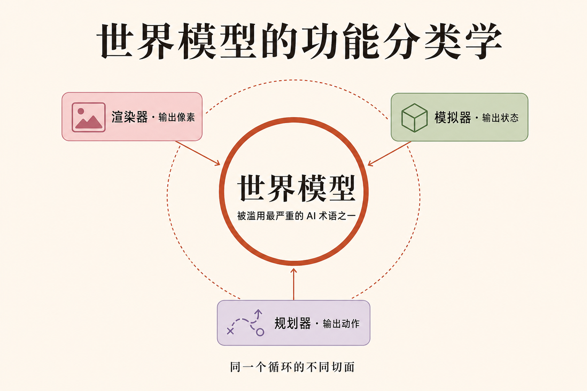

# 李飞飞给「世界模型」立规矩：它不是文生视频，是一套 POMDP 循环的不同切面

「世界模型」（world model）现在是 AI 圈最热也最糊的一个词。文生视频厂商说自己做的是世界模型，机器人公司说自己做的是世界模型，做 3D 生成的、做自动驾驶仿真的、做游戏引擎的，全都把这四个字贴在自己身上。词被用到哪里都对，结果就是用到哪里都不精确——你说「世界模型」，对方根本不知道你指的是哪一种东西。

6 月 3 日，李飞飞和她的 World Labs 团队发了一篇长文，标题叫《世界模型的功能分类学》（A Functional Taxonomy of World Models）。这不是又一篇技术发布，而是一次正名：把这个被营销稀释到失焦的词，拉回它在强化学习教科书里的原始定义，再用一套框架把市面上所有自称「世界模型」的系统归位。文章开篇引了维特根斯坦《逻辑哲学论》的第一句——「世界是所有事实的总和」——然后接了一句更狠的：「世界不是由词构成的。」（The world is not made of words.）

这句话是整篇文章的判断锚。语言模型学的是文本，世界模型学的是空间和时间。两者不是大小之分，是底料之分。这篇拆解三件事：世界模型和语言模型到底差在哪、POMDP 这个老框架为什么能给它立规矩、以及这套分类学为什么对机器人和具身智能是生死攸关的。

## 本期看点

- 李飞飞团队直接点破：「世界模型是当今 AI 里最重要、也最被滥用的术语之一。」正名的方式不是造新词，是回到强化学习里那个比所有相关技术都更古老的框架——POMDP。
- 语言模型学**文本的统计结构**，世界模型学**空间与时间的统计结构**：光怎么落在表面、一座花园从没有相机拍过的角度看是什么样、物体受力后怎么动、怎么遵守物理定律。
- 文章把市面上所有「世界模型」归成三类——**渲染器、模拟器、规划器**——并指出它们「不是根本上分离的」，而是同一个循环的不同投影（projection）。底下那套关于几何、物理、动力学的知识是共用的。
- 判断落点：模拟（simulation）是桥。「如果说语言是世界的抽象、像素是世界的投影，那么几何、物理、动力学就是世界本身。」谁掌握了模拟，谁就能往两头投——投成给人看的像素，投成给机器人执行的动作。

## 世界模型 vs 语言模型：差的不是规模，是底料

先把最基本的区分钉死。这是全文的地基。

语言模型学的是文本的统计结构。它见过海量的字词共现，于是「extraordinary command of concepts, vocabulary, and reasoning」——对概念、词汇和推理有了非凡的掌控。但它从没见过世界本身，它见过的是人类关于世界写下的话。

世界模型学的是另一种统计——空间和时间的统计结构。李飞飞团队给了一串很具体的例子：光怎么落在一个表面上；一座花园从一个**没有任何相机拍过的角度**看过去是什么样；物体受力之后怎么响应、怎么遵守物理定律。这些东西在文本里是学不到的，因为它们本来就不在文本里。你可以读一万篇关于杯子的文章，也算不出把这个杯子推一下它会往哪个方向翻。

所以这不是「语言模型再大一点就成了世界模型」的问题。文章用了一个很硬的类比收这一节：「如果说语言是世界的抽象、像素是世界的投影，那么几何、物理和动力学就是世界本身。」（If language is an abstraction of the world and pixels are a projection of it, then geometry, physics, and dynamics are the world itself.）语言在世界外面绕，世界模型要钻进世界里。

这也是为什么李飞飞把空间智能（spatial intelligence）称作「AI 的下一个前沿」。语言给了机器谈论世界的能力，世界模型是机器**理解、想象、推理并与世界交互**的路径。两件事不在一条延长线上。

## POMDP：一个比所有相关技术都老的框架

正名最关键的一步，是李飞飞团队没有自己发明一个定义，而是回到了一张「比相关技术中任何一个都更古老的图」——POMDP。

POMDP 全称是 partially observable Markov decision process，部分可观测马尔可夫决策过程。名字吓人，拆开看其实是一个很朴素的循环。它从 Sutton 和 Barto 那本强化学习经典教科书的年代就在了，是这个领域的地基。用大白话讲，它由四个零件组成：

**智能体**（agent）：可以是一个人、一个机器人、一段软件。它是那个要在世界里行动的主体。

**动作**（action）：智能体做的事。动作会改变世界的状态。

**状态**（state）：「对某一时刻世界里正在发生的一切的完整描述——每个物体、每个位置、每个速度、每个属性。」这是世界的真相，是上帝视角下的全部。

**观测**（observation）：智能体对那个真相的**部分视图**——落进眼睛的光子、传感器读数、屏幕上的像素。

这里有一个词是整套框架的命门：**部分可观测**（partially observable）。智能体永远看不到状态本身，它只能看到观测。你睁开眼，看到的不是世界的完整状态，只是从你这个角度、这一瞬间能接收到的那一小片。机器人也一样，它的摄像头给的是一帧画面，不是房间里每个物体的精确位置和速度。

把这四个零件连起来：智能体做动作 → 动作改变状态 → 状态产生观测 → 智能体根据观测再做下一个动作。「智能体到动作到状态到观测再回来——正是这个结构，给了现代『世界模型』这个词它的技术含义。」这就是世界模型的原始定义所在地。任何一个真在做世界模型的系统，都是在这个循环里啃某一段。

## 三类世界模型：同一个循环的不同投影

有了 POMDP 这把尺子，李飞飞团队把市面上所有自称世界模型的系统量了一遍，分出三类。关键在于：它们各自负责循环里的不同一段。

**渲染器**（renderer）：输出是给人眼看的像素，最看重的指标是视觉保真度。文生视频模型生成的电影感航拍、Google 的 Genie 3、World Labs 自己的 RTFM，都属于这一类。它们的命门文章说得很直白：「模型不带任何关于三维结构的显式理解。它产出的是一个观众会看到的东西，而不是事物本身。」（It produces what a viewer would see, not what is.）配的例子很形象——航拍里的楼房从空中看完美无缺，但你试着开车穿过下面那座城，它们就散架了。

**模拟器**（simulator）：输出的是状态——一个在几何、物理、动力学上都忠实的世界表示，人和程序都能在上面计算、交互。它伺候两类消费者：一类是建筑师、设计师、电影人、游戏开发者这些人类专业用户；另一类是强化学习智能体、机器人控制器、自动驾驶系统这些程序。它的要求比渲染器苛刻得多：「经得起检视的几何、尊重牛顿定律的物理、按世界该有的方式运转的动力学。」

**规划器**（planner）：输出的是动作。给它一个观测和一个目标，它回答「智能体下一步该做什么」。文章说它「在很多意义上是渲染器的逆」——视觉-语言-动作（VLA）模型、各种基于模型的系统、世界-动作模型都在这一类。

分完类，李飞飞团队立刻强调一句更重要的话：这三类**不是根本上分离的**。「同样那套关于世界如何运转的知识——几何、物理、动力学——垫在它们所有人底下。」一个能把杯子从任意角度渲染出来的模型，原则上就应该能模拟推这个杯子会发生什么，也应该能规划一只手把它拿起来。它们是同一个 POMDP 循环投在不同方向上的影子。

而且边界正在被研究者主动抹掉。文章举了 World Labs 自己的 Marble：从单个模型里同时吐出高斯泼溅（Gaussian splats，一种 3D 表示）和碰撞网格（collision mesh，物理引擎能用的几何），「溶解了渲染器和模拟器之间的边界」。逻辑终点是一个统一世界模型——一个基础模型，既能渲染照片级视图、又能产出物理精确的结构、还能规划动作序列，按下游消费者的需要切换输出形态。

## 为什么模拟是桥：机器人和具身智能的生死线

这套分类学不是文字游戏，它指向一个很实在的判断：三类里，模拟器是枢纽。

李飞飞团队的原话是：「模拟是两者之间的桥。」一个掌握了模拟的模型，能把它对世界的理解往两头投——投成给人看的像素，投成给具身智能体执行的动作预测。反过来，一个只会渲染、或只会规划的模型，两件事都做不成。这就是为什么 World Labs 把宝押在「世界本身」那一层，而不是押在最容易出 demo、最容易传播的像素层。

商业面积大得惊人。文章点名 NVIDIA 的 Omniverse，光这一个平台，英伟达估算的可寻址市场就超过一万亿美元——工厂、仓库、供应链、数字孪生。再加上机器人训练、自动驾驶测试、建筑可视化、工程、药物发现，全都依赖某种「模拟形状」的东西。

但难也难在这里。文章没有粉饰：三维数据——带显式几何、材料属性、物理标注的那种——比渲染器训练用的互联网视频稀缺好几个数量级。sim-to-real（仿真到现实）的鸿沟一直存在。AI 生成的几何还会出自相交、尺度错误这类毛病，喂给物理引擎就是一堆胡来的物理。机器人这边更是泼了冷水：「几乎所有（成果）都局限在高度受限的实验室设置里，物体集合很窄、任务时长很短。没有一个在真实部署所要求的复杂度、多变性或持续时间上被验证过。」

这才是这篇文章作为正名的分量。它不是在抢一个热词的解释权，而是在告诉所有从业者：当你说自己做「世界模型」，先想清楚你在 POMDP 循环里啃的是哪一段——渲染、模拟、还是规划。三段的难度、数据、商业价值完全不同。把文生视频的 demo 当成世界模型解决了，是把投影错认成了世界本身。

## 对从业者意味着什么

如果你在投世界模型相关的项目，或者自己在做，这篇文章给了一把可以立刻用的尺子。

下次有人跟你说「我们在做世界模型」，别接受这个标签就完事。问一句：**你输出的是像素、是状态、还是动作？** 输出像素的是渲染器，看视觉保真度，护城河是数据和算力，但它不懂三维真相；输出状态的是模拟器，最难、最贵、也最值钱，因为它能往两头投；输出动作的是规划器，是具身智能的落地端，但目前几乎都还困在实验室。三类用同一个词，融资故事可以一样动听，技术难度和成熟度差着代际。

第二，别被最会出片的那一类带偏。文生视频的航拍最容易刷屏，因为它直接给人眼喂糖。但李飞飞团队的判断很明确：真正能通向具身智能的是模拟那一层——「几何、物理、动力学就是世界本身」。如果你的目标是机器人、自动驾驶、数字孪生，渲染再炫也只是投影，你要的是底下那个能算的世界。

第三，认清现在的位置。机器人世界模型「没有一个在真实部署的复杂度上被验证过」。这意味着这个赛道现在卖的是叙事和路线，不是成品。看一个团队，与其看它的 demo 多惊艳，不如看它在三维数据、sim-to-real、几何正确性这些苦活上啃到了哪一步。

## 关键词

- **世界模型（world model）**：能理解、想象、推理并与一个语义、物理、几何、动力学上都复杂的世界交互的生成模型。被滥用成几乎任何跟 3D 或视频沾边的系统的统称，这篇文章就是来正名的。
- **POMDP（部分可观测马尔可夫决策过程）**：强化学习里的经典框架。一个由智能体、动作、状态、观测组成的循环；核心是智能体永远只能看到世界的部分视图（观测），看不到完整真相（状态）。
- **渲染器 / 模拟器 / 规划器**：世界模型的三种功能切面。分别输出像素、状态、动作，对应 POMDP 循环里的不同一段。
- **空间智能（spatial intelligence）**：李飞飞提出的概念，指机器理解和操作三维物理空间的能力，她称之为 AI 的下一个前沿。
- **sim-to-real**：仿真到现实的迁移鸿沟。在模拟里训好的模型搬到真实世界往往失效，是机器人和自动驾驶的长期硬骨头。
- **高斯泼溅（Gaussian splats）/ 碰撞网格（collision mesh）**：两种 3D 表示。前者偏视觉渲染，后者给物理引擎做碰撞计算。World Labs 的 Marble 能从一个模型同时产出两者。

## 引用

- 李飞飞推文（主信源）：https://x.com/drfeifei/status/2062247238143996275
- 《世界模型的功能分类学》（A Functional Taxonomy of World Models），World Labs 博客原文：https://www.worldlabs.ai/blog/taxonomy-of-world-models
- 李飞飞 Substack 同文：https://drfeifei.substack.com/p/a-functional-taxonomy-of-world-models
- 前作《从词语到世界：空间智能是 AI 的下一个前沿》：https://drfeifei.substack.com/p/from-words-to-worlds-spatial-intelligence

英文摘录中译对照：

> 「The world is not made of words.」——世界不是由词构成的。

> 「It produces what a viewer would see, not what is.」——它产出的是一个观众会看到的东西，而不是事物本身。

> 「If language is an abstraction of the world and pixels are a projection of it, then geometry, physics, and dynamics are the world itself.」——如果说语言是世界的抽象、像素是世界的投影，那么几何、物理、动力学就是世界本身。

> 「Language gave machines a way to talk about that world. World models are how machines will finally come to understand, imagine, reason and interact with it.」——语言给了机器谈论那个世界的方式。世界模型是机器最终去理解、想象、推理并与之交互的途径。
