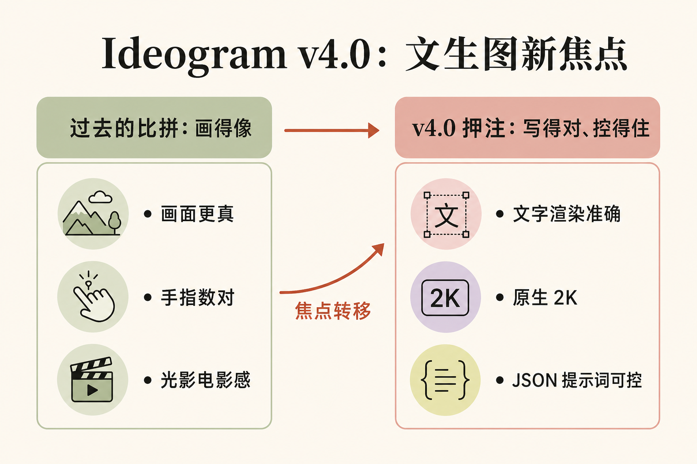

# Ideogram v4.0：当文生图开始“把字写对”和“听结构化指令”

6 月 3 日，Krea 在 X 上甩出一句话：「introducing Ideogram v4.0. 2k native resolution, excellent text rendering, and support for JSON prompts.」（隆重介绍 Ideogram v4.0。原生 2K 分辨率、出色的文字渲染、支持 JSON 提示词。）三个卖点，没有一句谈“画得更像”。

这正是值得拆的地方。过去两年，文生图的军备竞赛都在比谁的画面更真、谁的手指数得对、谁的光影更电影感。Ideogram 这家公司从一开始就没挤这条赛道——它押的是另一件被长期低估的事：把图里的字写对，以及让你能精确地指挥画面里每个元素摆在哪、用什么颜色、配什么字体。v4.0 把这条线推到了一个新位置，而且这次它还顺手开了源。

对做海报、电商详情页、品牌物料、社交配图的人来说，这两件事——文字准确 + 结构可控——恰恰是日常最痛的刚需。本期就把这两条主线讲透。

## 本期看点

- Ideogram 一贯的看家本领是“图里的字写得对”，v4.0 把它推到原生 2K，且不再靠事后放大补一道工序。
- 真正的新东西是 JSON 提示词：模型用结构化 JSON 描述训练，你可以用带坐标、配色、字体的 JSON 直接指挥版面——图开始“可编程”。
- v4.0 是 9.3B 参数的扩散 Transformer，Ideogram 第一个开放权重的文生图模型，但商用要单独授权。
- 文字渲染和结构控制，是做海报、电商、营销物料的真痛点；这两条线一起进步，改的是工作流，不只是出图质量。

## 为什么“把字写对”对 AI 这么难

先解释一个外行容易忽略的事实：让扩散模型在图里写对一行字，比让它画一只逼真的猫难得多。

原因在于扩散模型的工作方式。它不是“先想好这里要写 SALE 三个字母，再一笔一画描出来”，而是从一团噪声里同时把整张图“显影”出来。对它而言，字母只是一种特定形状的纹理——和草叶、砖缝、毛发没有本质区别。它学到的是“这一块区域看起来像有字”，而不是“这里必须是 S-A-L-E 这四个确定的字符，顺序不能错、笔画不能多”。结果就是早期文生图里那些著名的灾难：招牌上是一串扭曲的伪英文，海报标题像被水泡过的乱码，中文则直接糊成一堆“类汉字”的方块。

字越多、字体越花、语言越复杂（中文这种笔画密集的尤其），出错概率越高。这就是为什么“图里有可读文字”长期是文生图的硬骨头，也是为什么 Ideogram 把它当成立身之本——这家公司从第一代起就以“文字渲染最强”被记住。v4.0 官方继续强调这条：标牌、logo、字幕、水印、多行文本，直接从提示词高保真生成。换句话说，它不是把文字当纹理蒙混过关，而是真把“这里要写什么字”当成一等公民来处理。

## 原生 2K：少了一道工序，不只是清晰

“2k native resolution”（原生 2K 分辨率）听起来像个参数升级，但关键词是 native（原生）。

过去很多模型出高清图是两步：先在较低分辨率生成，再用一个放大模型（upscaler）把它拉到 2K。这一步会带来两个问题——放大模型有自己的“想象力”，会在拉伸时改动细节，尤其是文字，本来写对的字经过放大可能又变形；而且多一道工序就多一份时间和算力成本。Ideogram v4.0 直接在 2K 出图，省掉这道放大步骤，从推理一次性产出 2K。

对文字渲染来说这一步尤其重要：字在生成阶段就以最终分辨率被“想清楚”，不经过二次拉伸的污染，笔画更稳。对做物料的人来说，2K 意味着出来的图可以直接进印刷流程或大尺寸投放，不用再担心放大补救。模型支持 256 到 2048 像素每边的灵活分辨率，竖图、横图、方图都能直接出对应尺寸，而不是先出一张再裁。

## JSON 提示词：图开始变得“可编程”

这是 v4.0 里最该被讲透、却最容易被当成小功能略过的一条。

普通文生图的提示词是一句自然语言：“一张夏季促销海报，顶部写 SALE，背景是粉色。”模型怎么理解“顶部”、“粉色”、SALE 和背景的关系，全凭它自己猜。你改一个词，整张图可能重排，控制感几乎为零。

JSON 提示词把这件事变成了结构化指令。据技术拆解，Ideogram 4.0 训练和推理用的是同一套 JSON 描述格式：每张训练图都被拆成带样式的元素，可以带边界框（bounding box）和配色。具体来说——位置用归一化坐标（0 到 1000，原点在左上角，格式是 `[y_min, x_min, y_max, x_max]`）；配色每张图最多 16 个十六进制色、每个元素最多 5 个；文字元素则同时携带“要写的那串字面文字”加一段字体样式描述，专门服务多字体的海报排版。

把这串话翻译成人话：你不再是“描述一张图”，而是在“写一份版面规格”。标题放在画面上方这个矩形框里，用衬线粗体，砖红色；副标题放在下方那个框里，用细体；主色限定在这五个色值内。模型按这份规格出图，而不是凭感觉发挥。这就是“图变得可编程”的含义——画面从一段模糊的描述，变成一组可以逐字段调的参数。改标题文字不动版面，调一个色值不重排全图。

值得点明一个细节：Krea 那条推文写的是“support for JSON prompts”（支持 JSON 提示词），听起来像多了个可选输入框；但底层其实是模型本身就是用 JSON 描述训练出来的，结构化才是它的母语，纯文字提示反而是被一层“魔法提示”自动转成 JSON 再喂进去。这个区别决定了它的控制力上限——不是在自然语言模型外面套了个解析器，而是从训练那一刻起就理解版面结构。

## 开了源，但商用有门槛

v4.0 还有一条容易被忽略的身份转变：它是 Ideogram 第一个开放权重（open-weight）的文生图模型。

具体是一个 9.3B 参数、34 层的单流扩散 Transformer，从零训练，不是在别人模型上微调；文本编码器用的是冻结的 Qwen3-VL-8B-Instruct。权重放在 Hugging Face 上、代码在 GitHub，本地推理和研究微调可以做。但别急着高兴——权重走的是“Ideogram 4 非商用模型协议”（Non-Commercial Model Agreement），商用必须单独买授权，代码部分则是 Apache 2.0。

这是一种越来越常见的“半开源”姿态：把模型放出来给社区跑、给研究者改，赚生态和口碑；但真要拿去做生意，回到付费 API（Turbo 每张 0.03 美元、默认 0.06、高质量 0.10）或商用授权。对个人创作者和研究者，这扇门是开的；对要把它接进产品的公司，成本账还得照算。第三方基准（DesignArena）把它排在所有开放权重模型第一，质量上胜过 Midjourney v8、与 Flux 相当，但仍不及 GPT-Image-2 这类闭源顶配——也就是说，它的卖点从来不是“画质天花板”，而是“在文字和可控这两件事上，开放阵营里没有对手”。

## 对从业者意味着什么

如果你做设计、电商、营销物料，这次更新改的不是“图更好看了”，而是出图能不能进生产流程。

第一，文字准确 + 原生 2K，意味着 AI 出的图第一次有机会直接用，而不是“出个草稿再让设计师重做字”。促销海报的标题、电商主图的卖点字、logo 上的品牌名、活动 banner 的日期——这些以前 AI 一碰就糊的地方，现在有了能用的工具。把“出图”从灵感阶段往“成品阶段”推了一格。

第二，JSON 提示词意味着批量化和工程化成为可能。一张图能写成结构化规格，就能被模板化、被脚本生成。电商一万个 SKU 各出一张主图、同一套版式换文字和配色批量产出活动图、品牌物料按规范自动套版——这些过去要靠设计师一张张做或靠 PS 动作硬凑的活，现在可以用“改 JSON 字段”来跑。这才是“可编程的图”对工作流的真正冲击：图从手工艺品，变成可以被程序调用的资产。

第三，别被“开源”冲昏头。个人和研究随便用，但商用要授权、要算 API 成本。真要落地，先把这笔账算清楚，再决定是自己跑权重还是走付费接口。

文生图的竞争焦点，正在从“画得像不像”转向“字写得对不对、版面控不控得住”。Ideogram v4.0 是这个转向的一个清晰路标——它赌的不是更美的图，而是更可用的图。

## 关键词

- **文生图（text-to-image）**：输入一段文字，模型生成对应图像的技术，如 Midjourney、Flux、GPT-Image。
- **扩散模型（diffusion model）**：当前主流的图像生成方式，从随机噪声逐步“显影”出图像，而不是一笔一画地画。
- **文字渲染（text rendering）**：让生成的图里包含准确、可读的文字（而不是乱码字符）的能力。
- **原生 2K（native 2K）**：模型直接以 2K 分辨率出图，不靠事后放大模型补救。
- **JSON 提示词（JSON prompt）**：用结构化的 JSON 字段（位置、配色、字体、文本内容）描述画面，替代一句模糊的自然语言，让出图可精确控制、可批量化。
- **边界框（bounding box）**：一个矩形坐标，用来指定某个元素在画面里的位置和大小。
- **开放权重（open-weight）**：模型权重公开可下载、可本地运行，但许可证可能限制商用。

## 引用

1. Krea（@krea_ai）发布推文，2026-06-03：「introducing Ideogram v4.0. 2k native resolution, excellent text rendering, and support for JSON prompts. try it now in Krea.」（隆重介绍 Ideogram v4.0。原生 2K 分辨率、出色的文字渲染、支持 JSON 提示词。现在就在 Krea 试。）https://x.com/krea_ai/status/2062227837130887567
2. the decoder，《Ideogram 4.0 drops as an open-weight model with native 2K resolution and improved text rendering》：「improved text rendering in images, useful for logos and posters」「precise layout control via bounding boxes」「weights and code are available for download」「commercial use requires a paid license」。（图像文字渲染改进，对 logo 和海报有用；通过边界框精确控制版面；权重和代码可下载；商用需付费授权。）https://the-decoder.com/ideogram-4-0-drops-as-an-open-weight-model-with-native-2k-resolution-and-improved-text-rendering/
3. Mervin Praison，《Ideogram 4.0: 9.3B Open-Weight Image Model With 2K JSON Layout and Local Inference》：9.3B 参数、34 层单流扩散 Transformer；边界框用 0–1000 归一化坐标 `[y_min, x_min, y_max, x_max]`；每图最多 16 色、每元素最多 5 色；训练与推理用同一套 JSON 描述格式。https://mer.vin/2026/06/ideogram-4-0-9-3b-open-weight-image-model-with-2k-json-layout-and-local-inference/
4. evolink.ai，《Ideogram 4.0: What Developers Should Know》：「Ideogram 4.0 was trained on JSON captions and supports explicit composition, color palette, bounding-box layout, and typed text elements」「Ideogram has historically been strong at text rendering」。（Ideogram 4.0 用 JSON 描述训练，支持显式构图、配色、边界框版面与带类型的文本元素；Ideogram 历来以文字渲染见长。）https://evolink.ai/blog/ideogram-4-0-what-developers-should-know
