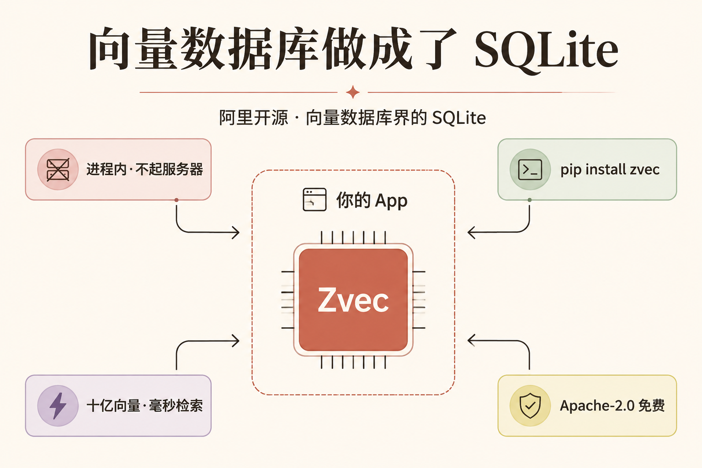
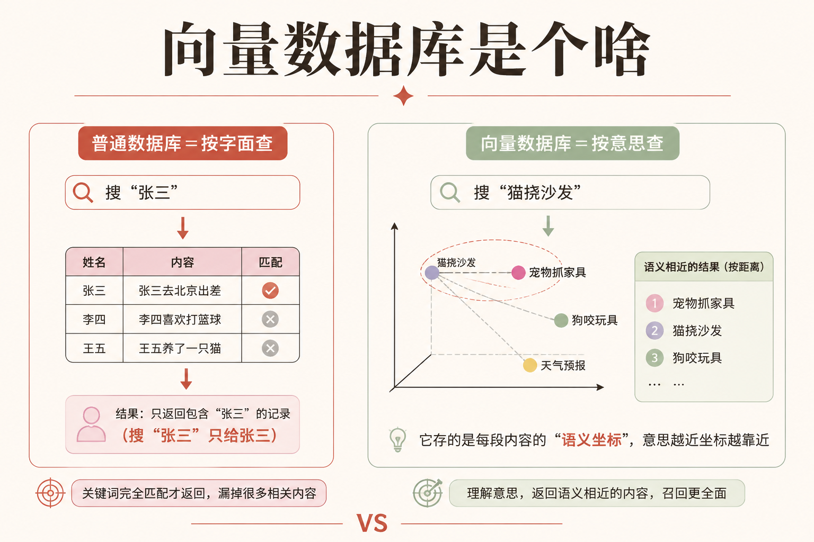
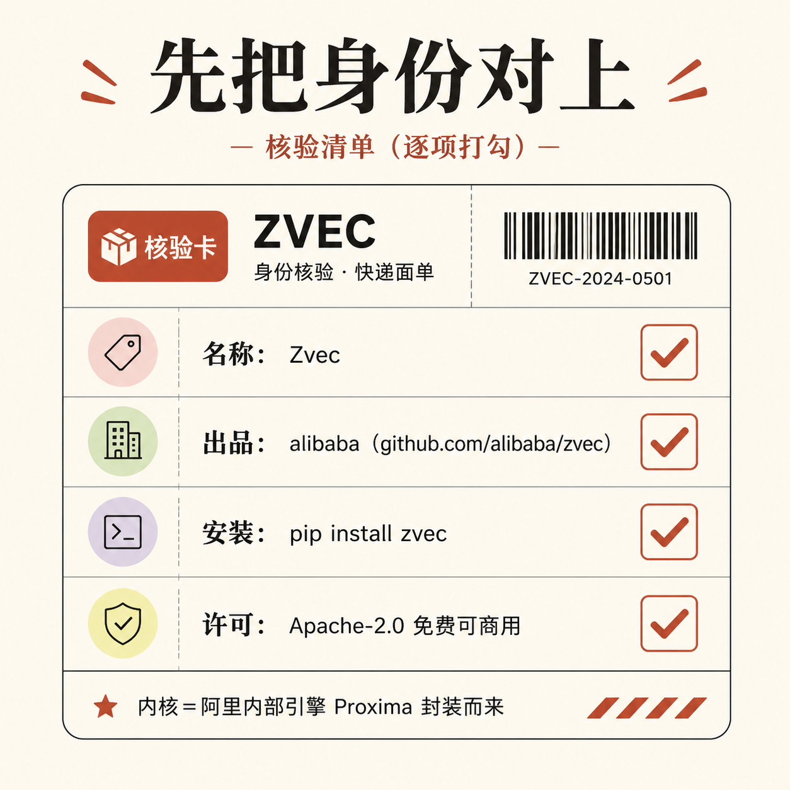
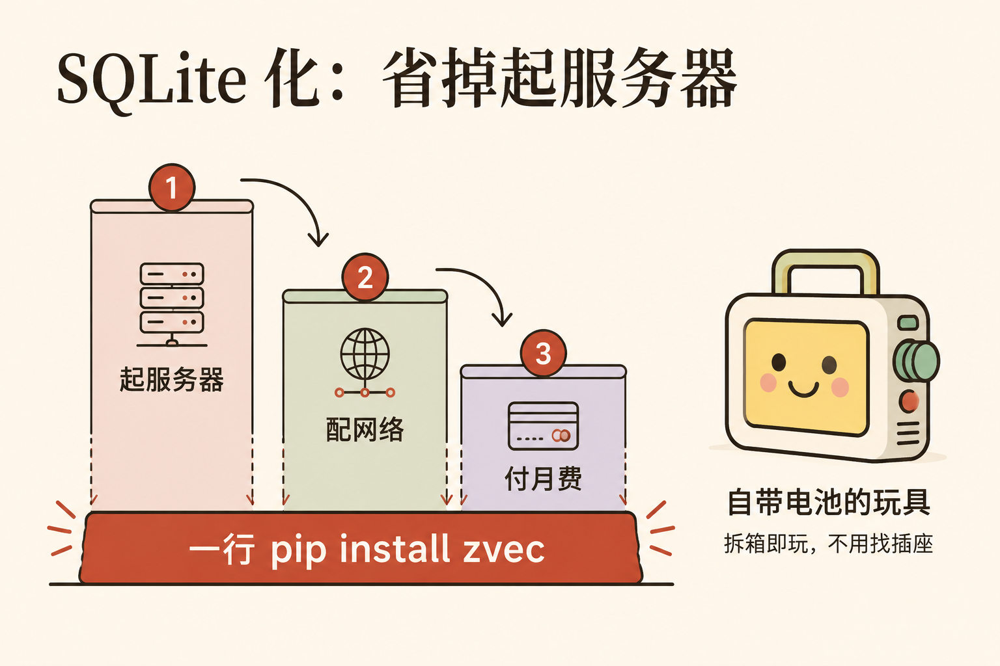
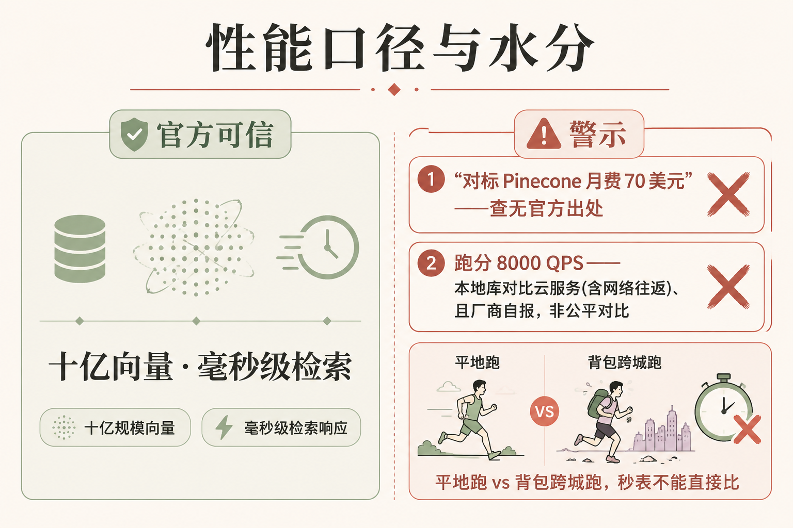
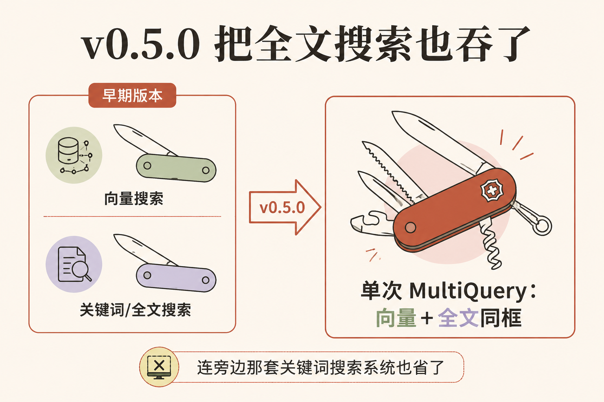
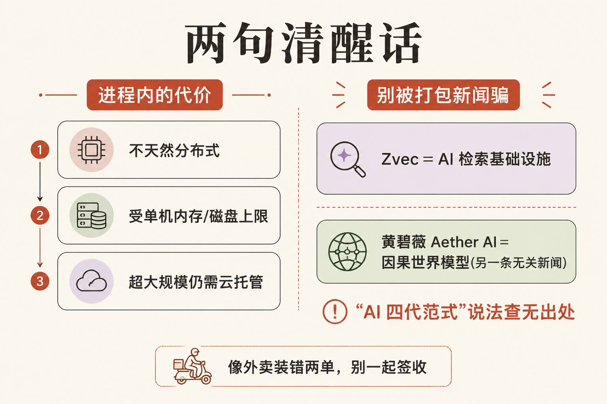

# 阿里把"向量数据库"做成了 SQLite——一行 pip 装上，省掉一台服务器

**本期关键词:进程内向量数据库 / SQLite 化 / 全文+向量混合搜索**

阿里巴巴在代码托管平台 GitHub 上开源了一个叫 **Zvec** 的东西。一句话讲它的卖点:**过去要联网、要单独开一台服务器、还要按月付费才能用的那种"向量数据库"，被阿里压缩成了一个能塞进你自己程序里、装完即用、还免费的本地小库。** 你只要敲一行 `pip install zvec`（pip 是 Python 这门编程语言装软件包的命令）就能用上。

这件事对做 AI 搜索、做"喂资料给大模型"（业内叫 RAG）的人是个实打实的省钱信号。但网上的传播里夹了几处不准的说法，这篇会一边讲清它好在哪，一边把水分挤掉。先从最基本的"向量数据库到底是个啥"讲起——不懂这个，后面都白搭。

---

## 第零步:向量数据库到底是个啥

先把这个零件讲清。普通数据库存的是"精确的东西":姓名、金额、日期，你查"张三"就只给你张三。但 AI 时代有个新需求:**按"意思"找，而不是按"字面"找。** 你搜"怎么让猫别挠沙发"，希望它也能找到"防止宠物抓家具的方法"这种字面不一样、意思很近的内容。

要做到这点，得先把每段文字（或每张图）变成一串数字——这串数字叫**向量**，可以理解成给这段内容标了个"语义坐标"。意思越近，坐标就越靠近。**向量数据库，就是专门存这些"语义坐标"、并帮你飞快找出"坐标最接近"的那几条的数据库。** 它是今天几乎所有 AI 搜索、推荐、问答系统的底座。

那它和 Zvec 的关系是什么?这就要引入一个你其实早就见过的东西——**SQLite**。你手机里几乎每个 App 都内置了一个叫 SQLite 的小数据库，它不是机房里那种要专人运维的大铁柜，而是小到直接塞进 App 里、随程序一起跑。**Zvec 想做的，就是"向量数据库界的 SQLite"。** 记住这个比喻，下面全靠它。

---

## 第一步:阿里开源的是 Zvec——先把"是谁、叫什么、哪来的"对上

传播中名字、出处容易传歪，所以先像核对**快递面单**一样，把三栏一一对上再往下读。这几条我都逐字核对过官方仓库:

- **名字:** 就叫 **Zvec**，没错。
- **出品方:** GitHub 上的仓库地址是 `github.com/alibaba/zvec`，组织名是 alibaba，确属阿里巴巴。
- **怎么装:** 官方安装命令就是 `pip install zvec`（需要 Python 3.10 到 3.14 的版本）。
- **要钱吗:** 许可证是 Apache-2.0——这是一种很宽松的开源许可，**免费，而且可以商用**。

官方对它的一句话定位是:

> "A lightweight, lightning-fast, in-process vector database."
>
> （一个轻量、极速、进程内的向量数据库。）
>
> 来源:alibaba/zvec GitHub 仓库，https://github.com/alibaba/zvec

这里有个措辞要拧准:常说的"阿里开源了内部向量数据库"，更准确的说法是——**Zvec 的内核，是阿里内部那套用了多年、经过大规模实战检验的向量检索引擎 Proxima;这次开源的，是把 Proxima 封装成了一个人人能用的产品 Zvec。** 不是把内部那套系统原样搬出来。（你可能在别处看到"Proxima 驱动了淘宝、支付宝某某功能"的说法——官方并没有点名具体是哪条业务线，稳妥起见，只说"阿里集团内部多年实战检验"。)

---

## 第二步:"SQLite 化"——它真正的狠招是不用起服务器

Zvec 最核心的价值，不是跑得多快，而是**它把"开服务器"这一步整个省掉了。** 有篇技术报道把这层意思讲得最透:

> "the SQLite of vector databases ... runs as a library inside your application and does not require any external service or daemon."
>
> （向量数据库界的 SQLite……作为一个库跑在你的应用内部，不需要任何外部服务或常驻进程。）
>
> 来源:MarkTechPost，2026-02-10，https://www.marktechpost.com/2026/02/10/alibaba-open-sources-zvec-an-embedded-vector-database-bringing-sqlite-like-simplicity-and-high-performance-on-device-rag-to-edge-applications/

"进程内"（in-process）这个词翻成人话就是:**它跑在你自己程序的肚子里，不另开一个独立的服务。** 你把它想成**自带电池的玩具 vs 要外接电源的玩具**——传统向量数据库是后者，你得先找个插座（开一台服务器）、拉根电线（配网络连接）、还要交电费（按用量付费）才能玩;Zvec 是前者，拆箱即玩。官网的原话就一句大白话:

> "Get up and running in seconds — pure local, just install and go."
>
> （几秒就能跑起来——纯本地，装完即用。）
>
> 来源:Zvec 官网，https://zvec.org/en/

对做 RAG、做搜索的人来说，这一步省掉的不只是钱，更是运维的心智负担:不用再单独维护一个数据库服务、不用担心它半夜挂了。**这就是为什么说它对个人开发者和小团队特别友好——它把一个原本"要专人伺候"的组件，变成了"一行 import"。**

---

## 第三步:十亿向量毫秒级——性能口径，和那句"对标 Pinecone"的水分

Zvec 反复强调的一个能力是"规模大、速度快"。这个口径是官方的，可信:

> "Searches billions of vectors in milliseconds."（在毫秒级时间内检索数十亿条向量。）
> "Millisecond search at billion-vector scale."（十亿向量规模下的毫秒级检索。）
>
> 来源:alibaba/zvec GitHub 与 Zvec 官网，https://github.com/alibaba/zvec

但传播里有一句话要特别小心:"对标 Pinecone，每月省下 70 美元。"（Pinecone 是最知名的云托管向量数据库之一。)**这句话有两处水分，得挤掉:**

第一，**那个"70 美元/月"，在 Zvec 的任何官方材料里都查不到出处。** 官方从没提过 Pinecone，也没给过这个价格——它是第三方博客自己脑补的对比数字。准确、且能说的，是这个方向性事实:**Zvec 走的是"本地免费库"路线，省掉的是 Pinecone、Zilliz 这类"云托管向量库"要单独起服务、按用量付费的那笔开销。** 至于具体省多少，因人而异，别引用那个没出处的数字。

第二，确实有一个跑分流传:Zvec 在某基准测试上报出 8000 多 QPS（每秒处理的查询数），是榜首云服务的两倍多。**但这是个不公平的对比**——它是"塞进程序里的本地库"对比"要联网调用的云服务"，后者的成绩里含了网络往返的时间。你把它想成**比百米成绩**:一个人在平地跑、一个人背着包跨城跑，秒表数字不能直接比。而且这些数字基本是厂商自报、缺第三方独立复测。**所以可以说"Zvec 很快"，但别拿那个跑分去"碾压 Pinecone"。**

---

## 第四步:v0.5.0 把全文搜索也吞了——连关键词检索都省一套

2026 年 6 月 12 日，Zvec 发布了 v0.5.0 版本，加了一个值得说的能力:**原生全文搜索，而且能和向量搜索在一次查询里合起来用。** 官方原话:

> "Native full-text search — attach an FTS index to any string field; Combine full-text and vector search in a single MultiQuery."
>
> （原生全文搜索——给任意文本字段挂一个全文索引;在单次 MultiQuery 查询里把全文搜索和向量搜索合起来。）
>
> 来源:alibaba/zvec GitHub，v0.5.0（2026-06-12），https://github.com/alibaba/zvec

翻成人话:过去你做一个好用的搜索，常常要**两套系统**——一套按"意思"找（向量搜索），一套按"关键词"精确命中（全文搜索，比如你搜一个确切的产品型号）。现在 Zvec 把这两把刀合进了一把。你把它想成**瑞士军刀又多开了一把刀**:本来要再单独带一把美工刀（关键词搜索系统），现在一把全干了。

这个升级的意义在于:**它把"省掉的东西"又扩大了一圈。** 前面省掉的是向量数据库的服务器，现在连旁边那套关键词搜索系统也能一并省下——对小团队来说，技术栈又简化了一截。

---

## 第五步:进程内的代价 + 别被"打包新闻"骗了

把好话说完，得讲两句清醒的。

**第一，"进程内"不是免费午餐。** 正因为它跑在你单个程序里，它**不天然支持"多台机器一起扛"**（分布式），数据量和并发能撑多大，受限于你那一台机器的内存和磁盘。这正是 SQLite 和那种大型数据库的分野:SQLite 适合塞进 App、适合中小规模;真要扛超大规模、多机高并发的线上业务，云托管的那套（Pinecone、Milvus 这类）仍有它的位置。**Zvec 是把"对的场景"做到了极简，不是"取代一切"。**

**第二，也是最该提醒的:** 这次关于 Zvec 的传播里，有一条被错误地和它捆在了一起——说 UCSD 的黄碧薇教授提出了"AI 四代范式"、还说她创立的 Aether AI 完成了融资。**这两件事和 Zvec 毫无关系，分属"AI 基础设施"和"AI 前沿研究"两个完全不同的层。** 而且其中"AI 四代范式"这个说法，在能查到的一手资料里并不存在（黄碧薇真正提的是另一套叫"四层因果脑架构"的东西，被传串了);Aether AI 那笔是 2000 万美元的种子轮融资。它们值得单独写，但不该和一个向量数据库挤在同一条新闻里。你把它想成**一份外卖装错了两单——Zvec 和因果 AI 是两个收件人，别一起签收。**

---

## 对从业者意味着什么

1. **如果你在做 RAG、搜索或推荐:** Zvec 值得放进你的"先试一下"清单——尤其是个人项目、原型、端侧（手机/浏览器里）应用，它能让你省掉一整台向量数据库服务器，开发体验从"装一套系统"降到"装一个包"。免费、可商用，试错成本极低。

2. **但选型要对场景:** 进程内库的甜点区是中小规模、单机够用、追求极简的场景。如果你的业务是超大规模、要多机高并发、要团队共享一个集中式服务，那云托管的向量库仍然该用——别因为"免费"就一刀切。

3. **看懂一个更大的规律:"SQLite 化"正在吞掉越来越多的基础设施。** 数据库、缓存、搜索、现在是向量检索——一个又一个"原本要起服务、要运维"的组件，正被压缩成"一个能塞进程序的库"。**当一项基础能力成熟到可以"装进口袋"，它的门槛就会塌到地板上，长尾的小开发者会因此第一次用得起。** 下一个被这样"SQLite 化"的会是什么，值得盯着。

4. **最后一条职业习惯:对任何"免费碾压收费"的传播，先问一句"这数字哪来的"。** 这次的"月省 70 美元""跑分两倍"都经不起追问。免费的本地轮子确实香，但把它说成"对标 Pinecone"是营销话术，不是事实判断——分清这两者，是从业者的基本功。

---

## 引用与信源

1. Zvec 官方仓库 alibaba/zvec（定位、安装、Apache-2.0、十亿向量毫秒级、v0.5.0 全文+向量混合搜索）:https://github.com/alibaba/zvec
2. Zvec 官网 zvec.org（"装完即用"、十亿向量规模毫秒检索）:https://zvec.org/en/
3. MarkTechPost:阿里开源 Zvec，"向量数据库界的 SQLite"、内核为 Proxima 引擎、QPS 跑分（2026-02-10）:https://www.marktechpost.com/2026/02/10/alibaba-open-sources-zvec-an-embedded-vector-database-bringing-sqlite-like-simplicity-and-high-performance-on-device-rag-to-edge-applications/
4. （延伸·与本文无直接关系）TheNextWeb:黄碧薇 Aether AI 完成 2000 万美元种子轮、做因果世界模型（2026-06-19）:https://thenextweb.com/news/aether-ai-causal-world-models-20m-seed-physical-ai
