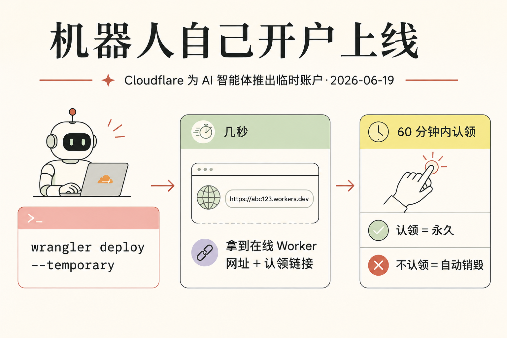
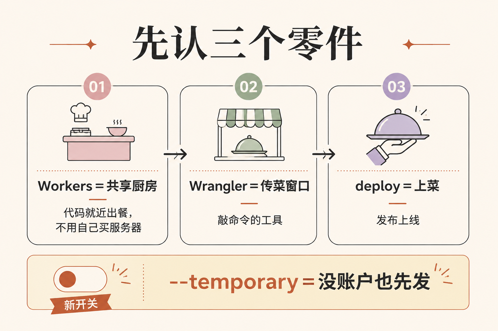
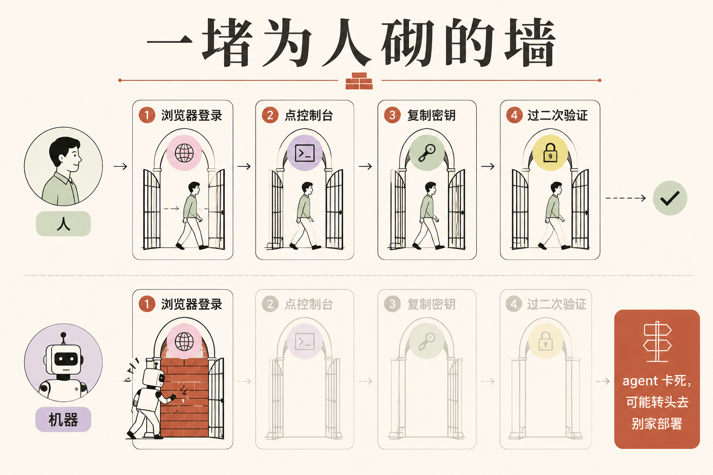
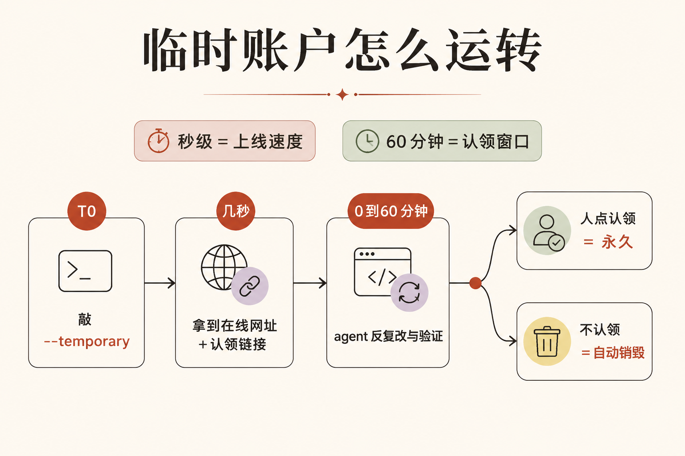
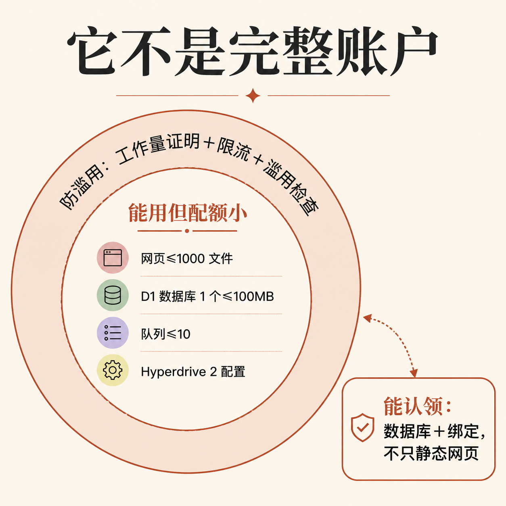
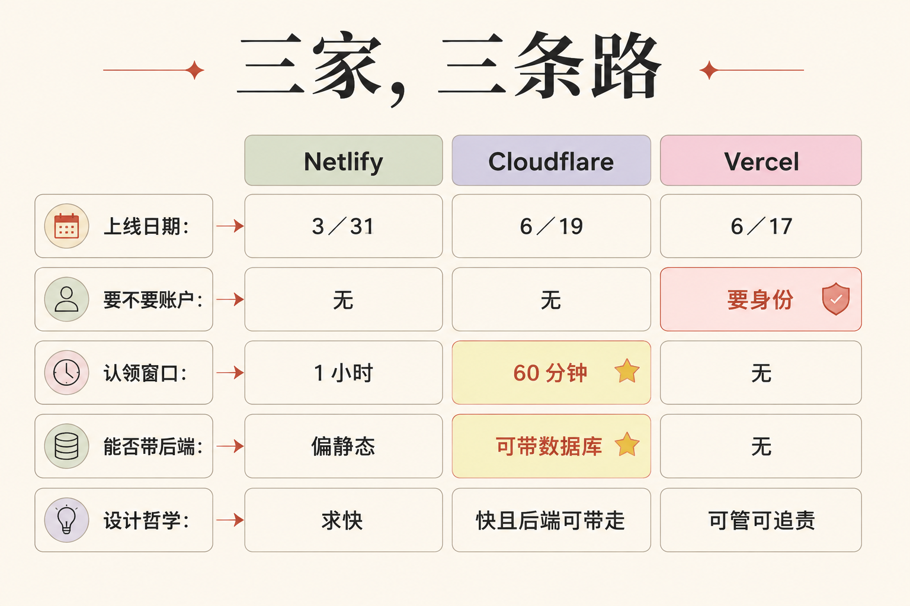
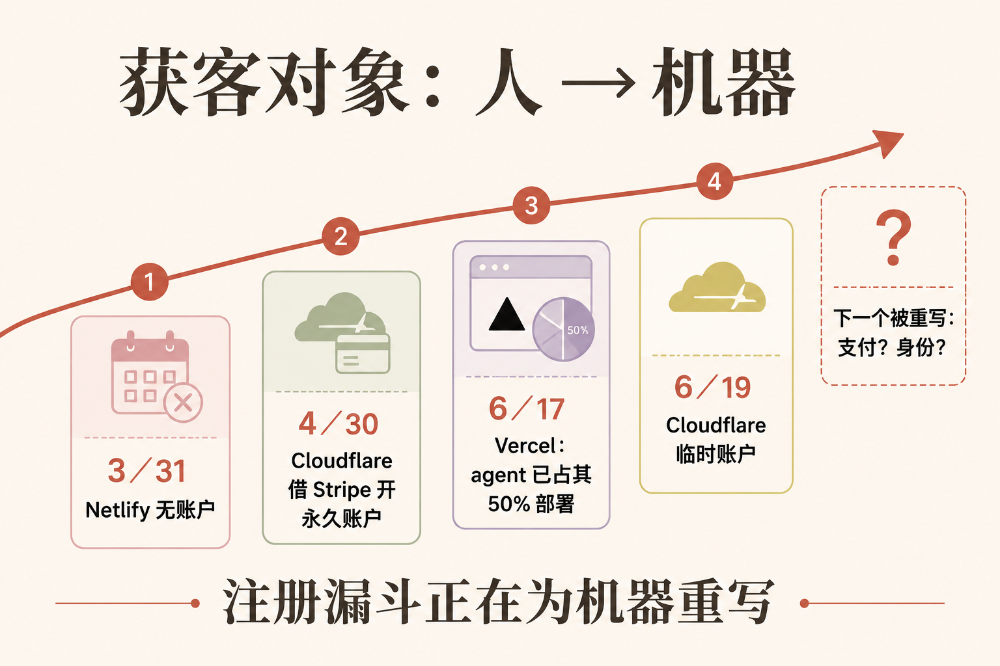

# 一句命令，机器人自己开了个账户上线——Cloudflare 把"注册门槛"为 AI 重写了

**本期关键词:临时账户 / 认领窗口（claim window）/ 无账户部署（anonymous deploy）**

2026 年 6 月 19 日，做网络服务起家的 Cloudflare 上线了一个听起来很小、其实信号很大的功能:让一个 AI 程序（业内叫"智能体 / agent"，就是能自己干活、不用你一步步盯着的软件）敲一句命令，就能凭空开一个账户、把代码发布上线，几秒钟后拿到一个真实能访问的网址。

这件事值得讲，不是因为技术多复杂，而是因为它暴露了一个正在发生的转向:**几十年来，所有软件平台的注册、登录、付费流程，都是为"人"设计的。现在，平台开始为"机器"重写这套流程了。** 它要争抢的"新用户"，第一次不是人，是 agent。

这篇我不假设你懂任何技术。读完你会明白三件事:这条命令到底干了什么、Cloudflare 为什么要这么做、以及为什么说这是一个比它看起来更重要的趋势。先把几个零件讲清楚，后面才立得住。

---

## 第零步:先把三个零件讲清——Worker、Wrangler、那句命令

要看懂这条新闻，先得知道那个 AI 到底敲了什么。三个词:

- **Workers** = 一个"共享厨房"。你不用自己买灶台、租店面（不用自己买服务器），把菜谱（你的代码）递进去，Cloudflare 全球几百个"分店"（机房）就近给你把菜做好、端给访问者。这就是 Cloudflare Workers——让你的一小段代码跑在离用户最近的地方。
- **Wrangler** = 你递菜谱用的那个"传菜窗口"。它是 Workers 官方的命令行工具（开发者敲命令用的小程序），`deploy` 就是"上菜"，也就是"发布上线"。
- **`wrangler deploy --temporary`** = 这次的主角命令。平时 `deploy` 的意思是"用我的账户发布"；这次新加了个开关 `--temporary`，意思变成"我没有账户，请临时给我开一个，让我先发出去"。

记住一句话就够:**普通发布要先有账户，这条新命令是"先发布、账户临时现开"。** 一个技术细节先摆在这:用它得把 Wrangler 升级到 4.102.0 或更新的版本，而且必须处于"登出"状态——因为它专为"手里没有凭证的 agent"准备，不能和已有账户混用。

---

## 第一步:那堵"为人砌的墙"——为什么 agent 一部署就撞墙

为什么需要这么个新命令?因为现有的注册流程，对一台机器来说几乎是死路。Cloudflare 官方博客把话说得很直白:

> "the moment an agent needs to deploy something — and needs to sign up and create an account — it slams face-first into a wall built for humans: a browser-based OAuth flow, a dashboard to click through, an API token to copy-paste, a multi-factor authentication prompt to satisfy."
>
> （当一个 agent 需要部署东西、需要注册并创建账户的那一刻，它一头撞上了一堵为人类砌的墙:基于浏览器的登录授权流程、要点来点去的控制台、要复制粘贴的密钥、还有一道要过的二次验证。）
>
> 来源:Cloudflare Blog，2026-06-19，https://blog.cloudflare.com/temporary-accounts/

你把它想成一道**只认人脸的旋转门**:你（人）走过去刷个脸就进去了;但一台没有脸、不会用鼠标点"我不是机器人"、不会切到手机看验证码的机器，会永远卡在门口。Cloudflare 自己点破了卡住的后果——也点破了它的真实动机:

> "Any auth step that needs a browser, a copy-paste, or 'click here in 60 seconds' means an agent gets stuck and may choose to deploy elsewhere."
>
> （任何需要浏览器、需要复制粘贴、或"60 秒内点这里"的验证步骤，都意味着 agent 会卡住，并可能转头去别家平台部署。）
>
> 来源:Cloudflare Blog，2026-06-19，https://blog.cloudflare.com/temporary-accounts/

"deploy elsewhere"（跑去别家部署）这半句是关键。**这意味着 Cloudflare 已经把 agent 当成一个会流失的"客户"在抢了。** 一句话总结它的目标，官方原话是:"Our goal? Let your agent code and ship."（我们的目标?让你的 agent 写代码、然后直接发出去。）

---

## 第二步:临时账户怎么运转——秒级拿号、60 分钟认领、不认领就删

Cloudflare 的解法，是"先发一个一次性账户，再让人事后认领"。整套机制就三件套，官方原话:

> "Cloudflare provisions a temporary account for the agent to use, gives Wrangler an API token to work with, and provides a claim URL that the agent can give back to the human."
>
> （Cloudflare 为该 agent 临时开一个账户，给 Wrangler 一个可用的密钥，并提供一个"认领链接"，agent 可以把这个链接交还给人类。）
>
> 来源:Cloudflare Blog，2026-06-19，https://blog.cloudflare.com/temporary-accounts/

你把它想成**酒店前台的临时房卡**:前台先发一张能立刻进房的卡（几秒钟，你的网站就在线了），但这张卡有时限;要长住，得拿着它去前台登记成你自己的名字（这就叫"认领"）。

这里有两个数字千万别混:

- **"几秒"** 指的是上线速度——敲完命令，几秒钟后你就拿到一个真实能打开的网址。
- **"60 分钟"** 指的是这个临时账户的有效窗口。官方文档写得很死:"If you do not claim the temporary preview account within 60 minutes, Cloudflare deletes it and its deployments."（如果你不在 60 分钟内认领这个临时账户，Cloudflare 会把它连同它的部署一起删除。）

而且这 60 分钟不是"发一次就完"。官方说明书写明，窗口期内 agent 可以反复折腾:"the agent can verify the Worker, redeploy changes, and return both the live Worker URL and claim URL."（agent 可以验证这个网站、重新部署改动，并把在线网址和认领链接一起返回。）**这正好对上 Cloudflare 反复强调的一句话:"Agents need a tight write → deploy → verify loop."（agent 需要一个紧凑的"写→发布→验证"闭环。）** 机器靠反复试错干活，发布一次要等半天，它的反馈回路就断了——所以必须降到秒级。

---

## 第三步:它不是完整账户——配额、防薅，和一个别人没有的东西

凭空给机器发账户，平台不怕被薅羊毛吗?这正是 Cloudflare 要走的钢丝。所以临时账户是个"缩水版":

第一，**它有防滥用的门栓。** 创建临时账户前，系统要先做一道"工作量证明"（让你的电脑算一道小难题，证明你不是在批量刷号，命令行会自动处理、只会慢一点点），外加限流和额外的滥用检查。

第二，**它能用的东西是"体验装"，配额很小。** 官方文档列了清单:静态网页文件最多 1000 个、每个不超过 5 MiB;数据库 D1 只能建 1 个、不超过 100 MB;消息队列最多 10 个;数据库加速 Hyperdrive 最多 2 套配置、10 个连接。你把它想成**商场里的体验装**:能用、能试出真实效果，但分量小、有次数限制。

但 Cloudflare 比同行多给了一样关键的东西——**它能认领的不只是一个网页，还有"后端"。** 官方原话:

> "claiming not just Workers, but resources like databases and other bindings, too."
>
> （认领的不只是 Worker（网站本身），还包括数据库、以及它连着的其他资源。）
>
> 来源:Cloudflare Blog，2026-06-19，https://blog.cloudflare.com/temporary-accounts/

这句话的分量在于:agent 在临时账户里搭的不是一个空壳网页，而是一个**带数据库、能存东西的真应用**;满意了，人去"柜台"认领正装，连试用时配好的数据库一起打包带走。还有一个安全提醒别漏——那条认领链接本身就是账户的钥匙。官方专门标了一句:"Claim URLs grant ownership of the account. Treat them as sensitive."（认领链接会授予账户所有权，请把它当敏感信息对待。）谁拿到链接，谁就拥有这个账户。

---

## 第四步:横向看——Netlify 早三个月，Vercel 反着来

很容易把这条读成"Cloudflare 首创"。事实不是。**"让 agent 无账户部署"这件事，早就有人做了，而且行业正分成针锋相对的两派。**

竞品 Netlify 早在 2026 年 3 月 31 日就上了一个几乎一模一样的功能 `--allow-anonymous`，连说辞都对得上:

> "This is especially useful for AI agents that need to create temporary projects without requiring Netlify credentials upfront. This will create the project, deploy it to a live URL, and let you claim the project within an hour."
>
> （这对那些需要创建临时项目、又不想预先提供凭证的 AI agent 尤其有用。它会创建项目、部署到一个在线网址，并允许你在一小时内认领。）
>
> 来源:Netlify Changelog，2026-03-31，https://www.netlify.com/changelog/2026-03-27-create-and-deploy-anything-netlify-clis-improved-ax/

注意:**同样是"无账户 + 秒级上线 + 一小时认领"**——这套设计语言惊人地一致，说明它是赛道共识，不是孤例。Cloudflare 比 Netlify 多迈的那一步，前面说过了:Netlify 偏"静态项目/网页"，Cloudflare 连数据库这种"有状态后端"也能临时拥有、再被认领。

而另一边，Vercel（做 Next.js 的那家云平台）走的是**完全相反**的路线。它在 6 月 17 日的发布会上没有给 agent"匿名临时账户"，而是反过来要求 agent 必须持有一张"可验证的身份证"（业内叫 OIDC / Passport），把 agent 当成一个需要实名、需要被审计的正式主体来管。

所以这三家像三种快递柜:**Netlify 和 Cloudflare 是"不用注册先存件、一小时内来认领"，Cloudflare 的柜子还能存"冷链"（带数据库的真应用）;Vercel 是"必须先实名办卡才能用柜"。** 一个求快、一个求"快且后端可带走"、一个求"可管可追责"。这不是谁对谁错，是同一个问题（agent 怎么部署）的两种价值取向。

---

## 对从业者意味着什么:获客对象，第一次从人变成了机器

把时间线连起来看就清楚了:3 月 Netlify 开了头，4 月 30 日 Cloudflare 先做了"重型版"——借支付公司 Stripe 当身份背书，让 agent 自动开"永久付费"账户、甚至买域名（同一拨作者写的，临时账户是它的轻量前置版）;6 月 17 日 Vercel 宣布 agent 已经驱动了它超过一半的部署（半年前还不到 3%）;6 月 19 日 Cloudflare 补上这块临时账户的拼图。

这条趋势线指向一个判断:**平台争抢的"新客户"，正在从人变成机器，整个注册、上线、认领的漏斗都在为机器重写。**

这对不同的人意味着不同的事:

1. **如果你在做 AI 产品或 agent:** 你的工具能不能"不靠人手点击就跑通全流程"，正在变成一条硬指标。Cloudflare 怕 agent"跑去别家"，反过来说——哪家平台让 agent 用得最顺，agent 就会把活带到哪家。这是一条新的、以机器为用户的竞争维度。

2. **如果你是普通使用者或管理者:** 记住那条认领链接等于账户钥匙。当 agent 能凭空开账户、还能附带数据库，"谁部署了什么、出了事追谁"会变成真问题——这也正是 Vercel 那一派"要可验证身份"想解决的。零门槛很爽，但零门槛和可追责，目前还在拔河。

3. **看懂这件事的真正价值，是看懂一个更大的转变:** 过去二十年，互联网产品都在琢磨"怎么让人更容易注册"（一键登录、免密、扫码）。现在，第一批产品开始琢磨"怎么让机器更容易注册"。**下一个被重写的，可能是支付、是身份、是客服。** 当你的软件用户里混进越来越多的机器人，整套"入口"都得重做一遍——这事才刚开了个头。

---

## 引用与信源

1. Cloudflare 官方博客:Temporary Cloudflare Accounts for AI agents（2026-06-19）:https://blog.cloudflare.com/temporary-accounts/
2. Cloudflare Workers 文档:Claim deployments（临时账户机制、60 分钟窗口、配额、防滥用、认领链接安全）:https://developers.cloudflare.com/workers/platform/claim-deployments/
3. Cloudflare Changelog:Temporary accounts for AI agent deployments（窗口内可反复迭代、需 Wrangler 4.102.0+）（2026-06-19）:https://developers.cloudflare.com/changelog/post/2026-06-19-temporary-accounts-for-agents/
4. Cloudflare 官方博客（同线前作）:Agents can now create Cloudflare accounts, buy domains, and deploy（2026-04-30）:https://blog.cloudflare.com/agents-stripe-projects/
5. Netlify Changelog:Create and deploy anything（`--allow-anonymous`，无账户部署 + 1 小时认领）（2026-03-31）:https://www.netlify.com/changelog/2026-03-27-create-and-deploy-anything-netlify-clis-improved-ax/
6. Vercel:面向企业与 agent 的可验证身份路线（OIDC/Passport，作为对照）（2026-06）:https://vercel.com/blog/introducing-eve
