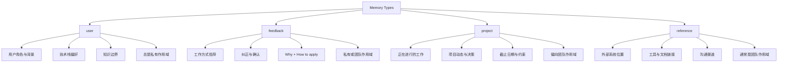

Claude Code 的记忆系统是一个精心设计的人本导向架构，其核心哲学是**只记忆那些无法从代码本身推断的信息**——用户特征、工作偏好、项目动态、外部系统引用。这套系统摒弃了传统 AI 工具"记录一切"的思路，通过明确的排除原则和分类体系，将记忆聚焦于"人"而非"代码"，从而避免信息冗余、降低存储成本，并保证记忆的有效性与时效性。

## 设计哲学：从代码可推导性到人本记忆

记忆系统的核心设计原则体现在明确的排除清单中。代码模式、架构设计、文件路径、项目结构、Git 历史、调试方案等所有可以从当前项目状态派生的信息都被系统性地排除在记忆范围之外。这种设计的理论基础是**代码可推导性**：如果某个信息可以通过阅读代码、执行 Git 命令或查看文件系统获得，那么记忆它只会造成冗余，并可能在代码变更后产生误导性的陈旧信息。真正值得记忆的是那些**隐性知识**——用户的技术背景、工作偏好、正在进行的项目计划、以及外部系统的引用位置，这些信息无法通过代码分析获得，但对理解用户意图、提供精准建议至关重要。

Sources: [memoryTypes.ts](claude-code-source/src/memdir/memoryTypes.ts#L1-L12) [memoryTypes.ts](claude-code-source/src/memdir/memoryTypes.ts#L183-L195)

## 四类记忆模型：用户、反馈、项目与引用

记忆系统定义了四种封闭的记忆类型，每种都有明确的保存时机、使用场景和结构化模板：



**user 类型**用于记录用户的角色定位、技术背景、知识边界和偏好特征。这类记忆总是私有作用域，帮助 Claude 理解"用户是谁"——例如一位有十年 Go 经验但首次接触 React 的后端工程师，或一位正在调研可观测性架构的数据科学家。这些背景信息使得 Claude 能够调整解释方式，用用户熟悉的概念类比陌生的技术领域。

**feedback 类型**记录用户对工作方式的指导，包括显式纠正（"不要这样做"）和隐式确认（"这正是我想要的"）。这类记忆支持私有和团队两种作用域：个人偏好（如"我喜欢简洁的回答，不要每次总结做了什么"）保存为私有，而项目级的通用规范（如"集成测试必须使用真实数据库，不能用 mock"）则保存为团队记忆。结构上要求包含**规则本身**、**Why（原因）** 和 **How to apply（适用场景）** 三个部分，确保未来的 Claude 能够理解规则的背景而非机械执行。

**project 类型**追踪项目级的工作动态、正在进行的任务、重要的技术决策和约束条件。这类记忆偏向团队作用域，记录"谁在做什么、为什么、什么时候完成"等信息，帮助 Claude 理解代码变更背后的业务逻辑和协调关系。这类记忆时效性强、衰减快，因此要求记录绝对日期（如将"周四"转换为"2026-03-05"）并注明决策动机。

**reference 类型**是外部系统的指针，指向代码仓库之外的资源位置——如 Linear 项目、Grafana 面板、Slack 频道、部署队列等。这类记忆帮助 Claude 快速定位外部信息源，避免用户重复说明"去哪里找什么"。

Sources: [memoryTypes.ts](claude-code-source/src/memdir/memoryTypes.ts#L14-L105) [memoryTypes.ts](claude-code-source/src/memdir/memoryTypes.ts#L113-L178)

## 智能检索机制：双模型协同的相关性判断

记忆系统采用了主模型（处理用户请求）和辅助模型（检索记忆）的协同架构。当用户发起查询时，系统会通过 `findRelevantMemories` 函数触发记忆检索流程：首先扫描记忆目录中的所有 `.md` 文件，提取文件名、描述、类型和修改时间等元数据，然后使用 Sonnet 模型（通过 `sideQuery` 机制）对这些记忆进行相关性打分，最终返回最多 5 个最相关的记忆文件路径。

检索系统的提示词设计体现了精准筛选的原则：只有在"确定会有帮助"的情况下才选择记忆，如果不确定则宁缺毋滥。系统还会排除已经使用过的工具的参考文档，避免噪音——例如当 Claude 正在使用某个 MCP 工具时，再次检索该工具的 API 文档只会干扰而非辅助。这种设计在源码中通过 `recentTools` 参数实现，检索提示词会明确标注"Recently used tools"列表，指导模型跳过这些工具的使用文档。

Sources: [findRelevantMemories.ts](claude-code-source/src/memdir/findRelevantMemories.ts#L18-L24) [findRelevantMemories.ts](claude-code-source/src/memdir/findRelevantMemories.ts#L39-L75)

## 记忆存储架构：索引文件与主题文件

记忆系统采用分层存储架构，由 `MEMORY.md` 入口文件和多个主题文件组成。`MEMORY.md` 充当索引，其行数限制为 200 行、字节限制为 25KB，用于存储记忆条目的简要描述和索引。当文件超出限制时，系统会自动截断并追加警告信息，指导用户将详细内容迁移到主题文件中。这种设计保证了入口文件的轻量性，避免每次会话都加载庞大的记忆库。

主题文件以 Markdown 格式存储，使用 frontmatter 声明记忆类型、名称和描述：

```markdown
---
name: backend-expertise
description: User has 10 years Go experience, new to React
type: user
---

When explaining frontend concepts, use backend analogies. User prefers 
understanding through familiar patterns rather than learning from scratch.
```

系统通过 `ensureMemoryDirExists` 函数确保记忆目录存在，在加载记忆提示时自动创建目录结构（如 `~/.claude/projects/<project-slug>/memory/`），这样 Claude 在保存记忆时可以直接写入而无需检查目录是否存在。

Sources: [memdir.ts](claude-code-source/src/memdir/memdir.ts#L34-L103) [memdir.ts](claude-code-source/src/memdir/memdir.ts#L116-L147)

## 记忆时效性验证：从"记得"到"验证"

记忆系统的一个重要设计是**记忆可能过时**的假设。系统明确要求 Claude 在使用记忆前进行验证：如果记忆提到了特定文件路径，需要检查文件是否存在；如果记忆提到了某个函数或标志位，需要通过 grep 确认它仍然存在。这种验证机制通过 `TRUSTING_RECALL_SECTION` 实现，标题从抽象的"信任你回忆的内容"改为更行动导向的"从记忆中推荐之前"，强调在做出决策前的验证责任。

系统还对"忽略记忆"的指令进行了特殊处理：当用户说"忽略关于 X 的记忆"时，Claude 应该完全跳过该记忆，而不是"确认后覆盖"——这意味着既不应用记忆中的事实，也不引用、比较或提及记忆内容。这种设计通过源码中的 `WHEN_TO_ACCESS_SECTION` 实现，明确禁止了"承认记忆存在但选择不遵循"的中间状态。

Sources: [memoryTypes.ts](claude-code-source/src/memdir/memoryTypes.ts#L201-L256) [memoryTypes.ts](claude-code-source/src/memdir/memoryTypes.ts#L216-L222)

## 作用域管理：私有记忆与团队记忆

记忆系统支持两种作用域：**private（私有）** 和 **team（团队）**。私有记忆存储在用户级目录（`~/.claude/projects/<slug>/memory/`），仅对当前用户可见；团队记忆存储在共享位置，对项目所有贡献者可见。user 类型记忆始终是私有的，feedback 类型根据是否为项目级规范选择作用域，project 类型偏向团队，reference 类型通常是团队记忆。

团队记忆功能通过 Feature Flag `TEAMMEM` 控制，相关的路径管理和提示词生成逻辑在 `teamMemPaths.ts` 和 `teamMemPrompts.ts` 中实现（当 Feature 启用时动态加载）。系统会在提示词中区分"Combined Mode"（私有+团队目录）和"Individual Mode"（仅单一目录），调整记忆类型说明中的作用域标注和示例格式。

Sources: [memoryTypes.ts](claude-code-source/src/memdir/memoryTypes.ts#L34-L106) [memdir.ts](claude-code-source/src/memdir/memdir.ts#L7-L9)

## 记忆管理命令：/remember 与记忆审查

系统提供了 `/memory` 命令用于手动编辑记忆文件，以及 `/remember` 技能用于审查和整理记忆层次。`/memory` 命令会打开记忆文件选择器，用户可以选择编辑私有或团队记忆文件，系统会自动创建不存在的文件并启动配置的编辑器（通过 `$EDITOR` 或 `$VISUAL` 环境变量）。

`/remember` 技能（仅在 `USER_TYPE=ant` 时可用）提供更高级的记忆整理功能：它会扫描所有记忆层次（CLAUDE.md、CLAUDE.local.md、自动记忆），识别重复、过时和冲突的条目，并提出迁移建议——例如将自动记忆中的项目规范提升到 CLAUDE.md，将个人偏好迁移到 CLAUDE.local.md，或清理已经显式记录的重复条目。这种设计帮助用户维护记忆库的整洁性，避免不同层次之间的信息冗余。

Sources: [memory.tsx](claude-code-source/src/commands/memory/memory.tsx#L14-L89) [remember.ts](claude-code-source/src/skills/bundled/remember.ts#L1-L82)

## 安全与路径验证：防范目录遍历攻击

记忆系统的路径管理包含严格的安全验证。`validateMemoryPath` 函数会拒绝以下危险路径：相对路径（可能通过 `../` 遍历父目录）、根路径或近根路径（如 `/` 或 `/a`）、Windows 驱动器根路径（如 `C:\`）、UNC 网络路径（如 `\\server\share`）以及包含空字节的路径（可能导致截断攻击）。验证通过后返回规范化路径并强制添加尾部分隔符，确保路径匹配逻辑的一致性。

系统还区分了环境变量路径（`CLAUDE_COWORK_MEMORY_PATH_OVERRIDE`，不支持波浪号扩展）和配置文件路径（`autoMemoryDirectory`，支持 `~/` 扩展），但后者仅允许从 `userSettings`、`localSettings`、`flagSettings` 和 `policySettings` 读取，明确排除了 `projectSettings`（即提交到代码仓库的 `.claude/settings.json`），防止恶意仓库通过配置文件重定向记忆目录到敏感位置（如 `~/.ssh`）并利用文件写入工具的豁免机制。

Sources: [paths.ts](claude-code-source/src/memdir/paths.ts#L109-L186) [paths.ts](claude-code-source/src/memdir/paths.ts#L170-L186)

## 记忆启用条件：多层开关与优先级链

记忆系统的启用与否通过 `isAutoMemoryEnabled` 函数决定，采用优先级链机制（第一个定义的值生效）：

1. **环境变量覆盖**：`CLAUDE_CODE_DISABLE_AUTO_MEMORY` 设置为 `1` 或 `true` 时禁用
2. **Simple 模式**：`--bare` 标志或 `CLAUDE_CODE_SIMPLE=true` 时禁用
3. **远程模式无存储**：`CLAUDE_CODE_REMOTE=true` 但未设置 `CLAUDE_CODE_REMOTE_MEMORY_DIR` 时禁用
4. **配置文件开关**：`settings.json` 中的 `autoMemoryEnabled` 字段（支持项目级退出）
5. **默认启用**：无以上情况时默认开启

这种多层开关设计允许在不同层级控制记忆功能：全局环境变量用于临时禁用，配置文件用于项目级持久化设置，远程模式的特殊处理则是为了支持无持久化存储的云环境。

Sources: [paths.ts](claude-code-source/src/memdir/paths.ts#L22-L55)

## 记忆与 CLAUDE.md 的分工协作

记忆系统与 [CLAUDE.md 编写最佳实践](23-claude-md-bian-xie-zui-jia-shi-jian) 形成互补关系。CLAUDE.md 存储项目级的静态约定和技术栈信息（如"使用 bun 而非 npm"、"API 路由使用 kebab-case"），这些信息适合提交到代码仓库，对所有贡献者可见。而记忆系统存储的是动态的、个人或团队的隐性知识——用户的背景偏好、项目的进行时状态、外部系统的引用位置。

`/remember` 技能的一个核心职责就是判断记忆条目应该属于哪个层次：如果某个自动记忆记录的是项目级约定，应该提升到 CLAUDE.md；如果是个人沟通偏好，应该迁移到 CLAUDE.local.md；如果是跨仓库的组织级知识，应该保存为团队记忆。这种分层管理避免了信息冗余，并确保每层信息的受众和更新频率匹配其性质。

Sources: [remember.ts](claude-code-source/src/skills/bundled/remember.ts#L24-L61)

## 系统架构总结

Claude Code 的记忆系统是一个深思熟虑的设计，其核心价值不在于"记住所有"，而在于"记住对的"。通过明确的分类体系、智能的检索机制、严格的时效性验证，以及与 CLAUDE.md 的分工协作，系统实现了从"代码仓库"到"人的知识库"的转变。这种设计哲学反映了 Anthropic 对 AI 助手定位的深刻理解：AI 不应该成为代码的另一个版本控制系统，而应该成为理解人、理解上下文、理解隐性知识的智能伙伴。