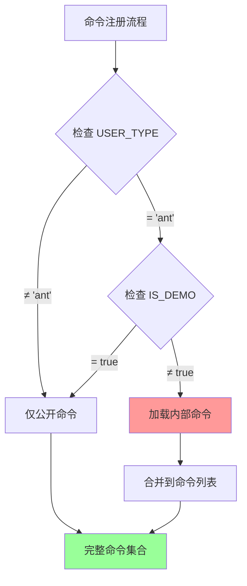
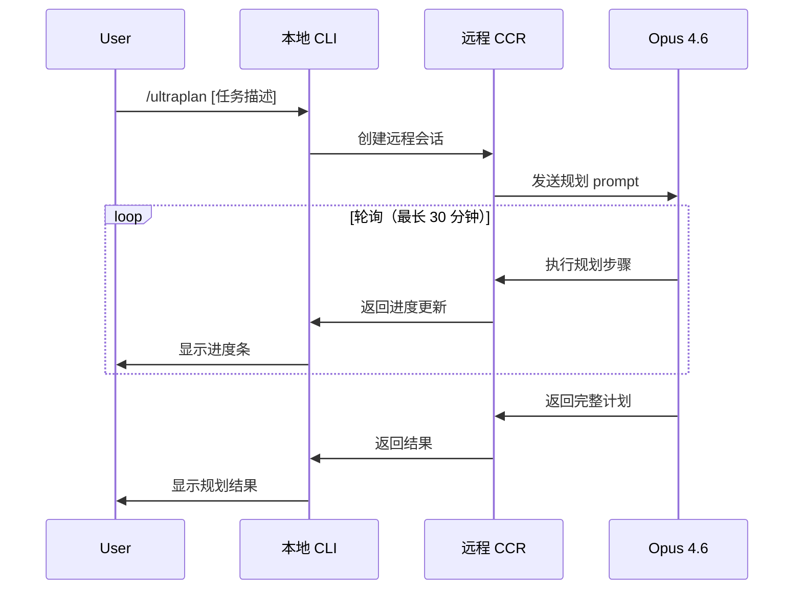

Claude Code 的命令系统包含三类不同层级的命令：公开命令、隐藏命令（通过 Feature Flags 控制）和**内部专用命令**（Anthropic 员工专属）。这些内部命令被硬编码在 `INTERNAL_ONLY_COMMANDS` 数组中，仅在满足 `USER_TYPE === 'ant' && !IS_DEMO` 条件时才会被加载到命令注册表中。在外部发布的 npm 包中，这些命令的源码会被构建工具自动移除或替换为空实现，确保外部用户无法访问。

这些内部命令主要服务于 Anthropic 内部的开发、测试、运维和质量保证流程，涵盖了故障注入、性能追踪、会话管理、自动化工作流等核心能力。它们的存在揭示了 Claude Code 作为生产级 AI Agent 平台的工程化深度——不仅是一个面向用户的工具，更是一个具备完整内部工具链的工程系统。

Sources: [commands.ts](claude-code-source/src/commands.ts#L225-L254)

## 访问控制机制

内部专用命令的访问控制采用**双重验证机制**：环境变量检查和构建时消除。运行时验证通过 `process.env.USER_TYPE === 'ant' && !process.env.IS_DEMO` 实现，这要求操作环境必须同时满足两个条件：用户类型为 Anthropic 内部员工（`ant`），且不是演示模式。这个判断逻辑在命令注册阶段执行，只有通过验证的会话才能将 `INTERNAL_ONLY_COMMANDS` 数组中的命令合并到最终命令列表中。



构建时消除则通过 TypeScript 编译器和打包工具的 dead code elimination 实现。`INTERNAL_ONLY_COMMANDS` 数组在外部构建配置中被标记为可移除代码，配合条件导入和动态 require，确保这些命令的实现代码不会出现在最终发布到 npm 的 bundle 中。这种设计既保证了内部命令的私密性，又避免了代码泄露风险。

Sources: [commands.ts](claude-code-source/src/commands.ts#L343-L346)

## 命令分类与功能概览

这 25 个内部命令按功能可划分为五大类：**调试与测试**、**会话管理**、**Git 自动化**、**系统运维**、**远程协作**。每个命令都是独立的 TypeScript 模块，遵循统一的 Command 接口定义，支持交互式和非交互式两种执行模式。

### 调试与测试类

| 命令 | 功能描述 | 使用场景 |
|------|---------|---------|
| `/bridge-kick` | Bridge 故障注入器 | 测试远程控制系统的故障恢复路径 |
| `/bughunter` | Bug 自动检测工具 | 代码质量扫描和问题定位 |
| `/perf-issue` | 性能问题诊断 | 分析会话性能瓶颈和资源消耗 |
| `/debug-tool-call` | 工具调用调试器 | 追踪单个工具的执行过程和结果 |
| `/mock-limits` | 模拟配额限制 | 测试计费系统和配额耗尽场景 |
| `/break-cache` | 缓存破坏工具 | 强制清除各类缓存以测试缓存逻辑 |
| `/ant-trace` | Anthropic 内部追踪 | 全链路性能监控和调用链追踪 |

调试类命令中最具代表性的是 `/bridge-kick`，这是一个**故障注入框架**，允许开发者手动触发 WebSocket 关闭、API 错误、认证失败等异常场景，验证 Bridge 模式的容错能力。该命令支持组合式故障注入，例如先让注册 API 失败 2 次，再触发 WebSocket 关闭代码 1002，模拟真实生产环境中的级联故障。

Sources: [bridge-kick.ts](claude-source-leaked-main/src/commands/bridge-kick.ts#L1-L201)

### 会话管理类

| 命令 | 功能描述 | 使用场景 |
|------|---------|---------|
| `/teleport` | 会话传送 | 将本地会话迁移到远程 Agent |
| `/share` | 会话分享 | 生成可分享的会话链接 |
| `/summary` | 会话摘要 | 自动生成会话内容总结 |
| `/backfill-sessions` | 会话回填 | 批量修复历史会话数据 |
| `/onboarding` | 新用户入职流程 | 内部员工首次使用的引导系统 |

会话管理命令体现了 Claude Code 的**会话迁移能力**。`/teleport` 命令可以将一个本地运行中的会话完整迁移到云端 CCR（Claude Code Remote）环境继续执行，这个过程涉及状态序列化、远程环境初始化、执行恢复等复杂步骤。这种能力使得 Anthropic 员工可以在本地启动一个任务，然后传送到云端长期运行，解放本地终端。

Sources: [hidden-configs.md](claude-source-leaked-main/practical/hidden-configs.md#L221-L236)

### Git 自动化类

| 命令 | 功能描述 | 使用场景 |
|------|---------|---------|
| `/commit` | 智能提交生成 | 根据代码变更自动生成 commit message |
| `/commit-push-pr` | 一键提交推送 PR | 自动化分支创建、提交、推送、PR 创建全流程 |
| `/autofix-pr` | PR 自动修复 | 根据代码审查意见自动修复 PR 问题 |
| `/subscribe-pr` | PR 订阅 | 监听 PR 变更并自动响应 |

Git 自动化命令中，`/commit-push-pr` 是 Anthropic 内部开发流程的核心工具。该命令自动执行五个步骤：创建特性分支、生成智能 commit message、推送到远程、创建 Pull Request、自动添加审查者。更关键的是，它会根据用户是否处于 Undercover Mode（身份隐瞒模式）调整行为——在 Undercover 模式下会隐藏 Anthropic 归属信息和 Changelog 部分，避免在公开项目中暴露员工身份。

Sources: [commit-push-pr.ts](claude-source-leaked-main/src/commands/commit-push-pr.ts#L1-L159)

### 系统运维类

| 命令 | 功能描述 | 使用场景 |
|------|---------|---------|
| `/version` | 详细版本信息 | 显示构建时间和完整版本号 |
| `/env` | 环境变量管理 | 查看/设置运行时环境变量 |
| `/reset-limits` | 重置配额限制 | 开发环境配额重置 |
| `/reset-limits-non-interactive` | 非交互式重置 | 脚本化配额管理 |
| `/init-verifiers` | 初始化验证器 | 创建自动化验证技能 |

系统运维命令主要用于开发环境配置和测试环境管理。`/init-verifiers` 命令会扫描项目结构，检测 Web 应用、CLI 工具、API 服务等不同类型的项目，自动生成对应的验证器技能（Playwright、Tmux、HTTP 测试），这是 Anthropic 内部代码质量保证体系的重要组成部分。

Sources: [init-verifiers.ts](claude-source-leaked-main/src/commands/init-verifiers.ts#L1-L263)

### 远程协作类

| 命令 | 功能描述 | 使用场景 |
|------|---------|---------|
| `/agents-platform` | Agents 平台管理 | 多智能体系统控制和监控 |
| `/ultraplan` | 超级规划器 | 复杂任务的自主规划和执行 |
| `/oauth-refresh` | OAuth 令牌刷新 | 手动刷新过期的 OAuth token |
| `/good-claude` | 模型评估系统 | 对比不同模型的输出质量 |
| `/ctx-viz` | 上下文可视化 | 图形化展示上下文构成 |

远程协作类命令代表了 Claude Code 最前沿的能力。`/ultraplan` 是一个**自主规划系统**，它会启动一个远程 CCR 会话，使用 Opus 4.6 模型进行深度推理，最长运行时间可达 30 分钟，用于规划复杂的多步骤任务。这个命令的实现涉及远程 Agent 调度、长轮询机制、OAuth 令牌管理等复杂技术栈。

Sources: [ultraplan.tsx](claude-source-leaked-main/src/commands/ultraplan.tsx#L1-L50)

## 核心命令深度解析

### `/bridge-kick`：故障注入的艺术

Bridge 模式是 Claude Code 的远程控制系统，允许用户从移动设备或 Web 界面控制本地终端。`/bridge-kick` 命令提供了精确的故障注入能力，支持 WebSocket 关闭、Poll 失败、注册失败、心跳超时等多种故障模式。每个故障模式都可以设置具体的错误码和错误类型，例如：

```bash
/bridge-kick close 1002              # 触发 WebSocket 关闭（协议错误）
/bridge-kick poll 404                # Poll 请求返回 404（网关丢失）
/bridge-kick register fail 3         # 接下来 3 次注册请求失败
/bridge-kick heartbeat 401           # 心跳返回 401（认证过期）
```

该命令的核心价值在于**测试故障恢复路径**。例如，通过组合 `/bridge-kick register fail 2` 和 `/bridge-kick close 1002`，可以模拟真实场景中的级联故障：WebSocket 关闭后触发重连，重连需要重新注册，而注册连续失败会导致会话被销毁。这种测试能力是保证 Bridge 系统可靠性的关键。

Sources: [bridge-kick.ts](claude-source-leaked-main/src/commands/bridge-kick.ts#L17-L63)

### `/commit-push-pr`：自动化工作流引擎

这个命令体现了 Claude Code 在**工作流自动化**方面的工程实践。它不仅是一个简单的 Git 命令包装器，而是一个完整的自动化引擎，包含以下智能特性：

1. **智能分支命名**：自动使用 `SAFEUSER` 或 `USER` 环境变量作为分支前缀
2. **智能提交消息**：分析所有变更（不仅是最新提交），生成符合仓库风格的 commit message
3. **PR 标题长度优化**：自动截断过长的标题，将详细信息移至 PR body
4. **归属信息注入**：根据配置自动添加 Changelog 段落和归属标签
5. **审查者自动添加**：为 Anthropic 内部项目自动添加 `anthropics/claude-code` 团队作为审查者
6. **Slack 通知集成**：如果项目配置了 Slack 频道，自动询问是否发送 PR 通知

这些特性使得 Anthropic 员工可以专注于代码本身，而将繁琐的提交流程完全自动化。更重要的是，它体现了**流程标准化**的思想——所有员工使用统一的提交规范和 PR 模板，提高了代码审查效率。

Sources: [commit-push-pr.ts](claude-source-leaked-main/src/commands/commit-push-pr.ts#L50-L159)

### `/ultraplan`：自主规划的巅峰

`/ultraplan` 是 Claude Code 中最复杂的功能之一，它代表了**AI Agent 自主规划能力**的最高水平。该命令的工作流程如下：



该命令的实现难点在于**长时间运行会话的管理**。30 分钟的超时意味着 OAuth token 可能过期，需要实现自动刷新机制；轮询机制需要处理网络中断和重连；远程环境的初始化需要同步大量上下文信息。`/ultraplan` 的存在证明了 Claude Code 已经具备了生产级的远程 Agent 调度能力。

Sources: [ultraplan.tsx](claude-source-leaked-main/src/commands/ultraplan.tsx#L11-L50)

## 构建时消除与安全性设计

内部命令的安全性不仅依赖于运行时检查，更关键的是**构建时消除**。在 TypeScript 编译阶段，打包工具会根据 `USER_TYPE` 的值决定是否包含这些命令。外部发布版本中，这些命令被替换为简单的 stub 对象：

```typescript
export default { isEnabled: () => false, isHidden: true, name: 'stub' };
```

这种设计实现了**零成本抽象**——外部用户的代码包中根本不存在这些命令的实现，即使通过某种方式绕过了运行时检查，也会因为没有实际代码而无法执行。这比单纯的权限检查更加安全，因为权限检查可能会被绕过，而代码不存在则无法被调用。

Sources: [index.js](claude-code-source/src/commands/ant-trace/index.js#L1-L2)

## 架构意义与启示

这 25 个内部命令的存在揭示了 Claude Code 的**工程化深度**。它们不是简单的内部工具，而是构成完整开发运维体系的基础设施：

1. **故障注入框架**：通过 `/bridge-kick` 实现系统的健壮性测试
2. **自动化工作流**：通过 `/commit-push-pr` 实现开发流程标准化
3. **远程 Agent 调度**：通过 `/ultraplan` 实现长时间自主任务执行
4. **质量保证体系**：通过 `/init-verifiers` 和 `/bughunter` 实现代码质量自动化

这些能力的存在说明，Claude Code 不仅是一个面向终端用户的 AI 编程助手，更是一个**经过实战检验的 AI Agent 平台**。Anthropic 内部已经建立了一套完整的工具链，用于开发、测试、部署和运维 AI Agent 系统。这套工具链的工程价值远超公开功能本身，是理解 AI Agent 工程化的最佳实践样本。

对于中国 AI 公司而言，这些内部命令的设计思路具有重要的参考价值：**不仅要开发面向用户的功能，更要建立完整的内部工具链**。只有具备完整的开发运维能力，才能构建出真正可靠的 AI Agent 产品。建议参考 [Harness Engineering：AI 产品的真正护城河](26-harness-engineering-ai-chan-pin-de-zhen-zheng-hu-cheng-he) 深入理解这一工程哲学。