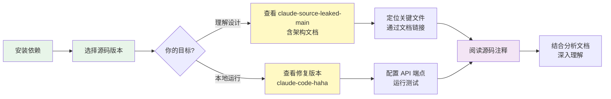

本仓库汇集了 Claude Code 源码泄露事件的完整资料库，包含原始泄露源码、深度架构分析、隐藏功能解密及工程实践指南。对于初次接触的开发者，本文档将引导你从零开始，系统性地掌握这套价值亿元的 AI 工程实践资料。

Sources: [claude-source-leaked-main/README_CN.md](claude-source-leaked-main/README_CN.md#L1-L80)

## 学习前准备：你需要掌握的基础知识

在深入源码之前，建议你具备以下基础能力，这将直接影响学习效率和深度。表中标注了不同学习路径所需的最低前置技能。

Sources: [claude-code-source/README.md](claude-code-source/README.md#L1-L142)

### 前置技能矩阵

| 技能领域 | 必备程度 | 快速应用 | 架构研究 | 成本优化 | 安全分析 |
|---------|---------|---------|---------|---------|---------|
| **TypeScript/JavaScript** | 核心 | ★★★★★ | ★★★★★ | ★★★★☆ | ★★★★☆ |
| **Node.js/Bun 运行时** | 重要 | ★★★★☆ | ★★★★☆ | ★★★☆☆ | ★★★☆☆ |
| **React 基础** | 辅助 | ★★★☆☆ | ★★★★☆ | ★★☆☆☆ | ★★☆☆☆ |
| **CLI 工具使用经验** | 核心 | ★★★★★ | ★★★☆☆ | ★★★★☆ | ★★☆☆☆ |
| **AI Agent 概念** | 重要 | ★★★☆☆ | ★★★★★ | ★★★★☆ | ★★★★☆ |
| **Git 操作** | 基础 | ★★★★☆ | ★★★☆☆ | ★★☆☆☆ | ★★★☆☆ |
| **LLM API 调用经验** | 辅助 | ★★★★☆ | ★★★★☆ | ★★★★★ | ★★★☆☆ |

如果你刚接触 TypeScript，建议先完成基础教程，重点掌握异步编程、类型系统和模块化概念。对于 AI Agent 新手，可以先阅读"[Claude Code源码泄露7小时：8大新功能/26个隐藏指令/6级安全架构](https://mp.weixin.qq.com/s/cJGWji1XeOEXgYGvIxGCtA)"这类综述文章建立整体认知。

Sources: [源码解读信息源(1).md](源码解读信息源(1).md#L1-L80)

## 仓库内容全景图

本仓库整合了两次泄露事件的完整资料，从源码本身到多层次分析文档，形成了一套立体的学习材料。下图展示了核心内容的组织结构和依赖关系。

Sources: [Claude Code 源码泄露：一份价值亿元的 AI 工程公开课.md](Claude Code 源码泄露：一份价值亿元的 AI 工程公开课.md#L1-L120)

```mermaid
graph TB
    subgraph 源码层["📦 原始源码（两层备份）"]
        S1[claude-code-source<br/>英文注释版]
        S2[claude-source-leaked-main<br/>中文分析版]
    end
    
    subgraph 架构层["🏗️ 架构解析"]
        A1[multi-agent.md<br/>多智能体协调]
        A2[tool-system.md<br/>工具系统设计]
        A3[query-lifecycle.md<br/>查询生命周期]
        A4[permission-model.md<br/>权限模型]
    end
    
    subgraph 实践层["⚙️ 实践指南"]
        P1[system-prompts.md<br/>System Prompt 完整解析]
        P2[cost-optimization.md<br/>成本优化技巧]
        P3[claude-md-guide.md<br/>CLAUDE.md 最佳实践]
        P4[hidden-configs.md<br/>隐藏配置手册]
    end
    
    subgraph 分析层["🔍 深度分析"]
        AN1[undercover-mode.md<br/>卧底模式]
        AN2[telemetry.md<br/>遥测机制]
        AN3[remote-control.md<br/>远程控制]
        AN4[hidden-features.md<br/>隐藏功能]
    end
    
    S2 --> A1 & A2 & A3 & A4
    S2 --> P1 & P2 & P3 & P4
    S2 --> AN1 & AN2 & AN3 & AN4
    
    style S1 fill:#e1f5ff
    style S2 fill:#e1f5ff
    style A1 fill:#fff4e6
    style A2 fill:#fff4e6
    style A3 fill:#fff4e6
    style A4 fill:#fff4e6
    style P1 fill:#f0f9ff
    style P2 fill:#f0f9ff
    style P3 fill:#f0f9ff
    style P4 fill:#f0f9ff
    style AN1 fill:#fef3f2
    style AN2 fill:#fef3f2
    style AN3 fill:#fef3f2
    style AN4 fill:#fef3f2
```

核心源码位于 `claude-source-leaked-main/src/` 目录，包含约 1,900 个 TypeScript 文件、13.2 万行代码。架构分析文档提供了系统性的拆解，实践指南聚焦于可操作的应用技巧，而深度分析则揭示了产品设计和工程决策背后的逻辑。

Sources: [claude-source-leaked-main/README_CN.md](claude-source-leaked-main/README_CN.md#L1-L50)

## 根据你的目标选择学习路径

不同的学习目标需要不同的切入点和学习顺序。下表为你规划了三条主流学习路径，每条路径都经过精心设计，确保知识点的连贯性和渐进性。

Sources: [claude-source-leaked-main/practical/cost-optimization.md](claude-source-leaked-main/practical/cost-optimization.md#L1-L10)

### 学习路径推荐表

| 学习目标 | 推荐顺序 | 预计时间 | 核心收获 |
|---------|---------|---------|---------|
| **🎯 快速应用：马上用起来** | 1. [仓库概览](1-cang-ku-gai-lan-claude-code-yuan-ma-xie-lu-zhi-shi-ku) 2. [CLAUDE.md 最佳实践](23-claude-md-bian-xie-zui-jia-shi-jian) 3. [成本优化十大技巧](20-cheng-ben-you-hua-shi-da-ji-qiao-yuan-ma-ji) 4. [工具系统](6-gong-ju-xi-tong-she-ji-yu-zhi-xing-liu-cheng) | 2-3小时 | 掌握配置优化、成本控制、工具使用技巧 |
| **🔬 架构研究：理解系统设计** | 1. [源码泄露事件全解析](3-yuan-ma-xie-lu-shi-jian-quan-jie-xi) 2. [System Prompt 五层优先级](9-system-prompt-wu-ceng-you-xian-ji-ti-xi) 3. [多智能体协调架构](5-duo-zhi-neng-ti-xie-diao-jia-gou) 4. [查询生命周期](7-cha-xun-sheng-ming-zhou-qi-yu-qing-qiu-chu-li) 5. [权限模型](8-quan-xian-mo-xing-yu-an-quan-ji-zhi) | 8-12小时 | 深入理解 AI Agent 系统架构设计模式 |
| **🛡️ 安全与隐私：了解风险** | 1. [Undercover Mode](30-undercover-mode-shen-fen-yin-man-xi-tong-pou-xi) 2. [遥测与数据采集](31-yao-ce-yu-shu-ju-cai-ji-ji-zhi) 3. [远程控制与紧急开关](32-yuan-cheng-kong-zhi-yu-jin-ji-kai-guan) 4. [封号机制逆向探查](33-feng-hao-ji-zhi-ni-xiang-tan-cha) | 4-6小时 | 识别 AI 工具的安全边界和数据风险 |

选择路径后，严格按照推荐顺序阅读，每个页面底部都会标注下一页的链接，形成完整的学习闭环。

Sources: [claude-code-source-analysis-leads.md](claude-code-source-analysis-leads.md#L1-L10)

## 核心概念速览：五个关键设计

在开始源码阅读前，理解以下五个核心设计理念将帮助你建立正确的认知框架。这些概念贯穿整个代码库，是理解 Claude Code 工程哲学的基石。

Sources: [claude-source-leaked-main/architecture/multi-agent.md](claude-source-leaked-main/architecture/multi-agent.md#L1-L80)

### 1. System Prompt 五层优先级

Claude Code 的 System Prompt 构建并非简单的字符串拼接，而是一个分层的优先级体系。Override 模式（优先级 0）完全替换所有内容，Coordinator 模式（优先级 1）用于多 worker 编排，Agent 定义（优先级 2）用于子代理，Custom 参数（优先级 3）通过 `--system-prompt` 传入，Default Prompt（优先级 4）是标准提示。这种设计让不同运行模式可以灵活切换而不破坏核心逻辑。

Sources: [claude-source-leaked-main/practical/system-prompts.md](claude-source-leaked-main/practical/system-prompts.md#L1-L100)

### 2. 权限分类器的双 AI 设计

在 Auto 模式下，Claude Code 实际运行着两个独立的 AI 系统：主 AI 负责执行任务，另一个权限分类器专门负责安全决策。每个操作请求都要经过历史规则匹配、低风险操作白名单、只读工具直通等检查流程，高风险操作才会弹出用户确认。这种设计将"AI 自主性"和"人类控制权"之间的张力通过工程手段显式管理。

Sources: [Claude Code 源码泄露：一份价值亿元的 AI 工程公开课.md](Claude Code 源码泄露：一份价值亿元的 AI 工程公开课.md#L60-L90)

### 3. 记忆系统："不记代码，只记人"

Claude Code 的记忆系统做出了一个反直觉的核心决策：严格区分四类记忆（用户偏好、行为反馈、项目信息、外部资源），但代码相关事实不存入持久化记忆。原因是代码会变化，记了就可能成为错误上下文；而人的偏好和判断相对稳定，值得持久化。还有一个 autoDream 服务在后台运行，类似人类的"睡眠整理"功能。

Sources: [Claude Code 源码泄露：一份价值亿元的 AI 工程公开课.md](Claude Code 源码泄露：一份价值亿元的 AI 工程公开课.md#L80-L100)

### 4. 九段式上下文压缩

当对话上下文超过阈值时，Claude Code 执行结构化压缩而非简单截断：核心请求、关键概念、文件和代码、错误和修复、解决过程、所有用户消息、待办任务、当前工作、下一步行动。九个维度缺一不可，且有一条铁律：所有用户消息必须完整保留，不得删减。AI 可以遗忘自己的输出，但不能篡改用户的意图。

Sources: [claude-source-leaked-main/practical/system-prompts.md](claude-source-leaked-main/practical/system-prompts.md#L80-L120)

### 5. Harness Engineering：工程的护城河

读完源码最震撼的发现是：Claude Code 好用，60% 靠模型能力，40% 靠 Harness 工程——工具设计、安全机制、记忆系统、上下文管理、多 Agent 协作，所有让 AI 从"能力强但不可预测"变成"能力强且可控"的系统工程。代码搜索用的不是向量数据库，而是 grep 和 ripgrep，这是"用最简单、最可靠、最可预测的工具做最关键的事"的工程哲学体现。

Sources: [Claude Code 源码泄露：一份价值亿元的 AI 工程公开课.md](Claude Code 源码泄露：一份价值亿元的 AI 工程公开课.md#L30-L60)

## 如何实际探索源码

理解概念后，动手探索是加深认知的最佳方式。本节提供具体的操作指南，从环境准备到源码定位，帮助你建立实际操作能力。

Sources: [claude-code-source/README.md](claude-code-source/README.md#L60-L100)

### 环境准备与源码浏览

首先确保本地安装了 Node.js v18+ 或 Bun 运行时。如果你想深入研读源码，推荐使用 `claude-source-leaked-main` 目录，因为它包含了详细的中文架构文档。如果你想在本地运行 Claude Code，建议克隆 [NanmiCoder/claude-code-haha](https://github.com/NanmiCoder/claude-code-haha) 这个修复版本，支持自定义 API 端点接入。

Sources: [源码解读信息源(1).md](源码解读信息源(1).md#L30-L60)

### 关键文件快速定位表

| 想了解什么 | 源码位置 | 分析文档 |
|-----------|---------|---------|
| System Prompt 构建逻辑 | `src/utils/systemPrompt.ts` | [system-prompts.md](claude-source-leaked-main/practical/system-prompts.md) |
| 工具调度与执行 | `src/tools/` 目录 | [tool-system.md](claude-source-leaked-main/architecture/tool-system.md) |
| 多智能体协调 | `src/coordinator/` 目录 | [multi-agent.md](claude-source-leaked-main/architecture/multi-agent.md) |
| 权限检查流程 | `src/tools/BashTool.ts` | [permission-model.md](claude-source-leaked-main/architecture/permission-model.md) |
| 查询生命周期 | `src/QueryEngine.ts` | [query-lifecycle.md](claude-source-leaked-main/architecture/query-lifecycle.md) |
| Feature Flags 定义 | `src/commands.ts` | [hidden-configs.md](claude-source-leaked-main/practical/hidden-configs.md) |
| 隐藏宠物系统 | `src/buddy/` 目录 | BUDDY 系统分析 |
| 卧底模式 | `src/utils/undercover.ts` | [undercover-mode.md](claude-source-leaked-main/analysis/zh/undercover-mode.md) |

阅读源码时，建议先打开对应的分析文档，理解设计意图后再深入代码细节。每个分析文档都会标注关键源码文件的行号，方便精准定位。

Sources: [claude-code-source-analysis-leads.md](claude-code-source-analysis-leads.md#L1-L20)

## 常见问题与学习建议

初次接触大型 AI 工程源码时，遇到困惑是正常的。以下是整理的高频问题及解答，帮助你避开常见的学习陷阱。

Sources: [claude-source-leaked-main/practical/claude-md-guide.md](claude-source-leaked-main/practical/claude-md-guide.md#L1-L100)

### 新手常见困惑解答表

| 困惑点 | 典型表现 | 解决建议 | 参考页面 |
|--------|---------|---------|---------|
| **不知道从哪个文件开始** | 面对近 2000 个文件无从下手 | 从 `src/main.tsx` 入口开始，沿着调用链路追踪 | [仓库结构与导航](4-cang-ku-jie-gou-yu-dao-hang-zhi-nan) |
| **源码太复杂读不懂** | 被各类工具、组件绕晕 | 先读分析文档建立框架，再对照源码看具体实现 | [架构深度解析](5-duo-zhi-neng-ti-xie-diao-jia-gou) |
| **不知道哪些功能真正有用** | 对 87 个 feature flags 感到迷茫 | 重点关注 KAIROS、COORDINATOR_MODE、BUDDY 等核心代号 | [87个隐藏 Flags](13-87ge-yin-cang-feature-flags-wan-quan-shou-ce) |
| **想本地运行但报错** | 编译失败、依赖缺失 | 使用修复版本仓库，按 README 配置 API 端点 | [源码泄露事件全解析](3-yuan-ma-xie-lu-shi-jian-quan-jie-xi) |
| **不知道如何优化成本** | Token 消耗过快、费用过高 | 阅读成本优化指南，掌握 CLAUDE.md 精简技巧 | [成本优化十大技巧](20-cheng-ben-you-hua-shi-da-ji-qiao-yuan-ma-ji) |
| **担心隐私和安全问题** | 对遥测、远程控制有顾虑 | 系统学习安全分析章节，了解数据采集边界 | [遥测与数据采集](31-yao-ce-yu-shu-ju-cai-ji-ji-zhi) |

学习大型工程源码是一个渐进过程，不必追求一次性理解所有细节。建议采用"先广后深"的策略：第一遍快速浏览核心架构和关键模块，建立整体认知；第二遍结合实际需求，深入研究特定子系统；第三遍尝试修改或扩展功能，检验理解深度。

Sources: [Claude Code 源码泄露全面剖析.md](Claude Code 源码泄露全面剖析.md#L1-L30)

## 下一步学习建议

完成本页阅读后，你已经建立了对 Claude Code 源码泄露知识库的整体认知。根据你的学习目标，建议按以下顺序继续深入学习：

**如果你是快速应用型学习者**：
1. 前往 [CLAUDE.md 编写最佳实践](23-claude-md-bian-xie-zui-jia-shi-jian)，掌握项目配置技巧
2. 阅读 [成本优化十大技巧](20-cheng-ben-you-hua-shi-da-ji-qiao-yuan-ma-ji)，学会省钱
3. 查看 [工具系统设计与执行流程](6-gong-ju-xi-tong-she-ji-yu-zhi-xing-liu-cheng)，理解工具调用机制

**如果你是架构研究型学习者**：
1. 深入 [System Prompt 五层优先级体系](9-system-prompt-wu-ceng-you-xian-ji-ti-xi)，理解提示构建逻辑
2. 研究 [多智能体协调架构](5-duo-zhi-neng-ti-xie-diao-jia-gou)，掌握 Agent 编排设计
3. 探索 [权限模型与安全机制](8-quan-xian-mo-xing-yu-an-quan-ji-zhi)，学习安全设计模式

**如果你关注安全与隐私**：
1. 阅读 [Undercover Mode：身份隐瞒系统剖析](30-undercover-mode-shen-fen-yin-man-xi-tong-pou-xi)，了解透明度问题
2. 学习 [遥测与数据采集机制](31-yao-ce-yu-shu-ju-cai-ji-ji-zhi)，识别数据边界
3. 了解 [封号机制逆向探查](33-feng-hao-ji-zhi-ni-xiang-tan-cha)，规避使用风险

无论选择哪条路径，请记住：这份源码的价值不在于复制功能，而在于学习顶级 AI 产品的工程思维和设计决策。每一次阅读，都是与 Anthropic 工程团队的一次虚拟对话。