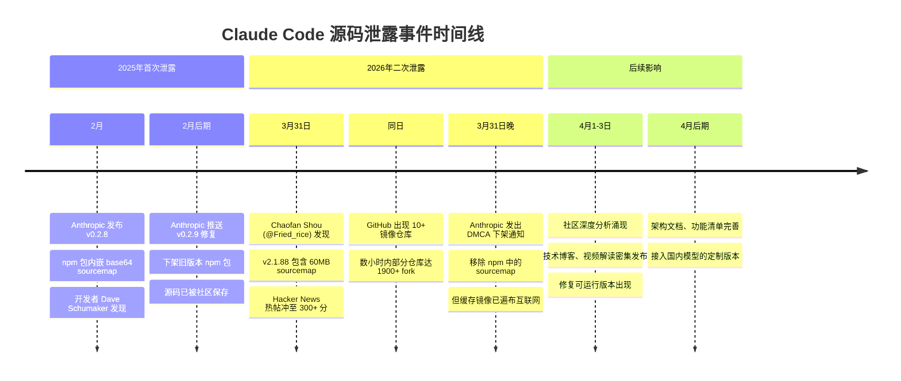
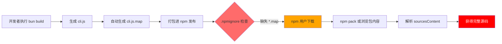
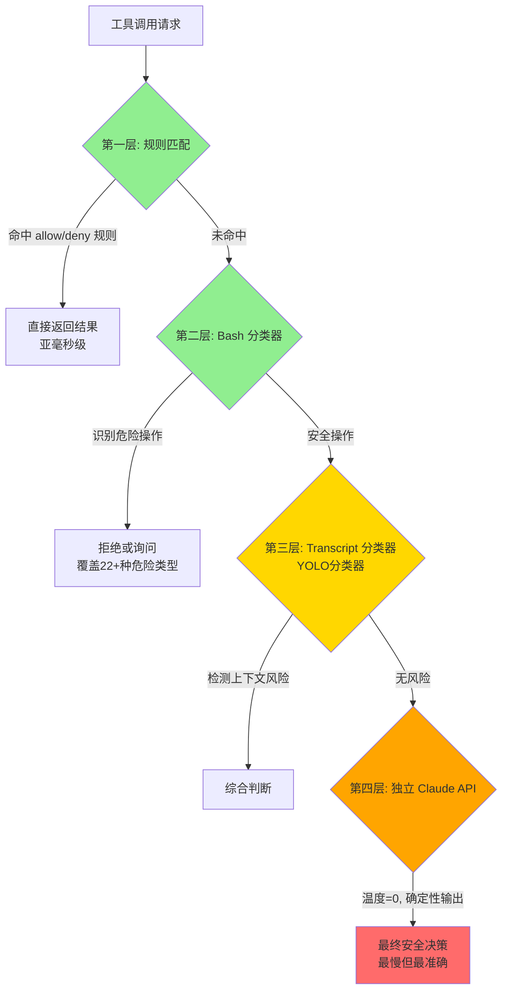

本文档全面剖析 Claude Code 源码泄露事件的完整脉络，从技术原因到行业影响，为你呈现这一 AI 工程领域最具价值的一次"意外公开课"。

## 事件时间线：两次泄露，同一个错误

Claude Code 源码泄露并非首次发生，而是经历了两次相同性质的安全疏漏。这个时间线揭示了从发现到发酵的完整过程：



**核心特征**：两次泄露相隔一年多，却源于同样的配置错误 —— 在 `.npmignore` 中忘记排除 `.map` 文件。第一次的教训未能转化为系统性的安全流程，导致历史重演。

Sources: [Claude Code's Entire Source Code Got Leaked via a Sourcemap in npm, Let's Talk About it.md](Claude Code's Entire Source Code Got Leaked via a Sourcemap in npm, Let's Talk About it.md#L1-L67)

Sources: [Claude Code 源码泄露全面剖析.md](Claude Code 源码泄露全面剖析.md#L1-L30)

## 技术原因：一个调试文件的蝴蝶效应

### Source Map 机制解析

Source Map（源映射）是 JavaScript 生态中的标准调试工具，其设计初衷是连接压缩后的生产代码与原始源码。一个典型的 `.map` 文件结构如下：

```json
{
  "version": 3,
  "sources": ["../src/main.tsx", "../src/tools/BashTool.ts", "..."],
  "sourcesContent": ["// 完整的原始源代码", "..."],
  "mappings": "AAAA,SAAS,OAAO..."
}
```

**关键问题**：`sourcesContent` 字段直接嵌入了完整的原始 TypeScript 源码，不需要任何反编译或逆向工程，只需要解析 JSON 数组即可获得所有代码。

### 泄露路径

Claude Code 使用 Bun 作为构建工具，而 Bun 的默认行为是在生产构建时生成 source map。这导致了一个简单的攻击向量：



**恢复步骤**（任何人都可以执行）：
1. `npm install @anthropic-ai/claude-code`
2. 解析 `cli.js.map` 的 `sourcesContent` 字段
3. 完成源码还原，无需任何技术门槛

Sources: [Claude Code's Entire Source Code Got Leaked via a Sourcemap in npm, Let's Talk About it.md](Claude Code's Entire Source Code Got Leaked via a Sourcemap in npm, Let's Talk About it.md#L68-L89)

Sources: [翻了翻 Claude Code 的泄露源码说几个有意思的发现.md](翻了翻 Claude Code 的泄露源码说几个有意思的发现.md#L1-L40)

## 泄露规模：51万行代码的全貌

v2.1.88 版本的泄露规模远超第一次，从多维度揭示了 Claude Code 的工程体量：

### 代码统计

| 维度 | 数据 | 说明 |
|------|------|------|
| **总文件数** | 1,902 个 | TypeScript/TSX 源文件 |
| **总代码行数** | ~512,000 行 | 不含空行和注释的统计 |
| **Source Map 大小** | 59.8 MB | 包含完整源码的 JSON 文件 |
| **编译产物** | 13 MB | 单文件 `cli.js`（所有依赖打包） |
| **核心入口** | 785 KB | `main.tsx` 文件大小 |
| **工具数量** | 40+ | 内置工具模块 |
| **命令数量** | 100+ | 斜杠命令和交互命令 |

### 关键模块体量

| 模块 | 文件大小 | 行数（估算） | 核心职责 |
|------|---------|------------|----------|
| `main.tsx` | 785 KB | ~15,000 | CLI 入口，启动初始化 |
| `query.ts` | 68 KB | ~1,700 | Agent 主循环引擎 |
| `services/api/claude.ts` | - | 3,419 | API 调用与流式处理 |
| `utils/hooks.ts` | - | 5,022 | React Hooks 逻辑 |
| `bashSecurity.ts` | - | 2,592 | Bash 命令安全检查 |

**架构特点**：整个系统编译为单文件分发，所有依赖（包括 React/Ink 渲染器）都被 bundle 进去，体现了"开箱即用"的产品哲学。

Sources: [claudecode 源码泄露快看看里面有什么.md](claudecode 源码泄露快看看里面有什么.md#L1-L30)

Sources: [Claude Code 源码泄露：一份价值亿元的 AI 工程公开课.md](Claude Code 源码泄露：一份价值亿元的 AI 工程公开课.md#L1-L30)

## 核心发现：意外揭示的工程世界

泄露的源码不仅暴露了代码，更揭示了一个精心设计的 AI Agent 工程体系。以下是几个最具代表性的发现：

### 1. 极简主义的 System Prompt

Claude Code 的自我认知定义极其简洁：

```
You are an interactive agent that helps users with software engineering tasks.
```

**仅 10 个单词**，没有冗长的人设包装，没有性格描述。相比 Cursor 的数千字系统提示词，Claude Code 选择了"少即是多"的哲学。提示词的重点放在"不要做什么"而非"做什么"，体现了 Anthropic 对 LLM 行为特性的深刻理解。

**工程细节**：系统提示词被分成静态和动态两部分，中间用 `=== SYSTEM_PROMPT_DYNAMIC_BOUNDARY ===` 分隔。静态部分可跨会话缓存，动态部分每轮更新。这个设计让 Anthropic 的 Prompt Caching 机制得以充分利用，节省大量 token 成本。

Sources: [翻了翻 Claude Code 的泄露源码说几个有意思的发现.md](翻了翻 Claude Code 的泄露源码说几个有意思的发现.md#L41-L100)

### 2. BUDDY：藏在终端里的电子宠物

在 `src/buddy/` 目录下，存在一个完整的 Tamagotchi 式虚拟宠物系统：

**系统特性**：
- **确定性抽奖**：使用 Mulberry32 PRNG，种子来自用户 ID 的哈希值加盐 `'friend-2026-401'`
- **18 个物种**：从普通到传说，覆盖 6 个稀有度等级
- **完整属性**：5 维属性（调试能力、耐心、混沌值、智慧、毒舌），6 种眼睛样式，8 种帽子选项
- **个性生成**：首次孵化时 Claude 会为每个 buddy 生成独特的"灵魂描述"

**隐藏细节**：开发者使用 `String.fromCharCode()` 对物种名进行了混淆，目的是绕过公司内部的防泄露扫描器。这体现了工程师在严格商业产品外壳下保留的创造自由。

**发布计划**：代码中引用了 2026 年 4 月 1-7 日作为预告窗口，正式发布定于 5 月。

Sources: [Claude Code's Entire Source Code Got Leaked via a Sourcemap in npm, Let's Talk About it.md](Claude Code's Entire Source Code Got Leaked via a Sourcemap in npm, Let's Talk About it.md#L90-L150)

### 3. KAIROS：常驻后台的自主助手

KAIROS 是代码中出现频率最高的 feature flag（154 次引用），代表一个持续运行的自主助手模式：

**核心能力**：
- 7×24 小时在线，持续待机
- 通过 MCP channel notifications 接收社交软件指令
- 支持 GitHub Webhook 订阅外部信号
- 与 cron、定时任务、远程控制模块深度集成
- 维护 append-only 每日日志文件
- 接收定期 `<tick>` 提示判断是否主动行动

**技术实现**：当 KAIROS 激活时，有一个特殊的 Brief 输出模式，提供极其简洁的响应，避免淹没用户的终端。系统还有 15 秒阻塞预算，任何会阻塞用户工作流超过 15 秒的主动行动都会被延迟。

Sources: [Claude Code's Entire Source Code Got Leaked via a Sourcemap in npm, Let's Talk About it.md](Claude Code's Entire Source Code Got Leaked via a Sourcemap in npm, Let's Talk About it.md#L180-L220)

### 4. Undercover Mode：身份隐瞒系统

这是泄露源码中最具争议的发现之一。当系统检测到操作者是 Anthropic 内部员工、且正在操作公开 GitHub 仓库时，会自动激活卧底模式：

**强制要求**：
- 抹除所有 AI 生成代码的痕迹
- System prompt 明确要求模型"不要暴露身份"
- 禁止在 commit 信息中包含内部代号、未发布版本号、内部工具名
- 禁止提及"Claude Code"或任何 AI 归属

**关键问题**：这个模式没有强制关闭开关。这是一个有意设计的、系统级的身份隐瞒机制，在开源社区里静默运行。Anthropic 需要给出公开解释。

Sources: [Claude Code's Entire Source Code Got Leaked via a Sourcemap in npm, Let's Talk About it.md](Claude Code's Entire Source Code Got Leaked via a Sourcemap in npm, Let's Talk About it.md#L260-L290)

Sources: [Claude Code 源码泄露：一份价值亿元的 AI 工程公开课.md](Claude Code 源码泄露：一份价值亿元的 AI 工程公开课.md#L130-L145)

### 5. "Dream" 记忆系统

Claude Code 有一个名为 autoDream 的后台记忆巩固引擎，名副其实地让 AI "做梦"：

**三重触发门控**：
- **时间门控**：距离上次梦境 24 小时
- **会话门控**：至少 5 个会话
- **锁门控**：获取巩固锁（防止并发梦境）

**四个严格阶段**：
1. **定向（Orient）**：读取 MEMORY.md，浏览现有主题文件
2. **收集信号（Gather）**：从日志、漂移记忆、转录搜索中找新信息
3. **巩固（Consolidate）**：写入或更新记忆文件，转换相对日期为绝对日期
4. **修剪索引（Prune）**：保持 MEMORY.md 在 200 行和 25KB 以内

**设计哲学**："不记代码，只记人"。代码相关的事实实时读取，不存入记忆，因为代码会变；但人的偏好和判断相对稳定，值得持久化。

Sources: [Claude Code's Entire Source Code Got Leaked via a Sourcemap in npm, Let's Talk About it.md](Claude Code's Entire Source Code Got Leaked via a Sourcemap in npm, Let's Talk About it.md#L230-L260)

### 6. 四层权限决策管道

权限系统是 Claude Code 架构中最值得学习的部分之一。Auto 模式下，每个工具调用要经过四层决策：



**设计原则**：由快到慢、由简单到复杂递进。能在前面层拦住的就不走后面，既保证安全又控制延迟。本质上是一个多层级的决策管道，远比一个 yes/no 开关复杂。

**核心洞察**：这套设计的本质是把"AI 自主性"和"人类控制权"之间的张力，用工程手段显式地管理起来。这不是安全功能，这是 AI Agent 时代的基础设施。

Sources: [Claude Code 源码泄露全面剖析.md](Claude Code 源码泄露全面剖析.md#L120-L175)

Sources: [Claude Code 源码泄露：一份价值亿元的 AI 工程公开课.md](Claude Code 源码泄露：一份价值亿元的 AI 工程公开课.md#L85-L105)

## 社区反应：从震惊到深挖

### Hacker News 热议

泄露消息在 Hacker News 上迅速发酵，帖子在数小时内冲至 300+ 分，成为当日的热门话题。讨论焦点从最初的"怎么发生的"快速转向"源码里有什么"。

**关键观察**：
- 开发者对 Claude Code 的工程实现表现出浓厚兴趣
- 安全研究人员批评 Anthropic 的配置疏漏
- 产品经理关注隐藏功能和设计哲学
- 创业者分析竞争对手的技术路线

Sources: [翻了翻 Claude Code 的泄露源码说几个有意思的发现.md](翻了翻 Claude Code 的泄露源码说几个有意思的发现.md#L1-L20)

### GitHub 镜像生态

泄露后数小时内，GitHub 上出现了十多个完整镜像仓库。部分仓库在 24 小时内积累了超过 1900 个 fork，显示出社区对源码的强烈需求。

**仓库类型分布**：

| 类型 | 代表仓库 | Stars | 特点 |
|------|---------|-------|------|
| **完整备份** | [sanbuphy/claude-code-source-code](https://github.com/sanbuphy/claude-code-source-code) | 4.2k | 中文 README，原始源码 |
| **修复可运行** | [NanmiCoder/claude-code-haha](https://github.com/NanmiCoder/claude-code-haha) | 4.2k | 修复编译错误，接入自定义 API |
| **深度分析** | [noya21th/claude-source-leaked](https://github.com/noya21th/claude-source-leaked) | 95 | 87 个 feature flags，架构图 |
| **工具修改** | [Piebald-AI/tweakcc](https://github.com/Piebald-AI/tweakcc) | - | 自定义 prompt/工具集/解锁隐藏功能 |
| **Rust 重写** | [Kuberwastaken/claurst](https://github.com/Kuberwastaken/claurst) | - | Rust 实现，性能优化 |

Sources: [源码解读信息源(1).md](源码解读信息源(1).md#L50-L100)

### DMCA 下架风波

Anthropic 迅速对多个 GitHub 仓库发出 DMCA 下架通知，并从 npm registry 移除了包含 source map 的版本。但为时已晚：

- 早期 npm 包已被多个镜像站点缓存
- 源码在社区里广泛传播
- 部分仓库通过地理分布或重复上传规避下架
- 技术社区对"版权保护 vs 学习自由"展开辩论

**行业思考**：一个低级配置错误，让 Anthropic 精心保守的工程秘密送给了全世界。这引发了关于 AI 公司源码保护策略的广泛讨论。

Sources: [Claude Code 源码泄露：一份价值亿元的 AI 工程公开课.md](Claude Code 源码泄露：一份价值亿元的 AI 工程公开课.md#L25-L35)

## 后续影响：泄露后的世界

### 技术学习的价值

这次泄露被普遍认为是"AI 工程领域最有价值的一次意外公开课"。它让所有人第一次有机会清晰看见顶级 AI 产品的工程决策：

**学到的工程原则**：
1. **用最简单的工具做最关键的事**：代码搜索用 grep/ripgrep，不是因为不懂向量数据库，而是因为这样最可靠
2. **安全从第一天就是一等公民**：四层权限流水线和熔断机制，从架构设计之初就内置
3. **记忆系统的哲学**："不记代码，只记人" —— 知道 AI 不该做什么比知道 AI 能做什么更重要
4. **上下文管理的艺术**：九段式结构化提取，所有用户消息必须完整保留

Sources: [Claude Code 源码泄露：一份价值亿元的 AI 工程公开课.md](Claude Code 源码泄露：一份价值亿元的 AI 工程公开课.md#L150-L180)

### 竞争格局的变化

源码泄露削弱了部分护城河，但核心壁垒并未动摇：

**被削弱的护城河**：
- 权限模型的具体实现
- 遥测埋点的设计思路
- 工具架构的设计逻辑
- KAIROS 的远程控制思路

**未被动摇的护城河**：
- 模型能力
- 推理成本
- 云端基础设施
- 企业级分发
- 品牌信任
- 数十万付费用户的使用习惯

**核心洞察**：这套精密的 Harness 工程，它的真正价值不是"别人抄不走的秘密"，而是"它证明了这个团队有能力把复杂的系统做对"。这种工程判断力无法从代码里复制，它沉淀在无数次正确的决策中。

Sources: [Claude Code 源码泄露：一份价值亿元的 AI 工程公开课.md](Claude Code 源码泄露：一份价值亿元的 AI 工程公开课.md#L145-L165)

### 中国开发者的机遇

泄露源码催生了多个接入国内模型的定制版本，支持 DeepSeek、Qwen、GLM、Kimi 等兼容 Anthropic API 格式的服务：

**接入方式**：通过设置 `API_BASE_URL` 环境变量指向国内模型服务商的端点，无需翻墙即可使用完整的 Claude Code 功能集。

**商业机会**：源码泄露让中国 AI 公司有机会学习顶级 AI Agent 的工程设计，缩短技术差距。但真正的挑战在于"如何做到同样水平的工程决策"，这需要团队经验的积累。

Sources: [源码解读信息源(1).md](源码解读信息源(1).md#L80-L100)

## 学习资源与推荐路径

### 快速入门

如果你刚接触这个事件，建议按以下顺序了解：

1. **5 分钟速览**：[Claude Code源码泄露7小时：8大新功能/26个隐藏指令/6级安全架构](https://mp.weixin.qq.com/s/cJGWji1XeOEXgYGvIxGCtA) —— 中文通俗解读，快速建立全局认知
2. **技术全景**：[Claude Code 源码泄露全面剖析.md](Claude Code 源码泄露全面剖析.md) —— 本文源，架构图+技术细节
3. **产品哲学**：[Claude Code 源码泄露：一份价值亿元的 AI 工程公开课.md](Claude Code 源码泄露：一份价值亿元的 AI 工程公开课.md) —— 深度分析，行业洞察

### 深度学习

如果你想深入研究源码和架构，建议访问：

- **[架构深度解析](5-duo-zhi-neng-ti-xie-diao-jia-gou)**：多智能体协调架构、工具系统设计、权限模型等核心技术
- **[隐藏功能揭秘](13-87ge-yin-cang-feature-flags-wan-quan-shou-ce)**：87 个 feature flags、15 个隐藏命令、25 个内部专用命令
- **[工程实践指南](20-cheng-ben-you-hua-shi-da-ji-qiao-yuan-ma-ji)**：成本优化、CLAUDE.md 最佳实践、System Prompt 定制

### 动手实践

如果你想本地运行源码或接入自定义模型：

- **[NanmiCoder/claude-code-haha](https://github.com/NanmiCoder/claude-code-haha)**：中文 README，修复可运行，接入任意兼容 API
- **[claude-code-best/claude-code](https://github.com/claude-code-best/claude-code)**：原汁原味，Bun 编译，TS 类型全修复
- **[cfrs2005/claude-init](https://github.com/cfrs2005/claude-init)**：中文开发套件，集成 MCP/安全扫描，免翻墙

Sources: [源码解读信息源(1).md](源码解读信息源(1).md#L10-L50)

## 结语

这次源码泄露事件揭示了 AI Agent 时代的一个核心真相：**模型会越来越强，差距会越来越小；但那套让模型变得"可靠、可预测、可信任"的工程体系，才是真正的护城河。**

一个低级的配置错误，意外打开了一扇窗。但窗子打开了，不代表你就看见了什么。你需要带着问题去看 —— 你在做的 AI 产品，Harness 工程做到几分了？