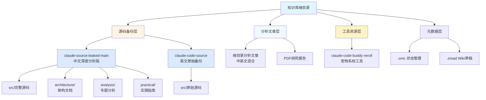

本页面为您提供 Claude Code 源码泄露知识库的完整导航地图。作为一个整合了源码备份、深度分析和实践指南的综合性知识库，理解仓库的组织结构将帮助您快速定位所需信息，并根据自身需求选择最优学习路径。本文档适用于初次接触本仓库的开发者，无论您是想快速了解泄露事件、深入研究架构设计，还是动手实践运行源码，都能在此找到清晰的导航指引。

Sources: [README_CN.md](claude-source-leaked-main/README_CN.md#L1-L20), [README.md](claude-code-source/README.md#L1-L30)

## 仓库整体架构

本仓库采用层次化组织结构，将**原始源码**、**深度分析**和**实践指南**三大类内容有机结合。通过以下架构图，您可以快速理解各模块间的逻辑关系：



仓库的核心价值在于提供了**双版本源码备份**与**多层次分析文档**的完整知识体系。`claude-source-leaked-main` 目录作为中文深度分析版，不仅包含完整的泄露源码，还配有系统化的架构拆解、隐藏功能手册和实践指南；而 `claude-code-source` 则保留了英文原始备份，适合对照研究。根目录下的多篇分析文章提供了不同视角的技术解读，从快速入门到深度剖析，满足不同层次学习者的需求。

Sources: [README_CN.md](claude-source-leaked-main/README_CN.md#L21-L50), [源码解读信息源(1).md](源码解读信息源(1).md#L1-L50)

## 核心目录详解

### 源码备份目录对比

本仓库提供两个版本的源码备份，各有侧重，适合不同使用场景：

| 目录 | 主要特点 | 分析深度 | 语言支持 | 适用场景 |
|------|---------|---------|---------|---------|
| **claude-source-leaked-main** | 完整分析体系 + 源码 | 系统化架构拆解、隐藏功能挖掘、实践指南 | 中英文双语 | **初学者首选**、系统性学习、架构研究 |
| **claude-code-source** | 原始备份 + 英文分析 | 英文发现报告、快速概览 | 英文 | 原始性研究、跨版本对照、国际协作 |

**claude-source-leaked-main** 是本仓库的**核心学习资源**，其内部结构按照 Diátaxis 文档方法论组织：

```text
claude-source-leaked-main/
├── src/                    # 1,884个TypeScript源文件（v2.1.88完整泄露）
│   ├── main.tsx           # 主入口文件（785KB）
│   ├── QueryEngine.ts     # 核心查询引擎
│   ├── tools/             # 40+内置工具
│   ├── coordinator/       # 多智能体协调系统
│   ├── services/          # 后台服务（MCP/OAuth/记忆/梦境）
│   └── buddy/             # 宠物系统
├── architecture/          # 架构深度解析（4个核心主题）
│   ├── multi-agent.md     # 多智能体协调架构
│   ├── tool-system.md     # 工具系统设计
│   ├── query-lifecycle.md # 查询生命周期
│   └── permission-model.md # 权限模型
├── analysis/              # 专题分析（中英文双语）
│   ├── zh/               # 中文分析
│   └── en/               # 英文分析
└── practical/            # 实践指南
    ├── hidden-configs.md # 87个隐藏Feature Flags
    ├── system-prompts.md # System Prompt完整还原
    ├── cost-optimization.md # 省钱指南
    └── claude-md-guide.md # CLAUDE.md编写最佳实践
```

**architecture/** 目录采用**系统架构视角**，逐层拆解 Claude Code 的核心设计：从多智能体协调到工具系统，从查询生命周期到权限模型，每个文档都配有 Mermaid 流程图和代码引用。**practical/** 目录则聚焦**工程实践**，提供可操作的优化技巧、配置指南和隐藏功能解锁方法，特别适合希望降低成本、提升效率的实战开发者。

Sources: [README_CN.md](claude-source-leaked-main/README_CN.md#L51-L120), [tool-system.md](claude-source-leaked-main/architecture/tool-system.md#L1-L30)

### 根目录分析文章概览

根目录下汇集了来自不同作者、不同视角的分析文章，这些文章具有**独立参考价值**，可作为快速入门或专题深入学习的补充材料：

**快速入门类文章**（建议优先阅读）：
- `Claude Code 源码泄露全面剖析.md` - 全景式介绍泄露事件与技术要点
- `claudecode 源码泄露快看看里面有什么.md` - 通俗解读，适合初学者
- `Claude Code 源码泄露：一份价值亿元的 AI 工程公开课.md` - 工程价值视角

**架构深度类文章**：
- `Claude Code 源码架构解析从启动Prompt 到权限管道.md` - 完整技术链路分析
- `claudecode架构全解密.md` - 架构模式总结
- `Claude Code 遭深度逆向！核心技术架构被 95% 还原.md` - 逆向工程视角

**产品设计哲学类文章**：
- `从Claude Code源码看Anthropic的产品野心.md` - 产品战略分析
- `How should Chinese AI companies "learn from Claude Code".md` - 本土化启示
- `Harness Engineering：AI 产品的真正护城河.md` - 工程壁垒思考

这些文章虽来自不同作者，但都基于同样的泄露源码进行分析，形成了**多维度、多视角**的知识拼图。建议在阅读本仓库系统化文档的基础上，通过这些文章补充不同作者的独特洞察。

Sources: [源码解读信息源(1).md](源码解读信息源(1).md#L51-L100), [claude-code-source-analysis-leads.md](claude-code-source-analysis-leads.md#L1-L50)

## 按需导航路径

根据您的学习目标和时间预算，推荐以下导航路径。每条路径都经过精心设计，确保知识获取的连贯性和效率：

### 路径一：快速了解（30分钟）

适用于希望在短时间内掌握泄露事件概况和核心发现的读者。

**推荐阅读顺序**：
1. [源码泄露事件全解析](3-yuan-ma-xie-lu-shi-jian-quan-jie-xi) - 了解泄露背景与技术影响
2. 阅读根目录 `Claude Code 源码泄露全面剖析.md` - 获取全景式概览
3. 浏览 `claude-source-leaked-main/practical/hidden-configs.md` - 查看87个隐藏Feature Flags列表
4. 前往 [多智能体协调架构](5-duo-zhi-neng-ti-xie-diao-jia-gou) - 理解核心设计理念

此路径以**概念建立**为目标，帮助您快速形成对 Claude Code 技术架构和泄露事件的整体认知，适合产品经理、技术决策者和时间有限的开发者。

### 路径二：深度学习（3-5小时）

适用于希望系统掌握 Claude Code 架构设计、理解核心工程决策的开发者。

**推荐阅读顺序**：
1. [快速开始：如何使用本仓库进行学习](2-kuai-su-kai-shi-ru-he-shi-yong-ben-cang-ku-jin-xing-xue-xi) - 掌握学习方法论
2. **核心架构模块**（按顺序学习）：
   - [System Prompt 五层优先级体系](9-system-prompt-wu-ceng-you-xian-ji-ti-xi) - 理解 Prompt 工程的核心设计
   - [工具系统设计与执行流程](6-gong-ju-xi-tong-she-ji-yu-zhi-xing-liu-cheng) - 掌握40+工具的组织方式
   - [查询生命周期与请求处理](7-cha-xun-sheng-ming-zhou-qi-yu-qing-qiu-chu-li) - 理解请求处理流程
   - [权限模型与安全机制](8-quan-xian-mo-xing-yu-an-quan-ji-zhi) - 学习安全设计哲学
3. **隐藏功能探索**：
   - [87个隐藏 Feature Flags 完全手册](13-87ge-yin-cang-feature-flags-wan-quan-shou-ce) - 解锁隐藏能力
   - [15个隐藏斜杠命令揭秘](14-15ge-yin-cang-xie-gang-ming-ling-jie-mi) - 发现实用命令

此路径以**架构理解**为核心，通过系统化学习建立完整的知识体系，适合希望深入理解 AI Agent 设计模式的技术架构师和高级开发者。

Sources: [README_CN.md](claude-source-leaked-main/README_CN.md#L121-L180), [源码解读信息源(1).md](源码解读信息源(1).md#L101-L150)

### 路径三：实践开发（2-3小时）

适用于希望本地运行源码、接入自定义模型或进行二次开发的实践者。

**推荐阅读顺序**：
1. [源码泄露事件全解析](3-yuan-ma-xie-lu-shi-jian-quan-jie-xi) - 了解版本差异与泄露方式
2. **环境搭建**：
   - 查看根目录 `源码解读信息源(1).md` 第三章节 - 选择适合的可运行版本
   - 重点阅读 `NanmiCoder/claude-code-haha` 的中文README - 最快上手路径
3. **实践指南**：
   - [成本优化十大技巧（源码级）](20-cheng-ben-you-hua-shi-da-ji-qiao-yuan-ma-ji) - 降低使用成本
   - [CLAUDE.md 编写最佳实践](23-claude-md-bian-xie-zui-jia-shi-jian) - 定制项目提示词
   - [缓存机制与 Token 预算管理](22-huan-cun-ji-zhi-yu-token-yu-suan-guan-li) - 优化性能

此路径以**动手实践**为导向，帮助您快速搭建开发环境并掌握实用优化技巧，适合全栈开发者和 AI 应用工程师。

### 路径四：架构研究（5-8小时）

适用于希望深入研究 AI Agent 架构模式、为团队设计系统方案的架构师。

**推荐阅读顺序**：
1. **理论基础**：
   - [Harness Engineering：AI 产品的真正护城河](26-harness-engineering-ai-chan-pin-de-zhen-zheng-hu-cheng-he) - 理解工程壁垒
   - [从源码看 Anthropic 的工程决策](27-cong-yuan-ma-kan-anthropic-de-gong-cheng-jue-ce) - 学习决策逻辑
2. **核心系统深度解析**：
   - [上下文管理与九段式压缩](10-shang-xia-wen-guan-li-yu-jiu-duan-shi-ya-suo) - 上下文工程精髓
   - [记忆系统设计："不记代码，只记人"](11-ji-yi-xi-tong-she-ji-bu-ji-dai-ma-zhi-ji-ren) - 长期记忆机制
   - [Coordinator Mode：多 Worker 编排系统](17-coordinator-mode-duo-worker-bian-pai-xi-tong) - 多智能体协调
3. **安全与隐私**：
   - [权限分类器：双 AI 系统的安全设计](29-quan-xian-fen-lei-qi-shuang-ai-xi-tong-de-an-quan-she-ji) - 安全架构设计
   - [遥测与数据采集机制](31-yao-ce-yu-shu-ju-cai-ji-ji-zhi) - 数据合规考量
4. **对比分析**：
   - [Claude Code vs Cursor vs Cline 功能对比](34-claude-code-vs-cursor-vs-cline-gong-neng-dui-bi) - 竞品架构对比

此路径以**架构洞察**为目标，帮助您从 Claude Code 的设计决策中提炼可复用的架构模式，适合技术负责人和系统架构师。

Sources: [claude-code-source-analysis-leads.md](claude-code-source-analysis-leads.md#L51-L120), [源码解读信息源(1).md](源码解读信息源(1).md#L151-L220)

## 关键文件定位速查

为方便您快速定位常用文件，以下提供核心文件的精确位置：

| 需求 | 文件路径 | 说明 |
|------|---------|------|
| **查看完整源码目录结构** | `claude-code-source/src/` 或 `claude-source-leaked-main/src/` | 1,884个TypeScript文件，从 `main.tsx` 开始浏览 |
| **了解40+工具列表** | `claude-code-source/src/tools/` | 每个子目录对应一个工具，如 `BashTool/`, `FileReadTool/` |
| **System Prompt 完整还原** | `claude-source-leaked-main/practical/system-prompts.md` | 包含默认Prompt的9大组成部分 |
| **87个隐藏Feature Flags** | `claude-source-leaked-main/practical/hidden-configs.md` | 含KAIROS、COORDINATOR_MODE等核心代号 |
| **省钱技巧（源码级）** | `claude-source-leaked-main/practical/cost-optimization.md` | 10个省钱技巧，附源码行号引用 |
| **多智能体协调架构图** | `claude-source-leaked-main/architecture/multi-agent.md` | Swarm模式与Coordinator设计 |
| **卧底模式分析** | `claude-source-leaked-main/analysis/zh/undercover-mode.md` | Anthropic员工身份隐藏机制 |
| **中文信息源汇总** | 根目录 `源码解读信息源(1).md` | 外部优质资源索引，持续更新 |
| **英文信息源汇总** | 根目录 `claude-code-source-analysis-leads.md` | 英文世界最佳分析文章索引 |

**源码阅读技巧**：如果您想直接阅读源码，建议从以下核心文件开始：
- **入口文件**：`src/main.tsx` - 785KB的主入口，理解整体启动流程
- **核心引擎**：`src/QueryEngine.ts` - LLM交互的主循环逻辑
- **工具基类**：`src/Tool.ts` - 所有工具的抽象定义
- **命令系统**：`src/commands.ts` - 隐藏Feature Flags的定义位置
- **系统提示词**：`src/constants/prompts.ts` - System Prompt的核心配置

Sources: [README_CN.md](claude-source-leaked-main/README_CN.md#L181-L230), [tool-system.md](claude-source-leaked-main/architecture/tool-system.md#L31-L50)

## 下一步建议

根据您的学习路径，推荐以下后续阅读：

**如果您刚完成快速了解路径**：
- 建议继续 [System Prompt 五层优先级体系](9-system-prompt-wu-ceng-you-xian-ji-ti-xi)，深入理解 Claude Code 如何通过分层设计实现灵活的系统提示词管理，这是理解整个架构的基础。

**如果您正在深度学习路径**：
- 完成核心架构模块后，建议转向 [87个隐藏 Feature Flags 完全手册](13-87ge-yin-cang-feature-flags-wan-quan-shou-ce)，通过解锁隐藏功能加深对系统设计的理解。

**如果您准备实践开发**：
- 完成环境搭建后，强烈建议阅读 [成本优化十大技巧（源码级）](20-cheng-ben-you-hua-shi-da-ji-qiao-yuan-ma-ji)，掌握基于源码分析的成本控制方法，这是最具实践价值的章节之一。

**如果您是架构研究者**：
- 建议在完成理论基础后，深入研究 [上下文管理与九段式压缩](10-shang-xia-wen-guan-li-yu-jiu-duan-shi-ya-suo)，这是 Claude Code 性能优化的核心秘诀，也是最难从外部观察到的设计细节。

无论您选择哪条路径，都建议随时参考 [源码模块清单与关键文件定位](38-yuan-ma-mo-kuai-qing-dan-yu-guan-jian-wen-jian-ding-wei)，它将帮助您在庞大的代码库中快速定位感兴趣的模块。本仓库的知识体系经过精心组织，每个章节都引用了具体的源码位置，确保您能够理论联系实际，真正掌握 Claude Code 的设计精髓。