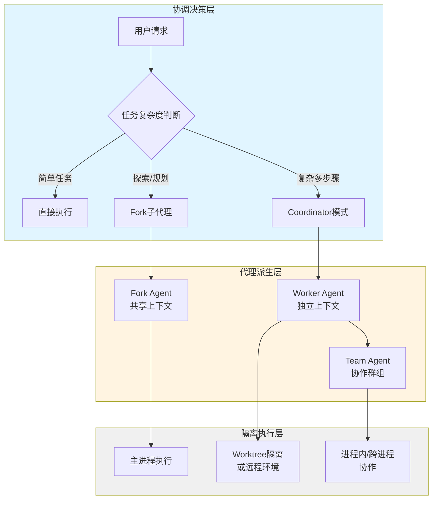
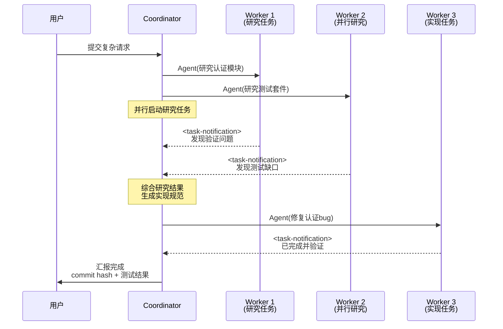
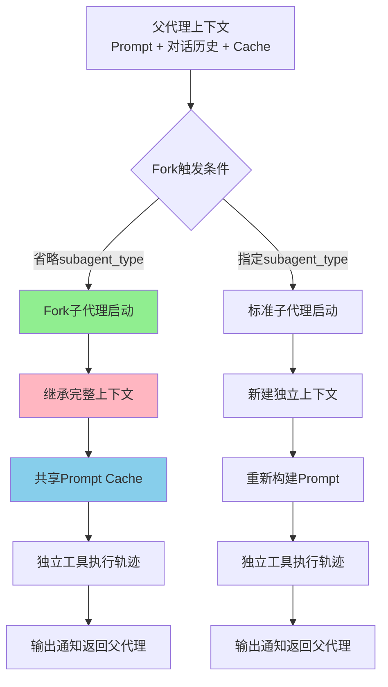
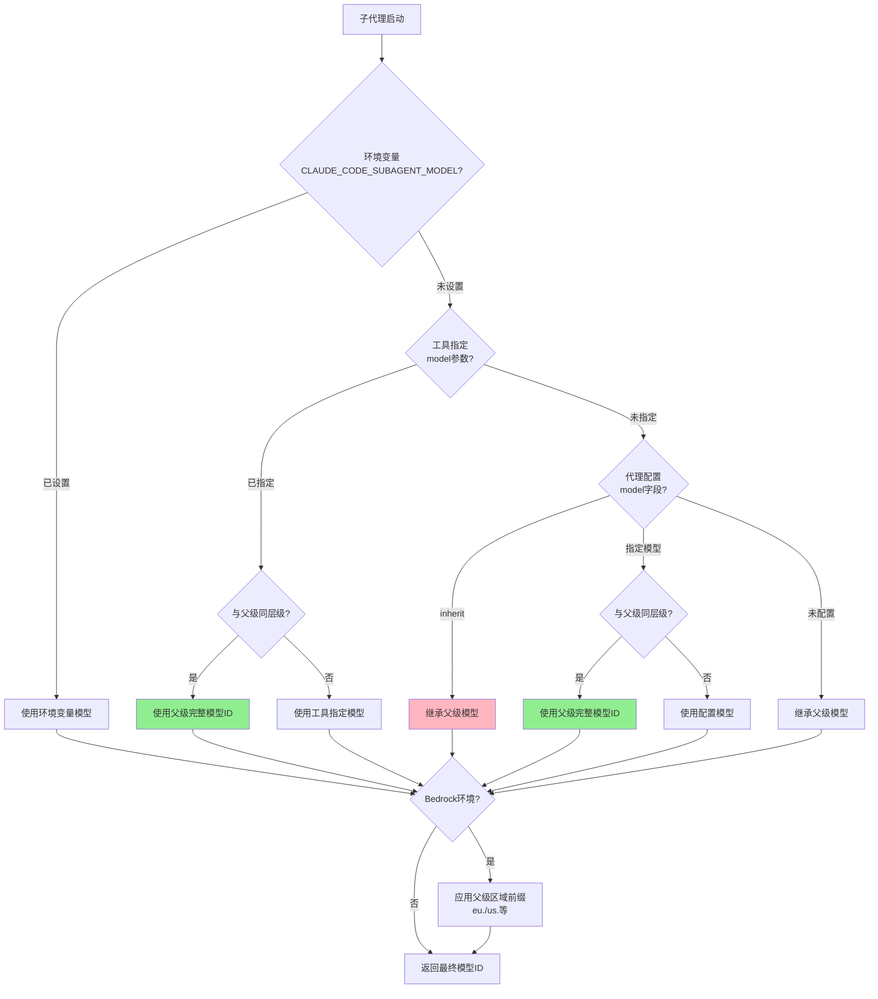
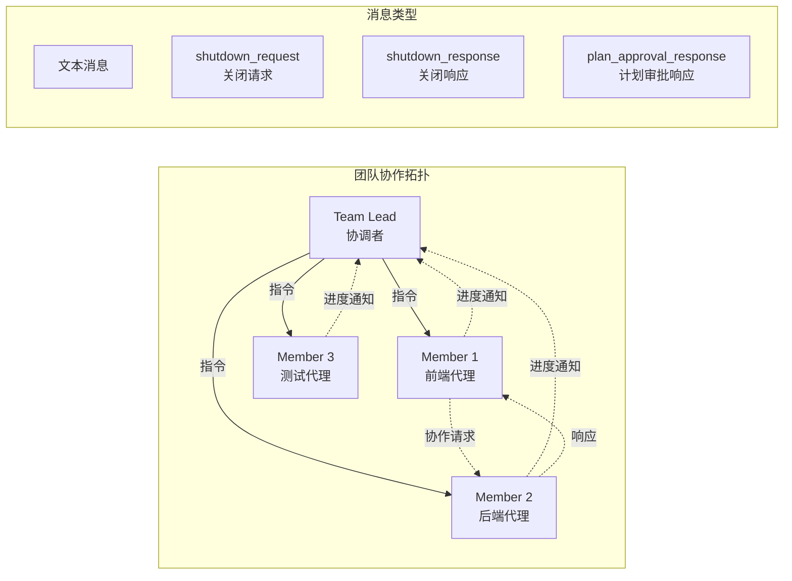

Claude Code 的多智能体协调架构是其处理复杂任务的核心能力，通过子代理派生、Coordinator模式、Worktree隔离等多层机制，实现了从单线程到多智能体并发的范式转换。这套架构不仅支持任务分解与并行执行，更在工程层面解决了上下文隔离、工具权限分级、模型路由优化等关键挑战。

## 架构总览：三层协调体系

Claude Code 的多智能体系统采用分层设计，从底层的代理派生机制到上层的协调器模式，构建了完整的任务编排体系。系统支持三种主要的协调模式：单代理Fork模式、多代理Worker模式和Coordinator编排模式，每种模式针对不同的任务场景进行了优化。

这套架构的核心价值在于通过代理分层实现了关注点分离：Coordinator负责战略决策和任务分解，Worker代理专注于战术执行，而Fork机制则提供了轻量级的上下文隔离方案。系统会根据任务特征自动选择最优的协调模式，开发者也可以通过配置显式指定。

Sources: [coordinatorMode.ts](claude-code-source/src/coordinator/coordinatorMode.ts#L1-L370), [AgentTool.tsx](claude-code-source/src/tools/AgentTool/AgentTool.tsx#L1-L100), [multi-agent.md](claude-source-leaked-main/architecture/multi-agent.md#L1-L102)

## 代理类型体系：从通用到专精

Claude Code 内置了多种专业化代理类型，每种代理都针对特定任务场景进行了工具集、权限和模型的优化配置。这些代理类型通过声明式配置定义，支持工具白名单/黑名单、模型路由、权限模式等多维度定制。

| 代理类型 | 工具集权限 | 模型路由 | 典型场景 | 只读限制 |
|---------|-----------|---------|---------|---------|
| **general-purpose** | 完整工具集 | 继承父级 | 复杂多步骤任务 | 否 |
| **Explore** | 只读工具（禁用Edit/Write） | Haiku（外部）/ 继承 | 代码库探索、文件搜索 | 是 |
| **Plan** | 只读工具（禁用Edit/Write） | 继承父级 | 架构设计、实现规划 | 是 |
| **Verification** | 标准工具集 | 可指定 | 测试验证、质量检查 | 否 |
| **Fork** | 继承父级完整工具池 | 继承父级 | 中间输出隔离、上下文分片 | 否 |
| **Worker** | ASYNC_AGENT_ALLOWED_TOOLS | 继承父级 | Coordinator模式下的任务执行 | 可配置 |

Explore代理的设计体现了性能与成本的平衡：对于Anthropic内部用户，它继承父级模型以保持上下文一致性；对于外部用户，它使用Haiku模型以降低成本并提升响应速度。Plan代理则专注于架构设计，通过只读限制确保其不执行实际代码修改，而是输出详细的实现计划。

Sources: [builtInAgents.ts](claude-code-source/src/tools/AgentTool/builtInAgents.ts#L1-L73), [exploreAgent.ts](claude-code-source/src/tools/AgentTool/built-in/exploreAgent.ts#L1-L84), [planAgent.ts](claude-code-source/src/tools/AgentTool/built-in/planAgent.ts#L1-L93)

## Coordinator模式：多Worker编排系统

Coordinator模式是Claude Code多智能体架构的高级形态，通过环境变量`CLAUDE_CODE_COORDINATOR_MODE`启用后，系统进入协调器-工作者架构。Coordinator本身不执行具体任务，而是专注于任务分解、Worker分配、结果综合和进度监控。

Coordinator通过专用的System Prompt（优先级1）进行指导，该Prompt详细定义了Worker管理的最佳实践：**并行优先原则**强调只读任务应尽可能并行执行以提升效率；**上下文合成规范**要求Coordinator在研究完成后必须理解结果，然后将具体文件路径、行号、修改内容编码到实现指令中，而非懒惰地传递"基于研究结果修复问题"；**错误处理策略**规定当Worker失败时，应使用SendMessage继续该Worker而非重新启动，以利用其已有的错误上下文。

Coordinator模式下Worker可用的工具集通过`ASYNC_AGENT_ALLOWED_TOOLS`定义，排除`TEAM_CREATE_TOOL_NAME`、`TEAM_DELETE_TOOL_NAME`等内部工具，确保Worker专注于任务执行而非团队管理。当配置了Scratchpad目录且`tengu_scratch`特性开关启用时，Worker可以在该目录读写跨Worker知识，无需权限提示。

Sources: [coordinatorMode.ts](claude-code-source/src/coordinator/coordinatorMode.ts#L1-L370), [workerAgent.ts](claude-code-source/src/coordinator/workerAgent.ts#L1-L100)

## Fork子代理机制：轻量级上下文隔离

Fork子代理是一种低成本的多智能体实现方式，通过省略`subagent_type`参数触发。与传统子代理不同，Fork继承父代理的完整对话上下文和System Prompt，共享Prompt Cache，因此具有极低的启动成本。这种机制适用于需要隔离中间工具输出、避免污染主上下文的场景。

Fork机制的核心优势在于**Cache复用**：所有Fork子代理产生字节级相同的API请求前缀，因此可以共享父代理的Prompt Cache，大幅降低Token消耗。为避免Cache失效，Fork子代理禁止设置`model`参数（不同模型无法共享Cache），同时禁止递归Fork（通过检测对话历史中的`FORK_BOILERPLATE_TAG`防止）。

Fork子代理的Prompt设计采用**指令式风格**：由于继承了父代理上下文，Prompt只需说明"做什么"而非"情况是什么"，需要明确界定任务范围（包括什么、不包括什么、其他代理在处理什么）。系统要求父代理**不得窥探**Fork的中间输出（除非用户明确要求检查进度），也**不得预测**Fork的结果，必须等待`<task-notification>`到达后再进行下一步。

Sources: [forkSubagent.ts](claude-code-source/src/tools/AgentTool/forkSubagent.ts#L1-L211), [prompt.ts](claude-code-source/src/tools/AgentTool/prompt.ts#L1-L288)

## 模型路由机制：智能降级与区域继承

子代理的模型选择遵循多优先级的决策树：环境变量`CLAUDE_CODE_SUBAGENT_MODEL`具有最高优先级；其次是工具调用时指定的`model`参数；再次是代理定义中的`model`配置；最后继承父代理模型。系统实现了**模型家族匹配**逻辑：如果代理配置指定`model: "opus"`，而父代理使用`claude-opus-4-6`，系统会识别两者属于同一家族并使用父代理的完整模型ID，避免意外降级。

对于Bedrock部署，系统实现了**区域前缀继承**机制：提取父代理模型的区域前缀（如`eu.`、`us.`），并应用到子代理模型上，确保跨区域推理配置文件的一致性。这对于IAM权限仅允许特定区域的场景至关重要。如果代理配置显式指定了包含区域前缀的完整模型ID，系统会保留该前缀而非覆盖，防止意外的数据驻留违规。

Sources: [agent.ts](claude-source-leaked-main/src/utils/model/agent.ts#L37-L95), [coordinatorMode.ts](claude-code-source/src/coordinator/coordinatorMode.ts#L1-L370)

## Worktree隔离机制：并行开发的物理隔离

Worktree隔离为子代理提供了Git工作树的独立副本，实现文件修改的物理隔离。当代理启用`isolation: "worktree"`时，系统会在`.claude/worktrees/<slug>`目录下创建临时的Git worktree，代理在该独立分支上工作，完成后可选择合并或清理。

Worktree隔离的核心价值在于**冲突预防**：多个代理可以同时在不同分支上修改同一文件的不同部分，避免了文件锁竞争。系统通过`validateWorktreeSlug`函数严格校验worktree名称，防止路径遍历攻击（禁止`.`、`..`段和绝对路径），同时支持正斜杠嵌套（如`user/feature-foo`）。

Worktree生命周期包括：创建阶段（执行`git worktree add`并运行可选的`worktree-create`钩子）、执行阶段（代理在隔离目录工作）、清理阶段（执行`git worktree remove`并运行`worktree-remove`钩子）。系统会跟踪worktree的变更状态，若有未提交的修改会在清理时警告用户。

Sources: [worktree.ts](claude-code-source/src/utils/worktree.ts#L1-L1520), [EnterWorktreeTool.ts](claude-code-source/src/tools/EnterWorktreeTool/EnterWorktreeTool.ts#L1-L100)

## 代理记忆系统：跨会话知识持久化

Claude Code 的代理记忆系统允许子代理跨会话保存和检索知识，支持三种作用域：`user`（用户级，存储在`~/.claude/agent-memory/`）、`project`（项目级，存储在`.claude/agent-memory/`）、`local`（本地级，存储在`.claude/agent-memory-local/`）。记忆系统遵循"不记代码，只记人"的哲学，专注于持久化用户偏好、项目约定、关键决策等高价值信息。

记忆目录结构按代理类型隔离：`<memory-base>/agent-memory/<agentType>/`，其中`agentType`经过路径安全处理（冒号替换为连字符，支持插件命名空间的代理类型如`my-plugin:my-agent`）。当配置`CLAUDE_CODE_REMOTE_MEMORY_DIR`环境变量时，local作用域会持久化到远程挂载点，并按项目命名空间隔离。

代理记忆通过`buildMemoryPrompt`函数注入到System Prompt中，格式化为结构化的知识条目。记忆系统与代理生命周期解耦：代理可以读取自己的记忆、写入新发现、更新既有知识，这些记忆在代理终止后依然存在，为后续会话提供上下文支持。

Sources: [agentMemory.ts](claude-code-source/src/tools/AgentTool/agentMemory.ts#L1-L178), [memdir.ts](claude-code-source/src/memdir/memdir.ts#L1-L100)

## 代理间通信：消息传递与团队协作

多智能体系统通过`SendMessage`工具实现代理间的异步消息传递，支持三种通信模式：**定向发送**（指定`to`参数为代理名称或ID）、**广播发送**（`to: "*"`发送给所有队友）、**结构化消息**（如`shutdown_request`、`plan_approval_response`等）。

团队协作通过`TeamCreate`和`TeamDelete`工具管理生命周期。`TeamCreate`创建团队配置文件（存储在`.claude/teams/<team-name>.json`），指定团队名称、描述、领导代理ID等元数据。团队成员通过`Agent`工具的`team_name`参数加入团队，系统会自动分配颜色标识并在团队面板中展示。

代理间通信采用**邮箱模式**：每个代理拥有独立的消息队列（`writeToMailbox`），消息以用户角色（`<task-notification>` XML格式）送达目标代理。这种设计确保了消息的异步性和可靠性，即使目标代理正在执行长时任务也不会阻塞发送方。系统还支持UDS（Unix Domain Socket）和Bridge协议，用于跨进程和远程会话的代理通信。

Sources: [SendMessageTool.ts](claude-code-source/src/tools/SendMessageTool/SendMessageTool.ts#L1-L80), [TeamCreateTool.ts](claude-code-source/src/tools/TeamCreateTool/TeamCreateTool.ts#L1-L100), [teammateMailbox.ts](claude-code-source/src/utils/teammateMailbox.ts#L1-L100)

## MCP服务器继承与扩展

子代理可以继承父代理的MCP（Model Context Protocol）服务器连接，并在此基础上添加代理专属的MCP服务器。代理定义的`mcpServers`字段采用声明式配置，在代理启动时动态连接，代理终止时自动清理。

MCP服务器继承遵循**增量合并**原则：子代理获得父代理的所有MCP客户端连接，加上自己定义的专属服务器。每个MCP服务器提供一组工具，这些工具会被注入到代理的工具池中。系统通过`initializeAgentMcpServers`函数管理连接生命周期，返回合并后的客户端列表、代理专属工具集和清理函数。

这种设计使得专业化代理可以访问特定的外部工具集：例如，一个专注于数据库操作的代理可以配置PostgreSQL MCP服务器，而无需污染其他代理的工具池。MCP服务器的工具权限同样遵循代理的`tools`和`disallowedTools`配置，实现细粒度的工具访问控制。

Sources: [runAgent.ts](claude-code-source/src/tools/AgentTool/runAgent.ts#L1-L100), [client.ts](claude-code-source/src/services/mcp/client.ts#L1-L100)

## 权限模式与隔离策略

子代理支持多种权限模式（`permissionMode`），决定了权限提示的呈现方式和执行策略。`default`模式要求代理在执行敏感操作前提示用户确认；`plan`模式强制代理先输出实现计划，用户批准后方可执行；`bubble`模式将权限提示上浮到父代理终端，适合后台运行的子代理。

| 权限模式 | 提示位置 | 典型场景 | 安全级别 |
|---------|---------|---------|---------|
| **default** | 子代理终端 | 交互式任务 | 高 |
| **plan** | 子代理终端 | 复杂实现任务 | 最高 |
| **bubble** | 父代理终端 | 后台任务、Fork子代理 | 中 |
| **auto-accept** | 无提示 | 信任环境、自动化流程 | 低 |

权限检查通过`filterDeniedAgents`函数实现，系统会检查代理是否被用户配置的拒绝规则匹配。对于Coordinator模式下的Worker代理，系统提供了专用的工具白名单（`ASYNC_AGENT_ALLOWED_TOOLS`），排除团队管理等高层工具，确保Worker专注于任务执行。

Sources: [permissions.ts](claude-code-source/src/utils/permissions/permissions.ts#L1-L100), [PermissionMode.ts](claude-code-source/src/utils/permissions/PermissionMode.ts#L1-L50)

## 相关主题

多智能体协调架构的各个组件与系统其他部分紧密关联：

- **工具权限分级与自动决策系统**：详细解析工具的分类机制和自动批准逻辑
- **Coordinator Mode：多 Worker 编排系统**：深入探讨 Coordinator 模式的设计哲学和最佳实践
- **KAIROS：自主助手平台架构**：了解 Tick 机制和主动唤醒模式的实现原理
- **子代理模型路由与配置**：掌握模型选择策略和 Bedrock 区域配置