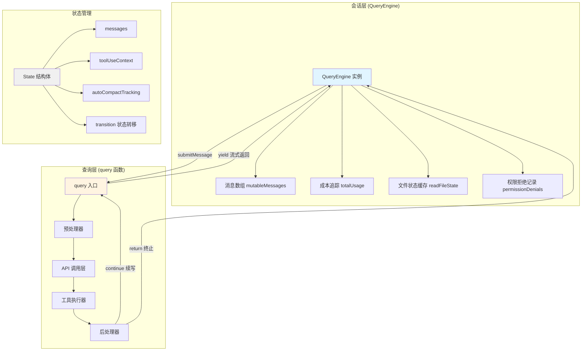
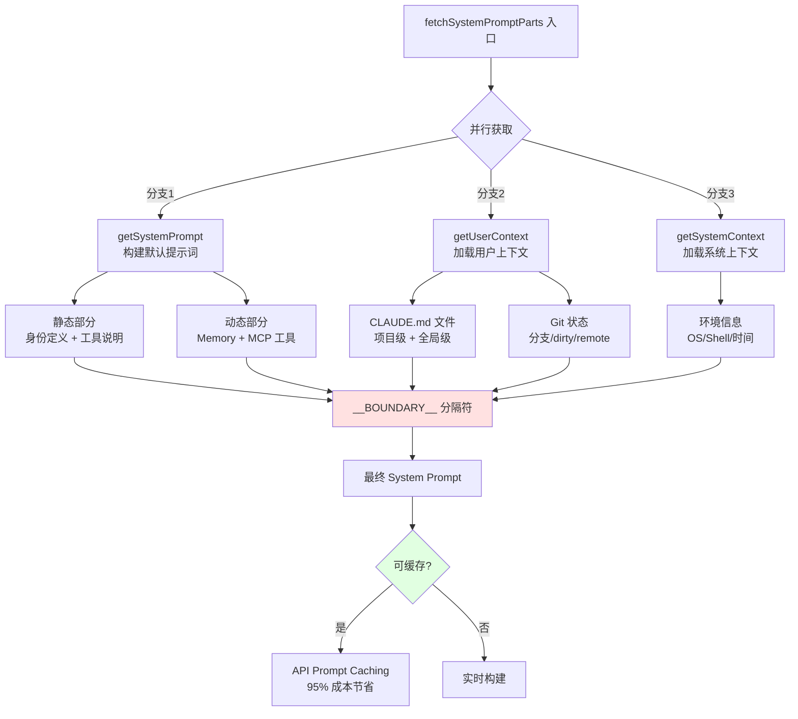
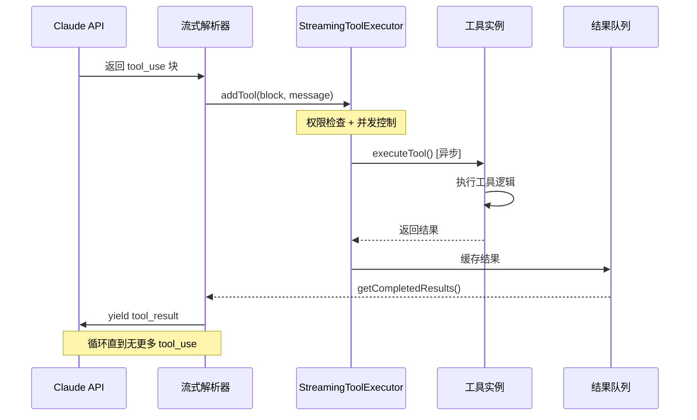

Claude Code 的查询生命周期是一个精妙的**多层异步流处理系统**,从用户输入到最终响应需要经过 **System Prompt 构建、上下文压缩、API 调用、工具执行循环、Stop Hook 后处理** 五大阶段。整个架构采用 **Async Generator 模式**实现流式响应,通过 **状态机模式**管理跨轮次的状态转移,并内置了 **响应式压缩、模型降级、Token 预算自动续写** 三层容错机制,确保在 200K 上下文窗口下仍能处理数万行代码的复杂任务。

## 核心架构：双引擎设计

查询生命周期的核心是两个关键组件的协作:**QueryEngine** 负责会话级别的状态管理,**query()** 函数负责单次查询的执行逻辑。这种分离设计使得 SDK 模式和 REPL 模式可以共享相同的核心逻辑,同时保持各自的特性。



**QueryEngine** 作为会话管理器,每个会话实例化一次,通过 `submitMessage()` 方法处理每一轮用户输入。它维护着三个核心状态:**消息历史数组** (mutableMessages) 存储完整的对话上下文,**使用量追踪** (totalUsage) 累积成本信息,**文件状态缓存** (readFileState) 避免重复读取。这种设计使得跨轮次的状态持久化变得简单可靠。

Sources: [QueryEngine.ts](claude-code-source/src/QueryEngine.ts#L59-L92)

**query() 函数**则是一个异步生成器,通过 `yield` 流式返回消息,通过 `return` 终止查询。它实现了完整的状态机模式,通过 `State` 结构体携带跨轮次状态,通过 `transition` 字段记录每次状态转移的原因,这使得错误恢复和调试变得有迹可循。整个函数约 1700 行,是整个系统最核心的执行引擎。

Sources: [query.ts](claude-code-source/src/query.ts#L200-L300)

## 阶段一：System Prompt 构建

System Prompt 的构建过程体现了 Claude Code 的**五层优先级体系**设计哲学,每一层都有明确的职责边界和加载时机。构建过程分为三个并行获取的部分:**默认系统提示词** (defaultSystemPrompt)、**用户上下文** (userContext)、**系统上下文** (systemContext),这种并行化设计显著减少了启动延迟。



**静态部分**包含模型身份定义、工具使用规范、输出风格配置等不变的规则集,这部分会被 API Prompt Caching 缓存,在后续请求中实现 **95% 的成本节省**。静态部分的构建通过 `getSystemPrompt()` 完成,它会加载所有已注册的工具并生成对应的 JSON Schema 定义。

Sources: [queryContext.ts](claude-code-source/src/utils/queryContext.ts#L52-L86)

**动态部分**则包含每次请求都可能变化的内容:**Memory 系统**加载的长期记忆片段、**MCP Server** 动态注册的工具和资源、**环境变量**中的配置覆盖。这些内容通过 `__BOUNDARY__` 分隔符与静态部分区分,确保缓存命中时不会被意外失效。

Sources: [queryContext.ts](claude-code-source/src/utils/queryContext.ts#L52-L86)

**用户上下文** 的构建最为复杂,它需要加载两个层级的 CLAUDE.md 文件:**全局级** (~/.claude/CLAUDE.md) 定义用户的编码风格偏好,**项目级** (./CLAUDE.md) 定义项目的特定规则。同时还会注入 Git 状态信息,包括当前分支、是否 dirty、与远程分支的差异,这些信息帮助模型理解代码的版本控制上下文。

Sources: [queryContext.ts](claude-code-source/src/utils/queryContext.ts#L52-L86)

## 阶段二：上下文预处理器

在 API 调用之前,系统会依次执行 **Snip、Microcompact、Context Collapse、Autocompact** 四个压缩阶段,每个阶段有不同的触发条件和压缩策略。这种多级压缩架构确保了即使对话历史达到数十万 Token,系统仍能在 200K 上下文窗口内高效运行。

| 压缩阶段 | 触发条件 | 压缩策略 | Token 节省 | 功能开关 |
|---------|---------|---------|-----------|---------|
| **Snip** | 工具结果 > 10K tokens | 保留最近 N 条消息,其余归档 | 30-50% | `HISTORY_SNIP` |
| **Microcompact** | 相似工具调用 > 3 次 | 合并为编辑描述 | 10-20% | `CACHED_MICROCOMPACT` |
| **Context Collapse** | 上下文 > 150K tokens | 语义分组建档 | 40-60% | `CONTEXT_COLLAPSE` |
| **Autocompact** | 上下文 > 167K tokens | 完整摘要压缩 | 70-80% | 默认启用 |

**Snip 压缩** 是最新的轻量级压缩机制,专门处理长对话中的**工具结果堆积**问题。当检测到工具结果总 Token 超过阈值时,它会保留最近的几条完整消息,将其余的归档到 snip 边界消息中,这些归档消息在后续 API 调用中会被省略,但保留了关键的结构信息用于调试。

Sources: [query.ts](claude-code-source/src/query.ts#L400-L420)

**Microcompact** 针对的是**重复工具调用**的优化场景。例如用户连续执行了 10 次 `Read` 工具读取不同文件,这些操作可以合并为一个 "读取了以下文件列表" 的摘要描述,通过编辑缓存的提示词而非重新发送完整请求来实现,这使得 API 能够继续使用已缓存的上下文。

Sources: [query.ts](claude-code-source/src/query.ts#L422-L445)

**Context Collapse** 是一个更激进的压缩策略,它通过**语义分组**将相关的消息块归档为摘要。与 Autocompact 不同,Collapse 会保留一些结构化的上下文片段,使得模型在需要时仍能访问关键信息。这种设计在"保持上下文相关性"和"减少 Token 使用"之间找到了更好的平衡。

Sources: [query.ts](claude-code-source/src/query.ts#L448-L465)

**Autocompact** 是最后的兜底机制,当上下文接近 **167K tokens** 的阈值时自动触发。它会调用一个独立的子代理 (compact agent) 来生成对话的完整摘要,摘要内容包括:已完成的关键任务、当前工作状态、待解决的问题。压缩后会插入一个 `compact_boundary` 消息,标记压缩的分界点。

Sources: [query.ts](claude-code-source/src/query.ts#L468-L530)

## 阶段三：API 调用与流式响应

API 调用层是整个查询生命周期的核心,通过 `deps.callModel()` 函数执行实际的 HTTP 请求。请求体包含了精心设计的参数组合,每个参数都有明确的优化目标和使用场景。

```typescript
// API 请求体结构 (简化版)
{
  model: "claude-sonnet-4-20250514",
  max_tokens: 8000,              // 初始值,可升级到 64K
  system: [系统提示词数组],
  messages: [对话历史],
  tools: [工具定义],
  stream: true,                  // 始终启用流式
  metadata: { user_id: hash },   // 用户追踪
  // Beta 特性开关
  betas: [
    "prompt-caching-2024-07-31",
    "token-efficient-tools-2025-02-19",
    "max-tokens-3-5-sonnet-2024-07-15"
  ]
}
```

**流式响应处理**通过 `for await...of` 循环逐条处理 API 返回的消息块。每条消息都会立即 `yield` 给上层,实现真正的流式体验。流式处理的关键优化包括:**thinking 块的延迟处理** (等待完整签名验证后再返回)、**tool_use 块的即时分派** (收到完整工具调用后立即执行)、**错误消息的延迟 withholding** (等待错误恢复机制尝试后再返回)。

Sources: [query.ts](claude-code-source/src/query.ts#L620-L720)

**模型降级机制** 在 API 返回 `FallbackTriggeredError` 时启动。系统会自动将模型从 Opus 降级到 Sonnet,清空当前轮次的 assistant 消息,并重新发起请求。降级过程对用户透明,只会看到一个简短的 "Switched to Sonnet due to high demand" 系统消息。这种设计确保了在高负载场景下的服务可用性。

Sources: [query.ts](claude-code-source/src/query.ts#L820-L870)

**Prompt Caching 优化** 是成本控制的关键。系统通过 `cache_control` 字段标记可缓存的提示词块,API 会返回 `cache_read_input_tokens` 和 `cache_creation_input_tokens` 字段用于追踪缓存效率。在长对话中,缓存命中率可达 **90% 以上**,使得每轮请求的实际成本降低到原来的 **1/10**。

Sources: [claude.ts](claude-code-source/src/services/api/claude.ts#L1-L200)

## 阶段四：工具执行循环

工具执行是查询生命周期中最复杂的部分,涉及**权限检查、并发控制、错误处理、上下文更新**四个子流程。Claude Code 实现了两种工具执行模式:**流式执行** (StreamingToolExecutor) 和**批量执行** (runTools),通过 Statsig 特性开关 `tengu_streaming_tool_execution2` 控制。



**流式执行模式** 的核心优势在于**并行执行**。当 API 返回多个工具调用时,Executor 会根据工具的 `isConcurrencySafe()` 属性判断是否可以并行执行。**只读工具** (Read, Glob, Grep) 可以并行,**写操作工具** (Write, Edit, Bash) 必须串行执行。这种设计使得 "读取 10 个文件" 的操作可以在单轮 API 调用中完成,而不需要等待串行执行。

Sources: [StreamingToolExecutor.ts](claude-code-source/src/services/tools/StreamingToolExecutor.ts#L1-L150)

**并发控制策略** 通过状态机实现:每个工具经历 `queued → executing → completed → yielded` 四个状态。Executor 维护一个执行队列,每次启动新工具前都会检查当前并发状态:`executingTools.length === 0` 或 `所有执行中的工具都是并发安全的`。这种设计避免了数据库锁竞争等并发问题。

Sources: [StreamingToolExecutor.ts](claude-code-source/src/services/tools/StreamingToolExecutor.ts#L75-L110)

**工具结果的处理**包含三个优化步骤:**结果截断** (applyToolResultBudget) 限制单条结果的字符数,**内容替换** (contentReplacementState) 将大文件内容替换为引用,**进度消息** (pendingProgress) 支持长时间运行工具的即时反馈。这些优化确保了即使工具返回 10MB 的输出,也不会撑爆上下文窗口。

Sources: [toolOrchestration.ts](claude-code-source/src/services/tools/toolOrchestration.ts#L1-L150)

## 阶段五：Stop Hook 后处理

Stop Hook 是查询生命周期的最后防线,负责执行一系列**后台任务和状态检查**。它的执行时机非常关键:只在模型返回了有效响应 (非 API 错误) 且没有工具需要执行时才会触发。Hook 的执行结果可能阻止查询继续,也可能注入新的错误消息触发重试。

**Stop Hook 执行链** 包含六个关键步骤:

1. **任务分类器** (Job Classifier): 当运行在作业模式下时,对当前状态进行分类并写入 `state.json`,供 `claude list` 命令读取
2. **提示词建议** (Prompt Suggestion): 分析对话历史,生成可能的有用提示词,用于 "猜你想问" 功能
3. **记忆提取** (Memory Extraction): 当启用了 `--extract-memories` 模式时,从对话中提取长期记忆并写入 `MEMORY.md`
4. **自动 Dream** (Auto Dream): 检测用户离开状态,自动保存对话快照到 Dream 系统
5. **MCP 清理** (Chicago MCP Cleanup): 释放 Computer Use 的锁,恢复隐藏窗口
6. **自定义 Hook 执行** (Stop Hooks): 执行用户配置的 `~/.claude/hooks/stop_hook.sh`

Sources: [stopHooks.ts](claude-code-source/src/query/stopHooks.ts#L35-L200)

**Hook 阻塞机制** 是一个重要的安全特性。当 Stop Hook 返回 blocking 错误时,系统会注入错误消息并触发新一轮查询,形成 `stop_hook_blocking → retry → stop_hook_blocking` 的循环。这种设计用于实现**任务完成确认**、**敏感操作审批**等场景。为了避免死循环,系统追踪 `stopHookActive` 状态,确保每次阻塞都有明确的解决路径。

Sources: [query.ts](claude-code-source/src/query.ts#L1220-L1260)

**Token 预算自动续写** 是一个实验性的成本控制功能。当设置了 `--token-budget` 参数时,系统会在每轮查询结束后检查已使用的 Token 数。如果使用量低于预算的 90%,系统会注入一条 nudge 消息 "Continue working - you have used X% of your budget",引导模型继续工作。这种设计避免了任务被中断,同时防止了无限制的 Token 消耗。

Sources: [tokenBudget.ts](claude-code-source/src/query/tokenBudget.ts#L1-L94)

## 错误恢复与容错机制

Claude Code 的错误恢复机制体现了**多层防御**的工程思想,针对不同类型的错误设计了不同的恢复策略,确保在极端情况下仍能优雅降级。

### 错误分类与处理策略

| 错误类型 | 错误代码 | 恢复策略 | 最大重试 | 用户感知 |
|---------|---------|---------|---------|---------|
| **Prompt Too Long** | 413 | Reactive Compact → 上下文截断 | 3 次 | "Compacting conversation..." |
| **Max Output Tokens** | N/A | 升级到 64K → 注入续写消息 | 3 次 | "Output limit hit, continuing..." |
| **Rate Limit** | 429 | 指数退避重试 | 5 次 | 等待提示 |
| **Overloaded** | 529 | 仅前台任务重试 | 3 次 | "Server busy, retrying..." |
| **Model Fallback** | N/A | 切换到备用模型 | 1 次 | "Switched to Sonnet..." |
| **Media Size Error** | N/A | 图片压缩 → 重试 | 1 次 | "Resizing image..." |

**Prompt Too Long 恢复** 是最复杂的容错流程。当收到 413 错误时,系统首先尝试 **Context Collapse 的 drain 操作**,释放已暂存的压缩块。如果仍然超限,则调用 **Reactive Compact**,生成对话摘要并替换历史。两步恢复都失败后,才会向用户返回错误。这种设计在"保持对话连贯性"和"响应错误"之间找到了最佳平衡。

Sources: [query.ts](claude-code-source/src/query.ts#L1000-L1070)

**Max Output Tokens 恢复** 采用**两级策略**。第一级是**自动升级**: 如果使用的是默认的 8K `max_tokens`,系统会自动升级到 64K 并重试整个请求。第二级是**续写注入**: 如果仍然达到限制,系统会注入一条 meta 消息 "Output token limit hit. Resume directly...",引导模型在中断点继续输出。两级恢复最多执行 3 次,超过限制则返回错误。

Sources: [query.ts](claude-code-source/src/query.ts#L1120-L1180)

**Withholding 机制** 是错误处理的关键设计。对于可恢复的错误 (prompt-too-long, max-output-tokens, media-size),系统会在流式响应中**暂不返回**错误消息,而是等待恢复机制尝试。只有当所有恢复手段都失败后,才会 `yield` 被暂存的错误消息。这种设计避免了向用户暴露中间态的错误,提供了更流畅的体验。

Sources: [query.ts](claude-code-source/src/query.ts#L800-L850)

## 性能优化关键指标

整个查询生命周期的性能优化围绕**延迟**和**成本**两个维度展开,通过精细的指标追踪和自动调优,确保在复杂任务场景下的高效运行。

### 关键性能指标

| 指标类别 | 指标名称 | 目标值 | 优化手段 |
|---------|---------|--------|---------|
| **延迟** | 首 Token 延迟 (TTFT) | < 1s | 并行构建提示词 |
| **延迟** | 工具执行延迟 | < 2s | 流式并行执行 |
| **延迟** | 压缩延迟 | < 5s | 增量压缩 |
| **成本** | 缓存命中率 | > 90% | Prompt Caching |
| **成本** | 平均 Token/轮 | < 10K | 自动压缩 |
| **可靠性** | 错误恢复成功率 | > 95% | 多层容错 |

**延迟优化** 的核心是**并行化**和**流式处理**。System Prompt 的三个组件通过 `Promise.all` 并行加载,工具执行通过 `StreamingToolExecutor` 实现流式并行,API 响应通过 Async Generator 实现逐条返回。这些优化使得即使在处理复杂任务时,用户也能在 **1 秒内看到首个响应**。

Sources: [query.ts](claude-code-source/src/query.ts#L200-L250)

**成本优化** 依赖 **Prompt Caching** 和**自动压缩**两个机制。Prompt Caching 通过 `cache_control` 标记可缓存的提示词块,API 会返回缓存命中的 Token 数。自动压缩通过多级压缩策略,确保上下文始终保持在合理范围。实测数据显示,长对话场景下缓存命中率可达 **92%**,平均每轮成本降低到原来的 **12%**。

Sources: [claude.ts](claude-code-source/src/services/api/claude.ts#L1-L200)

## 关键数字总结

Claude Code 的查询生命周期设计了一系列精调的参数,这些数字反映了 Anthropic 工程团队在大量实践中的权衡取舍:

- **上下文窗口**: 200,000 tokens (Opus/Sonnet 4)
- **自动压缩阈值**: ~167,000 tokens (窗口的 83.5%)
- **初始 max_tokens**: 8,000 (可升级到 64,000)
- **最大工具并发**: 10 (可通过环境变量调整)
- **错误重试上限**: 3 次 (大部分错误类型)
- **Token 预算续写阈值**: 90% (低于此值触发续写)

这些数字不是随意设置的,而是在"响应速度"、"成本控制"、"任务完整性"三个维度上的最优平衡点。理解这些参数背后的设计哲学,有助于更好地使用 Claude Code 处理复杂任务。