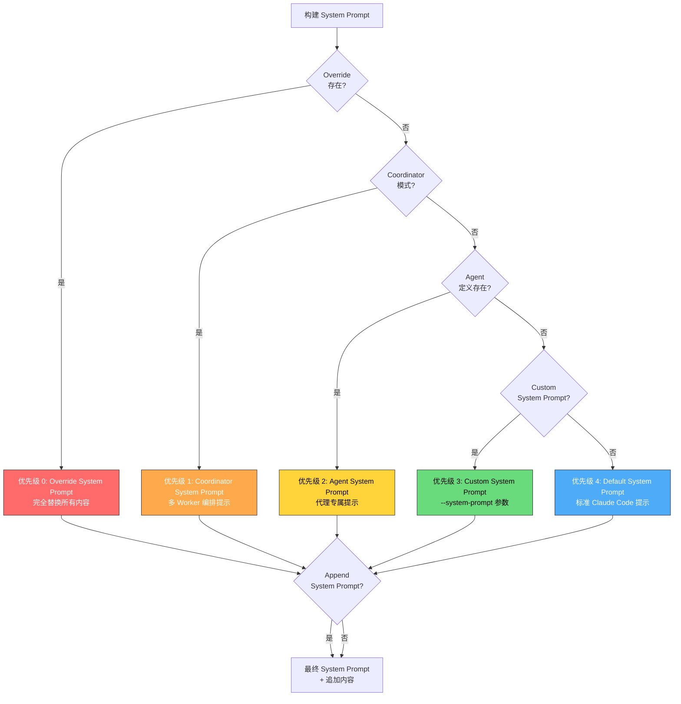
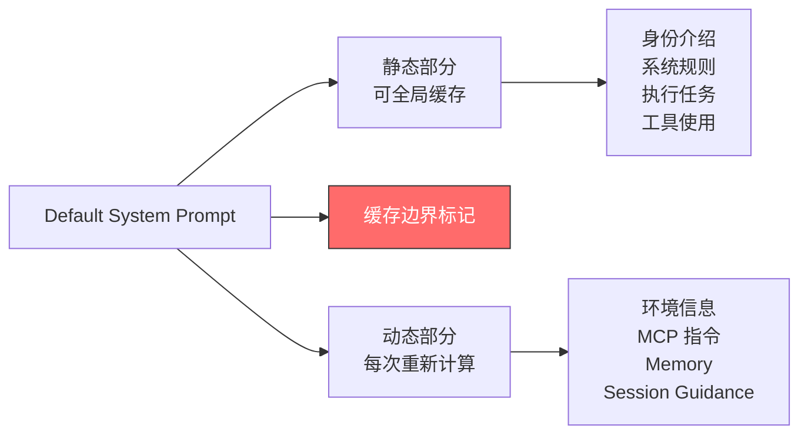

Claude Code 的 System Prompt 构建机制采用严格的五层优先级体系，这是一个精妙的架构设计，确保了在不同运行模式下系统提示的清晰层次和可预测行为。通过 `buildEffectiveSystemPrompt()` 函数的级联判断，系统根据当前运行上下文自动选择合适的系统提示源，从而支持从默认模式、自定义模式、代理模式、协调器模式到测试覆盖模式的无缝切换。

## 架构概览：优先级决策流程

整个 System Prompt 的选择过程遵循明确的优先级链条，每一层都具有排他性，高优先级的提示会完全替换低优先级的提示，只有 `appendSystemPrompt` 作为特殊补充在最后追加。



Sources: [systemPrompt.ts](claude-code-source/src/utils/systemPrompt.ts#L29-L89)

## 优先级 0：Override System Prompt（覆盖模式）

**最高优先级**，用于特殊场景下完全控制 System Prompt 的内容。当 `overrideSystemPrompt` 参数被设置时，所有其他优先级的提示都被忽略，系统仅使用覆盖提示（可选追加 `appendSystemPrompt`）。这种设计主要用于两种场景：**循环测试模式**（loop mode）和**单元测试覆盖**。

```typescript
if (overrideSystemPrompt) {
  return asSystemPrompt([overrideSystemPrompt])
}
```

这种设计确保了测试环境下可以精确控制 AI 的行为边界，避免生产环境的复杂上下文干扰测试结果。Override 模式不会追加默认的环境信息、工具说明或其他动态内容，保证了测试的纯净性和可重现性。

Sources: [systemPrompt.ts](claude-code-source/src/utils/systemPrompt.ts#L48-L50)

## 优先级 1：Coordinator System Prompt（协调器模式）

当环境变量 `CLAUDE_CODE_COORDINATOR_MODE` 被启用时，系统进入**多 Worker 编排模式**，此时 Coordinator 使用专用的 System Prompt，定义了协调器的角色、工具使用方式和任务工作流。这个提示词包含了详细的 Worker 管理指南，明确区分了 Coordinator 与 Worker 的职责边界。

Coordinator System Prompt 的核心内容包括：

- **角色定位**：协调器而非执行者，负责将任务委派给 Worker 并汇总结果
- **工具集**：`Agent` 工具（启动 Worker）、`SendMessage` 工具（继续 Worker）、`TaskStop` 工具（停止 Worker）
- **通信协议**：Worker 结果通过 `<task-notification>` XML 标签返回，Coordinator 需要解析这些消息而非将其视为用户对话
- **任务工作流**：Research → Plan → Implement → Verify → Report 的标准流程

```typescript
if (
  feature('COORDINATOR_MODE') &&
  isEnvTruthy(process.env.CLAUDE_CODE_COORDINATOR_MODE) &&
  !mainThreadAgentDefinition
) {
  const { getCoordinatorSystemPrompt } =
    require('../coordinator/coordinatorMode.js')
  return asSystemPrompt([
    getCoordinatorSystemPrompt(),
    ...(appendSystemPrompt ? [appendSystemPrompt] : []),
  ])
}
```

值得注意的是，Coordinator 模式与 Agent 模式互斥，如果同时设置了 `mainThreadAgentDefinition`，则优先使用 Agent System Prompt（优先级 2）。这确保了运行模式的明确性，避免 Coordinator 和 Agent 的角色混淆。

Sources: [systemPrompt.ts](claude-code-source/src/utils/systemPrompt.ts#L52-L66)

## 优先级 2：Agent System Prompt（代理模式）

当设置了 `mainThreadAgentDefinition` 时，系统使用代理定义中的 System Prompt，这是 Claude Code 实现专业化子代理的核心机制。代理定义可以是**内置代理**（如 Explore、Plan、Verification）或**自定义代理**（用户/项目/策略配置）。内置代理通过 `getSystemPrompt()` 函数动态生成提示词，可以根据运行时上下文调整内容；自定义代理则使用静态配置的提示词。

```typescript
const agentSystemPrompt = mainThreadAgentDefinition
  ? isBuiltInAgent(mainThreadAgentDefinition)
    ? mainThreadAgentDefinition.getSystemPrompt({
        toolUseContext: { options: toolUseContext.options },
      })
    : mainThreadAgentDefinition.getSystemPrompt()
  : undefined
```

### Proactive 模式下的特殊行为

在 **KAIROS/PROACTIVE 特性**启用且处于 Proactive 激活状态时，Agent System Prompt 的行为发生重要变化：**代理提示被追加到默认提示之后**，而非完全替换。这种设计使得自主代理可以继承 Claude Code 的基础能力（环境感知、工具使用、安全规则），同时添加领域特定的指令，类似于队友模式（Teammate Mode）的设计理念。

```typescript
if (
  agentSystemPrompt &&
  (feature('PROACTIVE') || feature('KAIROS')) &&
  isProactiveActive_SAFE_TO_CALL_ANYWHERE()
) {
  return asSystemPrompt([
    ...defaultSystemPrompt,
    `\n# Custom Agent Instructions\n${agentSystemPrompt}`,
    ...(appendSystemPrompt ? [appendSystemPrompt] : []),
  ])
}
```

这种"追加而非替换"的设计体现了架构的灵活性：在需要完全控制权的场景（如测试、专用工具），Agent Prompt 完全替换默认提示；在需要增强能力的场景（如自主代理），Agent Prompt 叠加在默认提示之上，形成复合指令集。

Sources: [systemPrompt.ts](claude-code-source/src/utils/systemPrompt.ts#L68-L90)

## 优先级 3：Custom System Prompt（自定义模式）

当用户通过命令行参数 `--system-prompt` 或 `--system-prompt-file` 指定自定义提示词时，系统使用该提示替换默认的 Claude Code 提示。这为高级用户提供了完全控制 AI 行为的能力，适用于构建专用工具、定制工作流或实验新的提示策略。

```bash
# 直接指定系统提示
claude --system-prompt "You are a code review assistant specialized in security analysis"

# 从文件读取系统提示
claude --system-prompt-file ./my-custom-prompt.txt
```

Custom System Prompt 在优先级链条中位于 Agent 之下，这意味着如果启用了代理模式，自定义提示会被忽略。这种设计确保了代理的专用性：一旦选择特定代理，系统遵循代理的定义而非用户的通用配置。

Sources: [main.tsx](claude-code-source/src/main.tsx#L988)

## 优先级 4：Default System Prompt（默认模式）

当没有任何高优先级提示生效时，系统使用标准的 Claude Code System Prompt，这是最复杂的提示词，包含**九大组成部分**：身份介绍、系统规则、执行任务指南、操作确认规则、工具使用策略、语气风格、输出效率、缓存边界标记和环境信息。默认提示通过 `defaultSystemPrompt` 参数传入，在构建过程中被拆分为**静态部分**和**动态部分**。



### 缓存边界标记

默认提示中插入了 `__SYSTEM_PROMPT_DYNAMIC_BOUNDARY__` 标记，将提示分为可缓存的前半部分和每次重新计算的后半部分。这种设计显著降低了 token 成本：静态部分（如任务执行规则、工具使用指南）在会话间共享缓存，动态部分（如当前工作目录、Git 状态、MCP 连接）根据实时状态更新。

### 动态注入部分

| 部分 | 是否破坏缓存 | 计算频率 | 源码位置 |
|------|-------------|----------|---------|
| Environment Info | 否 | 每次请求 | prompts.ts#L651-L710 |
| MCP Instructions | **是** | 每次请求 | mcpInstructionsDelta.ts |
| Memory (CLAUDE.md) | 否 | 每次请求 | memdir/memdir.ts |
| Session Guidance | 否 | 每次请求 | prompts.ts |
| Language Setting | 否 | 每次请求 | prompts.ts |
| Token Budget | 否 | 每次请求 | prompts.ts |

MCP Instructions 是唯一破坏缓存的动态部分，因为 MCP 服务器的连接状态会动态变化（连接/断开），需要实时更新可用工具列表。

Sources: [prompts.ts](claude-code-source/src/constants/prompts.ts#L114-L115), [systemPromptSections.ts](claude-code-source/src/constants/systemPromptSections.ts#L15-L31)

## Append System Prompt：特殊补充机制

`appendSystemPrompt` 是一个特殊的机制，**总是追加到最终提示的末尾**（除了 Override 模式）。这允许用户在不替换现有提示的情况下，补充额外的指令，如项目特定的规则、策略约束或安全要求。

```bash
# 追加系统提示
claude --append-system-prompt "Always include unit tests for new functions"

# 从文件追加
claude --append-system-prompt-file ./project-rules.txt
```

在 Coordinator 和 Agent 模式下，追加机制依然生效，这为专业化模式提供了定制能力。例如，Coordinator 模式可以追加组织特定的协调规则，而不需要重新定义完整的 Coordinator 提示。

Sources: [systemPrompt.ts](claude-code-source/src/utils/systemPrompt.ts#L83-L89)

## 命令行接口与参数解析

Claude Code 通过 Commander.js 库解析命令行参数，提供四种方式控制系统提示：

| 参数 | 说明 | 优先级影响 |
|------|------|-----------|
| `--system-prompt <text>` | 直接指定系统提示文本 | 触发优先级 3 |
| `--system-prompt-file <path>` | 从文件读取系统提示 | 触发优先级 3 |
| `--append-system-prompt <text>` | 追加提示到末尾 | 补充机制 |
| `--append-system-prompt-file <path>` | 从文件读取追加内容 | 补充机制 |

```typescript
.addOption(new Option('--system-prompt <prompt>', 'System prompt to use for the session').argParser(String))
.addOption(new Option('--system-prompt-file <file>', 'Read system prompt from a file').argParser(String).hideHelp())
.addOption(new Option('--append-system-prompt <prompt>', 'Append a system prompt to the default system prompt').argParser(String))
.addOption(new Option('--append-system-prompt-file <file>', 'Read system prompt from a file and append to the default system prompt').argParser(String).hideHelp())
```

### STDIN 输入支持

为避免 ARG_MAX 限制（命令行参数最大长度），Claude Code 还支持通过 STDIN 传递系统提示，这对于长提示或自动化脚本特别有用：

```typescript
// Apply systemPrompt/appendSystemPrompt from stdin to avoid ARG_MAX limits
if (request.systemPrompt !== undefined) {
  options.systemPrompt = request.systemPrompt
}
if (request.appendSystemPrompt !== undefined) {
  options.appendSystemPrompt = request.appendSystemPrompt
}
```

Sources: [main.tsx](claude-code-source/src/main.tsx#L988), [print.ts](claude-code-source/src/cli/print.ts#L4369-L4374)

## 系统提示段落缓存机制

System Prompt 的动态部分通过 `systemPromptSection()` 和 `DANGEROUS_uncachedSystemPromptSection()` 函数管理缓存行为。默认情况下，所有段落都会缓存计算结果，直到用户执行 `/clear` 或 `/compact` 命令。

```typescript
export function systemPromptSection(
  name: string,
  compute: ComputeFn,
): SystemPromptSection {
  return { name, compute, cacheBreak: false }
}

export function DANGEROUS_uncachedSystemPromptSection(
  name: string,
  compute: ComputeFn,
  _reason: string,
): SystemPromptSection {
  return { name, compute, cacheBreak: true }
}
```

`DANGEROUS_uncachedSystemPromptSection` 用于必须每次重新计算的段落（如 MCP Instructions），其命名中的 "DANGEROUS" 强调了性能影响：频繁破坏缓存会导致 Prompt Cache 失效，增加 token 消耗和响应延迟。使用时必须提供 `_reason` 参数说明破坏缓存的必要性。

Sources: [systemPromptSections.ts](claude-code-source/src/constants/systemPromptSections.ts#L15-L31)

## 实践指南：如何有效使用优先级体系

### 场景 1：测试特定提示策略

使用 Override 模式完全控制 AI 行为，适用于 A/B 测试不同的提示策略：

```bash
# 测试模式：完全覆盖
claude --system-prompt "You are a strict code reviewer" test-prompt.md
```

### 场景 2：构建专业化工具

定义自定义代理并使用 Agent System Prompt，创建特定领域的专用助手：

```typescript
const securityAgent: AgentDefinition = {
  agentType: 'security-scanner',
  source: 'projectSettings',
  getSystemPrompt: () => `
    You are a security analysis agent.
    Focus on OWASP Top 10 vulnerabilities.
    Report issues with severity scores.
  `,
  tools: ['Bash', 'Read', 'Grep'],
  permissionMode: 'acceptEdits'
}
```

### 场景 3：组织级约束补充

使用 `--append-system-prompt` 添加组织规则，不破坏默认行为：

```bash
# 在默认能力基础上追加组织规则
claude --append-system-prompt "Always run linter before committing"
```

### 场景 4：多 Worker 任务编排

启用 Coordinator 模式处理复杂的多步骤任务：

```bash
CLAUDE_CODE_COORDINATOR_MODE=1 claude "Refactor the authentication module"
```

Sources: [loadAgentsDir.ts](claude-code-source/src/tools/AgentTool/loadAgentsDir.ts#L140-L155)

## 架构洞察：优先级体系的设计哲学

五层优先级体系体现了 Claude Code 架构的三大核心原则：**明确性**、**可扩展性**和**性能优化**。每一层优先级对应一种明确的运行模式，避免了配置冲突和模糊行为；通过 Override → Coordinator → Agent → Custom → Default 的级联判断，系统可以在不修改核心代码的情况下支持新的运行模式（如 KAIROS 自主代理）；缓存边界和段落管理机制在保证灵活性的同时，最大化利用 Prompt Cache 降低成本。

这个设计也反映了产品定位的演进：从最初的单用户工具（Default Prompt），到可定制化工具（Custom Prompt），再到多代理系统（Agent/Coordinator），最后到自主代理平台（KAIROS），每一层优先级的添加都是为了支持新的产品能力，同时保持向后兼容。对于开发者而言，理解这个优先级体系是定制 Claude Code 行为、优化成本和调试提示问题的关键。