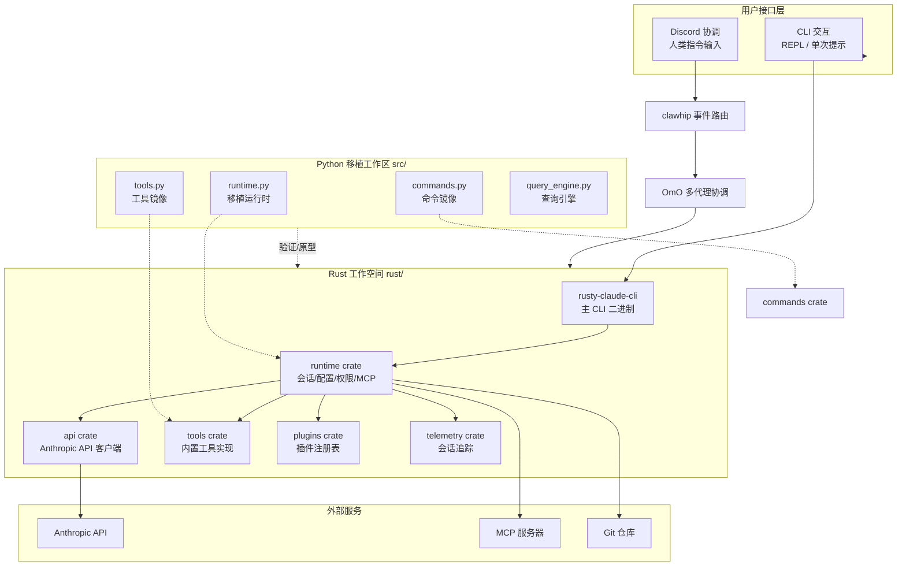

**Claw Code** 是一个由自主编码代理（autonomous coding agents）协作构建的开源项目，展示了一种新型软件开发范式：**人类设定方向，编码代理（claws）执行劳动**。本项目包含 Rust 和 Python 双语言实现，核心目标是构建一个高性能的 CLI 代理 harness，支持与 Anthropic API 的交互、工具系统编排、会话管理和多代理协调。

本项目并非由传统人类开发团队维护，而是通过 **clawhip**、**oh-my-codex (OmX)** 和 **oh-my-openagent (OmO)** 组成的协调系统，实现并行编码会话、事件驱动编排和自动恢复循环。代码库本身即是这一自主开发系统的产物和证明 [README.md](README.md#L1-L50)。

## 项目定位与核心价值

Claw Code 的本质不是单一代码库，而是一个**自主软件开发系统的公开演示**。它证明了：

- 代码库可以**公开自主构建**，由编码代理而非人类结对编程主导
- 通过聊天界面（Discord）协调开发工作流
- 结构化规划/执行/审查循环可持续改进代码质量
- 人类的核心价值从编码输出转向**架构清晰度、任务分解和判断力** [PHILOSOPHY.md](PHILOSOPHY.md#L1-L115)

### 三层协调系统

| 组件 | 职责 | 仓库链接 |
|------|------|----------|
| **OmX (oh-my-codex)** | 工作流层：将简短指令转化为结构化执行协议 | [oh-my-codex](https://github.com/Yeachan-Heo/oh-my-codex) |
| **clawhip** | 事件和通知路由器：监控 git、tmux、GitHub 事件，保持通知在代理上下文窗口之外 | [clawhip](https://github.com/Yeachan-Heo/clawhip) |
| **OmO (oh-my-openagent)** | 多代理协调：处理规划、交接、分歧解决和验证循环 | [oh-my-openagent](https://github.com/code-yeongyu/oh-my-openagent) |

## 双语言架构概览

Claw Code 采用**Rust 为主、Python 为辅**的双语言实现策略。Rust 工作空间位于 `rust/` 目录，包含 9 个 crate，提供高性能 CLI 和运行时引擎；Python 工作区位于 `src/` 目录，作为移植验证和原型开发空间。



**架构说明**：
- 用户通过 CLI 或 Discord 与系统交互
- Rust 工作空间是**主要生产环境**，包含完整的运行时引擎
- Python 工作区用于**移植验证和原型开发**，镜像 Rust 功能
- 外部服务包括 Anthropic API、MCP 服务器和 Git 仓库 [rust/README.md](rust/README.md#L1-L208) [USAGE.md](USAGE.md#L1-L160)

## 项目结构可视化

```
claw-code/
├── rust/                          # Rust 工作空间（主实现）
│   ├── crates/
│   │   ├── api/                   # Anthropic API 客户端 + SSE 流
│   │   ├── commands/              # 斜杠命令注册表
│   │   ├── mock-anthropic-service/# 本地 Mock 服务
│   │   ├── plugins/               # 插件系统
│   │   ├── runtime/               # 会话/配置/权限/MCP 核心
│   │   ├── rusty-claude-cli/      # 主 CLI 二进制
│   │   ├── telemetry/             # 会话追踪
│   │   └── tools/                 # 工具实现
│   └── scripts/                   # 测试脚本
├── src/                           # Python 移植工作区
│   ├── runtime.py                 # 移植运行时
│   ├── tools.py                   # 工具镜像
│   ├── commands.py                # 命令镜像
│   ├── query_engine.py            # 查询引擎
│   └── main.py                    # CLI 入口
├── tests/                         # Python 验证测试
├── assets/                        # 项目资源图片
└── 文档文件                        # README/USAGE/PHILOSOPHY 等
```

## 核心功能特性

| 功能类别 | 具体功能 | 实现状态 |
|----------|----------|----------|
| **API 集成** | Anthropic API + 流式响应 | ✅ 已完成 |
| | OAuth 登录/登出 | ✅ 已完成 |
| **交互模式** | 交互式 REPL (rustyline) | ✅ 已完成 |
| | 单次提示模式 | ✅ 已完成 |
| | JSON 输出（自动化脚本） | ✅ 已完成 |
| **工具系统** | Bash/文件读写/编辑/grep/glob | ✅ 已完成 |
| | Web 搜索/抓取 | ✅ 已完成 |
| | 子代理编排 | ✅ 已完成 |
| **会话管理** | 会话持久化与恢复 | ✅ 已完成 |
| | 成本追踪与使用显示 | ✅ 已完成 |
| | Todo 追踪 | ✅ 已完成 |
| **扩展能力** | MCP 服务器生命周期 | ✅ 已完成 |
| | 插件系统 | 📋 计划中 |
| | Skills 注册表 | 📋 计划中 |
| **开发工具** | Mock 奇偶性测试框架 | ✅ 已完成 |
| | 配置层次结构 | ✅ 已完成 |

## 快速能力验证

构建并运行 Rust CLI：

```bash
cd rust
cargo build --workspace
./target/debug/claw prompt "summarize this repository"
```

验证 Python 移植工作区：

```bash
python3 -m src.main summary
python3 -m src.main manifest
python3 -m unittest discover -s tests -v
```

运行 Mock 奇偶性测试：

```bash
cd rust
./scripts/run_mock_parity_harness.sh
```

## 文档阅读路径建议

本 Wiki 采用 **Diátactics 方法论** 组织内容，建议按以下顺序阅读：

### 入门阶段（开始使用）
1. 当前位置：**[概述](1-gai-shu)** ← 你在这里
2. 下一步：**[快速开始](2-kuai-su-kai-shi)** — 安装与基础使用
3. 深入理解项目理念：
   - **[项目愿景与价值主张](3-xiang-mu-yuan-jing-yu-jie-zhi-zhu-zhang)**
   - **[自主开发哲学](4-zi-zhu-kai-fa-zhe-xue)**
   - **[生态系统组件介绍](5-sheng-tai-xi-tong-zu-jian-jie-shao)**
4. 环境搭建：
   - **[前置依赖与安装](6-qian-zhi-yi-lai-yu-an-zhuang)**
   - **[认证与配置](7-ren-zheng-yu-pei-zhi)**

### 进阶阶段（深入理解）
完成入门后，可进入架构与核心模块学习：
- **架构概览**：[双语言实现架构](8-shuang-yu-yan-shi-xian-jia-gou)、[Rust 工作空间结构](9-rust-gong-zuo-kong-jian-jie-gou)
- **核心模块**：[运行时引擎](11-yun-xing-shi-yin-qing-yu-dui-hua-xun-huan)、[工具系统](12-gong-ju-xi-tong-shi-xian)
- **高级主题**：[自主开发工作流设计](26-zi-zhu-kai-fa-gong-zuo-liu-she-ji)、[事件驱动协调系统](27-shi-jian-qu-dong-xie-diao-xi-tong)

## 关键设计原则

1. **人类接口是 Discord**：真正的交互界面不是终端，而是 Discord 频道。人类输入指令后可离开，代理系统自动完成规划、执行、测试和推送 [PHILOSOPHY.md](PHILOSOPHY.md#L20-L30)

2. **瓶颈已转移**：当代理系统可在数小时内重建代码库时，稀缺资源变为**架构清晰度、任务分解、判断力和品味** [PHILOSOPHY.md](PHILOSOPHY.md#L55-L65)

3. **代码是证据，协调系统是产品**：本仓库展示的不是最终代码文件，而是**产生这些文件的协调系统** [PHILOSOPHY.md](PHILOSOPHY.md#L8-L15)

4. **双语言验证策略**：Rust 作为生产实现，Python 作为移植验证层，两者保持功能镜像以确保正确性 [README.md](README.md#L55-L80)

## 社区与资源

- **UltraWorkers Discord**：[加入社区](https://discord.gg/6ztZB9jvWq)
- **相关项目**：[clawhip](https://github.com/Yeachan-Heo/clawhip)、[oh-my-openagent](https://github.com/code-yeongyu/oh-my-openagent)、[oh-my-claudecode](https://github.com/Yeachan-Heo/oh-my-claudecode)
- **公开说明**：[Sigrid Jin 的 Twitter 解释](https://x.com/realsigridjin/status/2039472968624185713)

---

**下一步建议**：继续阅读 **[快速开始](2-kuai-su-kai-shi)** 了解安装步骤和基础使用命令。