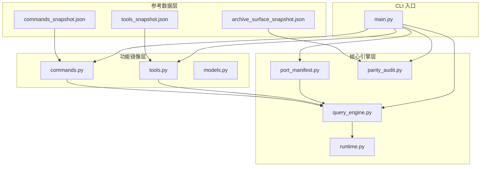
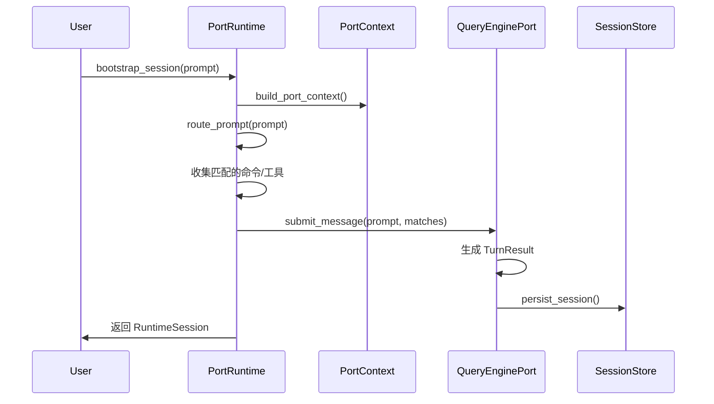

Python 移植工作区是 claw-code 项目的核心实现层，负责将原始 TypeScript/JavaScript 代码库系统地迁移到 Python 生态系统。该工作区采用**镜像架构**（Mirror Architecture）设计原则，通过快照驱动的方式保持与原始代码库的功能奇偶性，同时提供独立的 Python 原生实现。

工作区的核心目标不是简单翻译代码，而是建立一个可验证的移植框架：通过参考数据快照记录原始系统的命令和工具清单，在 Python 侧重建等效的功能接口，并通过奇偶性审计工具持续追踪移植进度。这种设计确保了移植过程的可追溯性和可验证性。

Sources: [README.md](README.md#L47-L62), [src/parity_audit.py](src/parity_audit.py#L1-L50)

## 工作区架构概览

Python 移植工作区采用分层架构设计，各模块职责清晰且相互协作。下图展示了核心组件及其数据流关系：



工作区的模块组织遵循功能域划分原则。根目录下的核心模块（约 20 个 Python 文件）提供基础架构能力，包括入口点 `main.py`、数据模型 `models.py`、端口清单 `port_manifest.py` 和奇偶性审计 `parity_audit.py`。子目录包（如 `assistant/`、`bridge/`、`utils/` 等）镜像原始 TypeScript 代码库的目录结构，每个包通过 `MODULE_COUNT` 和 `SAMPLE_FILES` 等元数据暴露归档元信息。

Sources: [src/main.py](src/main.py#L1-L50), [src/port_manifest.py](src/port_manifest.py#L1-L53), [tests/test_porting_workspace.py](tests/test_porting_workspace.py#L88-L94)

## 参考数据与快照系统

参考数据层是移植工作区的基石，存储于 `src/reference_data/` 目录下。该层包含三类关键快照文件，共同构成移植验证的基准：

| 快照文件 | 内容描述 | 关键指标 |
|---------|---------|---------|
| `archive_surface_snapshot.json` | 原始 TypeScript 代码库的表面结构快照 | 根文件 19 个、根目录 34 个、TS 类文件 1902 个 |
| `commands_snapshot.json` | 命令清单镜像（207 个条目） | 每个条目包含 name、source_hint、responsibility |
| `tools_snapshot.json` | 工具清单镜像（184 个条目） | 每个条目包含 name、source_hint、responsibility |

快照系统采用惰性加载策略。`commands.py` 和 `tools.py` 模块使用 `@lru_cache(maxsize=1)` 装饰器确保快照文件仅在首次访问时解析，后续调用直接返回缓存的元组。这种设计优化了 CLI 工具的启动性能，同时保持数据的不可变性。

```python
# src/commands.py 中的快照加载模式
@lru_cache(maxsize=1)
def load_command_snapshot() -> tuple[PortingModule, ...]:
    raw_entries = json.loads(SNAPSHOT_PATH.read_text())
    return tuple(
        PortingModule(
            name=entry['name'],
            responsibility=entry['responsibility'],
            source_hint=entry['source_hint'],
            status='mirrored',
        )
        for entry in raw_entries
    )
```

`source_hint` 字段记录原始 TypeScript 文件路径（如 `commands/add-dir/add-dir.tsx`），为开发者提供跨语言追溯能力。`responsibility` 字段描述模块职责，支持语义搜索和路由匹配。

Sources: [src/commands.py](src/commands.py#L10-L35), [src/tools.py](src/tools.py#L18-L35), [src/reference_data/archive_surface_snapshot.json](src/reference_data/archive_surface_snapshot.json#L1-L63)

## 奇偶性审计框架

奇偶性审计（Parity Audit）是移植工作区的核心验证机制，由 `parity_audit.py` 模块实现。该框架通过对比 Python 工作区与原始 TypeScript 归档的结构覆盖率，量化移植进度。

审计结果以 `ParityAuditResult` 数据类形式呈现，包含六个维度的覆盖率指标：

| 指标名称 | 计算方式 | 意义 |
|---------|---------|------|
| `root_file_coverage` | 已移植根文件数 / 原始根文件数 | 顶层入口文件移植完成度 |
| `directory_coverage` | 已移植目录数 / 原始目录数 | 子包结构镜像完整度 |
| `total_file_ratio` | Python 文件数 / TS 类文件数 | 整体代码量对比 |
| `command_entry_ratio` | 镜像命令数 / 原始命令数 | 命令系统覆盖度 |
| `tool_entry_ratio` | 镜像工具数 / 原始工具数 | 工具系统覆盖度 |
| `missing_*_targets` | 缺失目标列表 | 待完成移植项清单 |

审计流程首先检查本地归档目录是否存在（`ARCHIVE_ROOT.exists()`）。若归档可用，则遍历当前工作区的文件集合，与预定义的映射表（`ARCHIVE_ROOT_FILES` 和 `ARCHIVE_DIR_MAPPINGS`）进行匹配。映射表显式声明 TypeScript 文件到 Python 文件的对应关系，例如 `QueryEngine.ts` → `QueryEngine.py`、`commands.ts` → `commands.py`。

```python
# src/parity_audit.py 中的映射定义
ARCHIVE_ROOT_FILES = {
    'QueryEngine.ts': 'QueryEngine.py',
    'Task.ts': 'task.py',
    'Tool.ts': 'Tool.py',
    'commands.ts': 'commands.py',
    # ... 共 19 个根文件映射
}

ARCHIVE_DIR_MAPPINGS = {
    'assistant': 'assistant',
    'bootstrap': 'bootstrap',
    'bridge': 'bridge',
    # ... 共 34 个目录映射
}
```

当本地归档不可用时，审计结果会明确标注"Local archive unavailable"，避免产生误导性覆盖率数据。这种设计体现了工作区对验证严谨性的要求。

Sources: [src/parity_audit.py](src/parity_audit.py#L52-L139), [tests/test_porting_workspace.py](tests/test_porting_workspace.py#L37-L45)

## 运行时引擎与会话管理

`runtime.py` 模块实现 `PortRuntime` 类，提供移植工作区的核心执行能力。运行时引擎协调上下文构建、提示路由、命令/工具执行和会话持久化，形成完整的对话循环。

运行时会话的生命周期包含以下阶段：



`route_prompt` 方法实现基于令牌匹配的语义路由。它将输入提示分词后，与命令和工具清单的 `name`、`source_hint`、`responsibility` 字段进行匹配评分，返回按分数排序的 `RoutedMatch` 列表。路由策略优先保证命令和工具各至少一个匹配，再按分数补充剩余名额。

`bootstrap_session` 方法整合多个子系统：构建端口上下文、执行设置报告、生成系统初始化消息、路由提示、执行匹配的命令/工具、提交消息到查询引擎、持久化会话。最终返回的 `RuntimeSession` 对象包含完整的执行轨迹，可通过 `as_markdown()` 方法渲染为结构化报告。

Sources: [src/runtime.py](src/runtime.py#L1-L193), [src/context.py](src/context.py#L1-L50)

## 查询引擎与对话状态

`query_engine.py` 模块实现 `QueryEnginePort` 类，负责管理对话状态、令牌预算和会话持久化。查询引擎是运行时与底层存储之间的抽象层。

引擎配置由 `QueryEngineConfig` 数据类定义，包含五个关键参数：

| 参数 | 默认值 | 作用 |
|-----|-------|------|
| `max_turns` | 8 | 单会话最大对话轮数 |
| `max_budget_tokens` | 2000 | 令牌预算上限（基于词数估算） |
| `compact_after_turns` | 12 | 触发消息压缩的轮数阈值 |
| `structured_output` | False | 是否启用 JSON 结构化输出 |
| `structured_retry_limit` | 2 | 结构化输出渲染重试次数 |

`submit_message` 方法是引擎的核心接口，接收提示、匹配的命令/工具列表和权限拒绝列表，返回 `TurnResult`。方法内部执行以下操作：检查轮数限制、格式化输出摘要、更新令牌使用统计、追加消息到可变列表、刷新转录存储、触发压缩逻辑（若需要）。

```python
# src/query_engine.py 中的提交逻辑
def submit_message(
    self,
    prompt: str,
    matched_commands: tuple[str, ...] = (),
    matched_tools: tuple[str, ...] = (),
    denied_tools: tuple[PermissionDenial, ...] = (),
) -> TurnResult:
    if len(self.mutable_messages) >= self.config.max_turns:
        # 轮数超限处理
        ...
    # 生成输出并更新状态
    ...
```

`stream_submit_message` 方法提供生成器接口，产出事件流（`message_start`、`command_match`、`tool_match`、`message_delta`、`message_stop`），支持流式 UI 集成。`persist_session` 方法将当前会话状态保存到 `session_store`，返回持久化路径。

Sources: [src/query_engine.py](src/query_engine.py#L1-L194), [src/session_store.py](src/session_store.py#L1-L50)

## CLI 工具与诊断命令

`main.py` 模块提供完整的命令行界面，通过 `argparse` 定义 20 余个子命令，覆盖工作区的诊断、检查和执行功能。CLI 设计遵循"自举优先"原则——所有核心功能都可通过 CLI 访问，便于自动化测试和脚本集成。

主要命令分类如下：

| 命令类别 | 子命令 | 用途 |
|---------|-------|------|
| **概览类** | `summary`、`manifest`、`subsystems` | 查看工作区状态和模块清单 |
| **审计类** | `parity-audit`、`setup-report` | 执行奇偶性检查和设置报告 |
| **清单类** | `commands`、`tools`、`command-graph`、`tool-pool` | 浏览命令/工具镜像 |
| **路由类** | `route`、`bootstrap`、`show-command`、`show-tool` | 提示路由和条目详情 |
| **执行类** | `exec-command`、`exec-tool`、`turn-loop` | 执行镜像命令/工具 |
| **会话类** | `load-session`、`flush-transcript` | 会话加载和转录刷新 |
| **模式类** | `remote-mode`、`ssh-mode`、`teleport-mode` | 模拟运行时分支模式 |

典型使用示例：

```bash
# 查看移植工作区摘要
python3 -m src.main summary

# 执行奇偶性审计
python3 -m src.main parity-audit

# 查询包含"review"的命令
python3 -m src.main commands --limit 10 --query review

# 执行镜像命令
python3 -m src.main exec-command review "inspect security review"

# 运行多轮对话循环
python3 -m src.main turn-loop "review MCP tool" --max-turns 3 --structured-output
```

CLI 支持丰富的过滤选项。`commands` 命令可通过 `--no-plugin-commands` 和 `--no-skill-commands` 排除特定类别；`tools` 命令支持 `--simple-mode`（仅显示基础工具）、`--no-mcp`（排除 MCP 工具）、`--deny-prefix`（按前缀拒绝）等权限过滤。

Sources: [src/main.py](src/main.py#L1-L214), [tests/test_porting_workspace.py](tests/test_porting_workspace.py#L47-L150)

## 数据模型与类型系统

`models.py` 模块定义工作区的核心数据类，为各子系统提供统一的类型基础。模型设计遵循不可变优先原则，大部分数据类使用 `frozen=True` 确保运行时安全性。

核心模型包括：

- **`Subsystem`**：描述顶层 Python 模块包，包含名称、路径、文件数和备注
- **`PortingModule`**：表示单个镜像模块，包含名称、职责、来源提示和状态（`planned`/`mirrored`）
- **`PermissionDenial`**：记录工具权限拒绝，包含工具名称和拒绝原因
- **`UsageSummary`**：追踪令牌使用，提供 `add_turn` 方法累加输入/输出词数
- **`PortingBacklog`**：聚合模块列表，提供 `summary_lines` 方法生成格式化摘要

```python
# src/models.py 中的核心模型
@dataclass(frozen=True)
class PortingModule:
    name: str
    responsibility: str
    source_hint: str
    status: str = 'planned'

@dataclass(frozen=True)
class UsageSummary:
    input_tokens: int = 0
    output_tokens: int = 0

    def add_turn(self, prompt: str, output: str) -> 'UsageSummary':
        return UsageSummary(
            input_tokens=self.input_tokens + len(prompt.split()),
            output_tokens=self.output_tokens + len(output.split()),
        )
```

`UsageSummary` 采用简化的令牌估算策略：以空格分词的词数近似令牌数。这种设计牺牲了精确性以换取实现简洁性，适用于移植工作区的验证场景。生产环境可替换为真实的令牌计数器。

Sources: [src/models.py](src/models.py#L1-L50)

## 测试策略与验证

工作区的测试策略集中于 `tests/test_porting_workspace.py`，采用单元测试验证核心功能的可运行性和一致性。测试设计遵循"可执行文档"理念——每个测试用例同时验证功能并记录预期行为。

测试覆盖以下维度：

| 测试类别 | 测试方法 | 验证目标 |
|---------|---------|---------|
| **清单计数** | `test_manifest_counts_python_files` | 确保 Python 文件数≥20 且顶层模块非空 |
| **摘要渲染** | `test_query_engine_summary_mentions_workspace` | 验证摘要包含关键标识符 |
| **CLI 可运行** | `test_cli_summary_runs`、`test_parity_audit_runs` | 确保 CLI 子命令可执行并输出预期内容 |
| **覆盖率验证** | `test_root_file_coverage_is_complete_when_local_archive_exists` | 当归档存在时验证根文件覆盖率 100% |
| **快照非平凡** | `test_command_and_tool_snapshots_are_nontrivial` | 确保命令数≥150、工具数≥100 |
| **子包元数据** | `test_subsystem_packages_expose_archive_metadata` | 验证子包暴露 `MODULE_COUNT` 和 `SAMPLE_FILES` |
| **执行流** | `test_exec_command_and_tool_cli_run` | 验证命令/工具执行返回镜像消息 |
| **会话持久化** | `test_load_session_cli_runs` | 验证会话加载可恢复消息历史 |
| **权限过滤** | `test_tool_permission_filtering_cli_runs` | 验证 `--deny-prefix` 正确排除工具 |
| **远程模式** | `test_remote_mode_clis_run` | 验证远程/SSH/teleport 模式 CLI 可运行 |

测试套件通过 `unittest discover` 运行，支持 CI 集成。关键测试（如覆盖率验证）采用条件断言：仅当本地归档存在时才执行严格检查，避免环境依赖导致测试失败。

Sources: [tests/test_porting_workspace.py](tests/test_porting_workspace.py#L1-L249)

## 与 Rust 工作空间的关系

Python 移植工作区与 `rust/` 目录下的 Rust 工作空间形成双语言实现架构。两者共享相同的设计理念和奇偶性测试框架，但在实现策略上有所差异。

| 维度 | Python 工作区 | Rust 工作空间 |
|-----|-------------|-------------|
| **入口点** | `src/main.py` | `rust/crates/rusty-claude-cli` |
| **构建系统** | 无需编译，直接运行 | Cargo 构建，需编译 |
| **奇偶性测试** | `src/parity_audit.py` | `rust/crates/compat-harness` |
| **Mock 服务** | 内置模拟 | `mock-anthropic-service` crate |
| **目标受众** | 快速原型、脚本集成 | 生产部署、性能关键路径 |

Rust 工作空间包含更完整的运行时实现，包括 TUI 增强、插件系统和遥测集成。Python 工作区则侧重于架构验证和快速迭代。两者通过 `MOCK_PARITY_HARNESS.md` 和 `mock_parity_scenarios.json` 共享测试场景定义。

对于需要深入了解 Rust 实现的开发者，建议继续阅读 [Rust 工作空间结构](9-rust-gong-zuo-kong-jian-jie-gou)。对于关注运行时引擎细节的开发者，可参考 [运行时引擎与对话循环](11-yun-xing-shi-yin-qing-yu-dui-hua-xun-huan)。

Sources: [README.md](README.md#L23-L27), [rust/README.md](rust/README.md#L1-L50)

## 快速开始

以下命令序列帮助开发者快速熟悉 Python 移植工作区：

```bash
# 1. 查看工作区清单
python3 -m src.main manifest

# 2. 查看移植摘要
python3 -m src.main summary

# 3. 列出顶层子包
python3 -m src.main subsystems --limit 16

# 4. 执行奇偶性审计（需本地归档）
python3 -m src.main parity-audit

# 5. 浏览命令清单
python3 -m src.main commands --limit 10

# 6. 浏览工具清单
python3 -m src.main tools --limit 10

# 7. 运行测试套件
python3 -m unittest discover -s tests -v
```

对于希望深入核心模块实现的开发者，建议按以下顺序阅读代码：

1. `src/models.py` — 理解数据模型
2. `src/port_manifest.py` — 理解工作区结构
3. `src/commands.py` / `src/tools.py` — 理解镜像系统
4. `src/parity_audit.py` — 理解验证机制
5. `src/query_engine.py` — 理解对话引擎
6. `src/runtime.py` — 理解运行时协调

对于需要查看工具系统详细设计的开发者，可参考 [工具系统实现](12-gong-ju-xi-tong-shi-xian)。对于关注命令系统的开发者，可参考 [命令与斜杠命令系统](13-ming-ling-yu-xie-gang-ming-ling-xi-tong)。