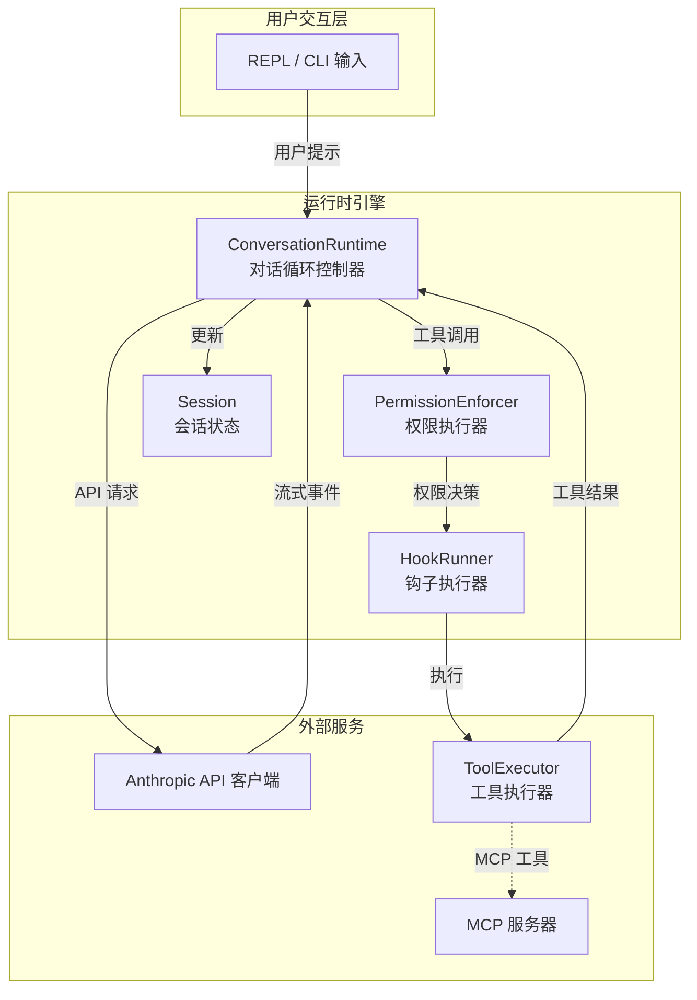
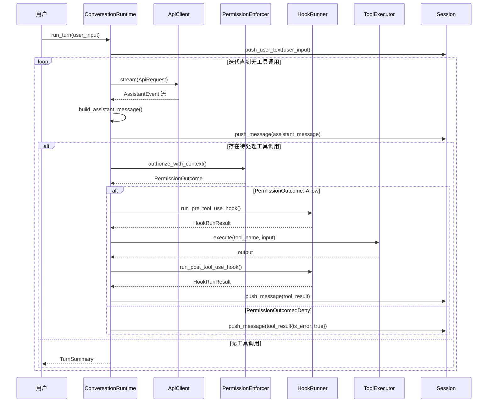
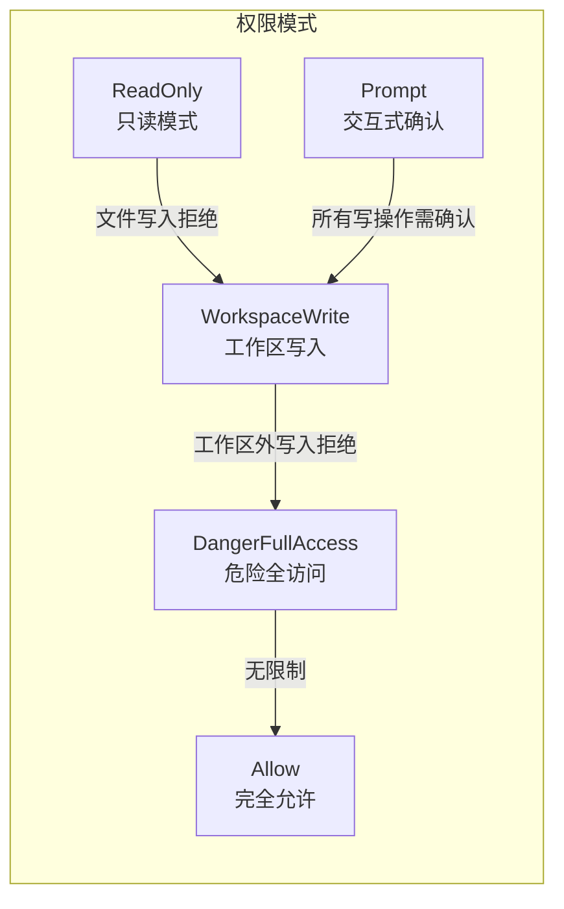
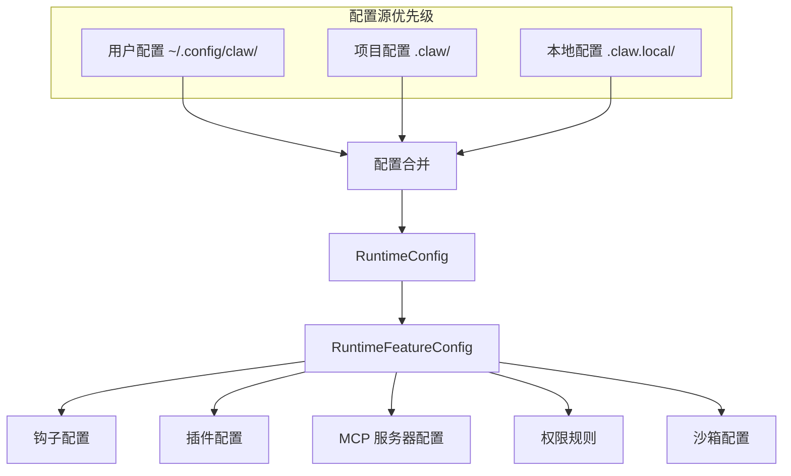

运行时引擎是 claw-code 项目的核心执行层，负责协调**用户输入**、**模型推理**、**工具执行**与**会话状态管理**的完整闭环。本页面深入解析双语言实现下的对话循环机制、权限门控流程、钩子生命周期以及会话压缩策略。

## 核心架构概览

项目采用**双语言并行实现**架构：Rust 原生实现位于 `rust/crates/runtime` crate，Python 移植工作区位于 `src/runtime.py` 与 `src/query_engine.py`。两者遵循相同的概念模型，但在实现细节上体现各自语言特性。



**关键组件职责**：

| 组件 | Rust 路径 | Python 路径 | 核心职责 |
|------|----------|-------------|----------|
| 对话运行时 | `conversation.rs` | `runtime.py::PortRuntime` | 协调模型循环、工具执行与钩子调用 |
| 会话状态 | `session.rs` | `session_store.py` | 持久化消息历史、Token 用量追踪 |
| 权限策略 | `permission_enforcer.rs` | `permissions.py` | 基于模式的工具执行门控 |
| 钩子系统 | `hooks.rs` | `hooks/__init__.py` | Pre/Post 工具生命周期拦截 |
| 会话压缩 | `compact.rs` | `query_engine.py::compact_messages_if_needed` | Token 阈值触发的历史摘要 |

Sources: [conversation.rs](rust/crates/runtime/src/conversation.rs#L125-L139), [runtime.py](src/runtime.py#L89-L107), [session.rs](rust/crates/runtime/src/session.rs#L74-L84)

## 对话循环执行流程

对话循环是运行时的核心状态机，以**迭代方式**处理模型响应中的工具调用请求，直到达到终止条件。

### Rust 实现的主循环逻辑

`ConversationRuntime::run_turn` 方法实现完整的单次对话回合：



循环终止条件包括：
1. **模型响应不含工具调用** — 正常完成
2. **达到最大迭代次数** — 防止无限循环 [`conversation.rs#L314-L320`](rust/crates/runtime/src/conversation.rs#L314-L320)
3. **API 调用失败** — 错误传播

Sources: [conversation.rs](rust/crates/runtime/src/conversation.rs#L296-L485)

### Python 移植的简化实现

Python 版本的 `PortRuntime` 采用更简化的设计，将对话循环委托给 `QueryEnginePort`：

```python
def run_turn_loop(self, prompt: str, limit: int = 5, max_turns: int = 3) -> list[TurnResult]:
    engine = QueryEnginePort.from_workspace()
    engine.config = QueryEngineConfig(max_turns=max_turns)
    matches = self.route_prompt(prompt, limit=limit)
    results: list[TurnResult] = []
    for turn in range(max_turns):
        turn_prompt = prompt if turn == 0 else f'{prompt} [turn {turn + 1}]'
        result = engine.submit_message(turn_prompt, command_names, tool_names, ())
        results.append(result)
        if result.stop_reason != 'completed':
            break
    return results
```

Python 版本的核心差异：
- **无流式处理** — 直接返回完整响应
- **无权限门控** — 依赖模拟的 `PermissionDenial` 推断
- **无钩子执行** — 钩子系统尚未完全移植

Sources: [runtime.py](src/runtime.py#L154-L167), [query_engine.py](src/query_engine.py#L61-L104)

## 权限门控机制

权限系统采用**模式驱动**的策略，在工具执行前进行拦截检查。

### 权限模式层次



`PermissionEnforcer` 根据当前模式执行差异化检查：

| 操作类型 | ReadOnly | WorkspaceWrite | Allow | DangerFullAccess | Prompt |
|----------|----------|----------------|-------|------------------|--------|
| 文件读取 | ✅ | ✅ | ✅ | ✅ | ✅ |
| 工作区内写入 | ❌ | ✅ | ✅ | ✅ | ⚠️ 需确认 |
| 工作区外写入 | ❌ | ❌ | ✅ | ✅ | ⚠️ 需确认 |
| Bash 只读命令 | ✅ | ✅ | ✅ | ✅ | ⚠️ 需确认 |
| Bash 写命令 | ❌ | ✅ | ✅ | ✅ | ⚠️ 需确认 |

Sources: [permission_enforcer.rs](rust/crates/runtime/src/permission_enforcer.rs#L34-L134), [permissions.rs](rust/crates/runtime/src/permissions.rs#L1-L50)

### 权限决策流程

工具调用时的权限检查序列：

1. **PreToolUse 钩子先行** — 钩子可覆盖权限决策
2. **策略授权检查** — `PermissionPolicy::authorize_with_context`
3. **结果分支**：
   - `Allow` → 执行工具
   - `Deny` → 返回错误工具结果

```rust
let permission_outcome = if pre_hook_result.is_cancelled() {
    PermissionOutcome::Deny { reason: "PreToolUse hook cancelled" }
} else if let Some(prompt) = prompter.as_mut() {
    self.permission_policy.authorize_with_context(&tool_name, &effective_input, &permission_context, Some(*prompt))
} else {
    self.permission_policy.authorize_with_context(&tool_name, &effective_input, &permission_context, None)
};
```

Sources: [conversation.rs](rust/crates/runtime/src/conversation.rs#L370-L415)

## 钩子生命周期系统

钩子系统允许在工具执行的关键节点注入自定义逻辑，支持**审计**、**修改**与**拦截**行为。

### 钩子事件类型

| 事件 | 触发时机 | 可修改内容 |
|------|----------|------------|
| `PreToolUse` | 工具执行前 | 输入参数、权限覆盖、取消执行 |
| `PostToolUse` | 工具成功执行后 | 输出内容、添加消息 |
| `PostToolUseFailure` | 工具执行失败后 | 错误信息、恢复建议 |

### 钩子执行结果结构

`HookRunResult` 封装钩子的决策输出：

```rust
pub struct HookRunResult {
    denied: bool,           // 拒绝执行
    failed: bool,           // 钩子自身失败
    cancelled: bool,        // 用户取消
    messages: Vec<String>,  // 附加消息
    permission_override: Option<PermissionOverride>,  // 权限覆盖
    permission_reason: Option<String>,  // 决策原因
    updated_input: Option<String>,      // 修改后的输入
}
```

Sources: [hooks.rs](rust/crates/runtime/src/hooks.rs#L80-L149)

### 钩子配置与执行

钩子命令通过运行时配置注册，在对应生命周期阶段通过子进程执行：

```rust
pub struct RuntimeHookConfig {
    pre_tool_use: Vec<String>,      // PreToolUse 钩子命令列表
    post_tool_use: Vec<String>,     // PostToolUse 钩子命令列表
    post_tool_use_failure: Vec<String>,  // PostToolUseFailure 钩子命令列表
}
```

钩子执行支持：
- **异步中止信号** — `HookAbortSignal` 允许用户中断长时间运行的钩子
- **进度报告** — `HookProgressReporter` 向 UI 反馈执行状态
- **上下文注入** — 工具名称、输入、输出作为 JSON 传递给钩子命令

Sources: [hooks.rs](rust/crates/runtime/src/hooks.rs#L60-L78), [config.rs](rust/crates/runtime/src/config.rs#L67-L72)

## 会话压缩策略

长对话会话会触发**自动压缩**机制，将早期消息摘要化以控制 Token 消耗。

### 压缩触发条件

```rust
fn maybe_auto_compact(&mut self) -> Option<AutoCompactionEvent> {
    if self.usage_tracker.cumulative_usage().input_tokens
        < self.auto_compaction_input_tokens_threshold
    {
        return None;
    }
    // 执行压缩...
}
```

默认阈值由环境变量 `CLAUDE_CODE_AUTO_COMPACT_INPUT_TOKENS` 控制，默认值为 **100,000 tokens**。

Sources: [conversation.rs](rust/crates/runtime/src/conversation.rs#L517-L540), [compact.rs](rust/crates/runtime/src/compact.rs#L18-L22)

### 压缩算法流程

```mermaid
flowchart TD
    Start[会话 Token 超阈值] --> Check{存在已有摘要？}
    Check -->|是 | Extract[提取现有摘要]
    Check -->|否 | StartPrefix[""]
    Extract --> Merge[合并新旧摘要]
    StartPrefix --> Summarize[摘要化旧消息]
    Summarize --> Merge
    Merge --> Preserve[保留最近 N 条消息]
    Preserve --> Build[构建系统提示延续消息]
    Build --> Replace[替换会话消息列表]
    Replace --> Done[压缩完成]
```

压缩后的会话结构：
1. **系统消息** — 包含摘要与延续指令
2. **保留消息** — 最近 4 条消息（可配置）

```rust
pub struct CompactionConfig {
    pub preserve_recent_messages: usize,  // 默认 4
    pub max_estimated_tokens: usize,      // 默认 10,000
}
```

Sources: [compact.rs](rust/crates/runtime/src/compact.rs#L96-L139)

### Python 版本的简化压缩

Python 移植采用更简单的策略 — 直接截断消息列表：

```python
def compact_messages_if_needed(self) -> None:
    if len(self.mutable_messages) > self.config.compact_after_turns:
        self.mutable_messages[:] = self.mutable_messages[-self.config.compact_after_turns:]
    self.transcript_store.compact(self.config.compact_after_turns)
```

配置参数 `compact_after_turns` 默认值为 **12 轮**。

Sources: [query_engine.py](src/query_engine.py#L129-L132)

## 会话持久化与恢复

### Rust 会话存储

`Session` 结构体支持 JSON 序列化与文件持久化：

```rust
pub struct Session {
    pub version: u32,
    pub session_id: String,
    pub created_at_ms: u64,
    pub updated_at_ms: u64,
    pub messages: Vec<ConversationMessage>,
    pub compaction: Option<SessionCompaction>,
    pub fork: Option<SessionFork>,
    persistence: Option<SessionPersistence>,
}
```

持久化特性：
- **自动旋转** — 单文件超过 256KB 后创建备份（最多保留 3 个）
- **分支支持** — `SessionFork` 记录父会话与分支名称
- **压缩历史** — `SessionCompaction` 记录压缩次数与移除消息数

Sources: [session.rs](rust/crates/runtime/src/session.rs#L74-L84), [session.rs](rust/crates/runtime/src/session.rs#L12-L14)

### Python 会话存储

Python 版本使用简单的 JSON 文件存储：

```python
@dataclass(frozen=True)
class StoredSession:
    session_id: str
    messages: tuple[str, ...]
    input_tokens: int
    output_tokens: int
```

存储目录默认为 `.port_sessions/`，每个会话一个 JSON 文件。

Sources: [session_store.py](src/session_store.py#L8-L35)

## 配置与特性开关

运行时行为通过 `RuntimeConfig` 统一配置，支持**用户级**、**项目级**与**本地级**三层配置源：



配置加载顺序：**Local > Project > User**（后者可被前者覆盖）。

Sources: [config.rs](rust/crates/runtime/src/config.rs#L13-L64)

## 下一步阅读建议

完成本页面后，建议按以下顺序深入相关主题：

1. **[工具系统实现](12-gong-ju-xi-tong-shi-xian)** — 了解工具执行器的具体实现与 MCP 集成
2. **[权限与安全模型](14-quan-xian-yu-an-quan-mo-xing)** — 深入权限策略配置与沙箱隔离机制
3. **[会话管理与持久化](15-hui-hua-guan-li-yu-chi-jiu-hua)** — 详细探讨会话恢复、分支与历史管理
4. **[MCP 服务器生命周期](17-mcp-fu-wu-qi-sheng-ming-zhou-qi)** — 理解外部工具服务器的启动与发现流程