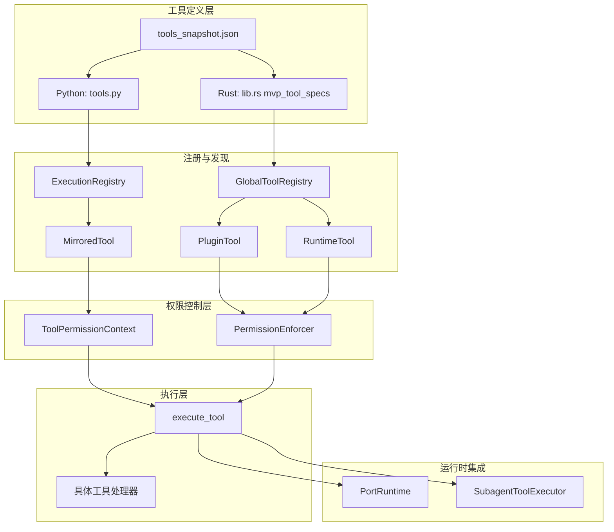
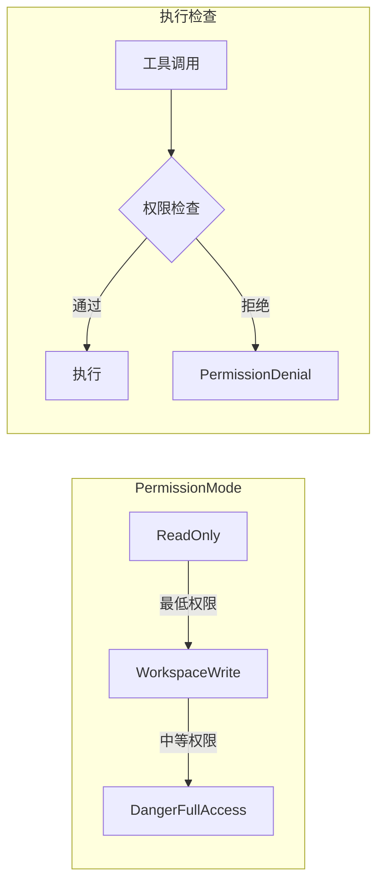
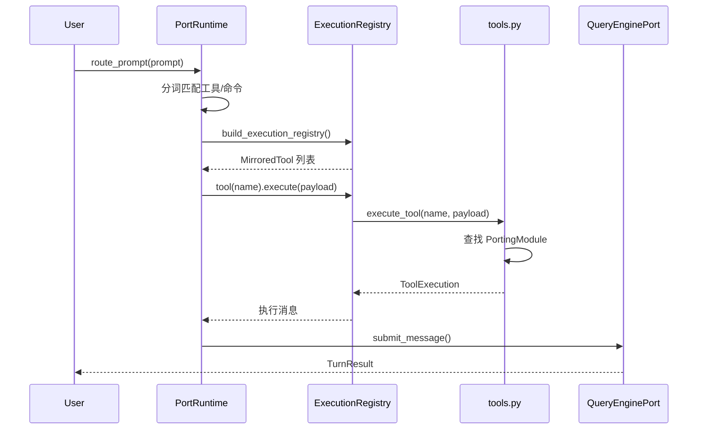

本文档深入剖析 claw-code 项目的工具系统架构，涵盖 Python 移植工作区与 Rust 原生实现的双语言设计模式。工具系统作为 AI 助手与外部环境交互的核心接口，实现了从工具定义、权限控制到执行分发的完整链路。

## 核心架构概览

工具系统采用**镜像移植（Mirrored Porting）**架构，将原始 TypeScript 实现的工具抽象为语言无关的模块定义，分别在 Python 和 Rust 两端实现。这种设计确保了功能奇偶性（parity）的同时，允许各语言利用自身生态优势。



工具定义以 JSON 快照形式存储于 [`src/reference_data/tools_snapshot.json`](src/reference_data/tools_snapshot.json#L1-L20)，包含工具名称、源路径提示和责任描述三元组。Python 端通过 `load_tool_snapshot()` 惰性加载，Rust 端则以编译期常量 `mvp_tool_specs()` 定义。

Sources: [src/tools.py](src/tools.py#L1-L35), [rust/crates/tools/src/lib.rs](rust/crates/tools/src/lib.rs#L384-L450)

## 工具定义模型

### Python 端数据模型

Python 移植工作区使用 `PortingModule` 作为工具的核心数据模型，该模型冻结（frozen）以确保不可变性：

```python
@dataclass(frozen=True)
class PortingModule:
    name: str              # 工具名称，如 "BashTool"
    responsibility: str    # 责任描述
    source_hint: str       # 原始 TypeScript 源路径
    status: str = 'planned' # 移植状态
```

工具执行结果封装为 `ToolExecution`，包含执行状态和消息：

```python
@dataclass(frozen=True)
class ToolExecution:
    name: str       # 工具名称
    source_hint: str # 源路径
    payload: str    # 输入负载
    handled: bool   # 是否成功处理
    message: str    # 执行结果消息
```

Sources: [src/models.py](src/models.py#L14-L20), [src/tools.py](src/tools.py#L14-L21)

### Rust 端工具规范

Rust 实现使用 `ToolSpec` 结构体定义工具规范，包含完整的输入 JSON Schema 和权限要求：

```rust
pub struct ToolSpec {
    pub name: &'static str,           // 工具名称
    pub description: &'static str,    // 工具描述
    pub input_schema: Value,          // JSON Schema 输入验证
    pub required_permission: PermissionMode, // 所需权限级别
}
```

MVP 工具集通过 `mvp_tool_specs()` 函数返回，涵盖 28+ 个核心工具，包括：

| 工具名称 | 权限级别 | 功能描述 |
|---------|---------|---------|
| `bash` | DangerFullAccess | 执行 shell 命令 |
| `read_file` | ReadOnly | 读取工作区文本文件 |
| `write_file` | WorkspaceWrite | 写入工作区文件 |
| `edit_file` | WorkspaceWrite | 替换文件中的文本 |
| `glob_search` | ReadOnly | 按 glob 模式查找文件 |
| `grep_search` | ReadOnly | 正则搜索文件内容 |
| `WebFetch` | ReadOnly | 获取 URL 并转换为可读文本 |
| `WebSearch` | ReadOnly | 网络搜索返回引用结果 |
| `TodoWrite` | WorkspaceWrite | 更新会话任务列表 |
| `Agent` | DangerFullAccess | 启动专用子代理任务 |
| `ToolSearch` | ReadOnly | 按名称或关键词搜索工具 |
| `REPL` | DangerFullAccess | 在类 REPL 子进程中执行代码 |
| `AskUserQuestion` | ReadOnly | 向用户提问并等待响应 |
| `TaskCreate` | DangerFullAccess | 创建后台子进程任务 |

Sources: [rust/crates/tools/src/lib.rs](rust/crates/tools/src/lib.rs#L100-L107), [rust/crates/tools/src/lib.rs](rust/crates/tools/src/lib.rs#L384-L600)

## 工具注册表系统

### 全局工具注册表（Rust）

Rust 端的 `GlobalToolRegistry` 统一管理三类工具源，确保命名空间无冲突：

```rust
pub struct GlobalToolRegistry {
    plugin_tools: Vec<PluginTool>,      // 插件提供的工具
    runtime_tools: Vec<RuntimeToolDefinition>, // 运行时动态工具
    enforcer: Option<PermissionEnforcer>, // 权限执行器
}
```

注册表构建采用**建造者模式**，通过链式调用逐步添加工具类型：

```rust
GlobalToolRegistry::builtin()
    .with_plugin_tools(plugin_tools)?
    .with_runtime_tools(runtime_tools)?
    .with_enforcer(enforcer)
```

命名冲突检测在构建时执行，确保：
1. 插件工具不与内置工具同名
2. 插件工具之间无重复命名
3. 运行时工具不与现有工具冲突

Sources: [rust/crates/tools/src/lib.rs](rust/crates/tools/src/lib.rs#L110-L180)

### 执行注册表（Python）

Python 端使用 `ExecutionRegistry` 封装可执行工具和命令，提供统一查找接口：

```python
@dataclass(frozen=True)
class ExecutionRegistry:
    commands: tuple[MirroredCommand, ...]
    tools: tuple[MirroredTool, ...]
    
    def command(self, name: str) -> MirroredCommand | None:
        # 不区分大小写查找命令
        
    def tool(self, name: str) -> MirroredTool | None:
        # 不区分大小写查找工具
```

`MirroredTool` 封装工具执行逻辑，将调用委托给底层 `execute_tool` 函数：

```python
@dataclass(frozen=True)
class MirroredTool:
    name: str
    source_hint: str

    def execute(self, payload: str) -> str:
        return execute_tool(self.name, payload).message
```

Sources: [src/execution_registry.py](src/execution_registry.py#L24-L52)

## 权限与安全模型

工具系统实现三级权限模型，通过 `PermissionMode` 枚举定义：



### 权限级别定义

| 权限级别 | 适用工具 | 安全约束 |
|---------|---------|---------|
| `ReadOnly` | read_file, glob_search, grep_search, WebFetch | 仅读取操作，无副作用 |
| `WorkspaceWrite` | write_file, edit_file, TodoWrite, Config | 限于工作区目录的写入 |
| `DangerFullAccess` | bash, Agent, REPL, PowerShell, TaskCreate | 需要显式用户确认 |

### Python 权限上下文

Python 端使用 `ToolPermissionContext` 实现基于名称和前缀的阻止列表：

```python
@dataclass(frozen=True)
class ToolPermissionContext:
    deny_names: frozenset[str]       # 明确拒绝的工具名
    deny_prefixes: tuple[str, ...]   # 拒绝的前缀模式
    
    def blocks(self, tool_name: str) -> bool:
        lowered = tool_name.lower()
        return lowered in self.deny_names or \
               any(lowered.startswith(prefix) for prefix in self.deny_prefixes)
```

过滤函数 `filter_tools_by_permission_context` 在工具获取时应用权限约束：

```python
def get_tools(
    simple_mode: bool = False,
    include_mcp: bool = True,
    permission_context: ToolPermissionContext | None = None,
) -> tuple[PortingModule, ...]:
    tools = list(PORTED_TOOLS)
    # 简单模式仅保留核心工具
    if simple_mode:
        tools = [m for m in tools if m.name in {'BashTool', 'FileReadTool', 'FileEditTool'}]
    # 排除 MCP 工具
    if not include_mcp:
        tools = [m for m in tools if 'mcp' not in m.name.lower()]
    # 应用权限过滤
    return filter_tools_by_permission_context(tuple(tools), permission_context)
```

Sources: [src/permissions.py](src/permissions.py#L5-L21), [src/tools.py](src/tools.py#L54-L68)

### Rust 权限执行器

Rust 端使用 `PermissionEnforcer` 在执行前进行权限检查：

```rust
fn execute_tool_with_enforcer(
    enforcer: Option<&PermissionEnforcer>,
    name: &str,
    input: &Value,
) -> Result<String, String> {
    match name {
        "bash" => {
            maybe_enforce_permission_check(enforcer, name, input)?; // 权限检查
            from_value::<BashCommandInput>(input).and_then(run_bash)
        }
        "read_file" => { /* ... */ }
        // ... 其他工具
    }
}
```

`SubagentToolExecutor` 实现 `ToolExecutor` trait，在子代理上下文中执行工具时进行双重验证：

```rust
impl ToolExecutor for SubagentToolExecutor {
    fn execute(&mut self, tool_name: &str, input: &str) -> Result<String, ToolError> {
        // 1. 检查工具是否在允许列表中
        if !self.allowed_tools.contains(tool_name) {
            return Err(ToolError::new(format!("tool `{tool_name}` is not enabled")));
        }
        // 2. 解析输入 JSON
        let value = serde_json::from_str(input)?;
        // 3. 执行并应用权限检查
        execute_tool_with_enforcer(self.enforcer.as_ref(), tool_name, &value)
            .map_err(ToolError::new)
    }
}
```

Sources: [rust/crates/tools/src/lib.rs](rust/crates/tools/src/lib.rs#L1158-L1180), [rust/crates/tools/src/lib.rs](rust/crates/tools/src/lib.rs#L3532-L3560)

## 工具执行流程

### Python 执行链路



`PortRuntime.route_prompt()` 实现基于 token 的智能路由，从提示词中提取关键词并匹配工具：

```python
def route_prompt(self, prompt: str, limit: int = 5) -> list[RoutedMatch]:
    tokens = {token.lower() for token in prompt.replace('/', ' ').replace('-', ' ').split()}
    # 分别匹配命令和工具
    by_kind = {
        'command': self._collect_matches(tokens, PORTED_COMMANDS, 'command'),
        'tool': self._collect_matches(tokens, PORTED_TOOLS, 'tool'),
    }
    # 按优先级选择：每类至少一个，其余按分数排序
    selected = []
    for kind in ('command', 'tool'):
        if by_kind[kind]:
            selected.append(by_kind[kind].pop(0))
    # 补充剩余名额
    leftovers = sorted([...], key=lambda x: (-x.score, x.kind, x.name))
    selected.extend(leftovers[:max(0, limit - len(selected))])
    return selected[:limit]
```

评分算法基于 token 在工具名称、源路径、责任描述中的出现频率：

```python
@staticmethod
def _score(tokens: set[str], module: PortingModule) -> int:
    haystacks = [module.name.lower(), module.source_hint.lower(), module.responsibility.lower()]
    score = 0
    for token in tokens:
        if any(token in haystack for haystack in haystacks):
            score += 1
    return score
```

Sources: [src/runtime.py](src/runtime.py#L70-L95), [src/runtime.py](src/runtime.py#L174-L183)

### Rust 执行链路

Rust 端的工具执行采用模式匹配分发器，每个工具对应独立的处理函数：

```rust
pub fn execute_tool(name: &str, input: &Value) -> Result<String, String> {
    execute_tool_with_enforcer(None, name, input)
}

fn execute_tool_with_enforcer(
    enforcer: Option<&PermissionEnforcer>,
    name: &str,
    input: &Value,
) -> Result<String, String> {
    match name {
        "bash" => {
            maybe_enforce_permission_check(enforcer, name, input)?;
            from_value::<BashCommandInput>(input).and_then(run_bash)
        }
        "read_file" => { /* ... */ }
        "AskUserQuestion" => {
            from_value::<AskUserQuestionInput>(input).and_then(run_ask_user_question)
        }
        _ => Err(format!("unsupported tool: {name}")),
    }
}
```

以 `AskUserQuestion` 为例，展示交互式工具的 stdin/stdout 处理：

```rust
fn run_ask_user_question(input: AskUserQuestionInput) -> Result<String, String> {
    let stdout = io::stdout();
    let stdin = io::stdin();
    let mut out = stdout.lock();
    
    writeln!(out, "\n[Question] {}", input.question)?;
    
    if let Some(ref options) = input.options {
        for (i, option) in options.iter().enumerate() {
            writeln!(out, "  {}. {}", i + 1, option)?;
        }
        write!(out, "Enter choice (1-{}): ", options.len())?;
    } else {
        write!(out, "Your answer: ")?;
    }
    out.flush()?;
    
    let mut answer = String::new();
    stdin.lock().read_line(&mut answer)?;
    Ok(answer.trim().to_string())
}
```

Sources: [rust/crates/tools/src/lib.rs](rust/crates/tools/src/lib.rs#L1158-L1210), [rust/crates/tools/src/lib.rs](rust/crates/tools/src/lib.rs#L1238-L1265)

## 工具池管理

`ToolPool` 封装工具集合及其配置，提供 Markdown 渲染能力：

```python
@dataclass(frozen=True)
class ToolPool:
    tools: tuple[PortingModule, ...]
    simple_mode: bool
    include_mcp: bool

    def as_markdown(self) -> str:
        lines = [
            '# Tool Pool',
            '',
            f'Simple mode: {self.simple_mode}',
            f'Include MCP: {self.include_mcp}',
            f'Tool count: {len(self.tools)}',
        ]
        lines.extend(f'- {tool.name} — {tool.source_hint}' for tool in self.tools[:15])
        return '\n'.join(lines)


def assemble_tool_pool(
    simple_mode: bool = False,
    include_mcp: bool = True,
    permission_context: ToolPermissionContext | None = None,
) -> ToolPool:
    return ToolPool(
        tools=get_tools(simple_mode=simple_mode, include_mcp=include_mcp, 
                       permission_context=permission_context),
        simple_mode=simple_mode,
        include_mcp=include_mcp,
    )
```

工具查询功能支持模糊搜索，限制返回数量：

```python
def find_tools(query: str, limit: int = 20) -> list[PortingModule]:
    needle = query.lower()
    matches = [module for module in PORTED_TOOLS 
               if needle in module.name.lower() or needle in module.source_hint.lower()]
    return matches[:limit]
```

Sources: [src/tool_pool.py](src/tool_pool.py#L8-L38), [src/tools.py](src/tools.py#L70-L74)

## 与运行时引擎集成

工具系统通过 `QueryEnginePort` 与运行时引擎深度集成，在提交消息时传递匹配的工具列表和权限拒绝信息：

```python
def submit_message(
    self,
    prompt: str,
    matched_commands: tuple[str, ...] = (),
    matched_tools: tuple[str, ...] = (),
    denied_tools: tuple[PermissionDenial, ...] = (),
) -> TurnResult:
    # 构建输出摘要
    summary_lines = [
        f'Prompt: {prompt}',
        f'Matched commands: {", ".join(matched_commands) if matched_commands else "none"}',
        f'Matched tools: {", ".join(matched_tools) if matched_tools else "none"}',
        f'Permission denials: {len(denied_tools)}',
    ]
    output = self._format_output(summary_lines)
    
    # 更新使用统计
    projected_usage = self.total_usage.add_turn(prompt, output)
    
    # 检查预算限制
    stop_reason = 'completed'
    if projected_usage.input_tokens + projected_usage.output_tokens > self.config.max_budget_tokens:
        stop_reason = 'max_budget_reached'
    
    return TurnResult(
        prompt=prompt,
        output=output,
        matched_commands=matched_commands,
        matched_tools=matched_tools,
        permission_denials=denied_tools,
        usage=self.total_usage,
        stop_reason=stop_reason,
    )
```

流式提交接口 `stream_submit_message` 生成事件流，支持前端实时渲染：

```python
def stream_submit_message(self, prompt: str, ...):
    yield {'type': 'message_start', 'session_id': self.session_id, 'prompt': prompt}
    if matched_commands:
        yield {'type': 'command_match', 'commands': matched_commands}
    if matched_tools:
        yield {'type': 'tool_match', 'tools': matched_tools}
    if denied_tools:
        yield {'type': 'permission_denial', 'denials': [d.tool_name for d in denied_tools]}
    result = self.submit_message(...)
    yield {'type': 'message_delta', 'text': result.output}
    yield {'type': 'message_stop', ...}
```

Sources: [src/query_engine.py](src/query_engine.py#L58-L105), [src/query_engine.py](src/query_engine.py#L107-L122)

## 扩展机制

### 插件工具集成

Rust 端支持通过 `PluginTool` 扩展工具系统，插件工具需实现统一接口：

```rust
pub struct PluginTool {
    definition: ToolDefinition,
    handler: Box<dyn Fn(&Value) -> Result<String, String>>,
    required_permission: String,
}
```

插件工具在注册时进行命名空间验证，防止与内置工具冲突。权限字符串通过 `permission_mode_from_plugin()` 映射到 `PermissionMode` 枚举。

Sources: [rust/crates/tools/src/lib.rs](rust/crates/tools/src/lib.rs#L279-L310)

### 运行时工具动态注册

`RuntimeToolDefinition` 允许在运行时动态添加工具，适用于 MCP（Model Context Protocol）服务器等场景：

```rust
pub struct RuntimeToolDefinition {
    pub name: String,
    pub description: Option<String>,
    pub input_schema: Value,
    pub required_permission: PermissionMode,
}
```

运行时工具通过 `with_runtime_tools()` 方法添加到注册表，同样进行命名冲突检查。

Sources: [rust/crates/tools/src/lib.rs](rust/crates/tools/src/lib.rs#L110-L145)

## 设计模式总结

工具系统实现体现了以下核心设计模式：

| 模式 | 应用场景 | 实现位置 |
|-----|---------|---------|
| **数据类不可变性** | 工具定义、执行结果 | `@dataclass(frozen=True)` |
| **建造者模式** | 工具注册表构建 | `GlobalToolRegistry::builtin().with_...()` |
| **策略模式** | 权限执行 | `PermissionEnforcer` / `ToolPermissionContext` |
| **注册表模式** | 工具查找 | `ExecutionRegistry` / `GlobalToolRegistry` |
| **命令模式** | 工具执行封装 | `MirroredTool.execute()` |
| **工厂模式** | 工具池组装 | `assemble_tool_pool()` |

## 后续阅读

- 了解工具如何与命令系统协同工作：[命令与斜杠命令系统](13-ming-ling-yu-xie-gang-ming-ling-xi-tong)
- 深入权限模型细节：[权限与安全模型](14-quan-xian-yu-an-quan-mo-xing)
- 探索 MCP 工具集成：[MCP 服务器生命周期](17-mcp-fu-wu-qi-sheng-ming-zhou-qi)
- 学习插件扩展机制：[插件系统架构](18-cha-jian-xi-tong-jia-gou)