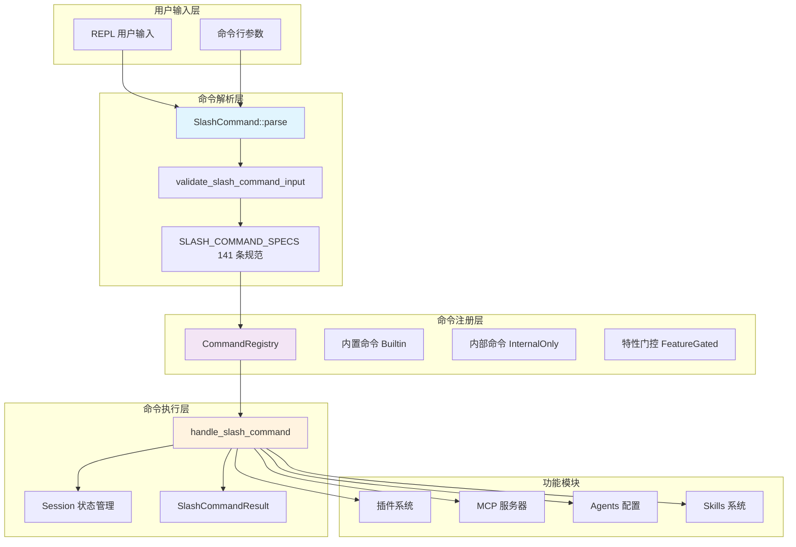
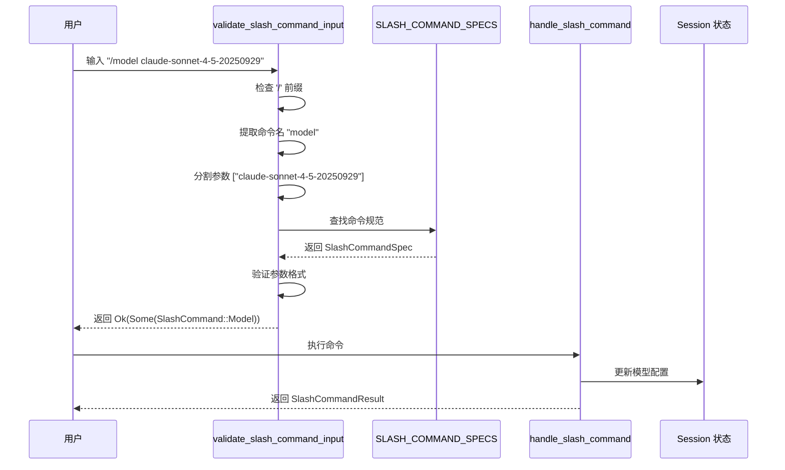

命令与斜杠命令系统是 Claw Code 的核心交互层，负责解析用户输入、调度功能执行并管理会话状态。系统采用**双语言架构**：Rust 实现完整的斜杠命令引擎，Python 提供命令镜像系统的移植框架。

## 系统架构概览

命令系统由三个核心组件构成：**命令注册表**、**斜杠命令解析器**和**命令执行引擎**。



**命令注册表**管理三种来源的命令条目：内置命令（Builtin）、内部专用命令（InternalOnly）和特性门控命令（FeatureGated）[rust/crates/commands/src/lib.rs#L13-L39](rust/crates/commands/src/lib.rs#L13-L39)。

**斜杠命令规范**定义了 141 个可用命令的元数据，包括名称、别名、功能摘要、参数提示和会话恢复支持能力 [rust/crates/commands/src/lib.rs#L43-L52](rust/crates/commands/src/lib.rs#L43-L52)。

## 斜杠命令规范系统

斜杠命令是用户与系统交互的主要接口，每个命令由 `SlashCommandSpec` 结构体定义：

| 字段 | 类型 | 说明 |
|------|------|------|
| `name` | `&'static str` | 命令主名称（不含前导斜杠） |
| `aliases` | `&'static [&'static str]` | 命令别名列表 |
| `summary` | `&'static str` | 单行功能描述 |
| `argument_hint` | `Option<&'static str>` | 参数格式提示 |
| `resume_supported` | `bool` | 是否支持 `--resume` 会话恢复 |

系统预定义了 141 个斜杠命令，按功能分为六大类别 [rust/crates/commands/src/lib.rs#L1807-L1824](rust/crates/commands/src/lib.rs#L1807-L1824)：

| 类别 | 代表命令 | 数量 |
|------|----------|------|
| Session & visibility | `/status`, `/model`, `/permissions`, `/cost` | ~15 |
| Workspace & git | `/compact`, `/diff`, `/commit`, `/config` | ~18 |
| Discovery & debugging | `/agents`, `/skills`, `/mcp`, `/teleport` | ~14 |
| Analysis & automation | `/bughunter`, `/ultraplan`, `/review` | ~6 |
| Appearance & input | `/theme`, `/vim`, `/voice`, `/color` | ~11 |
| Communication & control | `/export`, `/share`, `/feedback`, `/exit` | ~12 |

## 命令解析流程

命令解析采用**两阶段验证**：首先识别斜杠前缀并提取命令名，然后根据规范验证参数格式。



解析器通过 `validate_slash_command_input` 函数实现，该函数处理以下逻辑 [rust/crates/commands/src/lib.rs#L1214-L1230](rust/crates/commands/src/lib.rs#L1214-L1230)：

1. **前缀检测**：验证输入是否以 `/` 开头
2. **命令提取**：分割命令名和参数
3. **规范匹配**：在 `SLASH_COMMAND_SPECS` 中查找对应命令
4. **参数验证**：根据命令类型验证参数数量和格式
5. **错误生成**：提供详细的用法提示和修正建议

## 命令枚举与执行

解析后的命令被转换为 `SlashCommand` 枚举类型，每个变体对应特定功能：

```rust
pub enum SlashCommand {
    Help,
    Status,
    Model { model: Option<String> },
    Permissions { mode: Option<String> },
    Config { section: Option<String> },
    Mcp { action: Option<String>, target: Option<String> },
    Plugins { action: Option<String>, target: Option<String> },
    // ... 共 141 种变体
}
```

命令执行由 `handle_slash_command` 函数调度，该函数接收解析后的命令、当前会话状态和压缩配置，返回可选的 `SlashCommandResult` [rust/crates/commands/src/lib.rs#L3156-L3260](rust/crates/commands/src/lib.rs#L3156-L3260)：

| 执行结果 | 说明 |
|----------|------|
| `Some(SlashCommandResult)` | 命令已处理，包含消息和更新后的会话 |
| `None` | 命令需要外部处理（如工具调用）或未知命令 |

部分命令（如 `/compact`）直接在命令模块内处理，而其他命令（如 `/agents`、`/skills`、`/mcp`）委托给专用处理函数 [rust/crates/commands/src/lib.rs#L2144-L2164](rust/crates/commands/src/lib.rs#L2144-L2164)。

## 命令分类与来源

### Rust 内置斜杠命令

Rust 实现的斜杠命令是系统的主要交互接口，包含 141 个预定义命令。这些命令分为三个来源类别 [rust/crates/commands/src/lib.rs#L19-L24](rust/crates/commands/src/lib.rs#L19-L24)：

- **Builtin**：核心内置命令，始终可用
- **InternalOnly**：内部调试和开发专用命令
- **FeatureGated**：需要特定配置或权限才能启用的命令

### Python 命令镜像系统

Python 端的命令系统目前处于**移植镜像阶段**，通过 `commands_snapshot.json` 跟踪原始 TypeScript 命令表面 [src/commands.py#L1-L30](src/commands.py#L1-L30)：

```python
@dataclass(frozen=True)
class CommandExecution:
    name: str
    source_hint: str      # 原始 TypeScript 路径
    prompt: str
    handled: bool
    message: str
```

命令快照包含 500+ 条目，记录每个命令的名称、责任描述和源代码位置 [src/reference_data/commands_snapshot.json#L1-L10](src/reference_data/commands_snapshot.json#L1-L10)。

### 命令图分类

`CommandGraph` 将命令按来源分为三类 [src/command_graph.py#L8-L35](src/command_graph.py#L8-L35)：

| 类别 | 识别条件 | 用途 |
|------|----------|------|
| Builtins | 非 plugin/skills 来源 | 核心功能命令 |
| Plugin-like | source_hint 含 "plugin" | 插件扩展命令 |
| Skill-like | source_hint 含 "skills" | 技能包命令 |

## 参数验证与错误处理

系统提供精细的参数验证和友好的错误提示。验证函数包括：

- `validate_no_args`：验证无参数命令 [rust/crates/commands/src/lib.rs#L1414-L1423](rust/crates/commands/src/lib.rs#L1414-L1423)
- `optional_single_arg`：处理可选单参数 [rust/crates/commands/src/lib.rs#L1425-L1434](rust/crates/commands/src/lib.rs#L1425-L1434)
- `require_remainder`：验证必需参数 [rust/crates/commands/src/lib.rs#L1436-L1441](rust/crates/commands/src/lib.rs#L1436-L1441)

错误消息遵循统一格式，包含用法提示、摘要和类别信息：

```
Unsupported /permissions mode 'admin'. Use read-only, workspace-write, or danger-full-access.

  Category         Session & visibility
  Usage            /permissions [read-only|workspace-write|danger-full-access]
  Summary          Show or switch the active permission mode
```

系统还支持**模糊匹配建议**，通过 Levenshtein 距离算法为无效命令提供修正建议 [rust/crates/commands/src/lib.rs#L1843-L1884](rust/crates/commands/src/lib.rs#L1843-L1884)。

## 会话恢复支持

39 个斜杠命令支持会话恢复功能，允许通过 `--resume SESSION.jsonl` 参数恢复之前的对话状态 [rust/crates/commands/src/lib.rs#L1778-L1782](rust/crates/commands/src/lib.rs#L1778-L1782)：

```rust
pub fn resume_supported_slash_commands() -> Vec<&'static SlashCommandSpec> {
    slash_command_specs()
        .iter()
        .filter(|spec| spec.resume_supported)
        .collect()
}
```

支持恢复的命令主要包括会话管理类（`/status`、`/cost`）、工作区类（`/diff`、`/config`）和发现类（`/agents`、`/skills`）命令。

## 帮助系统

系统提供两级帮助文档：

**全局帮助**（`/help`）按类别列出所有命令 [rust/crates/commands/src/lib.rs#L1906-L1943](rust/crates/commands/src/lib.rs#L1906-L1943)：

```
Slash commands
  Start here        /status, /diff, /agents, /skills, /commit
  [resume]          also works with --resume SESSION.jsonl

Session & visibility
  /status                                                              Show current session status
  /model [model]                                                       Show or switch the active model [resume]
  ...

Workspace & git
  /compact                                                             Compact local session history [resume]
  /diff                                                                Show git diff for current workspace changes [resume]
  ...
```

**详细帮助**（`/help <command>`）提供单个命令的完整信息，包括别名、参数提示和恢复支持 [rust/crates/commands/src/lib.rs#L1769-L1772](rust/crates/commands/src/lib.rs#L1769-L1772)。

## 与相关模块的集成

命令系统与多个核心模块深度集成：

| 集成模块 | 相关命令 | 交互方式 |
|----------|----------|----------|
| [运行时引擎](11-yun-xing-shi-yin-qing-yu-dui-hua-xun-huan) | `/compact`, `/resume` | 会话压缩和恢复 |
| [工具系统](12-gong-ju-xi-tong-shi-xian) | `/debug-tool-call` | 工具调用调试 |
| [MCP 服务器](17-mcp-fu-wu-qi-sheng-ming-zhou-qi) | `/mcp` | MCP 服务器管理 |
| [插件系统](18-cha-jian-xi-tong-jia-gou) | `/plugin`, `/plugins` | 插件生命周期管理 |
| [会话管理](15-hui-hua-guan-li-yu-chi-jiu-hua) | `/session`, `/export` | 会话操作 |
| [权限模型](14-quan-xian-yu-an-quan-mo-xing) | `/permissions` | 权限模式切换 |

## 下一步阅读

- 了解命令如何与工具系统交互：[工具系统实现](12-gong-ju-xi-tong-shi-xian)
- 探索会话管理机制：[会话管理与持久化](15-hui-hua-guan-li-yu-chi-jiu-hua)
- 学习插件命令扩展：[插件系统架构](18-cha-jian-xi-tong-jia-gou)
- 查看实际使用示例：[交互式 REPL 模式](20-jiao-hu-shi-repl-mo-shi)