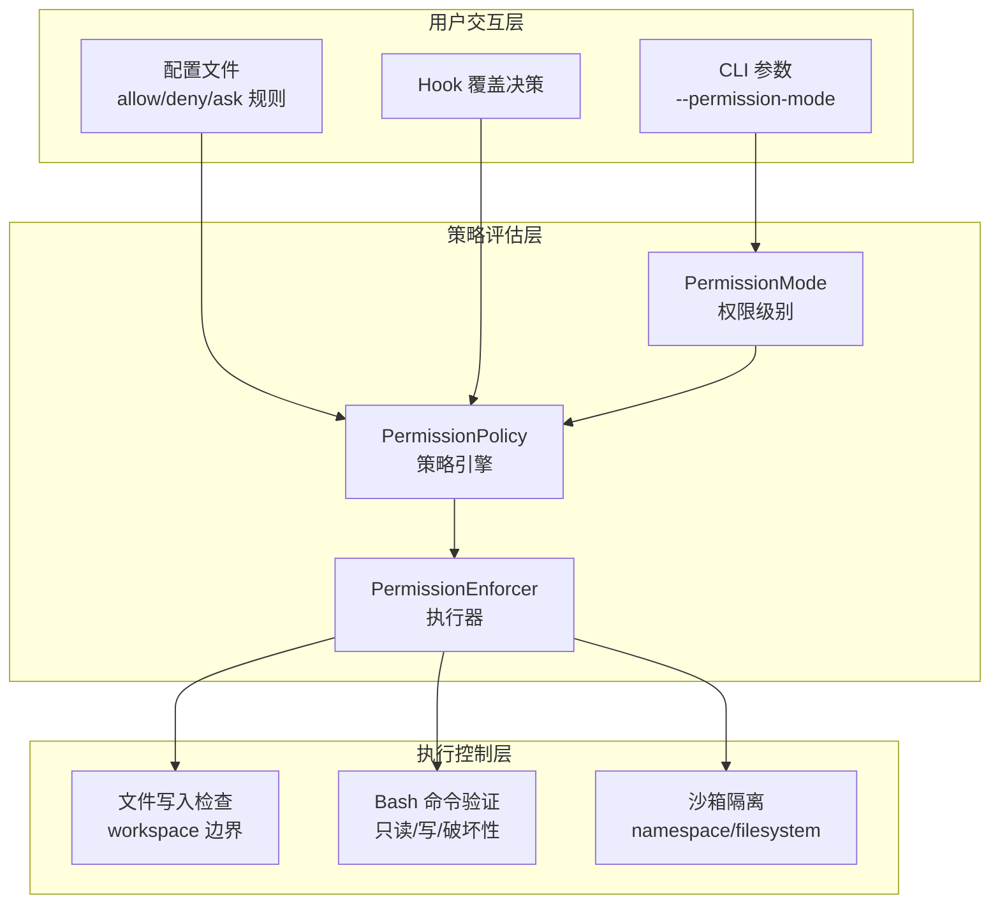
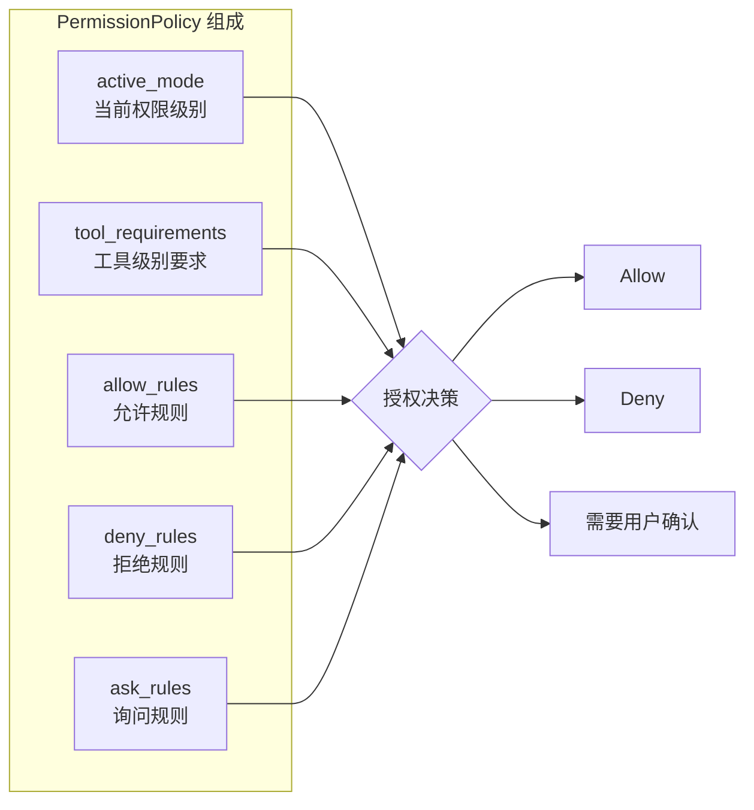
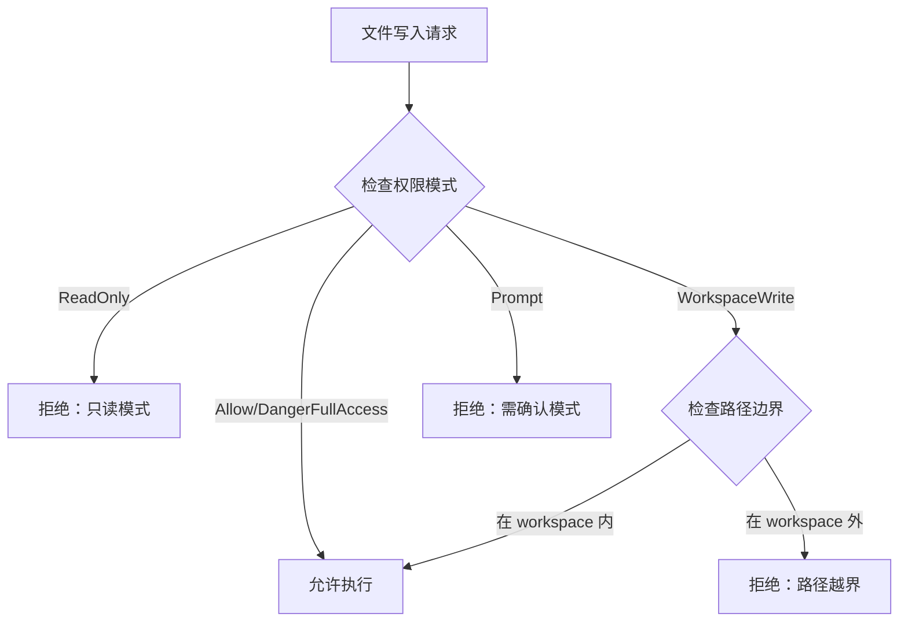
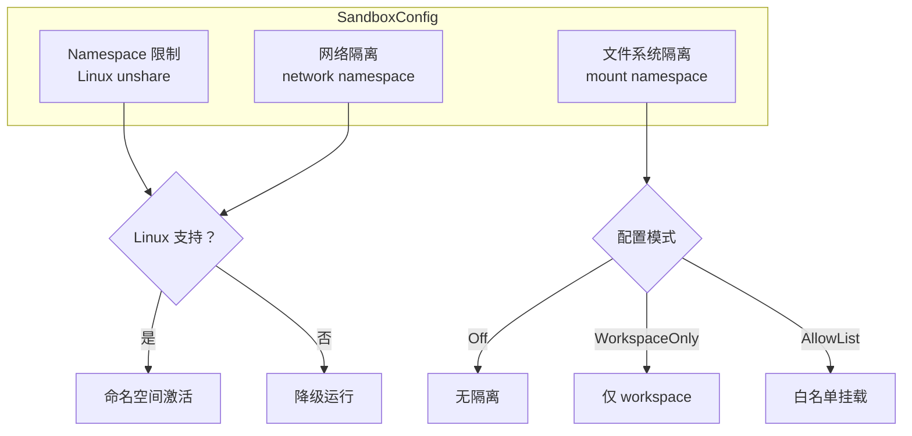
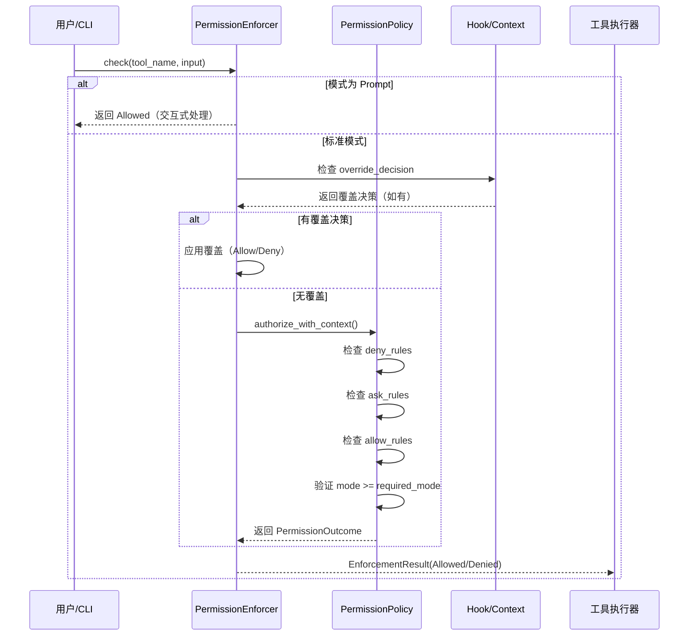

本文档深入剖析 claw-code 项目的权限控制与安全架构。系统采用**分层防御策略**，在 Python 移植工作区与 Rust 原生实现中分别构建了权限模型，形成从工具调用到系统执行的全链路安全控制。

## 权限模型架构概览

claw-code 的权限系统遵循**最小权限原则**与**显式授权模式**，通过三层架构实现细粒度访问控制：



**核心设计理念**：权限决策在工具执行前完成，支持静态规则匹配、动态上下文评估与交互式审批三种模式。

Sources: [permissions.rs](rust/crates/runtime/src/permissions.rs#L1-L200) [permission_enforcer.rs](rust/crates/runtime/src/permission_enforcer.rs#L1-L135)

## 权限级别定义

系统定义了五种权限模式，按风险等级递增排列：

| 权限模式 | 英文标识 | 适用场景 | 工具限制 |
|---------|---------|---------|---------|
| 只读模式 | `ReadOnly` | 代码审查、静态分析 | 仅允许读取类命令（`cat`, `grep`, `ls` 等） |
| 工作区写入 | `WorkspaceWrite` | 正常开发任务 | 允许 workspace 内文件修改，阻止外部写入 |
| 完全访问 | `DangerFullAccess` | 系统管理、部署 | 无限制访问（默认 CLI 模式） |
| 提示确认 | `Prompt` | 高风险操作审批 | 每次工具调用需用户确认 |
| 允许模式 | `Allow` | 信任环境 | 跳过权限检查 |

在 Rust 实现中，`PermissionMode` 枚举定义了这些级别的序关系，支持权限级别的比较与升级判断：

```rust
#[derive(Debug, Clone, Copy, PartialEq, Eq, PartialOrd, Ord)]
pub enum PermissionMode {
    ReadOnly,
    WorkspaceWrite,
    DangerFullAccess,
    Prompt,
    Allow,
}
```

CLI 通过 `--permission-mode` 参数设置初始权限级别，默认为 `DangerFullAccess`：

```bash
rusty-claude-cli --permission-mode read-only prompt "分析代码结构"
```

Sources: [permissions.rs](rust/crates/runtime/src/permissions.rs#L8-L28) [args.rs](rust/crates/rusty-claude-cli/src/args.rs#L42-L47)

## 策略引擎与规则系统

`PermissionPolicy` 是权限决策的核心引擎，整合了五个维度的控制要素：



**规则优先级**：`deny_rules` > `override_decision` > `ask_rules` > `allow_rules` > `mode_check`

规则配置通过 `RuntimePermissionRuleConfig` 定义，支持三类行为：

| 规则类型 | 配置键 | 行为 | 示例 |
|---------|-------|------|------|
| 允许规则 | `allow` | 匹配即授权 | `["BashTool:ls *"]` |
| 拒绝规则 | `deny` | 匹配即阻止 | `["BashTool:rm -rf *"]` |
| 询问规则 | `ask` | 匹配需确认 | `["FileWriteTool:/etc/*"]` |

Sources: [permissions.rs](rust/crates/runtime/src/permissions.rs#L97-L161) [config.rs](rust/crates/runtime/src/config.rs#L74-L80)

## 工具级权限控制

### Python 移植工作区

Python 端采用简化的**拒绝列表模型**，通过 `ToolPermissionContext` 实现：

```python
@dataclass(frozen=True)
class ToolPermissionContext:
    deny_names: frozenset[str] = field(default_factory=frozenset)
    deny_prefixes: tuple[str, ...] = ()
    
    def blocks(self, tool_name: str) -> bool:
        lowered = tool_name.lower()
        return lowered in self.deny_names or any(
            lowered.startswith(prefix) for prefix in self.deny_prefixes
        )
```

工具过滤在 `get_tools()` 函数中执行，支持 `simple_mode` 和 `include_mcp` 参数进一步限制可用工具集：

```python
def get_tools(
    simple_mode: bool = False,
    include_mcp: bool = True,
    permission_context: ToolPermissionContext | None = None,
) -> tuple[PortingModule, ...]:
    tools = list(PORTED_TOOLS)
    if simple_mode:
        tools = [module for module in tools 
                 if module.name in {'BashTool', 'FileReadTool', 'FileEditTool'}]
    if not include_mcp:
        tools = [module for module in tools 
                 if 'mcp' not in module.name.lower()]
    return filter_tools_by_permission_context(tuple(tools), permission_context)
```

Sources: [permissions.py](src/permissions.py#L6-L20) [tools.py](src/tools.py#L56-L72)

### Rust 原生实现

Rust 端提供更细粒度的工具权限控制，通过 `tool_requirements` 映射为每个工具指定最低权限级别：

```rust
pub fn required_mode_for(&self, tool_name: &str) -> PermissionMode {
    self.tool_requirements
        .get(tool_name)
        .copied()
        .unwrap_or(PermissionMode::DangerFullAccess)
}
```

未显式配置的工具默认需要 `DangerFullAccess` 级别，确保未知工具不会意外获得执行权限。

Sources: [permissions.rs](rust/crates/runtime/src/permissions.rs#L155-L161)

## 文件系统边界保护

`PermissionEnforcer` 实现了 workspace 边界的运行时检查，防止工具写入工作区外的敏感路径：



边界检查通过路径前缀匹配实现：

```rust
fn is_within_workspace(path: &str, workspace_root: &str) -> bool {
    let normalized = if path.starts_with('/') {
        path.to_owned()
    } else {
        format!("{workspace_root}/{path}")
    };
    let root = if workspace_root.ends_with('/') {
        workspace_root.to_owned()
    } else {
        format!("{workspace_root}/")
    };
    normalized.starts_with(&root) || normalized == workspace_root.trim_end_matches('/')
}
```

Sources: [permission_enforcer.rs](rust/crates/runtime/src/permission_enforcer.rs#L68-L103) [permission_enforcer.rs](rust/crates/runtime/src/permission_enforcer.rs#L137-L152)

## Bash 命令语义验证

系统对 bash 命令执行**语义级分类**，识别七种命令意图并应用相应的权限策略：

| 命令意图 | 典型命令 | 只读模式 | 工作区写入模式 |
|---------|---------|---------|---------------|
| ReadOnly | `ls`, `cat`, `grep`, `find` | ✅ 允许 | ✅ 允许 |
| Write | `cp`, `mv`, `mkdir`, `touch` | ❌ 阻止 | ✅ 允许 |
| Destructive | `rm`, `shred`, `truncate` | ❌ 阻止 | ⚠️ 警告 |
| Network | `curl`, `wget`, `ssh` | ❌ 阻止 | ⚠️ 警告 |
| ProcessManagement | `kill`, `pkill` | ❌ 阻止 | ⚠️ 警告 |
| PackageManagement | `apt`, `npm`, `pip` | ❌ 阻止 | ⚠️ 警告 |
| SystemAdmin | `sudo`, `chmod`, `mount` | ❌ 阻止 | ⚠️ 警告 |

只读模式验证逻辑：

```rust
pub fn validate_read_only(command: &str, mode: PermissionMode) -> ValidationResult {
    if mode != PermissionMode::ReadOnly {
        return ValidationResult::Allow;
    }
    
    let first_command = extract_first_command(command);
    
    // 检查写命令白名单
    for &write_cmd in WRITE_COMMANDS {
        if first_command == write_cmd {
            return ValidationResult::Block {
                reason: format!("Command '{write_cmd}' modifies the filesystem...")
            };
        }
    }
    
    // 检查写重定向
    for &redir in WRITE_REDIRECTIONS {
        if command.contains(redir) {
            return ValidationResult::Block {
                reason: format!("Command contains write redirection '{redir}'...")
            };
        }
    }
    
    ValidationResult::Allow
}
```

特殊处理：`sudo` 包装的命令会递归检查内部命令，`git` 命令根据子命令分类（`git status` 允许，`git commit` 阻止）。

Sources: [bash_validation.rs](rust/crates/runtime/src/bash_validation.rs#L26-L45) [bash_validation.rs](rust/crates/runtime/src/bash_validation.rs#L51-L160)

## 沙箱隔离机制

沙箱系统提供三层隔离能力，可在配置中独立启用：



配置结构：

```rust
#[derive(Debug, Clone, Serialize, Deserialize, PartialEq, Eq, Default)]
pub struct SandboxConfig {
    pub enabled: Option<bool>,
    pub namespace_restrictions: Option<bool>,
    pub network_isolation: Option<bool>,
    pub filesystem_mode: Option<FilesystemIsolationMode>,
    pub allowed_mounts: Vec<String>,
}
```

文件系统隔离模式：
- `Off`: 无限制访问
- `WorkspaceOnly` (默认): 仅允许 workspace 内路径
- `AllowList`: 仅允许配置中显式声明的挂载点

容器环境检测通过检查 `/.dockerenv`、`/run/.containerenv`、`/proc/1/cgroup` 等标志自动识别运行环境。

Sources: [sandbox.rs](rust/crates/runtime/src/sandbox.rs#L7-L34) [sandbox.rs](rust/crates/runtime/src/sandbox.rs#L155-L200)

## 信任解析与目录授权

`TrustResolver` 处理目录级别的信任决策，支持三种策略：

| 策略 | 触发条件 | 行为 |
|-----|---------|------|
| AutoTrust | 路径匹配 allowlist | 自动授权，无提示 |
| RequireApproval | 路径未匹配任何规则 | 显示信任提示，等待用户确认 |
| Deny | 路径匹配 denylist | 直接拒绝，记录原因 |

信任提示检测基于屏幕文本关键词匹配：

```rust
const TRUST_PROMPT_CUES: &[&str] = &[
    "do you trust the files in this folder",
    "trust the files in this folder",
    "trust this folder",
    "allow and continue",
    "yes, proceed",
];
```

解析流程：

```rust
pub fn resolve(&self, cwd: &str, screen_text: &str) -> TrustDecision {
    if !detect_trust_prompt(screen_text) {
        return TrustDecision::NotRequired;
    }
    
    // 优先检查 denylist
    if self.config.denied.iter().any(|root| path_matches(cwd, root)) {
        return TrustDecision::Required {
            policy: TrustPolicy::Deny,
            events: vec![TrustEvent::TrustDenied { ... }]
        };
    }
    
    // 检查 allowlist
    if self.config.allowlisted.iter().any(|root| path_matches(cwd, root)) {
        return TrustDecision::Required {
            policy: TrustPolicy::AutoTrust,
            events: vec![TrustEvent::TrustResolved { ... }]
        };
    }
    
    // 默认需要用户确认
    TrustDecision::Required {
        policy: TrustPolicy::RequireApproval,
        events: vec![TrustEvent::TrustRequired { ... }]
    }
}
```

Sources: [trust_resolver.rs](rust/crates/runtime/src/trust_resolver.rs#L11-L23) [trust_resolver.rs](rust/crates/runtime/src/trust_resolver.rs#L82-L135)

## Hook 覆盖机制

权限系统支持通过 Hook 在标准评估流程前注入覆盖决策：

```rust
#[derive(Debug, Clone, Copy, PartialEq, Eq)]
pub enum PermissionOverride {
    Allow,  // 强制允许
    Deny,   // 强制拒绝
    Ask,    // 强制询问
}

#[derive(Debug, Clone, PartialEq, Eq, Default)]
pub struct PermissionContext {
    override_decision: Option<PermissionOverride>,
    override_reason: Option<String>,
}
```

覆盖决策优先级最高，在 `authorize_with_context` 中优先评估：

```rust
match context.override_decision() {
    Some(PermissionOverride::Deny) => {
        return PermissionOutcome::Deny {
            reason: context.override_reason().map_or_else(
                || format!("tool '{tool_name}' denied by hook"),
                |r| r.clone()
            )
        };
    }
    Some(PermissionOverride::Allow) => {
        return PermissionOutcome::Allow;
    }
    _ => { /* 继续标准评估流程 */ }
}
```

此机制允许外部系统（如企业策略引擎、审计系统）动态干预权限决策。

Sources: [permissions.rs](rust/crates/runtime/src/permissions.rs#L31-L66) [permissions.rs](rust/crates/runtime/src/permissions.rs#L196-L210)

## Python 与 Rust 实现对比

两个实现遵循相同的权限理念，但在复杂度与功能上存在差异：

| 特性维度 | Python 移植工作区 | Rust 原生实现 |
|---------|-----------------|-------------|
| 权限级别 | 隐式（拒绝列表） | 显式五级模式 |
| 规则系统 | 名称/前缀匹配 | allow/deny/ask + 工具要求 |
| 文件边界 | 无 | workspace 路径检查 |
| Bash 验证 | 无 | 语义分类 + 只读验证 |
| 沙箱支持 | 无 | namespace 隔离 |
| Hook 覆盖 | 无 | PermissionContext |
| 信任解析 | 无 | 目录级授权 |
| 配置来源 | 代码内建 | 多层配置文件 |

**设计决策**：Python 端定位为轻量级移植验证环境，Rust 端提供生产级安全控制。两者通过 `PermissionDenial` 数据模型保持接口一致性。

Sources: [permissions.py](src/permissions.py#L6-L20) [permissions.rs](rust/crates/runtime/src/permissions.rs#L97-L105) [models.py](src/models.py#L22-L25)

## 权限决策流程

完整的权限评估流程如下：



对于文件写入和 bash 命令，`PermissionEnforcer` 在策略评估后追加专用验证：
1. `check_file_write()`: 验证路径在 workspace 边界内
2. `check_bash()`: 验证命令在只读模式下的安全性

Sources: [permission_enforcer.rs](rust/crates/runtime/src/permission_enforcer.rs#L26-L56) [permissions.rs](rust/crates/runtime/src/permissions.rs#L174-L200)

## 配置示例

### 权限规则配置

```json
{
  "permission_rules": {
    "allow": [
      "BashTool:ls *",
      "BashTool:cat *",
      "FileReadTool:*"
    ],
    "deny": [
      "BashTool:rm -rf *",
      "BashTool:sudo *",
      "FileWriteTool:/etc/*",
      "FileWriteTool:/root/*"
    ],
    "ask": [
      "BashTool:git commit *",
      "FileWriteTool:*.rs"
    ]
  },
  "permission_mode": "workspace-write",
  "sandbox": {
    "enabled": true,
    "filesystem_mode": "workspace-only"
  }
}
```

### CLI 使用

```bash
# 只读模式运行（安全审计）
rusty-claude-cli --permission-mode read-only \
  prompt "分析项目架构"

# 工作区写入模式（正常开发）
rusty-claude-cli --permission-mode workspace-write \
  --config ./claw-settings.json \
  prompt "重构用户认证模块"

# 完全访问模式（系统管理，默认）
rusty-claude-cli prompt "部署到测试环境"
```

Sources: [config.rs](rust/crates/runtime/src/config.rs#L54-L64) [args.rs](rust/crates/rusty-claude-cli/src/args.rs#L15-L16)

## 安全最佳实践

1. **默认最小权限**：生产环境应使用 `workspace-write` 而非 `danger-full-access`
2. **显式拒绝危险命令**：在 `deny_rules` 中明确列出 `rm -rf`、`sudo` 等高风险模式
3. **启用沙箱隔离**：在 Linux 环境下启用 `namespace_restrictions` 限制系统调用
4. **配置信任白名单**：将常用开发目录加入 `allowlisted` 减少交互干扰
5. **审计权限拒绝**：监控 `PermissionDenial` 事件识别潜在的配置问题或攻击尝试

## 相关文档

- [工具系统实现](12-gong-ju-xi-tong-shi-xian) — 了解工具定义与执行机制
- [运行时引擎与对话循环](11-yun-xing-shi-yin-qing-yu-dui-hua-xun-huan) — 权限在运行时中的集成点
- [模型与权限控制](23-mo-xing-yu-quan-xian-kong-zhi) — CLI 使用中的权限配置指南
- [沙箱与隔离](rust/crates/runtime/src/sandbox.rs) — 底层隔离技术实现