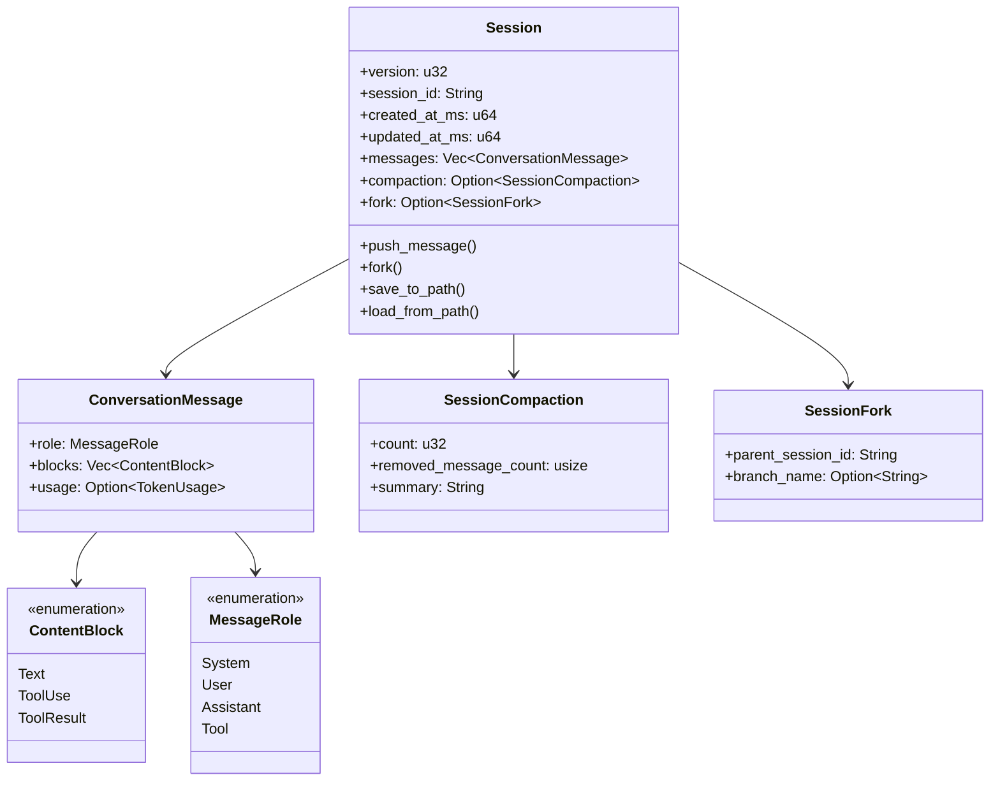
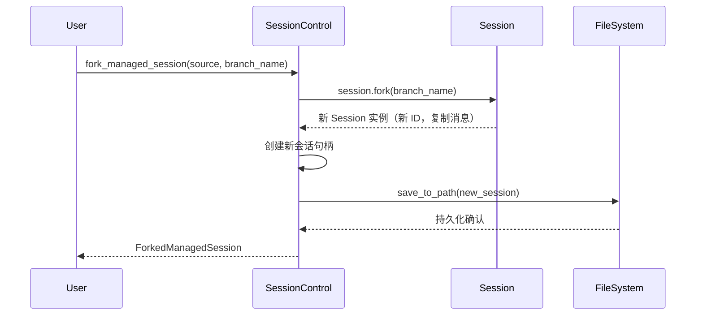
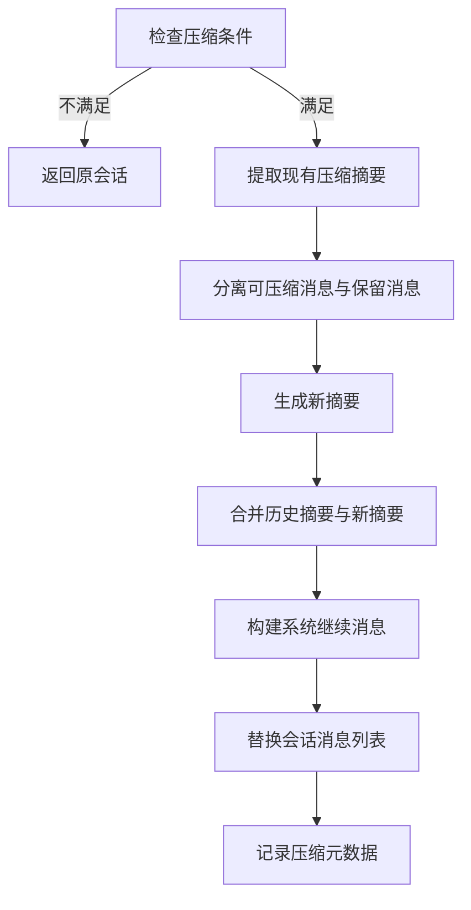

会话管理与持久化是 Claw-Code 双语言架构中的核心基础设施，负责维护对话状态、支持会话恢复与分支、并提供上下文压缩机制。本页面深入解析 Python 与 Rust 两套实现中的会话存储模型、持久化策略及生命周期管理。

## 会话数据模型

Claw-Code 采用分层会话数据模型，区分**原始消息存储**与**会话元数据**。Rust 实现提供了更丰富的结构化支持，而 Python 实现则保持轻量级设计。

### Rust 会话结构

Rust 的 `Session` 结构体是会话管理的核心，包含完整的对话历史与元数据：



**消息角色**定义了对话参与者的类型：`System`（系统指令）、`User`（用户输入）、`Assistant`（AI 响应）、`Tool`（工具执行结果）。**内容块**是消息的最小单元，支持纯文本、工具调用及工具返回结果三种形态 [`session.rs`](rust/crates/runtime/src/session.rs#L17-L45)。

**会话压缩元数据** (`SessionCompaction`) 记录压缩操作的历史，包括压缩次数、移除的消息数量及生成的摘要。**会话分支元数据** (`SessionFork`) 支持从现有会话派生新会话，保留父会话 ID 与可选的分支名称 [`session.rs`](rust/crates/runtime/src/session.rs#L52-L68)。

### Python 会话结构

Python 实现采用简化的数据类设计，适用于移植验证与测试场景：

| 组件 | 文件位置 | 核心字段 | 用途 |
|------|----------|----------|------|
| `StoredSession` | [`session_store.py`](src/session_store.py#L10-L14) | `session_id`, `messages`, `input_tokens`, `output_tokens` | 持久化会话快照 |
| `HistoryLog` | [`history.py`](src/history.py#L10-L23) | `events: list[HistoryEvent]` | 会话事件审计日志 |
| `TranscriptStore` | [`transcript.py`](src/transcript.py#L6-L24) | `entries`, `flushed` | 对话记录缓冲与压缩 |
| `RuntimeSession` | [`runtime.py`](src/runtime.py#L24-L82) | 完整运行时上下文 | 单次运行会话快照 |

Python 的 `TranscriptStore` 提供 `compact()` 方法支持保留最近 N 条记录的压缩策略，而 `HistoryLog` 则以 Markdown 格式输出会话事件历史 [`transcript.py`](src/transcript.py#L14-L20) [`history.py`](src/history.py#L16-L22)。

## 持久化存储机制

### 存储目录结构

Rust 实现使用项目根目录下的 `.claw/sessions/` 作为托管会话存储位置。Python 实现默认使用 `.port_sessions/` 目录。

```
project_root/
├── .claw/
│   └── sessions/
│       ├── session-1704067200000-0.jsonl    # 主会话文件
│       ├── session-1704067200000-0.rot-*.jsonl  # 轮转备份
│       └── latest -> session-1704067200000-0.jsonl  # 最新会话引用
└── .port_sessions/
    └── {session_id}.json                    # Python 会话文件
```

### JSONL 持久化格式

Rust 采用 **JSONL（JSON Lines）** 格式进行会话持久化，每条记录占一行，支持增量追加与流式读取：

```jsonl
{"type":"session_meta","version":1,"session_id":"session-1704067200000-0","created_at_ms":1704067200000,"updated_at_ms":1704067200000}
{"type":"message","message":{"role":"user","blocks":[{"type":"text","text":"hello"}]}}
{"type":"message","message":{"role":"assistant","blocks":[{"type":"text","text":"Hi there!"}]}}
{"type":"compaction","count":1,"removed_message_count":5,"summary":"Conversation summary:..."}
```

JSONL 格式的优势在于：
- **增量写入**：新消息可直接追加到文件末尾，无需重写整个会话
- **容错恢复**：单行损坏不影响其他记录读取
- **流式处理**：可逐行解析，降低内存占用

会话加载时支持 **JSON 对象**（遗留格式）与 **JSONL** 两种格式的自动检测 [`session.rs`](rust/crates/runtime/src/session.rs#L150-L165)。

### 原子写入与文件轮转

为确保数据一致性，Rust 实现采用**原子写入策略**：

1. 将完整会话序列化到临时文件（`.tmp-{timestamp}-{counter}.jsonl`）
2. 使用 `fs::rename()` 原子替换目标文件
3. 清理轮转日志文件

**文件轮转机制**在会话文件超过 256KB 时触发：
- 当前文件重命名为 `.rot-{timestamp}.jsonl`
- 保留最近 3 个轮转文件，超出部分自动清理
- 新消息写入新创建的空会话文件

此机制防止单个会话文件无限增长，同时保留历史上下文用于审计或恢复 [`session.rs`](rust/crates/runtime/src/session.rs#L867-L920)。

## 会话生命周期管理

### 会话创建与标识

会话 ID 采用时间戳 + 计数器格式：`session-{millis}-{counter}`。`SESSION_ID_COUNTER` 原子计数器确保同一毫秒内创建的会话具有唯一标识 [`session.rs`](rust/crates/runtime/src/session.rs#L903-L907)。

```rust
fn generate_session_id() -> String {
    let millis = current_time_millis();
    let counter = SESSION_ID_COUNTER.fetch_add(1, Ordering::Relaxed);
    format!("session-{millis}-{counter}")
}
```

### 会话引用解析

`session_control.rs` 提供灵活的会话引用解析机制，支持多种引用方式：

| 引用类型 | 示例 | 解析行为 |
|----------|------|----------|
| 别名引用 | `latest`, `last`, `recent` | 解析为最近修改的会话 |
| 会话 ID | `session-1704067200000-0` | 直接查找对应文件 |
| 相对路径 | `./my-session.jsonl` | 作为文件路径解析 |
| 绝对路径 | `/home/user/session.jsonl` | 直接加载指定文件 |

`resolve_session_reference()` 函数按优先级尝试：别名 → 直接路径 → 托管会话目录查找。若引用无效，返回包含恢复提示的错误信息 [`session_control.rs`](rust/crates/runtime/src/session_control.rs#L92-L138)。

### 会话列表与排序

`list_managed_sessions()` 扫描会话目录，返回按修改时间降序排列的会话摘要列表：

```rust
pub struct ManagedSessionSummary {
    pub id: String,
    pub path: PathBuf,
    pub modified_epoch_millis: u128,
    pub message_count: usize,
    pub parent_session_id: Option<String>,
    pub branch_name: Option<String>,
}
```

摘要包含分支血缘信息（`parent_session_id`, `branch_name`），支持会话谱系追踪 [`session_control.rs`](rust/crates/runtime/src/session_control.rs#L28-L35)。

## 会话分支与派生

会话分支功能允许从现有会话创建独立副本，适用于实验性探索或事故复盘场景。

### 分支操作流程



### 分支元数据

分支会话保留完整的父会话消息历史，并在 `fork` 字段中记录谱系信息：

```rust
pub struct SessionFork {
    pub parent_session_id: String,
    pub branch_name: Option<String>,
}
```

分支名称（如 `"incident-review"`）为可选字段，用于语义化标识分支用途。`fork()` 方法创建新会话时：
- 生成新的 `session_id` 与时间戳
- 深拷贝父会话的 `messages` 与 `compaction`
- 设置 `fork` 元数据指向父会话
- 清除 `persistence` 路径（需重新保存）[`session.rs`](rust/crates/runtime/src/session.rs#L215-L232)

## 会话压缩策略

长对话会话会消耗大量上下文窗口。Claw-Code 实现**智能压缩机制**，在保留关键上下文的同时控制 token 消耗。

### 压缩配置

```rust
pub struct CompactionConfig {
    pub preserve_recent_messages: usize,  // 默认：4
    pub max_estimated_tokens: usize,      // 默认：10,000
}
```

压缩触发条件：
1. 可压缩消息数量 > `preserve_recent_messages`
2. 可压缩部分的估算 token 数 ≥ `max_estimated_tokens`

### 压缩算法流程



压缩后的会话结构：
1. **系统消息**：包含压缩摘要与继续指令
2. **保留消息**：最近 N 条原始消息（默认 4 条）

系统继续消息包含三部分：
- 压缩摘要前缀："This session is being continued from a previous conversation..."
- 格式化摘要：提取 `<summary>` 标签内容
- 继续指令："Continue the conversation from where it left off without asking the user any further questions." [`compact.rs`](rust/crates/runtime/src/compact.rs#L1-L15)

### 摘要生成

`summarize_messages()` 函数分析被压缩的消息，生成结构化摘要：
- 统计各类消息数量（user/assistant/tool）
- 提取使用的工具名称列表
- 收集最近的用户请求摘要

摘要采用 XML 风格标签封装，便于后续提取与合并：

```text
<summary>
Conversation summary:
- Scope: 15 earlier messages compacted (user=8, assistant=5, tool=2).
- Tools mentioned: bash, read_file, write_file.
- Recent user requests:
  - Refactor the authentication module
  - Add unit tests for session store
</summary>
```

多次压缩时，新旧摘要通过 `merge_compact_summaries()` 合并，保留压缩历史 [`compact.rs`](rust/crates/runtime/src/compact.rs#L103-L180)。

## Python 与 Rust 实现对比

| 特性 | Python 实现 | Rust 实现 |
|------|-------------|-----------|
| 存储格式 | JSON 对象 | JSONL（支持增量追加） |
| 会话目录 | `.port_sessions/` | `.claw/sessions/` |
| 文件扩展名 | `.json` | `.jsonl` / `.json`（遗留） |
| 原子写入 | 无（直接写入） | 临时文件 + 重命名 |
| 文件轮转 | 无 | 256KB 阈值，保留 3 个 |
| 会话分支 | 无 | 完整支持（SessionFork） |
| 会话压缩 | TranscriptStore.compact() | 智能摘要压缩（compact.rs） |
| 引用别名 | 无 | latest/last/recent |
| Token 追踪 | input_tokens, output_tokens | 完整 TokenUsage（含缓存） |
| 错误处理 | 简单异常 | SessionError 枚举 |

Python 实现专注于**移植验证**与**测试场景**，提供最小可行功能集。Rust 实现面向**生产环境**，具备完整的生命周期管理、容错机制与性能优化 [`session_store.py`](src/session_store.py#L1-L36) [`session.rs`](rust/crates/runtime/src/session.rs#L1-L1247)。

## 会话恢复模式

### 正常恢复

通过 `load_managed_session()` 加载会话后，可直接从最后一条消息继续对话。会话的 `updated_at_ms` 字段在每次消息追加时更新，确保排序正确 [`session_control.rs`](rust/crates/runtime/src/session_control.rs#L253-L265)。

### 压缩后恢复

压缩后的会话包含系统级继续消息，指导 AI 模型无缝继续对话：

```rust
pub fn get_compact_continuation_message(
    summary: &str,
    suppress_follow_up_questions: bool,
    recent_messages_preserved: bool,
) -> String
```

当 `suppress_follow_up_questions=true` 时，附加指令禁止 AI 提出澄清问题，直接进入执行状态 [`compact.rs`](rust/crates/runtime/src/compact.rs#L62-L77)。

### 分支恢复

分支会话可通过 `parent_session_id` 追溯源头，支持：
- 对比分支与父会话的差异
- 合并多个分支的探索结果
- 审计会话派生历史

`list_managed_sessions()` 返回的摘要包含分支信息，便于用户识别会话谱系 [`session_control.rs`](rust/crates/runtime/src/session_control.rs#L168-L222)。

## 相关页面

- 了解运行时引擎如何利用会话进行对话循环：[运行时引擎与对话循环](11-yun-xing-shi-yin-qing-yu-dui-hua-xun-huan)
- 查看 CLI 中如何恢复和管理会话：[会话管理与恢复](22-hui-hua-guan-li-yu-hui-fu)
- 理解压缩机制与上下文窗口管理：[恢复循环与容错机制](28-hui-fu-xun-huan-yu-rong-cuo-ji-zhi)