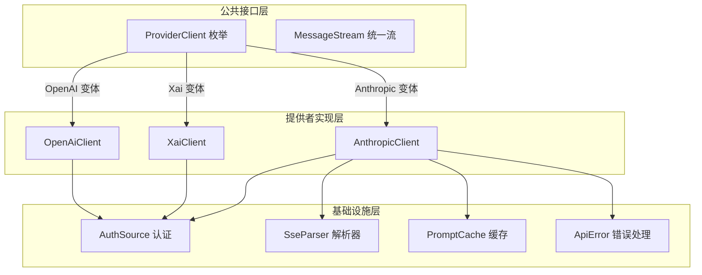
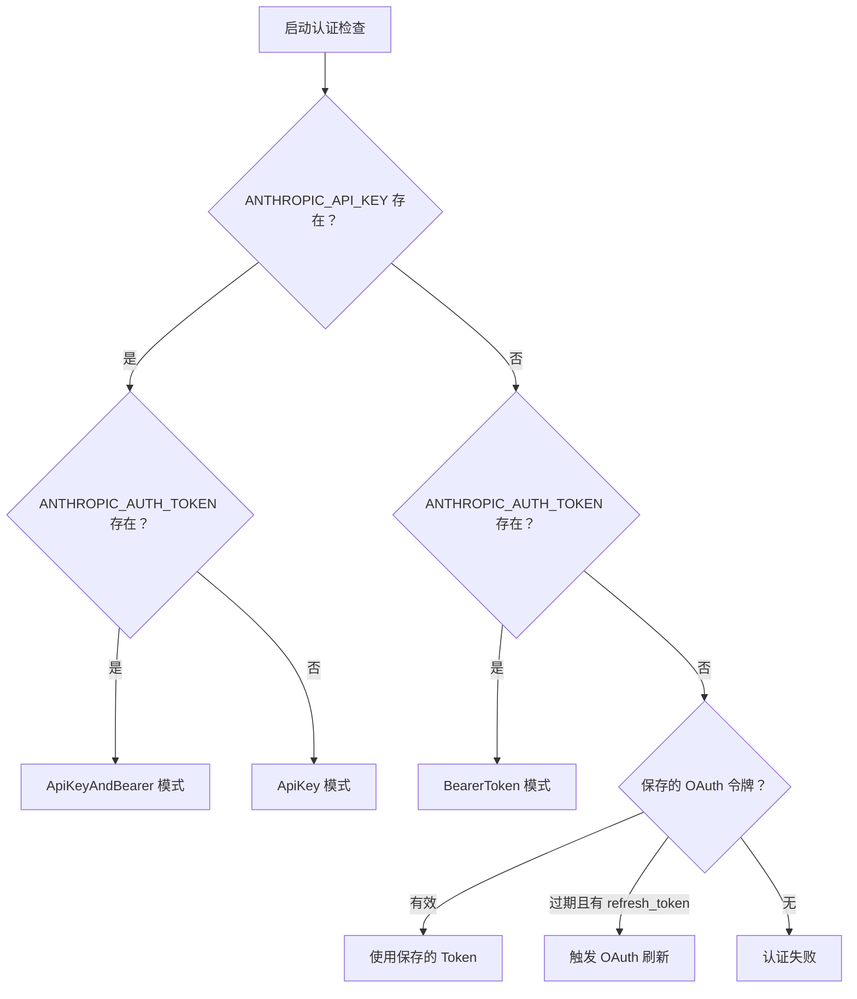
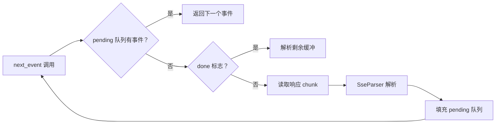
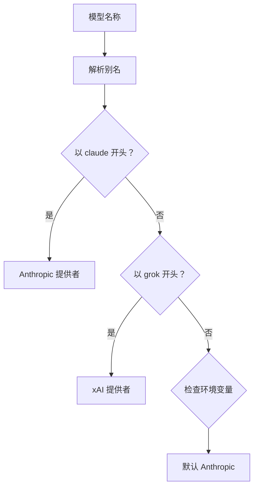

Anthropic API 客户端是 claw-code 项目中负责与 Anthropic Claude API 进行通信的核心模块，位于 `rust/crates/api` 工作区。该客户端采用**多提供者架构**设计，在统一抽象下支持 Anthropic、xAI (Grok) 和 OpenAI 等多种 LLM 提供者，同时提供完整的认证管理、流式响应处理、错误重试和 Prompt 缓存等高级功能。

## 架构概览

API 客户端模块采用分层设计，通过策略模式实现多提供者支持。核心架构如下：



客户端模块的核心职责包括：

| 职责 | 实现方式 | 关键类型 |
|------|----------|----------|
| **多提供者路由** | 基于模型名称自动检测提供者 | `ProviderKind`, `detect_provider_kind()` |
| **认证管理** | 支持 API Key、Bearer Token、OAuth 多种模式 | `AuthSource` 枚举 |
| **请求发送** | 同步发送与流式发送两种模式 | `send_message()`, `stream_message()` |
| **错误处理** | 分类错误类型与智能重试策略 | `ApiError`, `send_with_retry()` |
| **流式解析** | SSE 协议解析与事件分发 | `SseParser`, `MessageStream` |
| **Prompt 缓存** | 请求/响应缓存与命中率统计 | `PromptCache`, `PromptCacheRecord` |

Sources: [lib.rs](rust/crates/api/src/lib.rs#L1-L35), [client.rs](rust/crates/api/src/client.rs#L1-L50), [providers/mod.rs](rust/crates/api/src/providers/mod.rs#L1-L50)

## 认证机制

### AuthSource 认证源

`AuthSource` 枚举定义了四种认证模式，支持灵活的凭证配置：

```rust
pub enum AuthSource {
    None,                              // 无认证（用于 OAuth 刷新）
    ApiKey(String),                    // 仅 API Key
    BearerToken(String),               // 仅 Bearer Token
    ApiKeyAndBearer {                  // 双重认证
        api_key: String,
        bearer_token: String,
    },
}
```

认证源的优先级遵循以下规则：

1. **环境变量优先**：`ANTHROPIC_API_KEY` 和 `ANTHROPIC_AUTH_TOKEN`
2. **组合模式**：同时存在时自动升级为 `ApiKeyAndBearer`
3. **OAuth 回退**：环境变量缺失时尝试加载保存的 OAuth 令牌

Sources: [anthropic.rs](rust/crates/api/src/providers/anthropic.rs#L28-L95)

### 环境变量配置

| 环境变量 | 用途 | 优先级 |
|----------|------|--------|
| `ANTHROPIC_API_KEY` | 传统 API Key 认证 | 高 |
| `ANTHROPIC_AUTH_TOKEN` | OAuth Bearer Token | 高 |
| `ANTHROPIC_BASE_URL` | 自定义 API 端点（可选） | - |

认证加载流程：



Sources: [anthropic.rs](rust/crates/api/src/providers/anthropic.rs#L48-L68), [anthropic.rs](rust/crates/api/src/providers/anthropic.rs#L503-L530)

### OAuth 令牌管理

客户端支持完整的 OAuth 2.0 令牌生命周期管理：

```rust
pub struct OAuthTokenSet {
    pub access_token: String,
    pub refresh_token: Option<String>,
    pub expires_at: Option<u64>,
    pub scopes: Vec<String>,
}
```

令牌刷新流程通过 `refresh_oauth_token()` 方法实现，自动将新令牌持久化到本地配置目录。

Sources: [anthropic.rs](rust/crates/api/src/providers/anthropic.rs#L97-L105), [anthropic.rs](rust/crates/api/src/providers/anthropic.rs#L326-L345)

## 请求与响应类型

### MessageRequest 请求结构

```rust
pub struct MessageRequest {
    pub model: String,                    // 模型名称（支持别名）
    pub max_tokens: u32,                  // 最大输出 tokens
    pub messages: Vec<InputMessage>,      // 对话历史
    pub system: Option<String>,           // 系统提示（可选）
    pub tools: Option<Vec<ToolDefinition>>, // 工具定义（可选）
    pub tool_choice: Option<ToolChoice>,  // 工具选择策略（可选）
    pub stream: bool,                     // 是否流式输出
}
```

模型别名自动解析：

| 别名 | 解析结果 | 提供者 |
|------|----------|--------|
| `opus` | `claude-opus-4-6` | Anthropic |
| `sonnet` | `claude-sonnet-4-6` | Anthropic |
| `haiku` | `claude-haiku-4-5-20251213` | Anthropic |
| `grok` | `grok-3` | xAI |
| `grok-mini` | `grok-3-mini` | xAI |

Sources: [types.rs](rust/crates/api/src/types.rs#L5-L19), [providers/mod.rs](rust/crates/api/src/providers/mod.rs#L88-L125)

### MessageResponse 响应结构

```rust
pub struct MessageResponse {
    pub id: String,                       // 请求 ID
    pub kind: String,                     // 响应类型
    pub role: String,                     // 助手角色
    pub content: Vec<OutputContentBlock>, // 内容块列表
    pub model: String,                    // 使用的模型
    pub stop_reason: Option<String>,      // 停止原因
    pub stop_sequence: Option<String>,    // 停止序列
    pub usage: Usage,                     // Token 使用统计
    pub request_id: Option<String>,       // HTTP 请求 ID
}
```

输出内容块类型：

```rust
pub enum OutputContentBlock {
    Text { text: String },
    ToolUse { id: String, name: String, input: Value },
    Thinking { thinking: String, signature: Option<String> },
    RedactedThinking { data: Value },
}
```

Sources: [types.rs](rust/crates/api/src/types.rs#L107-L135), [types.rs](rust/crates/api/src/types.rs#L137-L152)

### Usage Token 统计

```rust
pub struct Usage {
    pub input_tokens: u32,
    pub cache_creation_input_tokens: u32,  // 缓存创建 tokens
    pub cache_read_input_tokens: u32,      // 缓存读取 tokens
    pub output_tokens: u32,
}
```

总 Token 计算公式：`input_tokens + output_tokens + cache_creation_input_tokens + cache_read_input_tokens`

成本估算通过 `estimated_cost_usd(&model)` 方法实现，根据模型定价自动计算。

Sources: [types.rs](rust/crates/api/src/types.rs#L154-L175)

## 流式响应处理

### SSE 协议解析

Anthropic API 使用 Server-Sent Events (SSE) 协议传输流式响应。`SseParser` 负责解析 SSE 帧：

```rust
pub struct SseParser {
    buffer: Vec<u8>,
}

impl SseParser {
    pub fn push(&mut self, chunk: &[u8]) -> Result<Vec<StreamEvent>, ApiError>;
    pub fn finish(&mut self) -> Result<Vec<StreamEvent>, ApiError>;
}
```

SSE 帧格式示例：
```
event: content_block_start
data: {"type":"content_block_start","index":0,"content_block":{"type":"text","text":"Hi"}}

event: content_block_delta
data: {"type":"content_block_delta","index":0,"delta":{"type":"text_delta","text":"Hello"}}
```

Sources: [sse.rs](rust/crates/api/src/sse.rs#L4-L45), [sse.rs](rust/crates/api/src/sse.rs#L55-L95)

### StreamEvent 事件类型

流式响应由以下事件类型组成：

| 事件类型 | 触发时机 | 包含数据 |
|----------|----------|----------|
| `MessageStart` | 响应开始 | 完整消息元数据 |
| `ContentBlockStart` | 内容块开始 | 内容块类型和索引 |
| `ContentBlockDelta` | 内容增量 | 文本/JSON/思考增量 |
| `ContentBlockStop` | 内容块结束 | 内容块索引 |
| `MessageDelta` | 消息增量 | 停止原因和最终 usage |
| `MessageStop` | 响应结束 | 空 |

```rust
pub enum StreamEvent {
    MessageStart(MessageStartEvent),
    MessageDelta(MessageDeltaEvent),
    ContentBlockStart(ContentBlockStartEvent),
    ContentBlockDelta(ContentBlockDeltaEvent),
    ContentBlockStop(ContentBlockStopEvent),
    MessageStop(MessageStopEvent),
}
```

Sources: [types.rs](rust/crates/api/src/types.rs#L237-L245), [types.rs](rust/crates/api/src/types.rs#L180-L233)

### MessageStream 迭代器

`MessageStream` 提供异步迭代接口消费流式事件：



```rust
impl MessageStream {
    pub fn request_id(&self) -> Option<&str>;
    pub async fn next_event(&mut self) -> Result<Option<StreamEvent>, ApiError>;
}
```

Sources: [anthropic.rs](rust/crates/api/src/providers/anthropic.rs#L720-L780)

## 错误处理与重试

### ApiError 错误类型

```rust
pub enum ApiError {
    MissingCredentials { provider, env_vars },  // 凭证缺失
    ExpiredOAuthToken,                           // OAuth 令牌过期
    Auth(String),                                // 认证错误
    Http(reqwest::Error),                        // HTTP 错误
    Api { status, error_type, message, body, retryable }, // API 错误
    RetriesExhausted { attempts, last_error },   // 重试耗尽
    InvalidSseFrame(&'static str),               // SSE 解析错误
    BackoffOverflow { attempt, base_delay },     // 退避溢出
}
```

Sources: [error.rs](rust/crates/api/src/error.rs#L6-L30)

### 重试策略

客户端采用**指数退避**重试策略：

| 参数 | 默认值 | 说明 |
|------|--------|------|
| `max_retries` | 2 | 最大重试次数 |
| `initial_backoff` | 200ms | 初始退避时间 |
| `max_backoff` | 2s | 最大退避时间 |

退避计算公式：`min(initial_backoff * 2^(attempt-1), max_backoff)`

可重试状态码：`408, 409, 429, 500, 502, 503, 504`

```rust
fn backoff_for_attempt(&self, attempt: u32) -> Result<Duration, ApiError> {
    let multiplier = 1_u32.checked_shl(attempt.saturating_sub(1))?;
    Ok(self.initial_backoff
        .checked_mul(multiplier)
        .map_or(self.max_backoff, |delay| delay.min(self.max_backoff)))
}
```

Sources: [anthropic.rs](rust/crates/api/src/providers/anthropic.rs#L493-L501), [anthropic.rs](rust/crates/api/src/providers/anthropic.rs#L400-L455), [error.rs](rust/crates/api/src/error.rs#L37-L52)

## Prompt 缓存系统

### 缓存配置

```rust
pub struct PromptCacheConfig {
    // 缓存路径配置
}

pub struct PromptCache {
    // 内部缓存实现
}
```

缓存功能通过 `with_prompt_cache()` 方法启用：

```rust
let client = AnthropicClient::from_env()?
    .with_prompt_cache(prompt_cache);
```

### 缓存统计

```rust
pub struct PromptCacheStats {
    // 命中率、缓存大小等统计
}

pub struct PromptCacheRecord {
    // 单次缓存记录
}
```

Sources: [lib.rs](rust/crates/api/src/lib.rs#L14-L18), [anthropic.rs](rust/crates/api/src/providers/anthropic.rs#L230-L245)

## 多提供者路由

### ProviderClient 统一接口

```rust
pub enum ProviderClient {
    Anthropic(AnthropicClient),
    Xai(OpenAiCompatClient),
    OpenAi(OpenAiCompatClient),
}

impl ProviderClient {
    pub fn from_model(model: &str) -> Result<Self, ApiError>;
    pub fn from_model_with_anthropic_auth(model: &str, auth: Option<AuthSource>) -> Result<Self, ApiError>;
    pub async fn send_message(&self, request: &MessageRequest) -> Result<MessageResponse, ApiError>;
    pub async fn stream_message(&self, request: &MessageRequest) -> Result<MessageStream, ApiError>;
}
```

### 提供者检测逻辑



Sources: [client.rs](rust/crates/api/src/client.rs#L8-L95), [providers/mod.rs](rust/crates/api/src/providers/mod.rs#L140-L165)

## 会话追踪与遥测

客户端支持集成 `SessionTracer` 进行请求追踪：

```rust
let client = AnthropicClient::from_env()?
    .with_session_tracer(session_tracer)
    .with_client_identity(client_identity);
```

追踪事件包括：
- HTTP 请求开始/成功/失败
- Token 使用统计
- 成本估算

Sources: [anthropic.rs](rust/crates/api/src/providers/anthropic.rs#L215-L230), [lib.rs](rust/crates/api/src/lib.rs#L27-L33)

## 使用示例

### 同步请求

```rust
use api::{ProviderClient, MessageRequest, InputMessage};

let client = ProviderClient::from_model("sonnet")?;
let request = MessageRequest {
    model: "claude-sonnet-4-6".to_string(),
    max_tokens: 1024,
    messages: vec![InputMessage::user_text("Hello")],
    system: None,
    tools: None,
    tool_choice: None,
    stream: false,
};

let response = client.send_message(&request).await?;
println!("Response: {:?}", response.content);
```

### 流式请求

```rust
let mut stream = client.stream_message(&request).await?;
while let Some(event) = stream.next_event().await? {
    match event {
        StreamEvent::ContentBlockDelta(delta) => {
            print!("{}", delta.delta.text());
        }
        StreamEvent::MessageStop(_) => break,
        _ => {}
    }
}
```

Sources: [client.rs](rust/crates/api/src/client.rs#L70-L95), [anthropic.rs](rust/crates/api/src/providers/anthropic.rs#L278-L300)

## 相关文档

- 深入理解架构：[双语言实现架构](8-shuang-yu-yan-shi-xian-jia-gou)
- 运行时集成：[运行时引擎与对话循环](11-yun-xing-shi-yin-qing-yu-dui-hua-xun-huan)
- 多提供者支持：[MCP 服务器生命周期](17-mcp-fu-wu-qi-sheng-ming-zhou-qi)
- 测试验证：[Mock 奇偶性测试框架](24-mock-qi-ou-xing-ce-shi-kuang-jia)