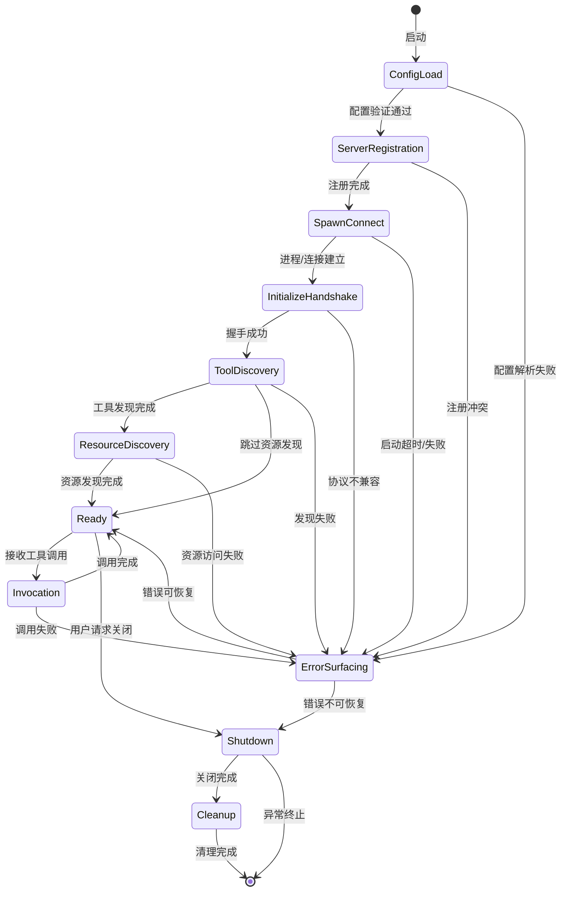
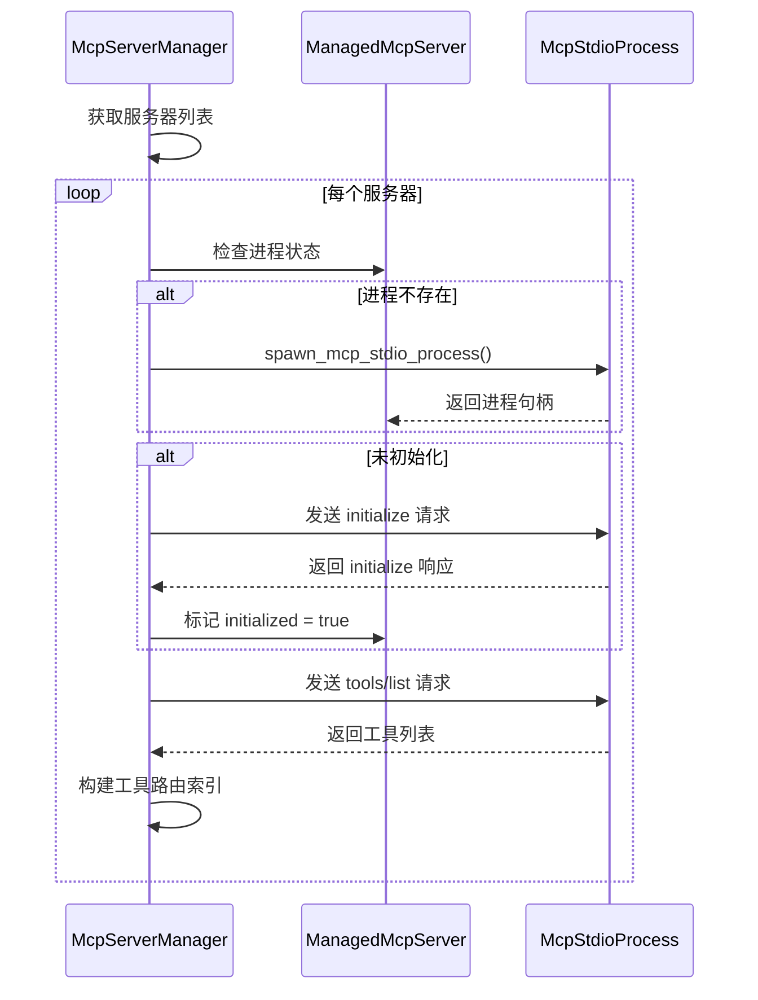

本文档深入解析 Claw 项目中 MCP（Model Context Protocol）服务器的完整生命周期管理机制。MCP 服务器作为连接外部工具和服务的核心桥梁，其生命周期管理涉及配置加载、进程生成、协议握手、工具发现、运行时调用及优雅关闭等关键阶段。系统通过**状态机驱动的生命周期验证器**确保每个阶段的状态转换合法，并提供**降级模式**以应对部分服务器故障场景。

Sources: [mcp_lifecycle_hardened.rs](rust/crates/runtime/src/mcp_lifecycle_hardened.rs#L15-L280)

## 生命周期阶段模型

MCP 服务器生命周期被精确定义为 **11 个离散阶段**，每个阶段代表服务器从配置到就绪再到关闭的特定状态。阶段之间遵循严格的状态转换规则，确保服务器初始化的可靠性和可追溯性。

| 阶段 | 英文标识 | 职责描述 | 可恢复性 |
|------|----------|----------|----------|
| 配置加载 | `config_load` | 解析并验证 MCP 服务器配置文件 | 不可恢复 |
| 服务器注册 | `server_registration` | 将服务器配置注册到运行时 | 不可恢复 |
| 生成连接 | `spawn_connect` | 启动 stdio 进程或建立远程连接 | 可恢复 |
| 初始化握手 | `initialize_handshake` | 执行 MCP 协议初始化握手 | 可恢复 |
| 工具发现 | `tool_discovery` | 发现并注册服务器提供的工具 | 可恢复 |
| 资源发现 | `resource_discovery` | 发现服务器提供的资源（可选） | 可恢复 |
| 就绪 | `ready` | 服务器已准备好接受工具调用 | N/A |
| 调用 | `invocation` | 执行工具调用请求 | 条件恢复 |
| 错误处理 | `error_surfacing` | 结构化错误上报与恢复决策 | N/A |
| 关闭 | `shutdown` | 停止服务器进程/连接 | 不可恢复 |
| 清理 | `cleanup` | 释放资源并清理状态 | 不可恢复 |

阶段转换遵循**有向无环图**结构，主要路径为线性推进，但支持特定场景下的回退（如从 `invocation` 返回 `ready`）和错误跳转（任何阶段可跳转至 `error_surfacing`）。

Sources: [mcp_lifecycle_hardened.rs](rust/crates/runtime/src/mcp_lifecycle_hardened.rs#L272-L295)

## 生命周期状态机架构

MCP 生命周期验证器 (`McpLifecycleValidator`) 实现了状态机的核心逻辑，负责验证阶段转换的合法性并记录每个阶段的执行结果。



**状态机关键特性**：

1. **阶段时间戳追踪**：每个阶段进入时记录 Unix 时间戳，支持性能分析和故障诊断
2. **错误分类存储**：按阶段索引错误列表，支持多维度错误查询
3. **可恢复性判断**：根据错误类型决定是否允许从 `error_surfacing` 返回 `ready`
4. **转换验证**：严格验证阶段转换的合法性，防止非法状态迁移

Sources: [mcp_lifecycle_hardened.rs](rust/crates/runtime/src/mcp_lifecycle_hardened.rs#L256-L350)

## 错误表面化机制

MCP 生命周期定义了结构化的错误表示类型 `McpErrorSurface`，用于在任意阶段捕获和传播错误信息。每个错误包含以下核心字段：

- **phase**: 错误发生的生命周期阶段
- **server_name**: 关联的服务器名称（可选）
- **message**: 人类可读的错误描述
- **context**: 键值对形式的上下文信息
- **recoverable**: 布尔标志，指示错误是否可恢复
- **timestamp**: 错误发生的时间戳

```rust
pub struct McpErrorSurface {
    pub phase: McpLifecyclePhase,
    pub server_name: Option<String>,
    pub message: String,
    pub context: BTreeMap<String, String>,
    pub recoverable: bool,
    pub timestamp: u64,
}
```

**阶段结果类型** (`McpPhaseResult`) 定义了三种执行结果：

| 变体 | 触发条件 | 后续行为 |
|------|----------|----------|
| `Success` | 阶段执行成功 | 进入下一阶段 |
| `Failure` | 阶段执行失败 | 跳转至 `error_surfacing` |
| `Timeout` | 阶段执行超时 | 跳转至 `error_surfacing`（标记为可恢复） |

Sources: [mcp_lifecycle_hardened.rs](rust/crates/runtime/src/mcp_lifecycle_hardened.rs#L65-L135)

## 服务器管理器实现

`McpServerManager` 是 MCP 服务器生命周期的核心执行引擎，负责管理多个 STDIO 传输类型的 MCP 服务器。其核心职责包括：

### 服务器引导

从运行时配置中提取 STDIO 服务器配置，创建 `McpClientBootstrap` 对象，包含：
- 服务器名称和标准化名称
- 工具名称前缀（格式：`mcp__{server_name}__`）
- 配置签名（用于缓存键）
- 传输层配置

Sources: [mcp_client.rs](rust/crates/runtime/src/mcp_client.rs#L52-L75)

### 工具发现流程

工具发现是服务器初始化的关键阶段，流程如下：



**超时配置**：
- 初始化超时：10,000ms（测试模式 200ms）
- 工具列表超时：30,000ms（测试模式 300ms）

Sources: [mcp_stdio.rs](rust/crates/runtime/src/mcp_stdio.rs#L782-L870)

### 降级模式报告

当部分服务器初始化失败时，系统生成 `McpDegradedReport` 降级报告，包含：
- **working_servers**: 正常工作的服务器列表
- **failed_servers**: 失败服务器及其错误信息
- **available_tools**: 可用工具列表
- **missing_tools**: 预期但缺失的工具列表

这种设计允许系统在部分功能受损的情况下继续运行，而非完全失败。

Sources: [mcp_lifecycle_hardened.rs](rust/crates/runtime/src/mcp_lifecycle_hardened.rs#L220-L250)

## 传输层抽象

MCP 客户端支持多种传输协议，通过 `McpClientTransport` 枚举统一抽象：

| 传输类型 | 配置结构 | 认证支持 | 使用场景 |
|----------|----------|----------|----------|
| `Stdio` | `McpStdioTransport` | 无 | 本地进程通信 |
| `Sse` | `McpRemoteTransport` | OAuth | 服务器发送事件 |
| `Http` | `McpRemoteTransport` | OAuth | HTTP POST 请求 |
| `WebSocket` | `McpRemoteTransport` | 无 | 双向实时通信 |
| `Sdk` | `McpSdkTransport` | 内建 | SDK 集成 |
| `ManagedProxy` | `McpManagedProxyTransport` | 托管 | Claude.ai 代理 |

**认证机制**：远程传输支持 OAuth 2.0 认证，通过 `McpClientAuth::OAuth` 变体携带 OAuth 配置，包括：
- `client_id`: OAuth 客户端标识
- `callback_port`: 回调服务器端口
- `auth_server_metadata_url`: 授权服务器元数据 URL
- `xaa`: 扩展认证标志

Sources: [mcp_client.rs](rust/crates/runtime/src/mcp_client.rs#L8-L50)

## 配置系统与作用域

MCP 服务器配置采用**多作用域合并**策略，支持三个配置来源：

1. **User** (`~/.claw/settings.json`): 用户全局配置
2. **Project** (`./.claw.json` 或 `./.claw/settings.json`): 项目级配置
3. **Local** (`./.claw/settings.local.json`): 本地临时配置（通常加入 .gitignore）

配置合并遵循**后加载覆盖**原则，但服务器配置按名称去重，后定义的同名服务器覆盖先前的配置。

**配置签名计算**：
```rust
pub fn scoped_mcp_config_hash(config: &ScopedMcpServerConfig) -> String {
    // 根据传输类型生成配置内容的稳定哈希
    // 用于缓存键和配置变更检测
}
```

Sources: [config.rs](rust/crates/runtime/src/config.rs#L85-L175)

## 工具调用路由

工具调用通过**合格名称**（qualified name）进行路由，格式为 `mcp__{server_name}__{tool_name}`。`McpServerManager` 维护 `tool_index` 映射表，将合格名称路由到对应的服务器和原始工具名：

```rust
struct ToolRoute {
    server_name: String,  // 目标服务器
    raw_name: String,     // 服务器内部工具名
}
```

调用流程：
1. 解析合格名称，查询 `tool_index`
2. 调用 `ensure_server_ready()` 确保服务器处于就绪状态
3. 获取服务器超时配置（默认 60,000ms）
4. 发送 `tools/call` JSON-RPC 请求
5. 处理响应并返回结果

Sources: [mcp_stdio.rs](rust/crates/runtime/src/mcp_stdio.rs#L620-L700)

## 恢复策略

系统定义了多层恢复机制：

### 自动重试
- **传输错误**：首次失败时自动重置服务器并重试
- **超时错误**：标记为可恢复，允许从 `error_surfacing` 返回 `ready`

### 服务器重置
当检测到以下错误类型时触发服务器重置：
- `Transport`: 底层通信错误
- `Timeout`: 请求超时
- `InvalidResponse`: 响应解析失败

重置流程：
1. 终止现有进程（如果存在）
2. 清除工具路由索引
3. 重新生成进程并执行初始化握手

### 不可恢复错误
以下场景标记为不可恢复，阻止返回 `ready` 状态：
- 配置解析失败
- 协议版本不兼容
- 工具调用导致会话损坏

Sources: [mcp_lifecycle_hardened.rs](rust/crates/runtime/src/mcp_lifecycle_hardened.rs#L740-L830)

## 测试验证策略

生命周期验证器包含完整的单元测试套件，验证：

1. **正常启动路径**：从 `ConfigLoad` 到 `Cleanup` 的完整流程
2. **可选阶段跳过**：从 `ToolDiscovery` 直接到 `Ready`（跳过资源发现）
3. **无效转换拒绝**：如从 `Ready` 直接返回 `ConfigLoad`
4. **错误恢复逻辑**：可恢复错误允许返回 `ready`，不可恢复错误阻止恢复
5. **超时处理**：超时错误保留等待时长信息并标记为可恢复

Sources: [mcp_lifecycle_hardened.rs](rust/crates/runtime/src/mcp_lifecycle_hardened.rs#L410-L720)

## 与插件系统的集成

MCP 服务器生命周期与插件生命周期 (`PluginLifecycle`) 共享相似的阶段模型，但 MCP 更专注于**协议级别的初始化和工具发现**。插件系统在此基础上增加了健康检查和资源追踪功能。

**关键区别**：
- MCP 生命周期：协议驱动，关注 JSON-RPC 通信
- 插件生命周期：进程驱动，关注健康检查和资源隔离

两者通过 `McpDegradedReport` 和 `DegradedMode` 共享降级模式报告机制。

Sources: [plugin_lifecycle.rs](rust/crates/runtime/src/plugin_lifecycle.rs#L1-L50)

## 下一步阅读

完成本文档后，建议继续阅读以下相关主题：

- **[工具系统实现](12-gong-ju-xi-tong-shi-xian)**：深入了解工具注册、参数验证和执行机制
- **[插件系统架构](18-cha-jian-xi-tong-jia-gou)**：了解插件与 MCP 服务器的集成模式
- **[运行时引擎与对话循环](11-yun-xing-shi-yin-qing-yu-dui-hua-xun-huan)**：理解 MCP 工具调用在对话循环中的位置
- **[权限与安全模型](14-quan-xian-yu-an-quan-mo-xing)**：了解工具调用的权限检查机制