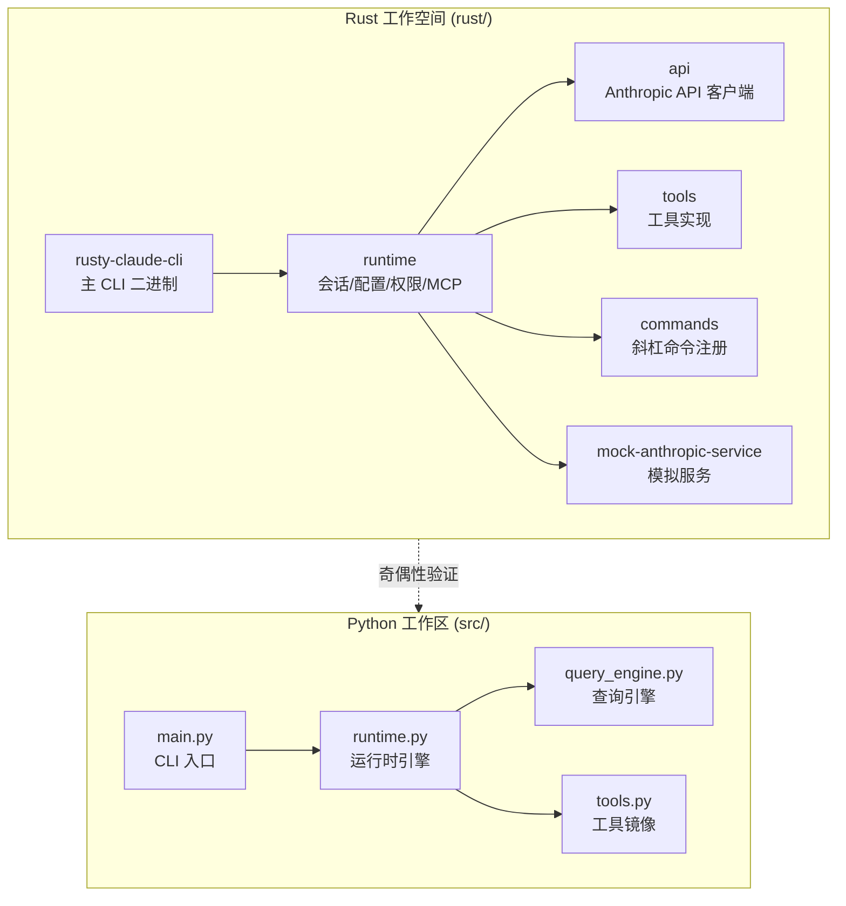

本文档提供 **Claw Code** 项目的快速入门指南，帮助你快速了解项目结构并完成首次运行。Claw Code 是一个采用 **Rust + Python 双语言实现** 的 CLI Agent 框架，支持交互式 REPL、工具系统、会话管理和 Anthropic API 集成。

> **注意**：当前活跃的开发工作区位于 `rust/` 目录，Python 工作区 (`src/`) 主要用于移植验证和架构镜像。建议新用户优先从 Rust 实现开始体验。

## 项目架构概览

Claw Code 采用分层架构设计，Rust 工作空间包含 9 个核心 crate，Python 工作区提供镜像验证能力：



**架构特点**：

| 维度 | Rust 实现 | Python 实现 |
|------|-----------|-------------|
| **定位** | 生产级 CLI 运行时 | 移植验证与架构镜像 |
| **入口** | `cargo run -p rusty-claude-cli` | `python3 -m src.main` |
| **性能** | 原生编译，高性能流式处理 | 解释执行，验证用途 |
| **工具系统** | 完整实现 (bash/read/write/grep 等) | 镜像元数据 |
| **会话管理** | `.claw/sessions/` 持久化 | 会话加载验证 |
| **测试框架** | Mock 奇偶性测试框架 | 单元测试验证 |

Sources: [README.md](README.md#L1-L50), [rust/README.md](rust/README.md#L1-L50), [USAGE.md](USAGE.md#L1-L30)

## 前置依赖

在开始之前，请确保你的开发环境满足以下要求：

### Rust 工作空间

| 依赖项 | 版本要求 | 验证命令 |
|--------|----------|----------|
| Rust 工具链 | 最新稳定版 | `rustc --version` |
| Cargo | 与 Rust 配套 | `cargo --version` |
| ANTHROPIC_API_KEY | 有效 API 密钥 | `echo $ANTHROPIC_API_KEY` |

### Python 工作区（可选）

| 依赖项 | 版本要求 | 验证命令 |
|--------|----------|----------|
| Python | 3.8+ | `python3 --version` |
| unittest | 标准库 | `python3 -m unittest --help` |

Sources: [USAGE.md](USAGE.md#L6-L12), [rust/README.md](rust/README.md#L15-L25)

## 快速启动 Rust CLI

### 步骤 1：构建工作空间

```bash
cd rust
cargo build --workspace
```

构建完成后，CLI 二进制文件位于 `rust/target/debug/claw`。

### 步骤 2：配置认证

**方式一：API 密钥（推荐）**

```bash
export ANTHROPIC_API_KEY="sk-ant-..."
```

**方式二：OAuth 认证**

```bash
cd rust
./target/debug/claw login
```

Sources: [USAGE.md](USAGE.md#L14-L35)

### 步骤 3：运行交互式 REPL

```bash
cd rust
./target/debug/claw
```

进入 REPL 后，可使用以下斜杠命令：

| 命令 | 功能描述 |
|------|----------|
| `/help` | 显示帮助信息 |
| `/status` | 显示会话状态（模型、token、成本） |
| `/model [name]` | 查看或切换模型 |
| `/permissions` | 查看或切换权限模式 |
| `/compact` | 压缩对话历史 |
| `/clear` | 清除对话 |
| `/diff` | 显示 git 差异 |
| `/export [path]` | 导出对话记录 |

Sources: [rust/README.md](rust/README.md#L85-L105)

## 快速启动 Python 工作区

Python 工作区主要用于架构验证和奇偶性测试，可通过以下命令快速探索：

### 查看移植摘要

```bash
python3 -m src.main summary
```

### 查看工作区清单

```bash
python3 -m src.main manifest
```

### 列出子系统模块

```bash
python3 -m src.main subsystems --limit 16
```

### 运行验证测试

```bash
python3 -m unittest discover -s tests -v
```

Sources: [README.md](README.md#L105-L130), [src/main.py](src/main.py#L1-L50)

## 常用命令示例

### 单次提示模式

```bash
# 标准提示
./target/debug/claw prompt "summarize this repository"

# 简写模式
./target/debug/claw "explain rust/crates/runtime/src/lib.rs"

# JSON 输出（适合脚本自动化）
./target/debug/claw --output-format json prompt "status"
```

### 模型与权限控制

```bash
# 指定模型
./target/debug/claw --model sonnet prompt "review this diff"

# 只读权限
./target/debug/claw --permission-mode read-only prompt "summarize Cargo.toml"

# 工作区写入权限
./target/debug/claw --permission-mode workspace-write prompt "update README.md"

# 限制可用工具
./target/debug/claw --allowedTools read,glob "inspect the runtime crate"
```

### 会话管理

```bash
# 恢复最新会话
./target/debug/claw --resume latest

# 恢复会话并执行命令
./target/debug/claw --resume latest /status /diff
```

Sources: [USAGE.md](USAGE.md#L40-L80)

## 模型别名对照

CLI 支持简短的模型别名：

| 别名 | 解析为 |
|------|--------|
| `opus` | `claude-opus-4-6` |
| `sonnet` | `claude-sonnet-4-6` |
| `haiku` | `claude-haiku-4-5-20251213` |

Sources: [rust/README.md](rust/README.md#L65-L75), [USAGE.md](USAGE.md#L55-L60)

## 权限模式说明

| 模式 | 描述 | 适用场景 |
|------|------|----------|
| `read-only` | 只读访问 | 代码审查、文档生成 |
| `workspace-write` | 工作区写入 | 代码修改、文件创建 |
| `danger-full-access` | 完全访问 | 需要外部命令执行的场景 |

Sources: [USAGE.md](USAGE.md#L50-L54)

## 配置文件加载顺序

运行时配置按以下顺序加载（后续覆盖先前）：

1. `~/.claw.json`
2. `~/.config/claw/settings.json`
3. `<repo>/.claw.json`
4. `<repo>/.claw/settings.json`
5. `<repo>/.claw/settings.local.json`

Sources: [USAGE.md](USAGE.md#L85-L92)

## Mock 奇偶性测试框架

工作空间包含确定性模拟服务和奇偶性测试框架，用于验证 Rust 实现与原始系统的兼容性：

```bash
cd rust
# 运行脚本化测试框架
./scripts/run_mock_parity_harness.sh

# 或手动启动模拟服务
cargo run -p mock-anthropic-service -- --bind 127.0.0.1:0
```

Sources: [rust/README.md](rust/README.md#L40-L60), [USAGE.md](USAGE.md#L95-L105)

## 下一步阅读

完成快速开始后，建议按以下顺序深入学习：

1. **[概述](1-gai-shu)** — 了解项目整体定位和核心功能
2. **[项目愿景与价值主张](3-xiang-mu-yuan-jing-yu-jie-zhi-zhu-zhang)** — 理解项目设计理念
3. **[前置依赖与安装](6-qian-zhi-yi-lai-yu-an-zhuang)** — 详细的环境搭建指南
4. **[双语言实现架构](8-shuang-yu-yan-shi-xian-jia-gou)** — 深入理解 Rust + Python 架构设计
5. **[交互式 REPL 模式](20-jiao-hu-shi-repl-mo-shi)** — 掌握 CLI 交互使用技巧

如需了解认证配置的详细信息，请阅读 **[认证与配置](7-ren-zheng-yu-pei-zhi)**。