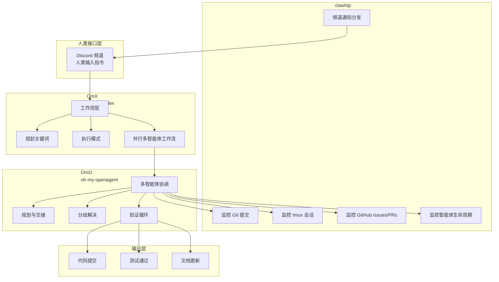

本文档阐述 Claw Code 项目的核心愿景、设计哲学与价值主张。作为自主软件开发范式的公开演示，本项目不仅是一个代码库，更是一套展示人类与编码智能体如何协同工作的系统架构。理解这些理念是深入技术实现的前提。

## 核心理念：人类设定方向，Claws 执行工作

Claw Code 的根本哲学在于重新定义人类在软件开发中的角色。**人类不再需要坐在终端前微观管理每一步操作**，而是提供清晰的方向指引，由多个编码智能体（claws/lobsters）并行协调执行具体工作。这种范式转变将稀缺资源从"打字速度"重新分配给"架构清晰度"、"任务分解能力"、"判断力"和"产品品味"。

项目的真正价值不在于生成的代码文件，而在于**产生这些文件的协调系统**。当智能体系统能够在数小时内重建整个代码库时，真正有价值的差异化因素变为：产品品味、方向决策、系统设计、人类信任和运营稳定性。人类的职责不是与机器比拼打字速度，而是**决定什么值得被构建**。

Sources: [PHILOSOPHY.md](PHILOSOPHY.md#L1-L30)

## 三部分系统架构

Claw Code 由三个相互协作的核心组件构成，形成一个完整的自主开发工作流：

**OmX (oh-my-codex)** 提供工作流层，将简短指令转化为结构化执行流程，包括规划关键词、执行模式、持久化验证循环和并行多智能体工作流。这是将一句话转化为可重复工作协议的转换层。

**clawhip** 作为事件和通知路由器，监控 Git 提交、tmux 会话、GitHub Issues 和 PRs、智能体生命周期事件以及频道分发。其核心职责是将监控和通知**置于编码智能体的上下文窗口之外**，使智能体专注于实现而非状态格式化和通知路由。

**OmO (oh-my-openagent)** 处理多智能体协调，包括规划、交接、分歧解决和跨智能体验证循环。当架构师、执行者和审查者意见不一致时，OmO 提供使循环收敛而非崩溃的结构框架。

Sources: [PHILOSOPHY.md](PHILOSOPHY.md#L32-L75)

## 真正的人机界面：Discord

项目设计中一个关键洞察是：**重要的人机界面不是 tmux、Vim、SSH 或终端复用器，而是 Discord 频道**。用户可以从手机输入一句话，然后离开、睡觉或做其他事情。claws 读取指令，将其分解为任务，分配角色，编写代码，运行测试，争论失败原因，恢复并在工作通过时推送。

这种设计意味着人类不再被绑定在终端前实时监控每个步骤。通知路由和状态跟踪由 clawhip 处理，智能体在 Discord 频道中报告进展和请求决策，形成异步但高效的工作流。

Sources: [PHILOSOPHY.md](PHILOSOPHY.md#L17-L26)

## 项目演示目标

Claw Code 作为一个公开演示，旨在证明一个代码库可以：

| 特性 | 传统开发模式 | Claw Code 模式 |
|------|-------------|---------------|
| 构建方式 | 人类配对编程 | claws/lobsters 协调构建 |
| 操作界面 | 终端/IDE | 聊天接口 (Discord) |
| 改进循环 | 手动代码审查 | 结构化规划/执行/审查循环 |
| 维护焦点 | 输出文件 | 协调层展示 |
| 透明度 | 私有开发 | 公开自主构建 |

项目代码本身是证据，**协调系统才是产品教训**。仓库不仅是代码的集合，更是自主软件开发可行性的公开证明。

Sources: [PHILOSOPHY.md](PHILOSOPHY.md#L77-L93)
Sources: [README.md](README.md#L25-L35)

## "Clawable"编码 Harness 的定义

项目的长期目标是将 claw-code 打造成最**clawable**的编码 harness。"Clawable"的定义包含以下核心属性：

- **确定性启动** — 会话启动过程可预测且可重复
- **机器可读状态** — 状态和失败模式以结构化格式暴露
- **无需人类监控的恢复** — 已知失败模式可自动修复
- **分支/测试/worktree 感知** — 理解代码库的版本控制状态
- **插件/MCP 生命周期感知** — 理解外部服务的启动和连接状态
- **事件优先而非日志优先** — 状态以类型化事件而非文本日志形式暴露
- **自主下一步执行能力** — 能够无需人类干预决定并执行下一步

这些属性确保 claws 能够通过 hooks、plugins、sessions 和 channel events 进行有效协调，而非依赖人类在终端前手动干预。

Sources: [ROADMAP.md](ROADMAP.md#L1-L25)

## 当前痛点与解决方向

项目识别出当前编码智能体系统的七个主要痛点，并针对性地提出解决方向：

| 痛点 | 问题描述 | 解决方向 |
|------|---------|---------|
| 会话启动脆弱 | 信任提示可能阻塞 TUI 启动，提示可能发送到 shell 而非编码智能体 | 添加明确的就绪握手生命周期状态 |
| 真相分散 | tmux 状态、clawhip 事件流、git 状态、测试状态、插件/MCP 运行时状态分散在各层 | 建立规范化的事件模式 |
| 事件过于日志化 | claws 从嘈杂文本中推断过多，重要状态未标准化为机器可读事件 | 类型化事件 schema |
| 恢复循环过于手动 | 需要手动重启 worker、接受信任提示、重新注入提示等 | 编码已知自动恢复方案 |
| 分支新鲜度未强制 | 侧分支可能错过已在 main 上修复的问题 | 在广泛测试前检测陈旧分支 |
| 插件/MCP 失败分类不足 | 启动失败、握手失败、配置错误等未清晰暴露 | 失败分类 taxonomy |
| 人类 UX 泄漏到 claw 工作流 | 过多依赖终端/TUI 行为而非显式智能体状态转换 | 状态机优先设计 |

Sources: [ROADMAP.md](ROADMAP.md#L27-L75)

## 产品原则

项目遵循七项核心产品原则，指导所有技术决策：

1. **状态机优先** — 每个 worker 都有明确的生命周期状态
2. **事件优于抓取文本** — 频道输出应从类型化事件派生
3. **恢复优先于升级** — 已知失败模式应在求助前自动修复一次
4. **分支新鲜度优先于问责** — 在将红色测试视为新回归前检测陈旧分支
5. **部分成功是一等公民** — 例如 MCP 启动可以对某些服务器成功而对其他失败，以结构化降级模式报告
6. **终端是传输而非真相** — tmux/TUI 可能仍是实现细节，但编排状态必须位于其上
7. **策略是可执行的** — 合并、重试、rebase、陈旧清理和升级规则应由机器强制执行

Sources: [ROADMAP.md](ROADMAP.md#L77-L95)

## 生态系统与社区

Claw Code 是 UltraWorkers 生态系统的一部分，与以下项目紧密集成：

- **[clawhip](https://github.com/Yeachan-Heo/clawhip)** — 事件和通知路由器
- **[oh-my-openagent](https://github.com/code-yeongyu/oh-my-openagent)** — 多智能体协调
- **[oh-my-claudecode](https://github.com/Yeachan-Heo/oh-my-claudecode)** — Claude Code 封装层
- **[oh-my-codex](https://github.com/Yeachan-Heo/oh-my-codex)** — 工作流编排层

项目通过 [UltraWorkers Discord](https://discord.gg/6ztZB9jvWq) 社区进行协作，讨论 LLMs、harness 工程、智能体工作流和自主软件开发。

Sources: [README.md](README.md#L15-L20)
Sources: [README.md](README.md#L160-L170)

## 下一步阅读建议

理解项目愿景后，建议按以下顺序深入学习：

1. **[自主开发哲学](4-zi-zhu-kai-fa-zhe-xue)** — 深入了解项目背后的设计哲学和思考方式
2. **[生态系统组件介绍](5-sheng-tai-xi-tong-zu-jian-jie-shao)** — 详细了解 OmX、clawhip、OmO 的技术实现
3. **[双语言实现架构](8-shuang-yu-yan-shi-xian-jia-gou)** — 理解 Rust 和 Python 双语言实现的设计决策
4. **[开发路线图](29-kai-fa-lu-xian-tu)** — 了解项目的未来发展方向和阶段性目标