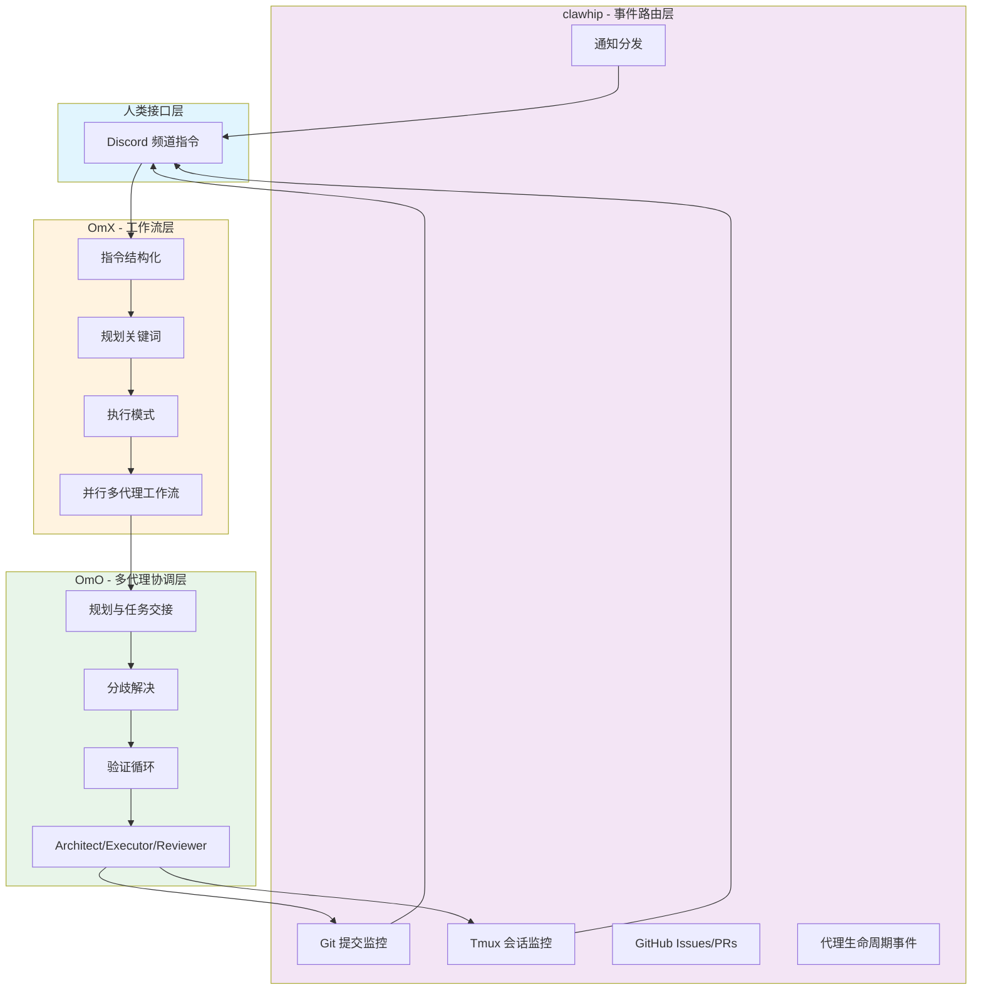
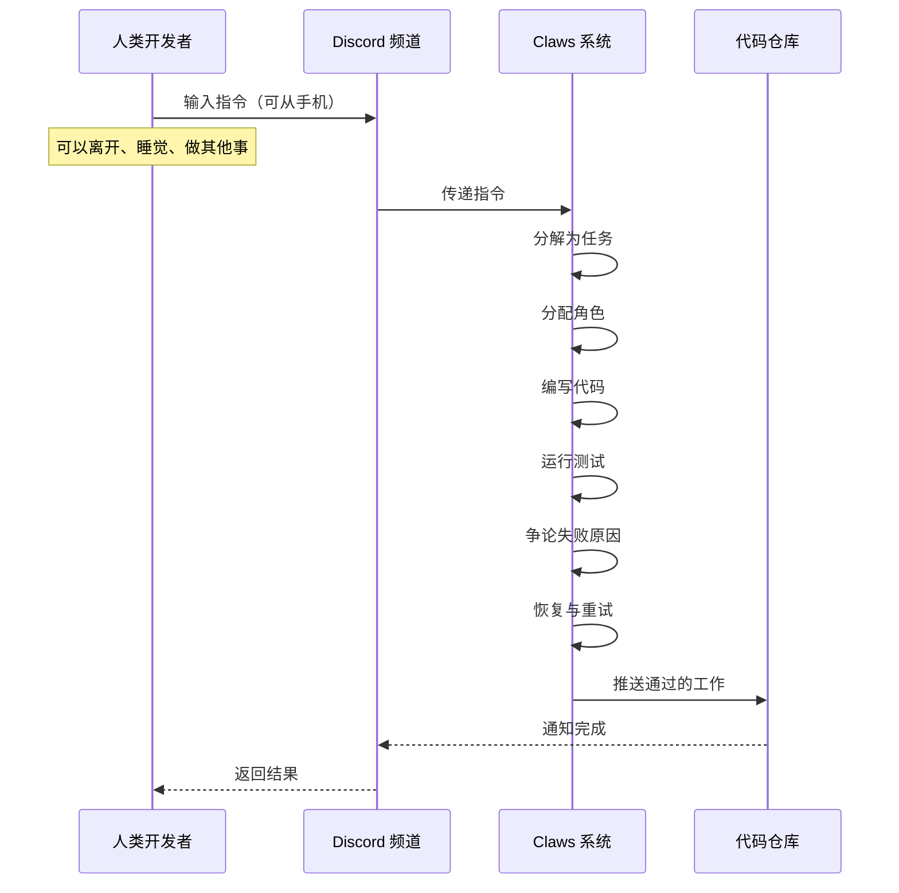
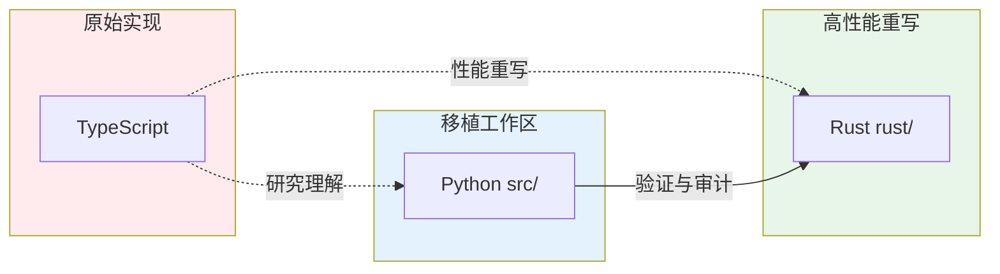
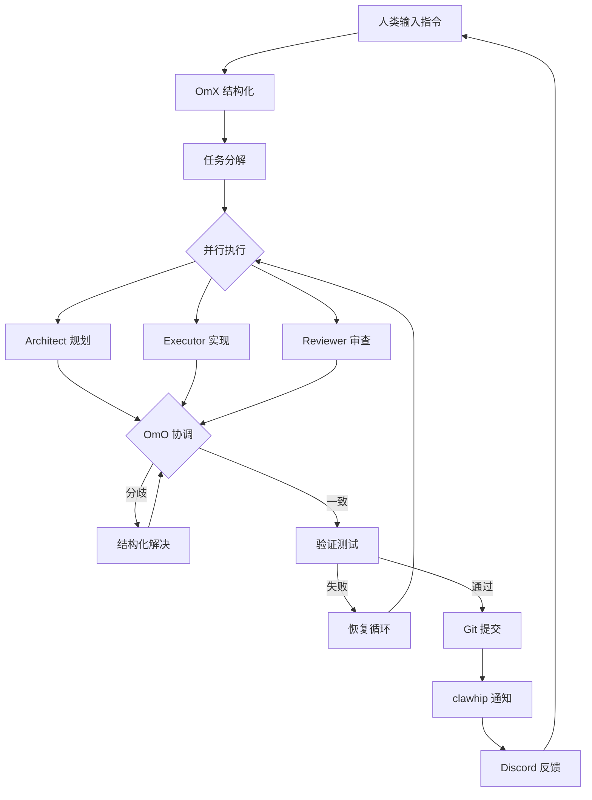

本文档阐述 Claw Code 项目的核心开发理念与自主开发范式。这不是一个传统意义上由人类开发者逐行编写代码的项目，而是一个**展示自主软件开发系统如何运作**的公共示范。

理解本项目的关键在于认识到：**代码库本身只是产物，真正值得研究的是产生这些代码的系统**。

## 核心理念：人类设定方向，Claws 执行工作

Claw Code 的根本哲学可以概括为一句话：**人类提供清晰的方向，多个编码代理并行协调执行，自动化完成规划、执行、审查和重试循环**。

这种范式转变的核心认知是：当代理系统能够在数小时内重建整个代码库时，稀缺资源不再是打字速度或编码时间，而是：

| 稀缺资源 | 传统开发 | 自主开发 |
|---------|---------|---------|
| 主要瓶颈 | 编码速度 | 架构清晰度 |
| 人类角色 | 执行者 | 方向制定者 |
| 关键能力 | 技术实现 | 任务分解与判断力 |
| 协作模式 | 结对编程 | 多代理协调 |

这种转变并不意味着思考变得不重要——相反，**清晰的思考变得更有价值**。

Sources: [PHILOSOPHY.md](PHILOSOPHY.md#L1-L35)

## 三层系统架构

Claw Code 的自主开发能力建立在三个核心组件之上，它们共同构成了一个完整的自主开发工作流：

### 1. OmX（oh-my-codex）—— 工作流层

OmX 负责将简短的人类指令转化为结构化的执行协议。它定义了：

- **规划关键词**：识别任务类型和执行策略
- **执行模式**：如 `$team` 模式用于协调并行审查，`$ralph` 模式用于持久化执行
- **持久验证循环**：确保任务完成质量
- **并行多代理工作流**：同时运行多个编码会话

这一层的核心价值在于**将一句话转化为可重复的工作协议**。

Sources: [PHILOSOPHY.md](PHILOSOPHY.md#L37-L48)

### 2. clawhip —— 事件与通知路由器

clawhip 的关键设计原则是：**将监控和通知分发保持在编码代理的上下文窗口之外**。

它监控的内容包括：
- Git 提交事件
- Tmux 会话状态
- GitHub Issues 和 PRs
- 代理生命周期事件
- 频道消息分发

这种设计的意义在于让编码代理能够**专注于实现而非状态格式化和通知路由**，从而提高整体效率。

Sources: [PHILOSOPHY.md](PHILOSOPHY.md#L50-L60)

### 3. OmO（oh-my-openagent）—— 多代理协调

OmO 处理多代理之间的规划、任务交接、分歧解决和验证循环。当 Architect（架构师）、Executor（执行者）和 Reviewer（审查者）之间出现分歧时，OmO 提供了**使循环收敛而非崩溃的结构**。

这种协调机制确保了：
- 不同角色的代理可以有效协作
- 分歧通过结构化流程解决
- 验证循环持续进行直到任务完成

Sources: [PHILOSOPHY.md](PHILOSOPHY.md#L62-L72)

## 人类接口：Discord 而非终端

一个关键的设计决策是：**真正的用户接口不是 tmux、Vim、SSH 或终端复用器，而是 Discord 频道**。

这种设计带来的工作流程变革：

这意味着一个人可以从手机输入一句话，然后离开、睡觉或做其他事情。Claws 会读取指令、分解任务、分配角色、编写代码、运行测试、对失败进行争论、恢复并在工作通过时推送。

Sources: [PHILOSOPHY.md](PHILOSOPHY.md#L20-L33)

## 双语言实现策略

Claw Code 采用 Python 和 Rust 双语言实现，这体现了自主开发系统的演进特性：

- **Python 移植工作区**（`src/`）：用于理解原始系统结构、进行奇偶性审计和验证
- **Rust 工作空间**（`rust/`）：高性能原生实现，包含 9 个 crate、约 20K 行代码

这种双语言策略反映了自主开发系统的一个特点：**代码库本身是动态演进的产物，而非静态的最终状态**。Python 和 Rust 版本都是这个系统产生的"副产品"，真正有价值的是产生它们的协调系统。

Sources: [README.md](README.md#L45-L65)
Sources: [rust/README.md](rust/README.md#L1-L50)

## 自主开发工作流示例

一个典型的自主开发循环包含以下阶段：

这个循环的关键特征是：
1. **人类不参与微观管理**：不需要坐在终端前指挥每一步
2. **自动化恢复**：失败会触发恢复循环而非终止
3. **持续验证**：规划/执行/审查循环持续进行直到工作通过
4. **公共构建**：整个过程在公开仓库中进行

Sources: [PHILOSOPHY.md](PHILOSOPHY.md#L74-L95)

## 什么仍然重要

随着编码智能变得越来越便宜和普及，持久的差异化因素不再是原始编码输出。在自主开发时代，仍然重要的是：

| 持久价值 | 说明 |
|---------|------|
| **产品品味** | 判断什么值得构建 |
| **方向感** | 设定清晰的战略目标 |
| **系统设计** | 架构清晰度决定系统上限 |
| **人类信任** | 确保系统行为符合预期 |
| **运营稳定性** | 系统可靠运行能力 |
| **下一步判断** | 知道接下来构建什么 |

在这个世界中，人类的工作不是与机器比拼打字速度，而是**决定什么值得存在**。

Sources: [PHILOSOPHY.md](PHILOSOPHY.md#L97-L115)

## Claw Code 的示范意义

Claw Code 证明了一个仓库可以：

- **公开自主构建**
- 由 claws/lobsters 协调而非仅靠人类结对编程
- 通过聊天接口操作
- 通过结构化的规划/执行/审查循环持续改进
- 作为协调层的展示而非仅仅是输出文件

**代码是证据，协调系统才是产品教训**。

Sources: [PHILOSOPHY.md](PHILOSOPHY.md#L74-L85)

## 后续阅读建议

基于本页面建立的理念基础，建议按以下顺序深入理解：

1. **[生态系统组件介绍](5-sheng-tai-xi-tong-zu-jian-jie-shao)** — 详细了解 OmX、clawhip、OmO 等核心组件
2. **[双语言实现架构](8-shuang-yu-yan-shi-xian-jia-gou)** — 理解 Python 和 Rust 实现的技术细节
3. **[自主开发工作流设计](26-zi-zhu-kai-fa-gong-zuo-liu-she-ji)** — 深入探讨自主开发工作流的设计模式
4. **[事件驱动协调系统](27-shi-jian-qu-dong-xie-diao-xi-tong)** — 了解 clawhip 的事件路由机制