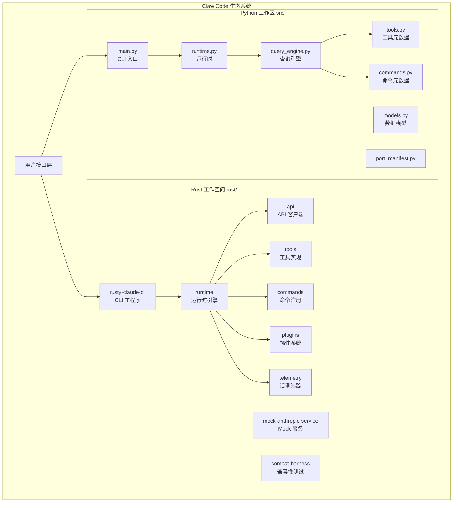
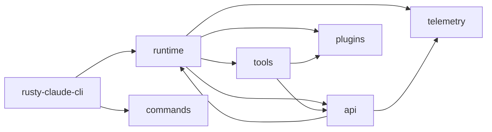
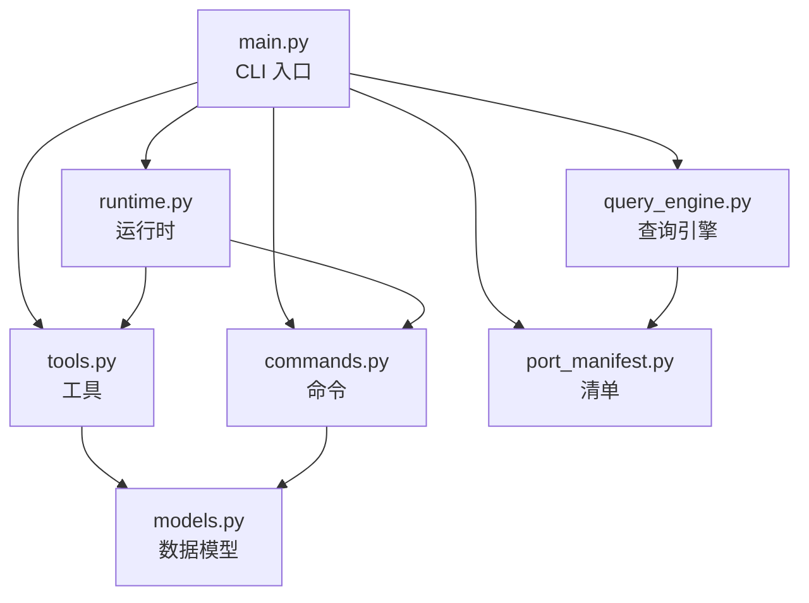

本文档介绍 Claw Code 项目的整体生态系统架构，帮助初学者理解项目的组件构成、职责划分以及各部分之间的协作关系。Claw Code 采用**双语言实现策略**，同时维护 Rust 高性能实现和 Python 移植工作区，两者共同构成完整的开发工具链。

Sources: [README.md](README.md#L1-L50), [CLAUDE.md](CLAUDE.md#L1-L22)

## 整体架构概览

Claw Code 生态系统由两个并行实现的工作空间组成，它们共享相同的设计理念和功能目标，但在技术栈和适用场景上各有侧重：

**Rust 工作空间**是生产级实现，提供高性能的原生 CLI 工具；**Python 工作区**是移植和实验环境，用于快速原型设计和功能验证。

Sources: [rust/README.md](rust/README.md#L1-L80), [src/main.py](src/main.py#L1-L50)

## Rust 工作空间组件

Rust 工作空间采用 Cargo workspace 管理，包含 9 个功能独立的 crate，每个 crate 专注于单一职责：

| Crate | 职责 | 核心依赖 |
|-------|------|----------|
| `rusty-claude-cli` | 主 CLI 二进制程序，提供 REPL 交互和单次提示模式 | runtime, commands, tools |
| `runtime` | 对话循环引擎、会话管理、配置加载、权限策略 | plugins, telemetry, tokio |
| `api` | Anthropic API 客户端、SSE 流解析、认证处理 | runtime, reqwest, tokio |
| `tools` | 内置工具实现（bash、文件操作、搜索、Web 工具等） | api, plugins, runtime |
| `commands` | 斜杠命令注册表和帮助文本生成 | - |
| `plugins` | 插件元数据、注册表和钩子集成接口 | serde, serde_json |
| `telemetry` | 会话追踪事件和使用遥测数据类型 | - |
| `mock-anthropic-service` | 本地 Mock Anthropic 兼容服务，用于奇偶性测试 | - |
| `compat-harness` | 从上游 TypeScript 源提取工具/提示清单 | - |

### 组件依赖关系

**核心运行时循环**由 `runtime` crate 提供，它协调 API 调用、工具执行和会话状态管理。`rusty-claude-cli` 作为入口点，将用户输入传递给运行时引擎，并负责渲染输出。

Sources: [rust/Cargo.toml](rust/Cargo.toml#L1-L23), [rust/crates/runtime/Cargo.toml](rust/crates/runtime/Cargo.toml#L1-L21), [rust/crates/api/Cargo.toml](rust/crates/api/Cargo.toml#L1-L18)

## Python 移植工作区组件

Python 工作区位于 `src/` 目录，采用模块化设计，每个模块对应 Rust 实现中的特定功能领域：

| 模块 | 文件数 | 职责 |
|------|--------|------|
| `main.py` | 1 | CLI 入口点，解析命令行参数并路由到相应功能 |
| `runtime.py` | 1 | 端口运行时实现，支持会话引导和回合循环 |
| `query_engine.py` | 1 | 查询引擎端口，负责移植摘要渲染 |
| `tools.py` | 1 | 工具清单元数据，镜像原始工具注册表 |
| `commands.py` | 1 | 命令清单元数据，镜像原始命令注册表 |
| `models.py` | 1 | 共享数据类定义（Subsystem、PortingModule 等） |
| `port_manifest.py` | 1 | 工作区清单生成，统计模块和文件 |
| `task.py` | 1 | 任务级规划结构 |
| `permissions.py` | 1 | 权限上下文和工具拒绝策略 |
| `session_store.py` | 1 | 会话持久化和加载 |

### Python 模块交互

Python 工作区的核心设计理念是**镜像（mirror）**——它不追求与原始 TypeScript 实现的功能对等，而是通过元数据清单和摘要工具来追踪移植进度和验证架构一致性。

Sources: [src/port_manifest.py](src/port_manifest.py#L1-L53), [src/models.py](src/models.py#L1-L50), [src/main.py](src/main.py#L50-L150)

## 辅助工具与测试基础设施

生态系统包含多个辅助组件，用于支持开发、测试和验证工作流：

### Mock 奇偶性测试框架

`mock-anthropic-service` crate 提供确定性的本地 Mock 服务，模拟 Anthropic API 行为，支持以下测试场景：

- 流式文本响应
- 文件读取往返测试
- Grep 分块组装
- 文件写入允许/拒绝
- 多工具回合往返
- Bash 输出往返
- 权限提示批准/拒绝
- 插件工具往返

测试脚本位于 `rust/scripts/` 目录，包括 `run_mock_parity_harness.sh` 和 `run_mock_parity_diff.py`。

### 配置与引导文件

| 文件 | 用途 |
|------|------|
| `.claude.json` | 共享默认配置 |
| `CLAUDE.md` | Claude Code 工作指引 |
| `.claude/settings.local.json` | 机器本地覆盖配置 |
| `rust/.clawd-todos.json` | 任务追踪清单 |

Sources: [rust/README.md](rust/README.md#L60-L90), [CLAUDE.md](CLAUDE.md#L10-L22)

## 外部生态系统集成

Claw Code 项目是 UltraWorkers 生态系统的一部分，与以下项目紧密集成：

- **[clawhip](https://github.com/Yeachan-Heo/clawhip)** — 核心爪工作流引擎
- **[oh-my-openagent](https://github.com/code-yeongyu/oh-my-openagent)** — OpenAgent 集成层
- **[oh-my-claudecode](https://github.com/Yeachan-Heo/oh-my-claudecode)** — Claude Code 增强工具
- **[oh-my-codex](https://github.com/Yeachan-Heo/oh-my-codex)** — Codex 驱动的工作流编排

这些项目共同构成自主软件开发工具链，支持并行编码会话、事件驱动编排和恢复循环。

Sources: [README.md](README.md#L15-L30)

## 组件选择指南

根据使用场景选择合适的组件：

| 场景 | 推荐组件 | 理由 |
|------|----------|------|
| 生产环境 CLI 使用 | Rust `rusty-claude-cli` | 高性能、完整功能、原生工具执行 |
| 功能原型设计 | Python `src/` 工作区 | 快速迭代、易于修改、元数据验证 |
| 测试与验证 | Mock 奇偶性框架 | 确定性测试、无需 API 密钥 |
| 架构研究 | Python 清单工具 | 清晰的模块映射、移植进度追踪 |
| 插件开发 | Rust `plugins` crate | 钩子集成、类型安全 |

## 后续阅读建议

完成本页面后，建议按以下顺序继续阅读：

1. **[项目愿景与价值主张](3-xiang-mu-yuan-jing-yu-jie-zhi-zhu-zhang)** — 了解项目的核心目标和设计理念
2. **[自主开发哲学](4-zi-zhu-kai-fa-zhe-xue)** — 深入理解自主软件开发的方法论
3. **[双语言实现架构](8-shuang-yu-yan-shi-xian-jia-gou)** — 详细分析 Rust 和 Python 双实现的技术决策
4. **[Rust 工作空间结构](9-rust-gong-zuo-kong-jian-jie-gou)** — 深入了解各 crate 的内部实现