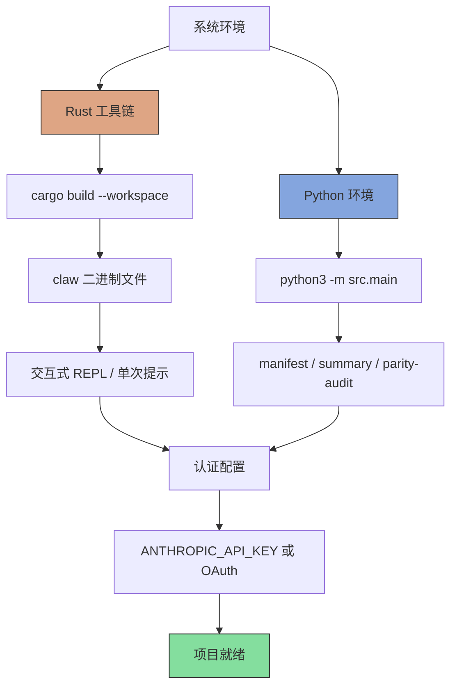
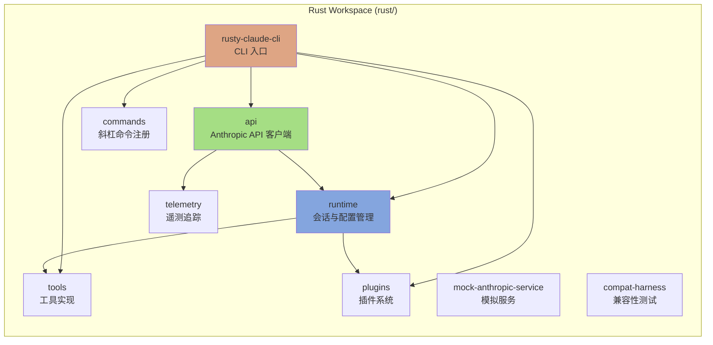
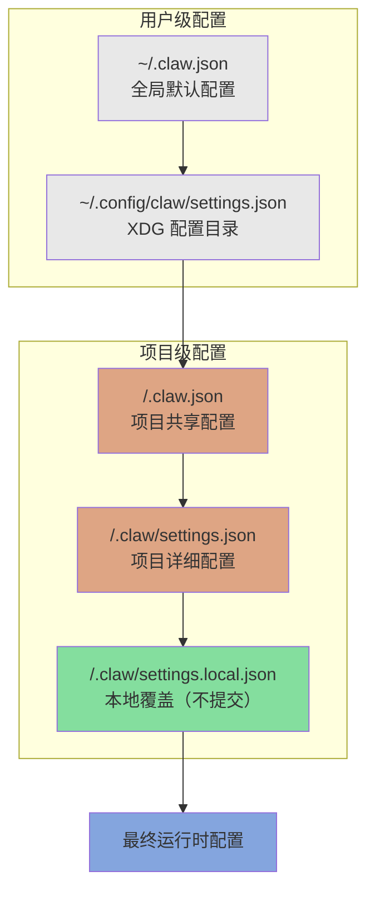

本文档提供 **Claw Code** 项目的环境搭建指南，涵盖 Rust 工作空间与 Python 移植工作区的双语言依赖配置。作为自主开发的 AI 编码助手框架，Claw Code 采用混合架构实现，需要同时准备 Rust 运行时环境与 Python 验证工具链。

本文档面向初次接触本项目的开发者，将引导你完成从系统依赖安装到认证配置的全过程。完成本章节后，你将能够构建项目并运行基础命令。

## 系统依赖概览

Claw Code 项目采用 **Rust + Python 双语言工作空间**架构。Rust 部分提供高性能运行时引擎，Python 部分用于移植验证与工具链支持。



### 依赖清单

| 组件 | 最低版本 | 用途 | 必需性 |
|------|----------|------|--------|
| Rust 工具链 | 1.75+ | 构建 Rust 工作空间与 `claw` CLI | 必需 |
| Cargo | 1.75+ | Rust 包管理与编译 | 必需 |
| Python | 3.10+ | 运行移植验证工具与 parity 审计 | 推荐 |
| Git | 2.0+ | 版本控制与仓库克隆 | 必需 |

Sources: [USAGE.md](USAGE.md#L6-L10), [rust/README.md](rust/README.md#L12-L25)

## Rust 工作空间安装

### 1. 安装 Rust 工具链

使用官方 `rustup` 工具安装 Rust：

```bash
# Linux/macOS
curl --proto '=https' --tlsv1.2 -sSf https://sh.rustup.rs | sh

# 验证安装
rustc --version
cargo --version
```

安装完成后，确保 `~/.cargo/bin` 已添加到系统 PATH 中。

### 2. 克隆仓库

```bash
git clone https://github.com/ultraworkers/claw-code.git
cd claw-code
```

### 3. 构建 Rust 工作空间

Rust 工作空间位于 `rust/` 子目录，包含 9 个功能 crate：

```bash
cd rust/
cargo build --workspace
```

构建完成后，CLI 二进制文件位于 `rust/target/debug/claw`。

Sources: [rust/README.md](rust/README.md#L12-L25), [USAGE.md](USAGE.md#L13-L17)

### Rust Crate 结构



| Crate | 职责 | 核心依赖 |
|-------|------|----------|
| `rusty-claude-cli` | 主 CLI 二进制文件，REPL 与流式输出 | crossterm, rustyline, pulldown-cmark |
| `api` | Anthropic API HTTP 客户端与 SSE 流解析 | reqwest, tokio, serde_json |
| `runtime` | 会话管理、配置加载、权限策略、MCP 生命周期 | tokio, serde, regex, walkdir |
| `tools` | 内置工具实现（bash/read/write/grep/glob 等） | tokio, serde_json |
| `commands` | 斜杠命令定义与帮助文本生成 | serde_json |
| `plugins` | 插件注册与 Hook 集成原语 | serde_json |
| `telemetry` | 会话追踪事件与使用量遥测类型 | serde_json |
| `mock-anthropic-service` | 确定性本地 Anthropic 兼容模拟服务 | tokio, serde_json |
| `compat-harness` | 从上游 TS 源提取工具/提示清单 | serde_json |

Sources: [rust/README.md](rust/README.md#L106-L140), [rust/crates/rusty-claude-cli/Cargo.toml](rust/crates/rusty-claude-cli/Cargo.toml#L1-L34)

## Python 移植工作区配置

Python 工作区位于 `src/` 目录，用于移植验证与 parity 审计。

### 1. 验证 Python 环境

```bash
python3 --version
# 推荐 Python 3.10+
```

### 2. 运行验证测试

```bash
# 运行单元测试
python3 -m unittest discover -s tests -v

# 渲染 Python 移植摘要
python3 -m src.main summary

# 打印当前 Python 工作区清单
python3 -m src.main manifest

# 列出当前 Python 模块
python3 -m src.main subsystems --limit 16
```

### Python 工作区模块

| 模块 | 用途 |
|------|------|
| `port_manifest.py` | 汇总当前 Python 工作空间结构 |
| `models.py` | 子系统、模块和待办状态的数据类 |
| `commands.py` | Python 端命令移植元数据 |
| `tools.py` | Python 端工具移植元数据 |
| `query_engine.py` | 从活动工作区渲染 Python 移植摘要 |
| `main.py` | 清单和摘要输出的 CLI 入口点 |

Sources: [README.md](README.md#L52-L80), [src/setup.py](src/setup.py#L1-L78)

## 认证配置

Claw Code 支持两种认证方式：**API Key 直接访问** 或 **OAuth 持久化认证**。

### 方式一：API Key（推荐用于自动化）

```bash
# 设置环境变量
export ANTHROPIC_API_KEY="sk-ant-..."

# 可选：配置代理端点
export ANTHROPIC_BASE_URL="https://your-proxy.com"
```

### 方式二：OAuth 登录（推荐用于交互式使用）

```bash
cd rust/
./target/debug/claw login
```

OAuth 认证会将凭证持久化存储在本地配置目录中。

### 认证方式对比

| 特性 | API Key | OAuth |
|------|---------|-------|
| 配置方式 | 环境变量 | `claw login` 命令 |
| 持久化 | 每次会话需设置 | 自动持久化 |
| 适用场景 | CI/CD、自动化脚本 | 交互式 REPL |
| 安全性 | 需妥善保管密钥 | 令牌自动刷新 |

Sources: [USAGE.md](USAGE.md#L35-L46), [rust/README.md](rust/README.md#L27-L37)

## 配置文件层次结构

运行时配置按以下顺序加载，后续条目覆盖先前条目：



| 优先级 | 路径 | 用途 | 建议提交至 Git |
|--------|------|------|----------------|
| 1 (最低) | `~/.claw.json` | 用户全局默认设置 | ❌ |
| 2 | `~/.config/claw/settings.json` | XDG 标准配置目录 | ❌ |
| 3 | `<repo>/.claw.json` | 项目共享配置 | ✅ |
| 4 | `<repo>/.claw/settings.json` | 项目详细配置 | ✅ |
| 5 (最高) | `<repo>/.claw/settings.local.json` | 本地个人覆盖 | ❌ |

Sources: [USAGE.md](USAGE.md#L74-L82)

## 快速验证

完成安装后，运行以下命令验证环境：

```bash
# 1. 验证 Rust 构建
cd rust/
cargo run -p rusty-claude-cli -- --help

# 2. 验证 Python 工作区
cd ..
python3 -m src.main summary

# 3. 验证认证配置
echo $ANTHROPIC_API_KEY  # 应显示非空值
# 或
./rust/target/debug/claw login  # 交互式 OAuth 登录
```

### 预期输出示例

```text
# cargo run -p rusty-claude-cli -- --help
claw [OPTIONS] [COMMAND]

Options:
  --model MODEL                    Override the active model
  --dangerously-skip-permissions   Skip all permission checks
  --permission-mode MODE           Set read-only, workspace-write, or danger-full-access
  ...

# python3 -m src.main summary
Python Porting Summary
======================
- Subsystems: 45 modules ported
- Commands: 12 commands mirrored
- Tools: 8 tools implemented
```

Sources: [rust/README.md](rust/README.md#L12-L25), [README.md](README.md#L82-L108)

## 常见问题排查

| 问题 | 可能原因 | 解决方案 |
|------|----------|----------|
| `cargo: command not found` | Rust 未安装或 PATH 未配置 | 运行 `rustup install stable` 并重启终端 |
| `ModuleNotFoundError: src` | 未在正确目录运行 Python 命令 | 确保在项目根目录执行 `python3 -m src.main` |
| `ANTHROPIC_API_KEY not set` | 环境变量未设置 | 执行 `export ANTHROPIC_API_KEY="sk-ant-..."` |
| 构建失败：依赖解析错误 | Cargo.lock 过期或网络问题 | 运行 `cargo update` 后重试 `cargo build` |

## 下一步

完成环境搭建后，建议按以下顺序继续阅读：

1. **[认证与配置](7-ren-zheng-yu-pei-zhi)** — 深入了解认证流程与配置文件详解
2. **[概述](1-gai-shu)** — 了解 Claw Code 的核心功能与使用场景
3. **[快速开始](2-kuai-su-kai-shi)** — 开始你的第一个交互式会话

如需了解项目背景与架构理念，可跳转至 **[项目愿景与价值主张](3-xiang-mu-yuan-jing-yu-jie-zhi-zhu-zhang)** 或 **[双语言实现架构](8-shuang-yu-yan-shi-xian-jia-gou)**。