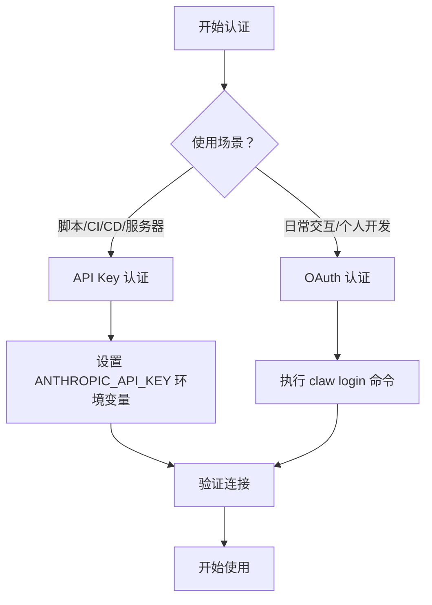
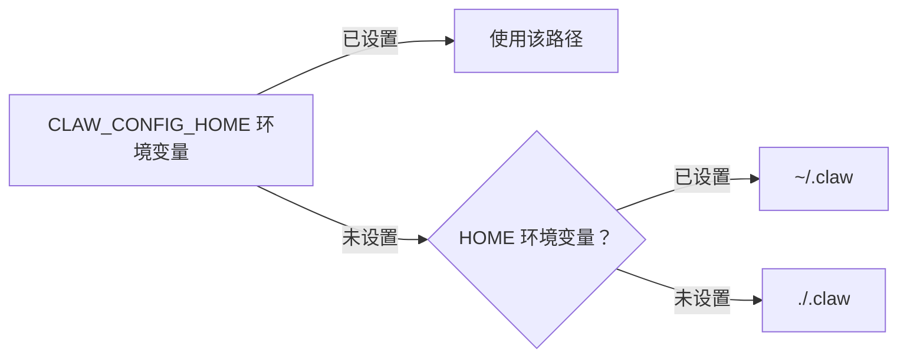

本文档介绍 Claw Code CLI 的认证机制与配置系统。作为入门开发者，理解如何正确配置认证凭证和运行时设置是使用本工具的第一步。Claw Code 支持两种认证方式：**API Key 直接认证**和**OAuth 浏览器认证**，并采用分层配置系统来管理不同作用域的设置。

## 认证方式

Claw Code 提供两种与 Anthropic API 建立连接的认证方式，你可以根据使用场景选择其中一种。

### API Key 认证（推荐用于自动化）

API Key 认证是最直接的认证方式，适用于脚本自动化和服务器环境。你需要从 [Anthropic 控制台](https://console.anthropic.com/) 获取 API Key，然后通过环境变量传递给 CLI。

设置方式如下：

```bash
export ANTHROPIC_API_KEY="sk-ant-..."
```

如果需要访问自定义 API 代理或本地服务，还可以设置基础 URL：

```bash
export ANTHROPIC_BASE_URL="https://your-proxy.com"
```

CLI 在启动时会自动检测这些环境变量。如果同时设置了 `ANTHROPIC_API_KEY` 和 `ANTHROPIC_AUTH_TOKEN`，系统会优先使用 OAuth Bearer Token 进行认证。

Sources: [rust/crates/api/src/providers/anthropic.rs](rust/crates/api/src/providers/anthropic.rs#L38-L65)

### OAuth 认证（推荐用于交互式使用）

OAuth 认证提供了更安全的浏览器登录流程，适合日常交互式使用。认证凭证会持久化存储在本地，无需每次手动设置环境变量。

执行登录命令后，CLI 会生成 PKCE（Proof Key for Code Exchange）代码对，打开浏览器引导你完成授权流程：

```bash
cd rust
./target/debug/claw login
```

登录成功后，访问令牌会存储在 `~/.claw/credentials.json` 文件中。该文件包含以下字段：

| 字段 | 说明 |
|------|------|
| `access_token` | 当前有效的访问令牌 |
| `refresh_token` | 用于刷新访问令牌的令牌（可选） |
| `expires_at` | 令牌过期时间戳（Unix 时间，可选） |
| `scopes` | 授权范围列表 |

如需清除已保存的凭证，可执行：

```bash
./target/debug/claw logout
```

Sources: [rust/crates/runtime/src/oauth.rs](rust/crates/runtime/src/oauth.rs#L13-L22)

### 认证方式选择指南



Sources: [rust/crates/api/src/providers/anthropic.rs](rust/crates/api/src/providers/anthropic.rs#L95-L110)

## 配置系统

Claw Code 采用分层配置系统，允许你在不同作用域（用户级、项目级、本地级）定义设置。后加载的配置会覆盖先加载的配置，实现灵活的设置管理。

### 配置文件加载顺序

配置文件按以下顺序加载，**后面的配置会覆盖前面的配置**：

| 优先级 | 路径 | 作用域 | 用途 |
|--------|------|--------|------|
| 1（最低） | `~/.claw.json` | 用户 | 遗留用户配置 |
| 2 | `~/.claw/settings.json` | 用户 | 标准用户配置 |
| 3 | `<项目>/.claw.json` | 项目 | 项目共享配置 |
| 4 | `<项目>/.claw/settings.json` | 项目 | 项目标准配置 |
| 5（最高） | `<项目>/.claw/settings.local.json` | 本地 | 个人本地覆盖 |

这种设计允许团队共享项目配置（通过版本控制），同时每个开发者可以有自己的本地覆盖（通常添加到 `.gitignore`）。

Sources: [rust/crates/runtime/src/config.rs](rust/crates/runtime/src/config.rs#L210-L235)

### 配置目录解析

配置目录的解析遵循以下规则：



你可以通过设置 `CLAW_CONFIG_HOME` 环境变量来自定义配置目录位置。

Sources: [rust/crates/runtime/src/config.rs](rust/crates/runtime/src/config.rs#L1625-L1632)

### 核心配置选项

以下是常用的配置项及其说明：

| 配置项 | 类型 | 说明 | 示例值 |
|--------|------|------|--------|
| `model` | string | 默认模型别名 | `"sonnet"` |
| `permissionMode` | string | 默认权限模式 | `"workspace-write"` |
| `allowedTools` | array | 允许的工具列表 | `["read", "glob", "grep"]` |
| `oauth` | object | OAuth 客户端配置 | 见下方示例 |
| `hooks` | object | 钩子命令配置 | 见下方示例 |
| `mcpServers` | object | MCP 服务器配置 | 见下方示例 |
| `sandbox` | object | 沙箱隔离配置 | `{"mode": "workspace"}` |

### 权限模式配置

权限模式决定了 CLI 可以执行的操作范围：

| 模式 | 说明 | 适用场景 |
|------|------|----------|
| `read-only` | 仅允许读取文件和信息 | 代码审查、分析任务 |
| `workspace-write` | 允许在工作区内写入文件 | 日常开发、代码修改 |
| `danger-full-access` | 无限制的完全访问 | 需要系统级操作的高级任务 |

通过命令行可以临时覆盖配置：

```bash
./target/debug/claw --permission-mode read-only prompt "分析代码结构"
```

Sources: [rust/crates/runtime/src/permissions.rs](rust/crates/runtime/src/permissions.rs#L8-L24)

### 模型别名

为简化使用，CLI 支持模型别名映射：

| 别名 | 实际模型 |
|------|----------|
| `opus` | `claude-opus-4-6` |
| `sonnet` | `claude-sonnet-4-6` |
| `haiku` | `claude-haiku-4-5-20251213` |

你可以在配置文件或命令行中使用这些别名：

```bash
./target/debug/claw --model sonnet prompt "解释这段代码"
```

Sources: [USAGE.md](USAGE.md#L54-L60)

## 快速配置示例

### 最小化配置（API Key 方式）

```bash
# 1. 设置环境变量
export ANTHROPIC_API_KEY="sk-ant-api03-..."

# 2. 验证配置
./target/debug/claw status
```

### 完整项目配置示例

在项目根目录创建 `.claw/settings.json`：

```json
{
  "model": "sonnet",
  "permissionMode": "workspace-write",
  "allowedTools": ["read", "write", "edit", "glob", "grep", "bash"],
  "mcpServers": {
    "filesystem": {
      "command": "npx",
      "args": ["-y", "@modelcontextprotocol/server-filesystem", "."]
    }
  }
}
```

### 个人本地覆盖

在项目根目录创建 `.claw/settings.local.json`（建议添加到 `.gitignore`）：

```json
{
  "model": "opus",
  "permissionMode": "danger-full-access"
}
```

Sources: [rust/crates/runtime/src/config.rs](rust/crates/runtime/src/config.rs#L260-L290)

## 验证配置

配置完成后，可以使用以下命令验证设置是否生效：

```bash
# 查看当前配置状态
./target/debug/claw /config

# 查看会话状态（包含模型、令牌、成本信息）
./target/debug/claw /status

# 查看权限模式
./target/debug/claw /permissions
```

在 REPL 交互模式中，可以使用 `/config [section]` 查看特定配置部分，如 `/config env`、`/config hooks`、`/config model` 等。

Sources: [USAGE.md](USAGE.md#L82-L92)

## 下一步

完成认证与配置后，你可以继续学习：

- **[快速开始](2-kuai-su-kai-shi)** — 了解基本使用方法和常见工作流
- **[交互式 REPL 模式](20-jiao-hu-shi-repl-mo-shi)** — 掌握交互式对话技巧
- **[权限与安全模型](14-quan-xian-yu-an-quan-mo-xing)** — 深入理解权限系统的工作原理