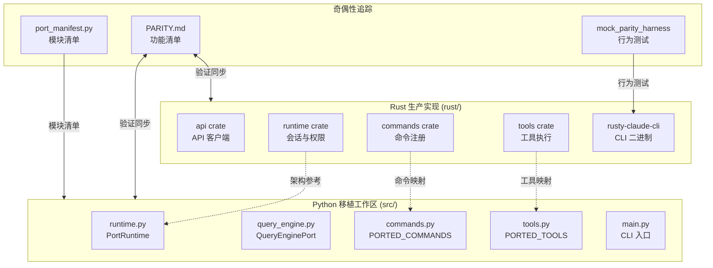
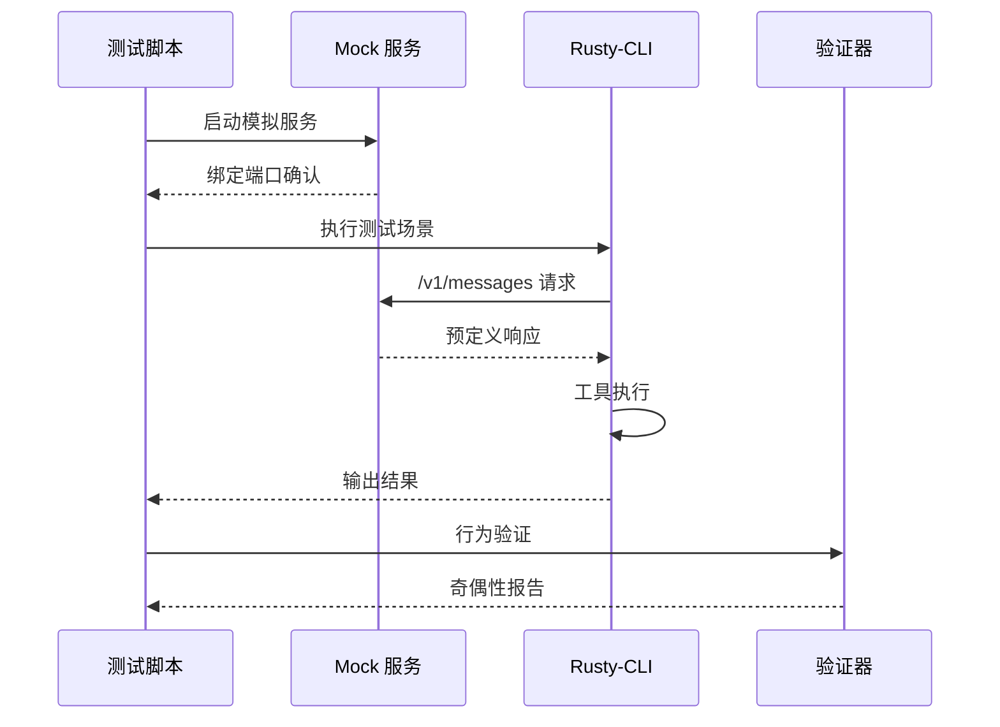

Claw Code 项目采用独特的**双语言并行实现架构**，通过 Rust 生产实现与 Python 移植工作区的协同设计，实现了高性能运行时与快速原型验证的平衡。本页面解析双语言架构的设计哲学、模块映射关系及奇偶性追踪机制。

## 架构概览

双语言架构的核心设计理念是**分层验证与渐进式移植**。Rust 工作空间作为生产级实现，提供高性能、类型安全的 CLI 工具链；Python 工作区则作为架构镜像与移植验证层，支持快速迭代和概念验证。

这种架构允许团队在保持 Rust 实现稳定性的同时，通过 Python 工作区快速探索新功能和架构变更。Sources: [README.md](README.md#L25-L45), [rust/README.md](rust/README.md#L1-L30)

## Rust 工作空间结构

Rust 实现采用**Cargo 工作空间**组织，包含 9 个功能独立的 crates，总计约 48,599 行 Rust 代码。各 crate 通过清晰的责任边界和依赖关系形成分层架构。

| Crate | 责任域 | 核心功能 | LOC 估算 |
|-------|--------|----------|----------|
| `api` | API 通信层 | HTTP 客户端、SSE 流解析、OAuth/API Key 认证 | ~2,000 |
| `commands` | 命令注册 | 斜杠命令定义、帮助文本生成 | ~800 |
| `compat-harness` | 兼容性测试 | TS 源码清单提取、奇偶性验证 | ~1,200 |
| `mock-anthropic-service` | 模拟服务 | 确定性 Anthropic API 模拟 | ~1,500 |
| `plugins` | 插件系统 | 插件注册表、钩子集成 | ~1,800 |
| `runtime` | 运行时引擎 | 会话管理、配置加载、权限策略、MCP 生命周期 | ~8,000 |
| `rusty-claude-cli` | CLI 二进制 | REPL、流式显示、参数解析 | ~3,500 |
| `telemetry` | 遥测系统 | 会话追踪、使用统计 | ~600 |
| `tools` | 工具执行 | 40+ 工具规范与执行逻辑 | ~6,000 |

工作空间配置强制**零 unsafe 代码**策略，通过 Clippy 的 pedantic 级别检查确保代码质量。依赖关系呈现清晰的单向依赖链：`rusty-claude-cli` → `runtime`/`tools`/`commands` → `api`/`plugins`。Sources: [rust/Cargo.toml](rust/Cargo.toml#L1-L23), [rust/README.md](rust/README.md#L100-L140), [PARITY.md](PARITY.md#L1-L20)

## Python 移植工作区结构

Python 工作区位于 `src/` 目录，采用**模块化包结构**设计，包含 30+ 个子系统模块。该工作区不追求运行时等效，而是聚焦于架构镜像和功能清单维护。

```mermaid
flowchart LR
    subgraph Core["核心层"]
        C1["main.py<br/>CLI 入口"]
        C2["runtime.py<br/>PortRuntime"]
        C3["models.py<br/>数据类定义"]
    end
    
    subgraph Engine["引擎层"]
        E1["query_engine.py<br/>查询编排"]
        E2["command_graph.py<br/>命令图"]
        E3["bootstrap_graph.py<br/>引导图"]
    end
    
    subgraph Domain["领域层"]
        D1["commands.py<br/>命令元数据"]
        D2["tools.py<br/>工具元数据"]
        D3["permissions.py<br/>权限上下文"]
        D4["session_store.py<br/>会话持久化"]
    end
    
    subgraph Support["支撑层"]
        S1["context.py<br/>上下文构建"]
        S2["history.py<br/>历史日志"]
        S3["setup.py<br/>环境检测"]
        S4["parity_audit.py<br/>奇偶审计"]
    end
    
    Core --> Engine
    Engine --> Domain
    Domain --> Support
```

关键模块职责：
- **`port_manifest.py`**：生成工作区清单，统计模块文件数和状态
- **`models.py`**：定义 `Subsystem`、`PortingModule`、`PermissionDenial` 等数据类
- **`runtime.py`**：实现 `PortRuntime` 类，提供路由、会话引导和回合循环功能
- **`query_engine.py`**：编排查询引擎，处理消息提交和流式事件

Python 工作区通过 `python3 -m src.main <command>` 提供 CLI 接口，支持 `summary`、`manifest`、`parity-audit` 等诊断命令。Sources: [src/main.py](src/main.py#L1-L50), [src/port_manifest.py](src/port_manifest.py#L1-L53), [src/runtime.py](src/runtime.py#L1-L60)

## 模块映射关系

双语言实现之间存在明确的**功能映射关系**。下表展示核心功能在两种实现中的对应状态：

| 功能域 | Rust 实现位置 | Python 映射位置 | 奇偶状态 |
|--------|--------------|-----------------|----------|
| API 客户端 | `crates/api/src/lib.rs` | `src/remote_runtime.py` | ✅ 已映射 |
| 会话管理 | `crates/runtime/src/session.rs` | `src/session_store.py` | ✅ 已映射 |
| 权限系统 | `crates/runtime/src/permissions.rs` | `src/permissions.py` | ✅ 已映射 |
| 工具执行 | `crates/tools/src/lib.rs` | `src/tools.py` + `src/tool_pool.py` | ✅ 已映射 |
| 命令注册 | `crates/commands/src/lib.rs` | `src/commands.py` | ✅ 已映射 |
| MCP 生命周期 | `crates/runtime/src/mcp_tool_bridge.rs` | `src/remote_runtime.py` | 🔄 部分映射 |
| 插件系统 | `crates/plugins/src/lib.rs` | `src/plugins/__init__.py` | 🔄 部分映射 |
| 遥测追踪 | `crates/telemetry/src/lib.rs` | `src/cost_tracker.py` | 🔄 部分映射 |

映射策略采用**元数据优先**方法：Python 工作区首先建立功能清单和接口规范，Rust 实现则提供完整的行为实现。`PARITY.md` 文档作为权威映射参考，追踪 40 个工具规范和 67+ 个斜杠命令的奇偶状态。Sources: [PARITY.md](PARITY.md#L45-L90), [rust/PARITY.md](rust/PARITY.md#L40-L80)

## 奇偶性测试框架

项目采用**Mock Parity Harness**进行行为级奇偶性验证。该框架包含确定性 Anthropic 兼容模拟服务和清洁环境 CLI 测试工具，确保 Rust 实现与上游行为一致。

测试场景覆盖 10+ 关键行为路径：
- `streaming_text`：流式响应组装
- `read_file_roundtrip`：文件读取往返
- `grep_chunk_assembly`：分块搜索组装
- `write_file_allowed/denied`：权限控制
- `bash_permission_prompt_approved/denied`：Bash 权限提示
- `multi_tool_turn_roundtrip`：多工具回合
- `plugin_tool_roundtrip`：插件工具执行

测试脚本 `run_mock_parity_harness.sh` 在清洁环境中执行，确保结果可重现。Python 脚本 `run_mock_parity_diff.py` 解析场景清单并生成奇偶性差异报告。Sources: [rust/PARITY.md](rust/PARITY.md#L1-L30), [PARITY.md](PARITY.md#L10-L25)

## 架构决策与权衡

双语言架构反映了以下核心设计决策：

| 决策维度 | 选择 | 理由 | 权衡 |
|----------|------|------|------|
| 生产实现语言 | Rust | 性能、内存安全、并发模型 | 开发迭代速度较慢 |
| 原型验证语言 | Python | 快速迭代、易读性、动态类型 | 运行时性能较低 |
| 奇偶性策略 | 行为验证 | 关注外部行为而非内部实现 | 需要维护测试场景 |
| 代码组织 | 工作空间/包 | 清晰的责任边界 | 增加构建复杂度 |
| 测试方法 | Mock 服务 | 确定性、可重现、无外部依赖 | 需要模拟逻辑维护 |

架构的核心洞察是：**瓶颈不再是编码速度，而是架构清晰度和任务分解能力**。通过双语言设计，团队可以在保持生产代码稳定性的同时，快速探索和验证新架构模式。Sources: [PHILOSOPHY.md](PHILOSOPHY.md#L1-L40), [README.md](README.md#L50-L80)

## 与后续页面的关系

理解双语言架构后，建议按以下顺序深入：
1. **[Rust 工作空间结构](9-rust-gong-zuo-kong-jian-jie-gou)** — 详细了解 9 个 crates 的内部组织
2. **[Python 移植工作区](10-python-yi-zhi-gong-zuo-qu)** — 探索 Python 模块的映射策略
3. **[Mock 奇偶性测试框架](24-mock-qi-ou-xing-ce-shi-kuang-jia)** — 深入了解行为验证机制

双语言架构是理解整个 Claw Code 项目的基础，后续所有核心模块都建立在这一架构模式之上。