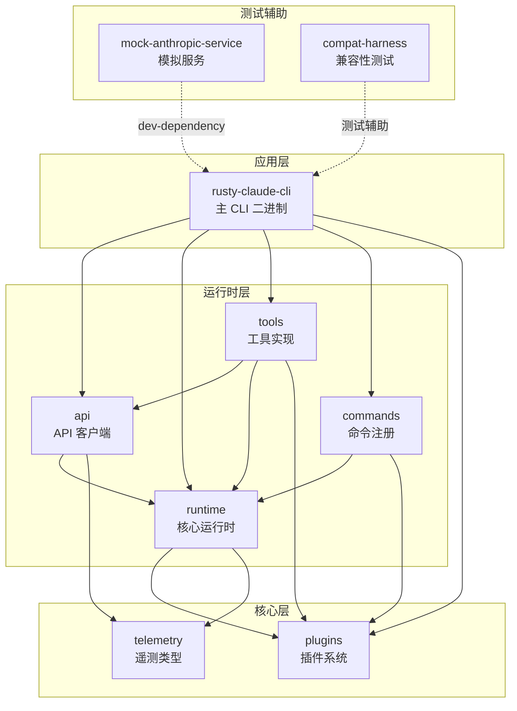
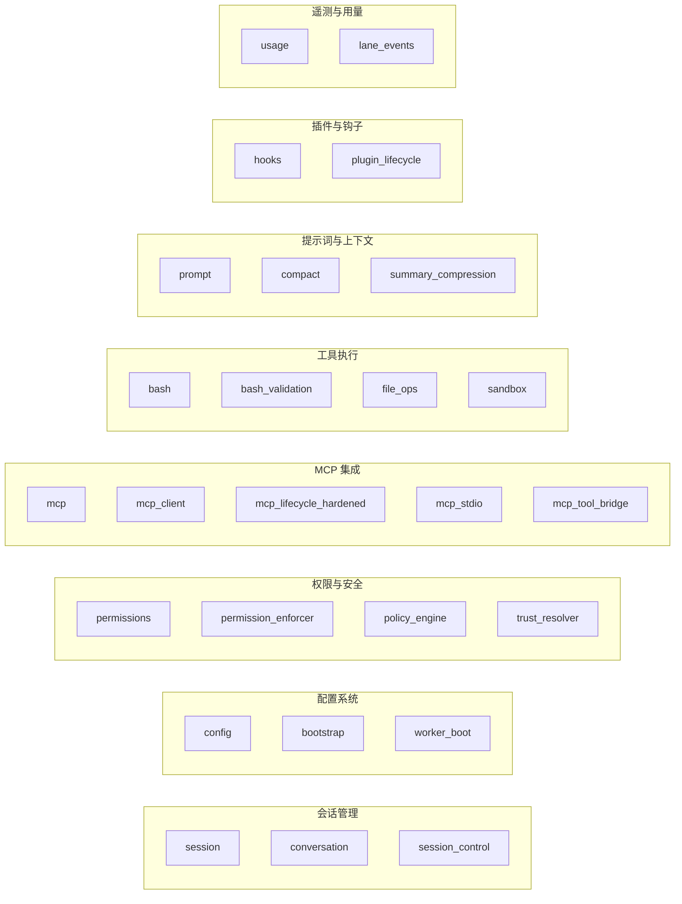

本文档深入剖析 Claw Code 项目的 Rust 实现工作空间架构。该工作空间采用 **Cargo Workspace** 模式组织，包含 9 个功能独立的 crate，通过清晰的分层依赖关系实现高内聚、低耦合的模块化设计。工作空间位于项目根目录的 `rust/` 子目录下，是原始 TypeScript 实现的 Rust 原生重写版本。

Sources: [Cargo.toml](rust/Cargo.toml#L1-L6), [README.md](rust/README.md#L108-L127)

## 工作空间根配置

工作空间由根目录的 `Cargo.toml` 定义，采用 `resolver = "2"` 解析器以支持 Rust 2021 Edition 的改进依赖解析。所有 crate 共享统一的版本、许可证和发布策略，通过 `workspace.package` 字段集中管理。

```toml
[workspace]
members = ["crates/*"]
resolver = "2"

[workspace.package]
version = "0.1.0"
edition = "2021"
license = "MIT"
publish = false
```

工作空间级别的 lint 配置强制执行代码安全标准：禁止 `unsafe_code`，并对 Clippy 的 `all` 和 `pedantic` 规则启用警告级别检查，同时允许特定规则的例外（如 `module_name_repetitions`）。

Sources: [Cargo.toml](rust/Cargo.toml#L1-L23)

## Crate 依赖关系架构

工作空间中的 9 个 crate 形成清晰的三层架构：**核心层**（telemetry、plugins）、**运行时层**（runtime、api、tools、commands）、**应用层**（rusty-claude-cli）。此外包含测试辅助 crate（mock-anthropic-service、compat-harness）。



该依赖图揭示了以下设计原则：

| 设计原则 | 体现方式 |
|---------|---------|
| **依赖倒置** | 高层 crate（CLI）依赖低层 crate（runtime、api），而非相反 |
| **关注点分离** | telemetry 和 plugins 作为基础层，被多个上层 crate 共享 |
| **测试隔离** | mock-anthropic-service 仅作为 dev-dependency 存在 |
| **单一出口** | runtime crate 集中导出所有核心类型和函数 |

Sources: [rusty-claude-cli/Cargo.toml](rust/crates/rusty-claude-cli/Cargo.toml#L10-L25), [runtime/Cargo.toml](rust/crates/runtime/Cargo.toml#L7-L15), [api/Cargo.toml](rust/crates/api/Cargo.toml#L7-L14)

## 各 Crate 职责详解

### 核心层 Crate

**telemetry** — 最基础的无依赖 crate，定义会话追踪和用量遥测的类型系统。提供 `TelemetrySink` trait 及多种实现（`JsonlTelemetrySink`、`MemoryTelemetrySink`），支持可插拔的遥测后端。

Sources: [telemetry/Cargo.toml](rust/crates/telemetry/Cargo.toml#L1-L14), [api/src/lib.rs](rust/crates/api/src/lib.rs#L27-L33)

**plugins** — 插件元数据、注册表和钩子集成原语。仅依赖 `serde` 用于序列化，作为插件系统的抽象层被 runtime、tools 和 commands 共享。

Sources: [plugins/Cargo.toml](rust/crates/plugins/Cargo.toml#L1-L14)

### 运行时层 Crate

**runtime** — 工作空间的**核心引擎**，包含 40+ 模块，涵盖会话持久化、权限评估、提示词组装、MCP 管道、工具文件操作和对话循环。该 crate 是依赖关系图中的枢纽，被 api、tools、commands 共同依赖。

关键模块包括：
- `conversation` — `ConversationRuntime` 和对话循环
- `config` — 配置加载器和 MCP 服务器配置
- `permissions` — 权限策略和提示器
- `mcp_*` — MCP 客户端生命周期管理
- `session` — 会话持久化和消息类型
- `worker_boot` — Worker 注册表和任务调度

Sources: [runtime/Cargo.toml](rust/crates/runtime/Cargo.toml#L1-L21), [runtime/src/lib.rs](rust/crates/runtime/src/lib.rs#L1-L160)

**api** — Anthropic API 客户端实现，包含 HTTP 客户端、SSE 流解析器、请求/响应类型和认证（API Key + OAuth Bearer）。依赖 runtime 获取配置和会话上下文，依赖 telemetry 进行请求追踪。

Sources: [api/Cargo.toml](rust/crates/api/Cargo.toml#L1-L18), [api/src/lib.rs](rust/crates/api/src/lib.rs#L1-L35)

**tools** — 内置工具实现规范 + 执行逻辑：Bash、ReadFile、WriteFile、EditFile、GlobSearch、GrepSearch、WebSearch、WebFetch、Agent、TodoWrite、NotebookEdit 等。依赖 api 进行网络工具调用，依赖 runtime 进行文件操作和权限检查。

Sources: [tools/Cargo.toml](rust/crates/tools/Cargo.toml#L1-L19)

**commands** — 斜杠命令定义和帮助文本生成。轻量级 crate，依赖 plugins 和 runtime 实现命令执行。

Sources: [commands/Cargo.toml](rust/crates/commands/Cargo.toml#L1-L15)

### 应用层 Crate

**rusty-claude-cli** — 主 CLI 二进制（`claw`），包含 REPL 交互、单次提示、流式显示、工具调用渲染和 CLI 参数解析。作为唯一产生可执行文件的 crate，它聚合所有其他运行时 crate。

Sources: [rusty-claude-cli/Cargo.toml](rust/crates/rusty-claude-cli/Cargo.toml#L1-L34)

### 测试辅助 Crate

**mock-anthropic-service** — 确定性本地 Anthropic 兼容模拟服务，用于 CLI 奇偶性测试和本地 harness 运行。

**compat-harness** — 从上游 TypeScript 源码提取工具/提示词清单的测试 harness。

Sources: [README.md](rust/README.md#L44-L63)

## 核心模块：Runtime Crate 内部结构

`runtime` crate 作为工作空间的核心，其模块组织反映了 Claw Code 的核心功能领域。以下是模块分类：



该 crate 通过 `lib.rs` 中的选择性 `pub use` 导出公共 API，内部模块使用 `mod` 声明保持封装性。例如，`bash` 模块私有但导出 `execute_bash` 函数，`permissions` 模块私有但导出 `PermissionMode` 等类型。

Sources: [runtime/src/lib.rs](rust/crates/runtime/src/lib.rs#L3-L155)

## 构建与开发工作流

工作空间支持多种构建和测试模式：

| 命令 | 用途 |
|-----|------|
| `cargo build --workspace` | 构建所有 crate |
| `cargo run -p rusty-claude-cli -- --help` | 运行 CLI 并查看帮助 |
| `cargo run -p mock-anthropic-service` | 启动模拟服务 |
| `./scripts/run_mock_parity_harness.sh` | 运行奇偶性测试 harness |

开发时推荐在 `rust/` 目录下操作，利用 Cargo 的 workspace 特性实现跨 crate 的即时编译和测试。

Sources: [README.md](rust/README.md#L13-L27)

## 下一步阅读建议

理解 Rust 工作空间结构后，建议按以下顺序深入：

1. **[运行时引擎与对话循环](11-yun-xing-shi-yin-qing-yu-dui-hua-xun-huan)** — 深入了解 runtime crate 的核心对话循环机制
2. **[工具系统实现](12-gong-ju-xi-tong-shi-xian)** — 探索 tools crate 的工具规范和执行逻辑
3. **[Python 移植工作区](10-python-yi-zhi-gong-zuo-qu)** — 对比 Python 实现的工作空间组织方式