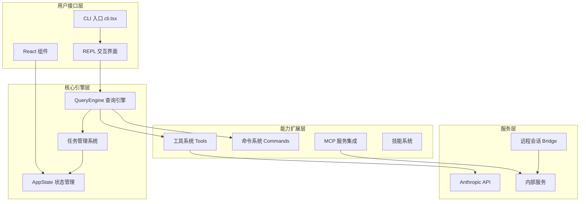
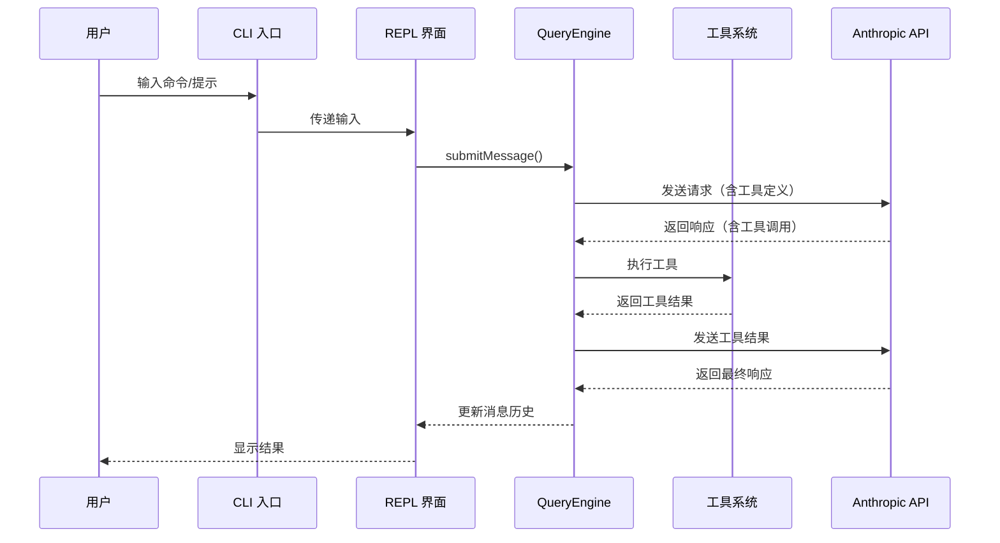

本项目是 **Claude Code** 的源代码仓库，一个由 Anthropic 开发的终端 AI 助手工具。它允许开发者直接在终端中与 Claude 交互，实现代码理解、文件编辑、命令执行和自动化工作流处理。

本文档旨在为初学者提供项目的整体架构概览，帮助理解核心组件的组织方式和数据流向。

## 项目基本信息

| 属性 | 值 |
|------|-----|
| 项目名称 | @anthropic-ai/claude-code |
| 当前版本 | 2.1.88 |
| 运行环境 | Node.js >= 18.0.0 |
| 构建工具 | Bun |
| 核心语言 | TypeScript |
| UI 框架 | React + Ink（终端渲染） |
| 入口命令 | `claude` |

Sources: [package.json](src/../package/package.json#L1-L15)

## 核心架构总览

Claude Code 采用分层架构设计，从用户输入到 AI 响应的完整流程涉及多个核心模块的协作：



### 架构层次说明

1. **用户接口层**：处理用户输入和输出渲染，包括 CLI 参数解析、REPL 交互循环和终端 UI 组件
2. **核心引擎层**：负责查询处理、任务调度和状态管理，是系统的"大脑"
3. **能力扩展层**：提供具体功能实现，包括各种工具、命令和插件
4. **服务层**：处理外部 API 通信、远程会话和内部服务集成

Sources: [main.tsx](src/main.tsx#L1-L100), [cli.tsx](src/entrypoints/cli.tsx#L1-L50), [QueryEngine.ts](src/QueryEngine.ts#L1-L100)

## 目录结构详解

项目源代码主要位于 `src/` 目录下，按功能模块进行组织：

```
src/
├── entrypoints/          # 应用入口点（CLI、MCP、SDK）
├── main.tsx              # 主应用初始化
├── QueryEngine.ts        # 查询引擎核心
├── Task.ts               # 任务类型定义
├── Tool.ts               # 工具基类定义
├── tools/                # 工具实现目录
│   ├── BashTool/         # Shell 命令执行
│   ├── FileEditTool/     # 文件编辑
│   ├── AgentTool/        # 多智能体协作
│   └── ...               # 其他工具
├── commands/             # CLI 命令实现
├── components/           # React UI 组件
├── state/                # 状态管理
├── services/             # 服务层（API、MCP 等）
├── hooks/                # React Hooks
├── utils/                # 工具函数库
├── bridge/               # 远程会话支持
└── ink/                  # 终端渲染引擎
```

### 核心模块职责

| 模块目录 | 职责描述 | 关键文件 |
|----------|----------|----------|
| `entrypoints/` | 应用启动入口，处理不同运行模式 | `cli.tsx`, `init.ts` |
| `tools/` | AI 可调用的能力实现 | 40+ 工具模块 |
| `commands/` | 用户可执行的 CLI 命令 | 100+ 命令模块 |
| `components/` | 终端 UI 组件库 | React + Ink 组件 |
| `state/` | 全局状态管理 | `AppStateStore.ts` |
| `services/` | 外部服务集成 | API、MCP、分析等 |
| `utils/` | 通用工具函数 | 200+ 工具模块 |

Sources: [tools.ts](src/tools.ts#L1-L50), [commands.ts](src/commands.ts#L1-L50)

## 核心组件详解

### 1. 查询引擎（QueryEngine）

`QueryEngine` 是系统的核心处理引擎，负责管理对话生命周期和会话状态。每个对话会话对应一个 `QueryEngine` 实例，它维护消息历史、文件缓存和使用量统计。

主要职责：
- 处理用户消息并提交到 AI 模型
- 管理工具调用和权限控制
- 跟踪 token 使用量和成本
- 处理会话持久化和恢复

Sources: [QueryEngine.ts](src/QueryEngine.ts#L85-L120)

### 2. 工具系统（Tools）

工具是 Claude Code 执行具体操作的能力单元。系统内置了 40+ 种工具，涵盖文件操作、Shell 执行、网络请求、任务管理等场景。

核心工具分类：

| 类别 | 工具示例 | 用途 |
|------|----------|------|
| 文件操作 | `FileReadTool`, `FileEditTool`, `FileWriteTool` | 读取、编辑、写入文件 |
| Shell 执行 | `BashTool`, `PowerShellTool` | 执行终端命令 |
| 搜索工具 | `GlobTool`, `GrepTool` | 文件和内容搜索 |
| 任务管理 | `TaskCreateTool`, `TaskOutputTool`, `TaskStopTool` | 创建和管理子任务 |
| 智能体 | `AgentTool`, `SkillTool` | 多智能体协作和技能调用 |
| 网络工具 | `WebFetchTool`, `WebSearchTool` | 网页获取和搜索 |
| MCP 集成 | `ListMcpResourcesTool`, `ReadMcpResourceTool` | MCP 服务器资源访问 |

Sources: [tools.ts](src/tools.ts#L1-L80)

### 3. 命令系统（Commands）

命令是用户可以直接调用的 CLI 指令，以 `/` 前缀触发。系统内置 100+ 命令，涵盖配置管理、会话控制、调试诊断等功能。

常用命令示例：
- `/config` - 查看和修改配置
- `/model` - 切换 AI 模型
- `/memory` - 管理会话记忆
- `/mcp` - 管理 MCP 服务器
- `/skills` - 管理技能
- `/help` - 显示帮助信息

Sources: [commands.ts](src/commands.ts#L1-L100)

### 4. 状态管理（AppState）

`AppState` 是全局状态容器，使用不可变模式管理应用状态。它存储设置、任务列表、MCP 连接、插件状态等核心数据。

状态更新通过 `setAppState` 函数进行，采用函数式更新模式确保状态一致性。

Sources: [AppStateStore.ts](src/state/AppStateStore.ts#L1-L100)

## 数据流与执行流程

典型的用户请求处理流程如下：



Sources: [QueryEngine.ts](src/QueryEngine.ts#L100-L200), [main.tsx](src/main.tsx#L200-L300)

## 关键技术特性

### 1. 终端 UI 渲染（React Ink）

项目使用 [Ink](https://github.com/vadimdemedes/ink) 库在终端中渲染 React 组件，实现丰富的交互式界面，包括：
- 消息列表和对话历史
- 工具使用进度显示
- 配置对话框和选择器
- 任务状态面板

Sources: [ink/](src/ink/#L1-L10)

### 2. 多智能体协作

通过 `AgentTool` 支持创建和管理多个子智能体，实现任务分解和并行处理。每个子智能体有独立的消息历史和工具调用能力。

Sources: [AgentTool/](src/tools/AgentTool/#L1-L10)

### 3. MCP（模型上下文协议）集成

支持通过 MCP 协议连接外部服务器，扩展 AI 的能力边界。可以动态加载 MCP 服务器提供的工具、资源和提示词。

Sources: [services/mcp/](src/services/mcp/#L1-L10)

### 4. 远程会话模式（Bridge）

通过 Bridge 模式支持远程会话，允许在本地终端控制云端的 Claude 会话，实现跨设备协作。

Sources: [bridge/](src/bridge/#L1-L10)

## 学习路径建议

基于本项目的目录结构和模块依赖关系，建议按以下顺序深入学习：

1. **入门阶段**
   - 先阅读 [快速开始](2-kuai-su-kai-shi) 了解基本使用方法
   - 理解 [核心概念与架构总览](3-he-xin-gai-nian-yu-jia-gou-zong-lan) 建立整体认知

2. **核心引擎**
   - [查询引擎架构与执行机制](4-cha-xun-yin-qing-jia-gou-yu-zhi-xing-ji-zhi)
   - [工具系统设计与编排](5-gong-ju-xi-tong-she-ji-yu-bian-pai)
   - [任务管理与并发控制](6-ren-wu-guan-li-yu-bing-fa-kong-zhi)

3. **功能扩展**
   - 根据兴趣选择命令系统、状态管理或服务层集成等专题深入

## 总结

Claude Code 是一个架构清晰、模块化程度高的终端 AI 助手项目。其核心设计思想是将 AI 能力通过工具系统具体化，通过查询引擎统一调度，通过终端 UI 提供友好交互。理解这四个核心组件（QueryEngine、Tools、Commands、State）的协作关系，是掌握本项目架构的关键。